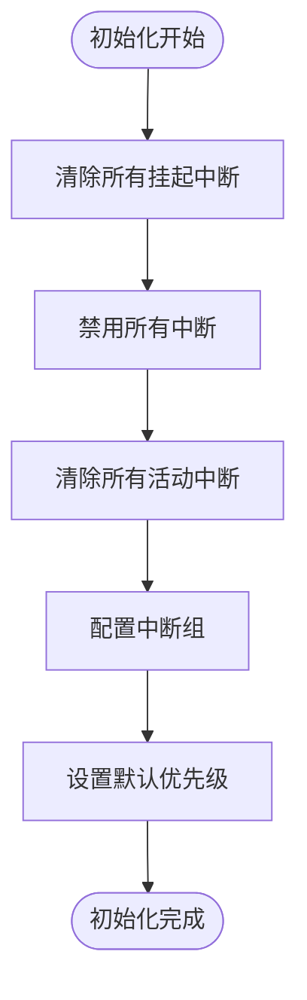
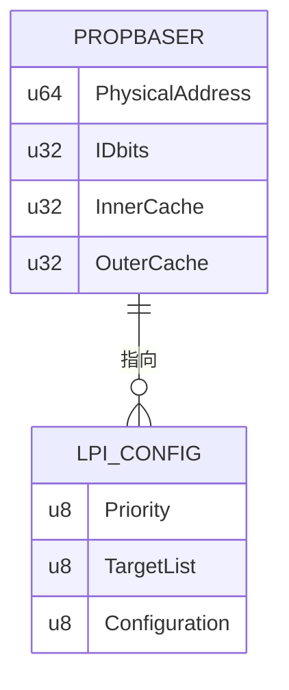

# GICv3 重分发器 (GICR)

<cite>
**Referenced Files in This Document**   
- [gicr.rs](file://gic-driver/src/version/v3/gicr.rs)
- [mod.rs](file://gic-driver/src/version/v3/mod.rs)
- [ppi.rs](file://itest/test-base/src/test_suit/ppi.rs)
- [sgi.rs](file://itest/test-base/src/test_suit/sgi.rs)
</cite>

## 目录
1. [简介](#简介)
2. [双寄存器帧结构](#双寄存器帧结构)
3. [基于亲和性的CPU寻址](#基于亲和性的cpu寻址)
4. [SGI与PPI控制](#sgi与ppi控制)
5. [LPI支持](#lpi支持)
6. [WAKER寄存器与电源管理](#waker寄存器与电源管理)

## 简介

GICv3重分发器（GICR）是GICv3中断控制器架构中的关键组件，负责为每个CPU核心处理软件生成中断（SGI）、私有外设中断（PPI）和局部性外设中断（LPI）。每个CPU核心都有一个专属的重分发器，它作为CPU接口与中断源之间的桥梁，实现了高效的中断分发和管理。

重分发器的核心功能包括：
- 管理SGI和PPI的配置、启用/禁用、优先级和触发模式
- 支持LPI的使能、挂起/清除和基地址配置
- 通过亲和性（Affinity）机制实现多核环境下的CPU寻址
- 提供电源管理功能，控制CPU核心的唤醒和睡眠状态

本API文档将详细阐述重分发器的架构和功能，为开发者提供全面的使用指南。

**Section sources**
- [gicr.rs](file://gic-driver/src/version/v3/gicr.rs#L0-L49)

## 双寄存器帧结构

GICv3重分发器采用双寄存器帧结构，分为RD_base和SGI_base两个独立的寄存器区域，分别负责不同的中断类型和功能。

### RD_base (LPI寄存器帧)

RD_base寄存器帧位于重分发器的基地址，主要负责LPI功能和重分发器的整体行为控制。其主要寄存器包括：

- **CTLR (Control Register)**: 控制寄存器，用于使能/禁用LPI支持
- **TYPER (Type Register)**: 类型寄存器，提供重分发器的特性信息，如亲和性值和是否为最后一个重分发器
- **WAKER (Wakeup Register)**: 唤醒寄存器，用于电源管理，控制重分发器的睡眠状态
- **PROPBASER (Properties Base Address Register)**: 属性基地址寄存器，指向LPI配置表的基地址
- **PENDBASER (Pending Table Base Address Register)**: 挂起表基地址寄存器，指向LPI挂起状态表的基地址

### SGI_base (SGI/PPI寄存器帧)

SGI_base寄存器帧位于RD_base偏移0x10000处，主要负责SGI和PPI的控制。其主要寄存器包括：

- **ISENABLER/ICENABLER**: 中断使能/禁用寄存器，用于控制SGI和PPI的启用状态
- **ISPENDR/ICPENDR**: 中断挂起/清除寄存器，用于设置和清除中断的挂起状态
- **IPRIORITYR**: 中断优先级寄存器，用于配置中断的优先级
- **ICFGR**: 中断配置寄存器，用于设置中断的触发模式（边沿/电平触发）

这种双帧结构设计使得LPI、SGI和PPI的功能分离，提高了系统的可维护性和可扩展性。

```mermaid
graph TD
A[重分发器基地址] --> B[RD_base (0x0000)]
A --> C[SGI_base (0x10000)]
B --> D[CTLR: LPI控制]
B --> E[TYPER: 类型信息]
B --> F[WAKER: 电源管理]
B --> G[PROPBASER: LPI属性基地址]
B --> H[PENDBASER: LPI挂起表基地址]
C --> I[ISENABLER/ICENABLER: 使能控制]
C --> J[ISPENDR/ICPENDR: 挂起控制]
C --> K[IPRIORITYR: 优先级配置]
C --> L[ICFGR: 触发模式]
```

**Diagram sources**
- [gicr.rs](file://gic-driver/src/version/v3/gicr.rs#L110-L156)
- [gicr.rs](file://gic-driver/src/version/v3/gicr.rs#L300-L349)

**Section sources**
- [gicr.rs](file://gic-driver/src/version/v3/gicr.rs#L0-L49)

## 基于亲和性的CPU寻址

GICv3重分发器使用亲和性（Affinity）机制来唯一标识和寻址多核系统中的CPU核心。亲和性值是一个32位的数值，由四个8位的亲和性级别（aff0, aff1, aff2, aff3）组成，对应于ARMv8架构中的MPIDR_EL1寄存器格式。

### 亲和性级别

- **aff0**: 0级亲和性，通常表示集群内的核心ID
- **aff1**: 1级亲和性，通常表示组内的集群ID
- **aff2**: 2级亲和性，通常表示系统内的组ID
- **aff3**: 3级亲和性，最高级别，用于大型系统

### CPU定位实现

在多核环境中，定位当前CPU对应的重分发器是初始化过程中的关键步骤。系统通过读取当前CPU的MPIDR_EL1寄存器获取其亲和性值，然后遍历所有重分发器，找到亲和性值匹配的重分发器。

```mermaid
sequenceDiagram
participant CPU as 当前CPU
participant GIC as GIC控制器
participant Redist as 重分发器列表
CPU->>CPU : 读取MPIDR_EL1寄存器
CPU->>GIC : 获取重分发器迭代器
loop 遍历每个重分发器
GIC->>Redist : 读取TYPER寄存器的亲和性值
Redist-->>GIC : 返回亲和性值
GIC->>GIC : 比较亲和性值
alt 匹配成功
GIC-->>CPU : 返回匹配的重分发器引用
break
end
end
```

**Diagram sources**
- [mod.rs](file://gic-driver/src/version/v3/mod.rs#L410-L451)
- [mod.rs](file://gic-driver/src/version/v3/mod.rs#L108-L147)

**Section sources**
- [mod.rs](file://gic-driver/src/version/v3/mod.rs#L108-L147)
- [mod.rs](file://gic-driver/src/version/v3/mod.rs#L410-L451)

## SGI与PPI控制

重分发器通过SGI_base寄存器帧提供对SGI和PPI的全面控制，包括初始化、启用/禁用、优先级配置和触发模式设置。

### 初始化流程

SGI/PPI的初始化需要按照特定顺序执行，以确保系统稳定：

1. 清除所有挂起的中断
2. 禁用所有中断
3. 清除所有活动的中断
4. 根据安全状态配置中断组
5. 设置默认优先级



**Diagram sources**
- [gicr.rs](file://gic-driver/src/version/v3/gicr.rs#L350-L400)

**Section sources**
- [gicr.rs](file://gic-driver/src/version/v3/gicr.rs#L350-L400)

### 控制方法

#### 启用/禁用中断

通过ISENABLER和ICENABLER寄存器可以分别启用和禁用指定的SGI或PPI。每个寄存器的每一位对应一个中断ID，写入1即可改变中断的使能状态。

#### 优先级配置

通过IPRIORITYR寄存器可以设置中断的优先级，数值越小优先级越高。系统通常将默认优先级设置为0xA0（中间优先级）。

#### 触发模式

通过ICFGR寄存器可以配置中断的触发模式：
- **边沿触发 (Edge-triggered)**: 中断在信号上升沿时触发
- **电平触发 (Level-sensitive)**: 中断在信号保持高电平时持续触发

## LPI支持

重分发器为LPI提供了完整的支持，包括使能控制、挂起/清除操作以及基地址寄存器的配置。

### LPI使能

通过CTLR寄存器的EnableLPIs位可以启用或禁用LPI支持。启用LPI后，系统才能处理LPI中断。

### 挂起与清除

- **SETLPIR**: 写入此寄存器可将指定的LPI设置为挂起状态
- **CLRLPIR**: 写入此寄存器可清除指定LPI的挂起状态

### 基地址寄存器配置

#### PROPBASER (属性基地址寄存器)

PROPBASER指向LPI配置表的基地址，该表包含每个LPI的优先级、目标CPU等配置信息。



#### PENDBASER (挂起表基地址寄存器)

PENDBASER指向LPI挂起状态表的基地址，该表记录了每个LPI的挂起状态。

**Diagram sources**
- [gicr.rs](file://gic-driver/src/version/v3/gicr.rs#L110-L156)
- [gicr.rs](file://gic-driver/src/version/v3/gicr.rs#L201-L252)

**Section sources**
- [gicr.rs](file://gic-driver/src/version/v3/gicr.rs#L201-L252)

## WAKER寄存器与电源管理

WAKER寄存器是重分发器电源管理功能的核心，用于控制CPU核心的唤醒和睡眠状态。

### 寄存器位定义

- **ProcessorSleep (位1)**: 当设置为1时，请求重分发器进入睡眠状态
- **ChildrenAsleep (位2)**: 当设置为1时，表示重分发器的子组件处于睡眠状态

### 唤醒流程

唤醒重分发器需要执行以下步骤：
1. 清除ProcessorSleep位，请求唤醒
2. 循环检查ChildrenAsleep位，等待子组件完全唤醒
3. 等待RWP位清零，确保寄存器写入完成

```mermaid
sequenceDiagram
participant CPU as CPU核心
participant Redist as 重分发器
CPU->>Redist : WAKER.ProcessorSleep = 0
loop 等待唤醒完成
Redist->>Redist : 检查WAKER.ChildrenAsleep
alt 仍在睡眠
Redist-->>CPU : 继续等待
Note right of Redist : 执行spin_loop()
else 唤醒完成
Redist-->>CPU : 唤醒成功
break
end
end
CPU->>Redist : 等待CTLR.RWP = 0
Redist-->>CPU : 准备就绪
```

**Diagram sources**
- [gicr.rs](file://gic-driver/src/version/v3/gicr.rs#L110-L156)
- [gicr.rs](file://gic-driver/src/version/v3/gicr.rs#L201-L252)

**Section sources**
- [gicr.rs](file://gic-driver/src/version/v3/gicr.rs#L201-L252)