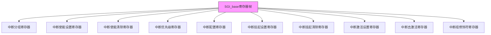
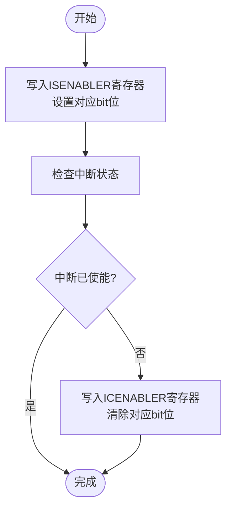
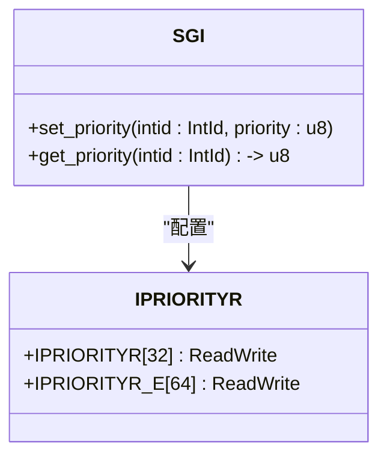
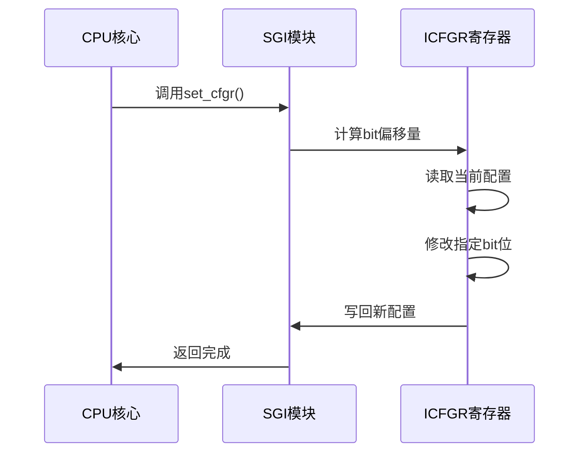
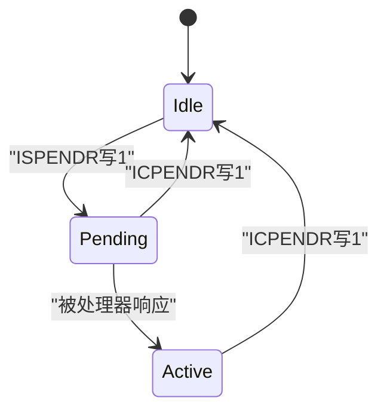
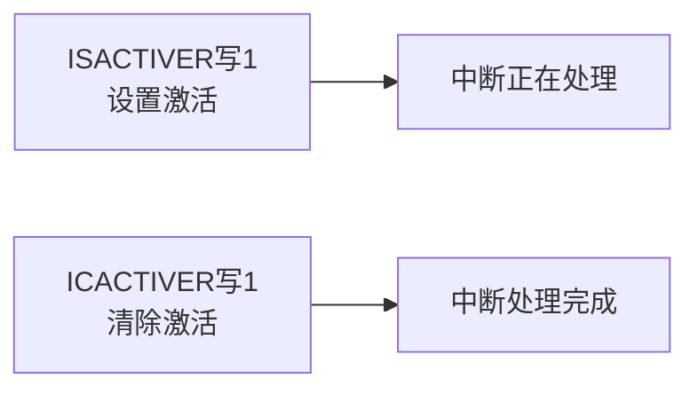
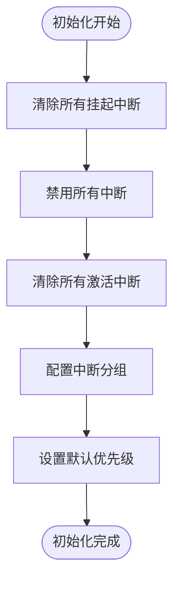
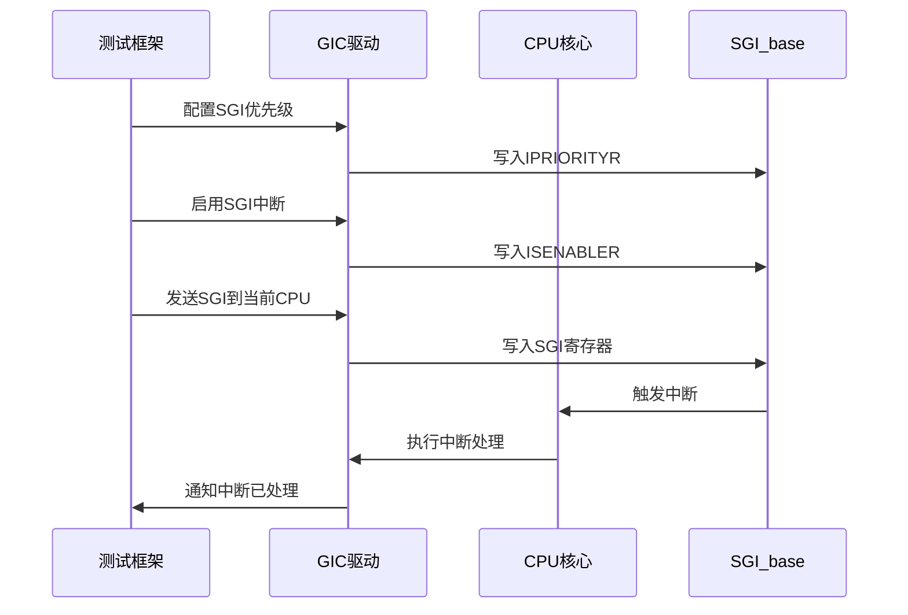
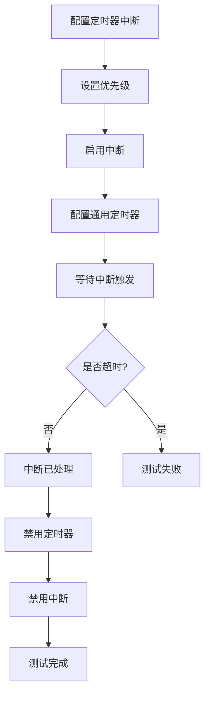

<cite>
**本文档中引用的文件**
- [gicr.rs](file://gic-driver/src/version/v3/gicr.rs)
- [define.rs](file://gic-driver/src/define.rs)
- [sgi.rs](file://itest/test-base/src/test_suit/sgi.rs)
- [ppi.rs](file://itest/test-base/src/test_suit/ppi.rs)
</cite>

## 目录
1. [引言](#引言)
2. [SGI_base寄存器帧结构](#sgi_base寄存器帧结构)
3. [中断控制机制](#中断控制机制)
4. [中断初始化流程](#中断初始化流程)
5. [中断分组与安全状态](#中断分组与安全状态)
6. [测试用例分析](#测试用例分析)
7. [结论](#结论)

## 引言
本文档详细阐述了GICv3重分发器中软件生成中断（SGI）和私有外设中断（PPI）的功能实现。重点分析SGI_base寄存器帧的结构及其对中断控制的作用，包括中断使能/禁用、优先级设置、触发模式配置、挂起/清除、激活/去激活等操作的实现机制。文档还详细说明了IGROUPR、ISENABLER、ICENABLER、IPRIORITYR、ICFGR等关键寄存器的功能和使用方法，为开发者提供全面的中断控制指南。

**Section sources**
- [gicr.rs](file://gic-driver/src/version/v3/gicr.rs#L1-L50)

## SGI_base寄存器帧结构
SGI_base寄存器帧是GICv3重分发器的核心组成部分，负责管理每个CPU核心的SGI和PPI。该寄存器帧包含多个功能寄存器，通过内存映射方式访问，为中断控制提供统一的接口。



**Diagram sources**
- [gicr.rs](file://gic-driver/src/version/v3/gicr.rs#L200-L300)

**Section sources**
- [gicr.rs](file://gic-driver/src/version/v3/gicr.rs#L200-L300)

## 中断控制机制
SGI_base寄存器帧提供了一套完整的中断控制机制，通过多个专用寄存器实现对SGI和PPI的精细化管理。

### 中断使能与禁用
中断使能和禁用操作通过ISENABLER和ICENABLER寄存器实现。这两个寄存器采用写1置位和写1清除的机制，确保操作的原子性。



**Diagram sources**
- [gicr.rs](file://gic-driver/src/version/v3/gicr.rs#L350-L400)

### 优先级设置
中断优先级通过IPRIORITYR寄存器进行配置，每个中断分配一个8位的优先级值，数值越小表示优先级越高。



**Diagram sources**
- [gicr.rs](file://gic-driver/src/version/v3/gicr.rs#L400-L420)

### 触发模式配置
中断触发模式（边沿触发或电平触发）通过ICFGR寄存器进行配置。每个中断占用2位，其中bit[1]用于指定触发类型。



**Diagram sources**
- [gicr.rs](file://gic-driver/src/version/v3/gicr.rs#L420-L480)

### 挂起与清除
中断的挂起状态通过ISPENDR和ICPENDR寄存器管理，允许软件主动触发或清除中断的挂起状态。



**Diagram sources**
- [gicr.rs](file://gic-driver/src/version/v3/gicr.rs#L250-L280)

### 激活与去激活
中断的激活状态通过ISACTIVER和ICACTIVER寄存器控制，反映中断是否正在被处理器处理。



**Diagram sources**
- [gicr.rs](file://gic-driver/src/version/v3/gicr.rs#L300-L320)

**Section sources**
- [gicr.rs](file://gic-driver/src/version/v3/gicr.rs#L350-L500)

## 中断初始化流程
SGI和PPI的初始化流程在系统启动时执行，确保中断系统处于已知的稳定状态。



**Diagram sources**
- [gicr.rs](file://gic-driver/src/version/v3/gicr.rs#L320-L350)

**Section sources**
- [gicr.rs](file://gic-driver/src/version/v3/gicr.rs#L320-L350)

## 中断分组与安全状态
GICv3支持灵活的中断分组策略，根据系统的安全状态配置不同的中断处理模式。

### 单安全状态配置
在单安全状态下，所有中断默认分配到Group 1，简化中断管理。


### 双安全状态配置
在双安全状态下，SGI通常分配到Group 0，PPI分配到Group 1，实现安全与非安全中断的分离。

```mermaid
erDiagram
SGI_base ||--o{ IGROUPR0 : "配置"
IGROUPR0 }|-- Group0 : "SGI 0-15"
IGROUPR0 }|-- Group1 : "PPI 16-31"
```

**Diagram sources**
- [gicr.rs](file://gic-driver/src/version/v3/gicr.rs#L330-L350)

**Section sources**
- [gicr.rs](file://gic-driver/src/version/v3/gicr.rs#L330-L350)

## 测试用例分析
通过对测试用例的分析，可以验证SGI和PPI功能的正确性。

### SGI测试流程
SGI测试验证了软件生成中断的完整生命周期，包括配置、触发和处理。



**Diagram sources**
- [sgi.rs](file://itest/test-base/src/test_suit/sgi.rs#L20-L80)

### PPI测试流程
PPI测试验证了私有外设中断的处理，特别是与系统定时器的集成。



**Diagram sources**
- [ppi.rs](file://itest/test-base/src/test_suit/ppi.rs#L20-L80)

**Section sources**
- [sgi.rs](file://itest/test-base/src/test_suit/sgi.rs#L1-L110)
- [ppi.rs](file://itest/test-base/src/test_suit/ppi.rs#L1-L140)

## 结论
本文档全面分析了GICv3重分发器中SGI和PPI的控制机制。通过SGI_base寄存器帧，系统能够精确控制每个CPU核心的中断行为，包括使能/禁用、优先级设置、触发模式配置等关键功能。中断分组和安全状态的配置策略为不同安全需求的系统提供了灵活的解决方案。测试用例验证了这些功能的正确实现，为开发者提供了可靠的中断管理基础。