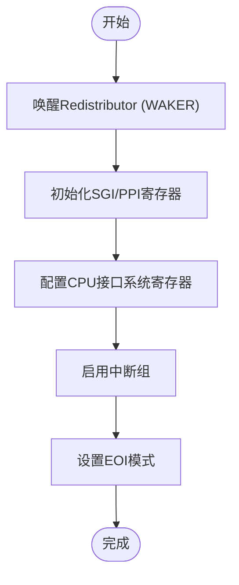

# Gic (GICv3) API

<cite>
**本文档引用的文件**   
- [gicd.rs](file://gic-driver/src/version/v3/gicd.rs)
- [gicr.rs](file://gic-driver/src/version/v3/gicr.rs)
- [mod.rs](file://gic-driver/src/version/v3/mod.rs)
- [gicd.rs](file://gic-driver/src/version/v2/gicd.rs)
- [rdif.rs](file://gic-driver/src/version/rdif.rs)
</cite>

## 目录
1. [简介](#简介)
2. [GICv3与GICv2架构差异](#gicv3与gicv2架构差异)
3. [Gic结构体核心功能](#gic结构体核心功能)
4. [Redistributor (GICR) 初始化流程](#redistributor-gicr-初始化流程)
5. [Distributor (GICD) 协同工作机制](#distributor-gicd-协同工作机制)
6. [RDBase与SGBase地址映射规则](#rdbase与sgbase地址映射规则)
7. [LPI支持配置步骤](#lpi支持配置步骤)
8. [ITS集成点](#its集成点)
9. [关键寄存器访问方法](#关键寄存器访问方法)
10. [多核环境下重分发器配置示例](#多核环境下重分发器配置示例)
11. [电源管理特性与唤醒中断配置](#电源管理特性与唤醒中断配置)

## 简介

GICv3（Generic Interrupt Controller version 3）是ARM架构中用于管理中断的高级控制器，相较于GICv2，它引入了重分发器（Redistributor）和系统寄存器接口等新特性，以支持更复杂的多核系统和虚拟化环境。本文档详细描述了`Gic`结构体的API，重点突出其与GICv2的架构差异，并深入解析Redistributor的初始化流程、与Distributor的协同工作机制、RDBase和SGBase的地址映射规则、LPI支持的配置步骤、ITS集成点、关键寄存器的访问方法以及多核环境下的配置示例。同时，文档还强调了GICv3特有的电源管理特性和唤醒中断配置。

**Section sources**
- [mod.rs](file://gic-driver/src/version/v3/mod.rs#L1-L1151)

## GICv3与GICv2架构差异

GICv3与GICv2在架构上存在显著差异，主要体现在以下几个方面：

1.  **中断分发机制**：GICv2使用单一的Distributor和CPU Interface，而GICv3引入了Redistributor，每个CPU核心都有一个专属的Redistributor，负责处理SGI（软件生成中断）和PPI（私有外设中断），而Distributor则主要负责SPI（共享外设中断）的全局管理。
2.  **CPU接口访问方式**：GICv2通过内存映射的CPU Interface寄存器进行访问，而GICv3则主要通过系统寄存器（如ICC_SRE_EL1, ICC_PMR_EL1等）进行访问，提高了访问效率和安全性。
3.  **亲和性路由**：GICv3引入了基于亲和性（Affinity）的路由机制，取代了GICv2中基于CPU目标列表的简单路由，能够更精确地控制中断的分发目标。
4.  **LPI支持**：GICv3原生支持LPI（Locality-specific Peripheral Interrupts），这是一种可扩展的中断类型，适用于大规模系统，而GICv2不支持LPI。


**Diagram sources **
- [mod.rs](file://gic-driver/src/version/v3/mod.rs#L1-L1151)
- [gicd.rs](file://gic-driver/src/version/v2/gicd.rs#L1-L290)

## Gic结构体核心功能

`Gic`结构体是GICv3驱动的核心，提供了对中断控制器的全面控制。其主要功能包括：

-   **初始化**：通过`init()`方法初始化Distributor，根据安全状态配置控制寄存器。
-   **中断管理**：提供`set_irq_enable`、`set_priority`、`set_pending`等方法来控制中断的使能、优先级和挂起状态。
-   **CPU接口获取**：通过`cpu_interface()`方法获取当前CPU的CPU接口，用于处理私有中断和中断确认。
-   **安全状态管理**：支持单安全状态和双安全状态配置，通过`SecurityState`枚举进行管理。

**Section sources**
- [mod.rs](file://gic-driver/src/version/v3/mod.rs#L1-L1151)

## Redistributor (GICR) 初始化流程

Redistributor的初始化是GICv3启动过程中的关键步骤，主要在`CpuInterface::init_current_cpu()`方法中完成。其流程如下：

1.  **唤醒Redistributor**：调用`wake()`方法，通过清除`WAKER.ProcessorSleep`位来唤醒Redistributor，并等待`WAKER.ChildrenAsleep`位清零，确保Redistributor已准备好。
2.  **初始化SGI/PPI寄存器**：调用`init_sgi_ppi()`方法，将SGI和PPI相关的寄存器（如使能、挂起、活动状态、优先级等）初始化为已知状态。
3.  **配置CPU接口系统寄存器**：根据当前执行级别（EL2或EL1）配置`ICC_SRE_ELx`寄存器以启用系统寄存器接口，并设置`ICC_PMR_EL1`以允许所有优先级的中断。
4.  **启用中断组**：根据安全状态，启用相应的中断组（Group 0和/或Group 1）。
5.  **配置EOI模式**：设置中断结束（EOI）模式。



**Diagram sources **
- [mod.rs](file://gic-driver/src/version/v3/mod.rs#L1-L1151)
- [gicr.rs](file://gic-driver/src/version/v3/gicr.rs#L1-L553)

## Distributor (GICD) 协同工作机制

Distributor与Redistributor协同工作，共同管理系统的中断。Distributor负责全局配置和SPI的管理，而Redistributor负责处理每个CPU核心的私有中断。两者通过以下方式协同：

-   **中断分发**：Distributor根据`IROUTER`寄存器中的亲和性信息，将SPI分发到相应的Redistributor。
-   **状态同步**：Distributor和Redistributor的状态需要保持同步，例如在初始化时，Distributor会将所有SPI的路由设置为当前CPU。
-   **安全状态协调**：Distributor和Redistributor的安全状态配置需要一致，以确保中断处理的正确性。

**Section sources**
- [mod.rs](file://gic-driver/src/version/v3/mod.rs#L1-L1151)
- [gicd.rs](file://gic-driver/src/version/v3/gicd.rs#L1-L733)

## RDBase与SGBase地址映射规则

在GICv3中，Redistributor的寄存器被分为两个基地址：

-   **RDBase**：指向Redistributor的LPI（Locality-specific Peripheral Interrupts）寄存器块，包括`CTLR`、`IIDR`、`TYPER`、`WAKER`、`PROPBASE`、`PENDBASE`等。这些寄存器用于控制LPI功能和Redistributor的整体行为。
-   **SGBase**：指向Redistributor的SGI（Software Generated Interrupts）和PPI（Private Peripheral Interrupts）寄存器块，包括`IGROUPR0`、`ISENABLER0`、`ISPENDR0`、`IPRIORITYR`等。这些寄存器用于控制SGI和PPI。

在代码中，这两个基地址通过`Gic`结构体的`gicr`字段统一提供，`RedistributorSlice`和`RedistributorV3`结构体负责根据偏移量访问相应的寄存器。

**Section sources**
- [mod.rs](file://gic-driver/src/version/v3/mod.rs#L1-L1151)
- [gicr.rs](file://gic-driver/src/version/v3/gicr.rs#L1-L553)

## LPI支持配置步骤

尽管当前代码可能未完全实现LPI的所有功能，但其支持的配置步骤如下：

1.  **检查LPI支持**：通过读取`GICD_TYPER.LPIS`位来检查Distributor是否支持LPI。
2.  **配置Redistributor**：为每个Redistributor配置`PROPBASE`（属性表基地址）和`PENDBASE`（挂起表基地址）寄存器，这两个表用于存储LPI的配置和挂起状态。
3.  **启用LPI**：在Distributor和Redistributor中分别启用LPI支持。在Redistributor中，通过设置`GICR_CTLR.EnableLPIs`位来启用。
4.  **配置LPI路由**：使用`GICR_PROPBASE`和`GICR_PENDBASE`中的信息来配置LPI的路由。

```mermaid
flowchart TD
    CheckSupport["检查GICD_TYPER.LPIS位"]
    CheckSupport --> ConfigBase["配置PROPBASE和PENDBASE"]
    ConfigBase --> EnableLPI["启用GICR_CTLR.EnableLPIs"]
    EnableLPI --> ConfigRouting["配置LPI路由"]
    Config