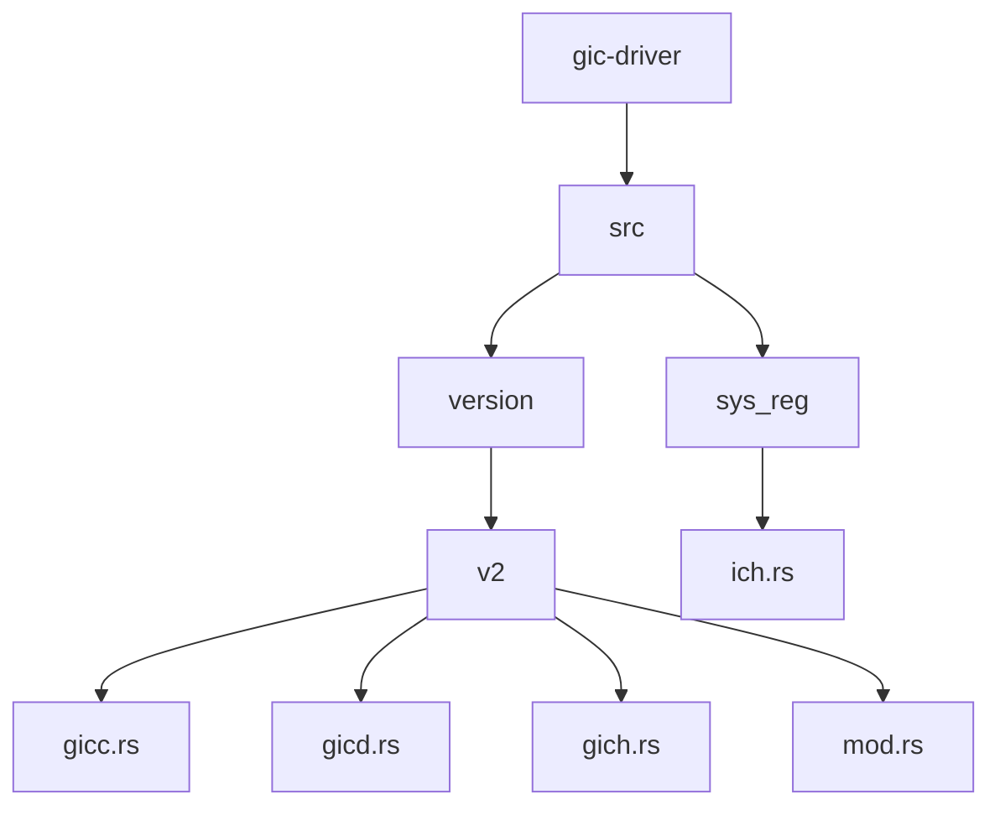
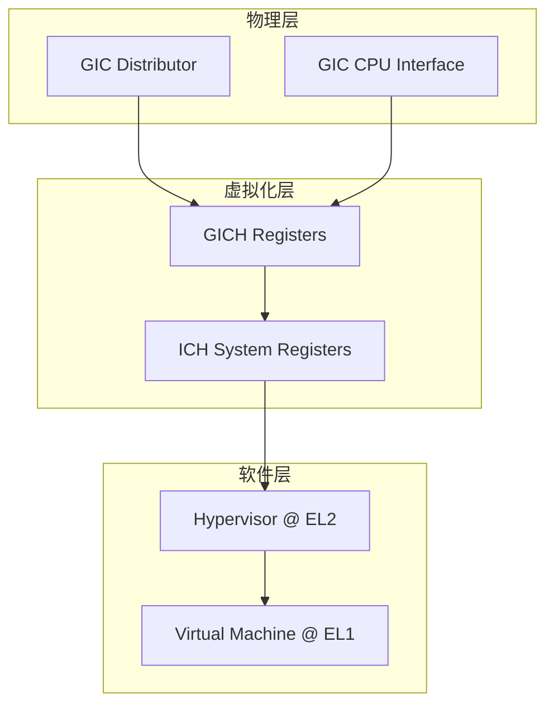
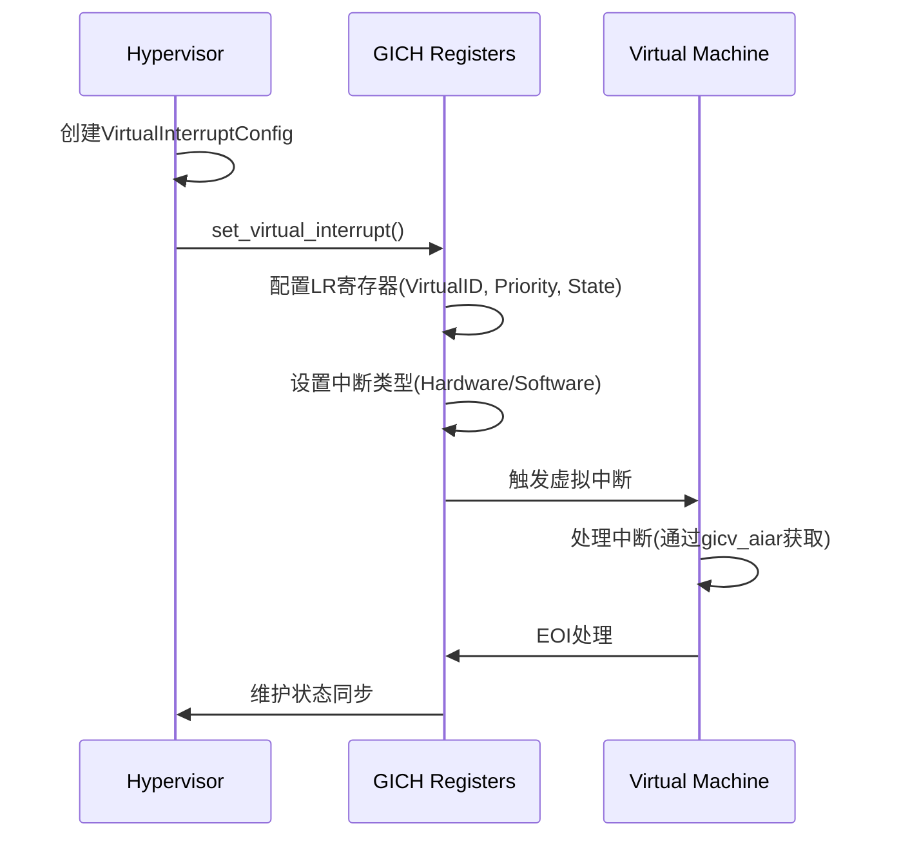
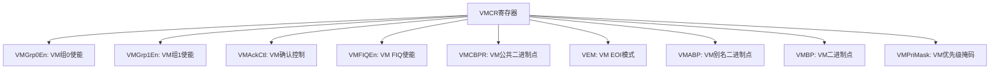
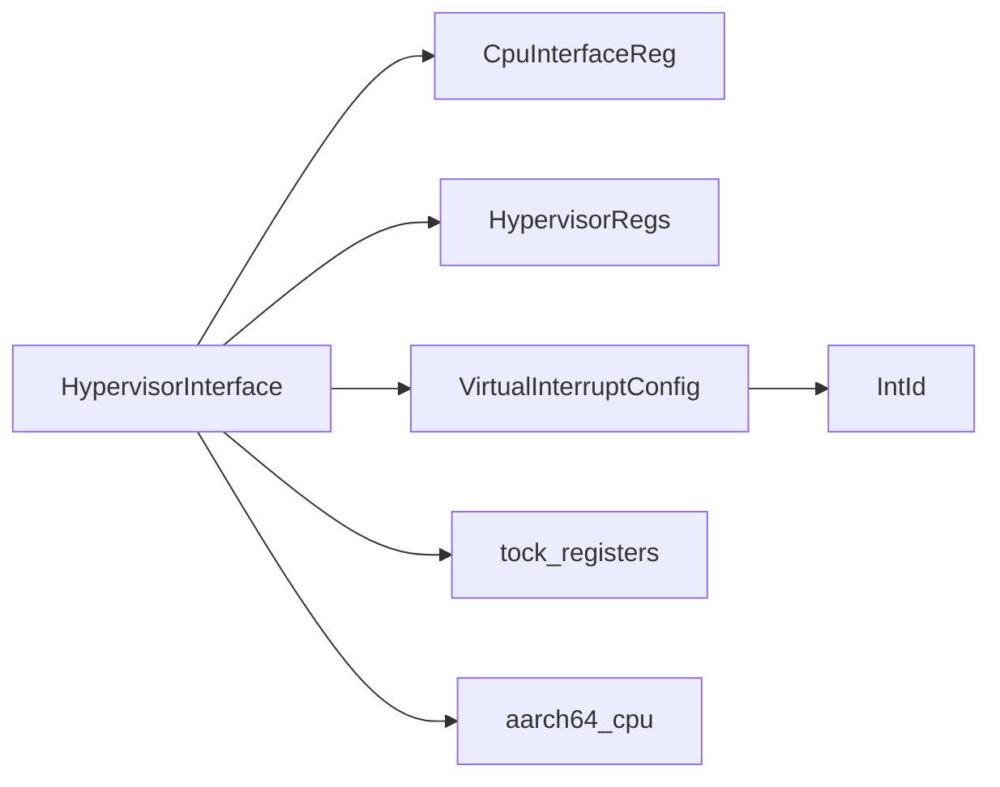

# HypervisorInterface API

<cite>
**本文档中引用的文件**  
- [gich.rs](file://gic-driver/src/version/v2/gich.rs)
- [ich.rs](file://gic-driver/src/sys_reg/ich.rs)
- [mod.rs](file://gic-driver/src/version/v2/mod.rs)
- [gicc.rs](file://gic-driver/src/version/v2/gicc.rs)
</cite>

## 目录
1. [简介](#简介)
2. [项目结构](#项目结构)
3. [核心组件](#核心组件)
4. [架构概述](#架构概述)
5. [详细组件分析](#详细组件分析)
6. [依赖分析](#依赖分析)
7. [性能考虑](#性能考虑)
8. [故障排除指南](#故障排除指南)
9. [结论](#结论)

## 简介
本文档为HypervisorInterface特征及GICH实现提供详细的API文档，专注于虚拟化场景下的中断管理。文档涵盖虚拟CPU接口（VCPU Interface）的初始化流程、虚拟中断的注入与处理机制。详细说明了`read_vmcr`、`write_vmcr`、`set_elrsr`等方法的功能，以及虚拟机器控制寄存器（VMCR）的配置选项。同时提供在EL2异常级别下配置虚拟中断优先级和屏蔽状态的代码示例，并解释物理GIC与虚拟GIC状态同步的挑战，给出减少世界切换开销的性能优化建议。

## 项目结构
项目结构基于ARM GIC（通用中断控制器）驱动程序，主要分为GICv2和GICv3两个版本。核心功能位于`gic-driver/src/version/v2/`目录下，包含GICC（CPU接口）、GICD（分发器）和GICH（虚拟化接口）三个模块。系统寄存器定义位于`sys_reg`目录，通过`ich.rs`提供对EL2系统寄存器的访问。



**图示来源**
- [gich.rs](file://gic-driver/src/version/v2/gich.rs)
- [ich.rs](file://gic-driver/src/sys_reg/ich.rs)
- [mod.rs](file://gic-driver/src/version/v2/mod.rs)

**本节来源**
- [mod.rs](file://gic-driver/src/version/v2/mod.rs#L0-L58)

## 核心组件
核心组件包括`HypervisorInterface`结构体，它提供了对GICH（虚拟化接口控制寄存器）的访问。该接口通过`gich`和`gicv`两个指针分别指向虚拟化控制寄存器和虚拟CPU接口寄存器。`VirtualInterruptConfig`结构体用于配置虚拟中断的属性，包括虚拟ID、优先级、状态和中断类型。

**本节来源**
- [mod.rs](file://gic-driver/src/version/v2/mod.rs#L565-L611)
- [gich.rs](file://gic-driver/src/version/v2/gich.rs#L0-L31)

## 架构概述
系统采用分层架构，物理GIC硬件通过GICD和GICC寄存器暴露给操作系统，而虚拟化层通过GICH寄存器为虚拟机提供虚拟中断服务。Hypervisor在EL2异常级别运行，通过系统寄存器`ICH_*_EL2`直接访问虚拟化功能，同时维护虚拟机状态与物理中断控制器的同步。



**图示来源**
- [gich.rs](file://gic-driver/src/version/v2/gich.rs#L0-L31)
- [ich.rs](file://gic-driver/src/sys_reg/ich.rs#L97-L138)

## 详细组件分析

### HypervisorInterface 分析
`HypervisorInterface`是虚拟化中断管理的核心，提供对GICH寄存器的封装。其初始化流程包括禁用接口、清空所有列表寄存器和清除活动优先级。通过`enable()`和`disable()`方法控制虚拟CPU接口的全局使能状态。

#### 方法功能分析
```mermaid
classDiagram
class HypervisorInterface {
+init_current_cpu()
+enable()
+disable()
+set_underflow_interrupt(enable : bool)
+set_list_reg_entry_not_present_interrupt(enable : bool)
+set_no_pending_interrupt(enable : bool)
+set_vgrp0_enable_interrupt(enable : bool)
+set_vgrp1_enable_interrupt(enable : bool)
+set_virtual_interrupt(lr_index : usize, config : VirtualInterruptConfig)
+get_virtual_interrupt(lr_index : usize) VirtualInterruptConfig
+is_list_register_empty(lr_index : usize) bool
+clear_list_register(lr_index : usize) Result<(), &str>
+get_maintenance_status() u32
+get_list_register_count() usize
+get_eoi_status() (u32, u32)
+get_empty_lr_status() (u32, u32)
+gicv_aiar() Option<Ack>
}
class VirtualInterruptConfig {
+virtual_id : IntId
+priority : u8
+state : VirtualInterruptState
+group1 : bool
+interrupt_type : VirtualInterruptType
}
class VirtualInterruptType {
+Software { cpu_id : Option<usize>, eoi_maintenance : bool }
+Hardware { physical_id : u32 }
}
HypervisorInterface --> VirtualInterruptConfig
VirtualInterruptConfig --> VirtualInterruptType
```

**图示来源**
- [mod.rs](file://gic-driver/src/version/v2/mod.rs#L609-L654)
- [gich.rs](file://gic-driver/src/version/v2/gich.rs#L33-L65)

#### 虚拟中断注入流程


**图示来源**
- [mod.rs](file://gic-driver/src/version/v2/mod.rs#L692-L755)
- [gich.rs](file://gic-driver/src/version/v2/gich.rs#L33-L65)

#### VMCR寄存器配置
虚拟机器控制寄存器（VMCR）用于配置虚拟中断的全局行为，包括组使能、确认控制、FIQ使能、二进制点和优先级掩码等。



**图示来源**
- [gich.rs](file://gic-driver/src/version/v2/gich.rs#L33-L65)
- [ich.rs](file://gic-driver/src/sys_reg/ich.rs#L97-L138)

**本节来源**
- [mod.rs](file://gic-driver/src/version/v2/mod.rs#L565-L611)
- [gich.rs](file://gic-driver/src/version/v2/gich.rs#L0-L134)

## 依赖分析
`HypervisorInterface`依赖于`gicc`模块中的`CpuInterfaceReg`结构体来访问虚拟CPU接口，依赖于`tock_registers`库进行底层寄存器操作。系统寄存器访问通过`aarch64_cpu`库的`mrs`和`msr`汇编指令实现。`VirtualInterruptConfig`依赖于`IntId`类型表示中断ID。



**图示来源**
- [mod.rs](file://gic-driver/src/version/v2/mod.rs#L0-L58)
- [ich.rs](file://gic-driver/src/sys_reg/ich.rs#L140-L188)

**本节来源**
- [mod.rs](file://gic-driver/src/version/v2/mod.rs#L56-L102)
- [ich.rs](file://gic-driver/src/sys_reg/ich.rs#L0-L278)

## 性能考虑
在虚拟化场景下，频繁的世界切换（World Switch）会导致性能开销。为减少开销，建议：
1. 批量处理虚拟中断注入，减少GICH寄存器访问次数
2. 合理配置维护中断，避免频繁陷入EL2处理
3. 使用硬件辅助虚拟化功能（如GICv3的LPI）减少软件干预
4. 优化列表寄存器使用，避免频繁的清空和重新配置
5. 在EL2级别直接处理简单中断，减少VM退出

## 故障排除指南
常见问题包括虚拟中断无法触发、维护中断频繁发生和优先级配置错误。调试时应检查：
- GICH接口是否已通过`enable()`方法启用
- 列表寄存器配置是否正确，特别是虚拟ID和状态字段
- VMCR寄存器的优先级掩码设置是否过于严格
- 物理中断是否正确映射到虚拟中断
- 维护中断状态寄存器（MISR）的值以诊断具体问题

**本节来源**
- [mod.rs](file://gic-driver/src/version/v2/mod.rs#L718-L755)
- [gich.rs](file://gic-driver/src/version/v2/gich.rs#L33-L65)

## 结论
HypervisorInterface为ARM GICv2的虚拟化提供了完整的API支持，通过GICH寄存器和EL2系统寄存器的协同工作，实现了高效的虚拟中断管理。开发者应理解虚拟中断的注入流程和VMCR寄存器的配置选项，合理利用维护中断机制，并注意性能优化以减少世界切换开销。