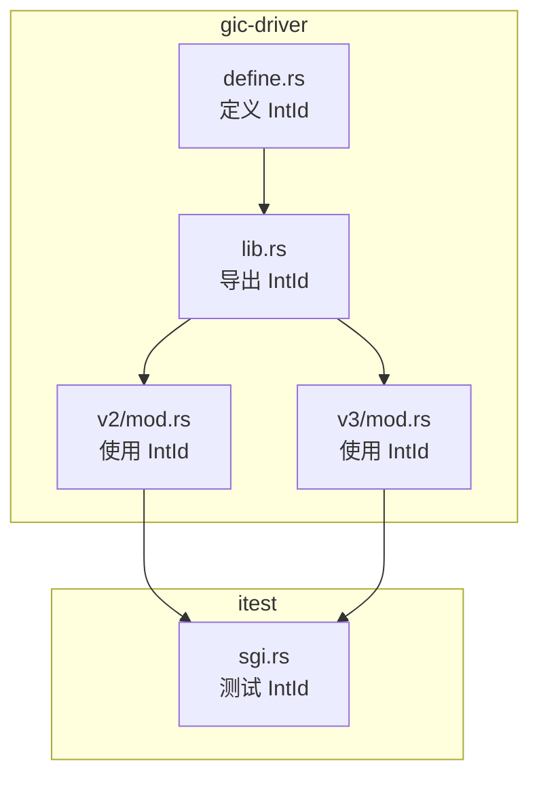
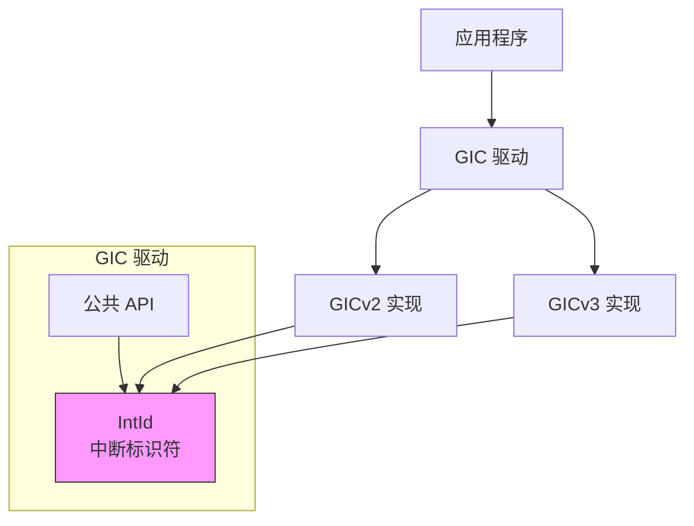
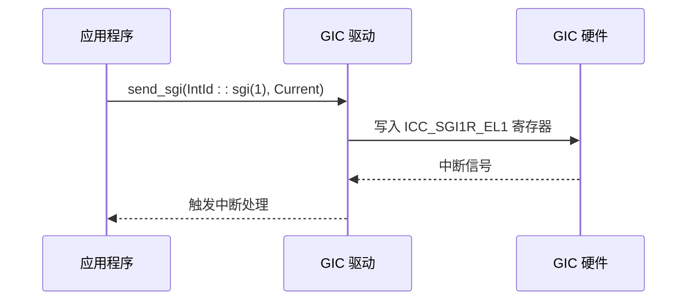
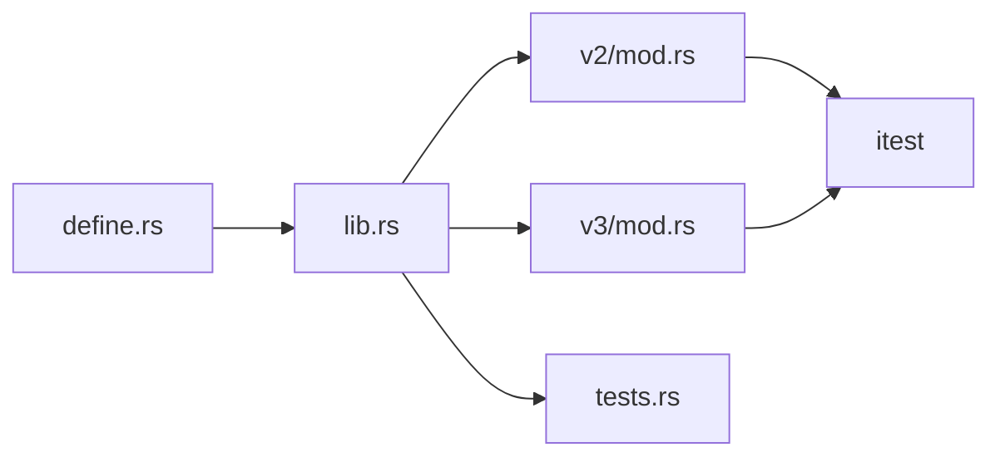

# IntId API

<cite>
**本文档中引用的文件**  
- [define.rs](file://gic-driver/src/define.rs#L82-L315)
- [lib.rs](file://gic-driver/src/lib.rs#L1-L112)
- [v3/mod.rs](file://gic-driver/src/version/v3/mod.rs#L1002-L1149)
- [v2/mod.rs](file://gic-driver/src/version/v2/mod.rs#L252-L306)
- [tests.rs](file://gic-driver/src/tests.rs#L0-L41)
- [sgi.rs](file://itest/test-base/src/test_suit/sgi.rs#L0-L110)
</cite>

## 目录
1. [简介](#简介)
2. [项目结构](#项目结构)
3. [核心组件](#核心组件)
4. [架构概述](#架构概述)
5. [详细组件分析](#详细组件分析)
6. [依赖分析](#依赖分析)
7. [性能考虑](#性能考虑)
8. [故障排除指南](#故障排除指南)
9. [结论](#结论)
10. [附录](#附录)（如有必要）

## 简介
`IntId` 是 ARM GIC（通用中断控制器）驱动程序中的核心抽象类型，用于表示中断标识符（Interrupt ID）。它封装了 GIC 规范中定义的中断 ID 范围和类型，提供类型安全的中断 ID 创建、验证和转换机制。`IntId` 支持四种中断类型：SGI（软件生成中断）、PPI（私有外设中断）、SPI（共享外设中断）和特殊中断。该类型通过构造函数强制执行边界检查，确保所有创建的中断 ID 都符合 GIC 规范。`IntId` 实现了 `From` 和 `TryFrom` trait，支持与原始 `u32` 值的安全转换，并因其不可变性和 `Send + Sync` 特性而具备线程安全性，可在多核系统中安全使用。

## 项目结构
`IntId` 类型主要定义在 `gic-driver/src/define.rs` 文件中，作为 `arm_gic_driver` crate 的公共接口被导出。该项目采用分层架构，`define.rs` 文件位于核心层，定义了基础数据结构和枚举，而具体的 GICv2 和 GICv3 版本实现位于 `version/v2` 和 `version/v3` 目录中。`IntId` 在整个中断处理流程中作为关键参数在不同组件间传递，包括中断配置、状态查询和 SGI 发送等操作。



**图示来源**
- [define.rs](file://gic-driver/src/define.rs#L82-L315)
- [lib.rs](file://gic-driver/src/lib.rs#L1-L112)

**本节来源**
- [define.rs](file://gic-driver/src/define.rs#L82-L315)
- [lib.rs](file://gic-driver/src/lib.rs#L1-L112)

## 核心组件
`IntId` 结构体是中断管理的核心组件，它是一个包含单个 `u32` 字段的元组结构体，代表 GIC 硬件使用的原始中断 ID。该类型通过一组常量范围（`SGI_RANGE`, `PPI_RANGE`, `SPI_RANGE`）来定义不同中断类型的合法 ID 范围。其主要功能包括：通过 `sgi()`, `ppi()`, `spi()` 构造函数创建特定类型的中断 ID，通过 `is_sgi()`, `is_private()` 等方法查询中断类型，以及通过 `to_u32()` 方法获取原始值。`IntId` 的设计确保了类型安全，防止了无效中断 ID 的创建和使用。

**本节来源**
- [define.rs](file://gic-driver/src/define.rs#L82-L315)

## 架构概述
`IntId` 类型在 GIC 驱动程序的架构中扮演着统一接口的角色。在 GICv2 和 GICv3 的不同实现中，`IntId` 被用作高层 API 的参数，屏蔽了底层硬件寄存器操作的复杂性。例如，在 `Gic` 结构体的 `set_irq_enable` 和 `send_sgi` 等方法中，`IntId` 作为中断的唯一标识符被传递。这种设计实现了关注点分离，使上层应用无需关心具体的 GIC 版本和寄存器布局，只需通过 `IntId` 与中断系统交互。



**图示来源**
- [v2/mod.rs](file://gic-driver/src/version/v2/mod.rs#L252-L306)
- [v3/mod.rs](file://gic-driver/src/version/v3/mod.rs#L1002-L1149)

## 详细组件分析

### IntId 结构分析
`IntId` 是一个简单的、不可变的包装器，其内部是一个 `u32` 值。它实现了 `Copy`, `Clone`, `Eq`, `PartialEq`, `Ord`, `PartialOrd` 等 trait，使其行为类似于原始类型，同时提供了额外的安全性。该结构体的不可变性设计确保了中断 ID 在创建后不会被意外修改，这对于在多线程环境中安全地共享中断标识符至关重要。

```mermaid
classDiagram
class IntId {
+u32 id
+const fn sgi(sgi : u32) IntId
+const fn ppi(ppi : u32) IntId
+const fn spi(spi : u32) IntId
+fn is_sgi() bool
+fn is_private() bool
+const fn to_u32() u32
+unsafe fn raw(id : u32) IntId
}
note right of IntId
表示 GIC 中断标识符的核心结构
提供类型安全的中断 ID 创建和验证
end note
```

**图示来源**
- [define.rs](file://gic-driver/src/define.rs#L82-L315)

**本节来源**
- [define.rs](file://gic-driver/src/define.rs#L82-L315)

### 构造方法与边界检查
`IntId` 提供了多种构造方法来创建不同类型的中断 ID。`sgi()`、`ppi()` 和 `spi()` 是安全的常量函数，它们接受逻辑中断号作为参数，并在编译时通过 `assert!` 宏执行边界检查。例如，`sgi()` 函数确保传入的 `sgi` 值小于 16，否则会导致编译时 panic。这保证了所有通过这些方法创建的 `IntId` 实例都符合 GIC 规范。对于需要直接使用原始 ID 的场景，提供了 `unsafe fn raw(id: u32)` 方法，但调用者必须自行保证其有效性。

**本节来源**
- [define.rs](file://gic-driver/src/define.rs#L110-L160)

### 中断类型关联
`IntId` 通过 ID 范围与不同的中断类型相关联。ID 0-15 为 SGI，用于处理器间通信；16-31 为 PPI，是每个 CPU 核心私有的外设中断；32-1019 为 SPI，是可以在多个 CPU 之间路由的共享外设中断。`IntId` 提供了 `is_sgi()` 和 `is_private()` 等方法来查询中断类型。`is_private()` 方法返回 `true` 当中断 ID 小于 32，即该中断是 SGI 或 PPI，不能在 CPU 之间路由。

**本节来源**
- [define.rs](file://gic-driver/src/define.rs#L234-L272)

### 转换逻辑
`IntId` 实现了 `From<IntId> for u32` trait，允许通过 `.into()` 或 `u32::from()` 语法将其转换为原始 `u32` 值。这在与底层硬件寄存器交互时非常有用，因为寄存器通常期望原始的数值。虽然文档中未明确显示 `TryFrom<u32> for IntId` 的实现，但 `raw()` 方法提供了不安全的转换途径，而 `sgi()`, `ppi()`, `spi()` 方法则提供了针对特定范围的安全转换。以下是一个将原始值安全转换为 `IntId` 的代码示例：

```rust
// 使用构造函数进行安全转换
let sgi_id = IntId::sgi(5); // 创建 SGI #5
let spi_id = IntId::spi(42); // 创建 SPI #42 (ID 74)

// 获取原始值
let raw_id: u32 = sgi_id.into(); // raw_id = 5
```

**本节来源**
- [define.rs](file://gic-driver/src/define.rs#L274-L315)

### 不可变性与线程安全性
`IntId` 是一个不可变的值类型，一旦创建，其内部的 `u32` 值就无法更改。这种设计使其天然具备线程安全性。此外，`IntId` 实现了 `Send` 和 `Sync` trait，这意味着 `IntId` 实例可以安全地在线程之间转移（`Send`）或在多个线程之间共享引用（`Sync`）。这在多核系统中处理中断时至关重要，例如，一个核心可以创建一个 `IntId` 并将其发送到另一个核心用于 SGI 发送操作。

**本节来源**
- [define.rs](file://gic-driver/src/define.rs#L82-L315)

### 典型应用场景
`IntId` 在中断配置和处理流程中有多种应用场景。在初始化阶段，用于配置中断的优先级、触发类型和目标 CPU。在运行时，用于查询中断状态（如是否启用、是否挂起）和发送 SGI。例如，在 `itest` 测试套件中，`IntId::sgi(1)` 被用来创建一个 SGI 中断 ID，并通过 `test_if().sgi_to_current(SGI_IRQ)` 发送到当前 CPU，以测试中断处理逻辑。



**图示来源**
- [v3/mod.rs](file://gic-driver/src/version/v3/mod.rs#L1113-L1149)
- [sgi.rs](file://itest/test-base/src/test_suit/sgi.rs#L0-L110)

**本节来源**
- [v3/mod.rs](file://gic-driver/src/version/v3/mod.rs#L1002-L1149)
- [sgi.rs](file://itest/test-base/src/test_suit/sgi.rs#L0-L110)

### 非法ID值与预防措施
非法的中断 ID 值（如大于 1023 或在保留范围内）可能导致硬件异常或未定义行为。`IntId` 的设计通过安全的构造函数（`sgi`, `ppi`, `spi`）来预防此类问题，这些函数在编译时执行边界检查。对于使用 `unsafe fn raw(id: u32)` 的情况，开发者必须自行承担风险，确保传入的 ID 值是有效的。最佳实践是尽可能使用安全的构造函数，避免直接使用 `raw()` 方法，除非在极少数需要处理特殊或保留 ID 的情况下。

**本节来源**
- [define.rs](file://gic-driver/src/define.rs#L110-L160)
- [tests.rs](file://gic-driver/src/tests.rs#L0-L41)

## 依赖分析
`IntId` 类型是 `arm_gic_driver` crate 的基础依赖。`lib.rs` 文件通过 `pub use define::IntId;` 将其导出为公共接口。`version/v2` 和 `version/v3` 模块中的 `Gic` 和 `CpuInterface` 结构体都依赖 `IntId` 作为其公共 API 的参数类型。`itest` 测试项目也直接依赖 `IntId` 来编写中断功能的测试用例。这种依赖关系表明 `IntId` 是整个中断驱动程序的基石。



**图示来源**
- [lib.rs](file://gic-driver/src/lib.rs#L1-L112)
- [v2/mod.rs](file://gic-driver/src/version/v2/mod.rs#L252-L306)
- [v3/mod.rs](file://gic-driver/src/version/v3/mod.rs#L1002-L1149)

**本节来源**
- [lib.rs](file://gic-driver/src/lib.rs#L1-L112)

## 性能考虑
`IntId` 的性能开销极低。它是一个零成本抽象，其方法（如 `to_u32()`）通常会被编译器内联，最终生成的代码与直接使用 `u32` 几乎相同。边界检查在编译时由 `assert!` 宏处理，不会在运行时产生额外开销。因此，使用 `IntId` 不仅提高了代码的安全性和可读性，而且不会对中断处理的性能造成任何负面影响。

## 故障排除指南
当遇到与 `IntId` 相关的问题时，最常见的原因是使用了无效的中断 ID。如果代码在调用 `IntId::sgi()`, `ppi()`, 或 `spi()` 时 panic，应检查传入的参数是否超出了有效范围（SGI: 0-15, PPI: 0-15, SPI: 0-987）。如果使用 `unsafe fn raw()` 导致硬件异常，应验证原始 ID 值是否在 GIC 支持的范围内（0-1023），并确保没有使用保留的特殊 ID（1020-1023）。调试时，可以利用 `IntId` 的 `Debug` 实现来打印其类型和值，例如 `println!("{:?}", intid)` 会输出 "SGI 5" 或 "SPI 42"。

**本节来源**
- [define.rs](file://gic-driver/src/define.rs#L82-L315)
- [tests.rs](file://gic-driver/src/tests.rs#L0-L41)

## 结论
`IntId` 是一个设计精良、类型安全的中断标识符抽象，它为 ARM GIC 驱动程序提供了坚实的基础。通过强制执行边界检查、提供清晰的中断类型关联和安全的转换逻辑，`IntId` 有效防止了因无效中断 ID 导致的硬件错误。其不可变性和线程安全性使其非常适合在多核嵌入式系统中使用。开发者应优先使用其安全的构造函数来创建中断 ID，以充分利用其安全优势，同时享受零运行时性能开销的好处。