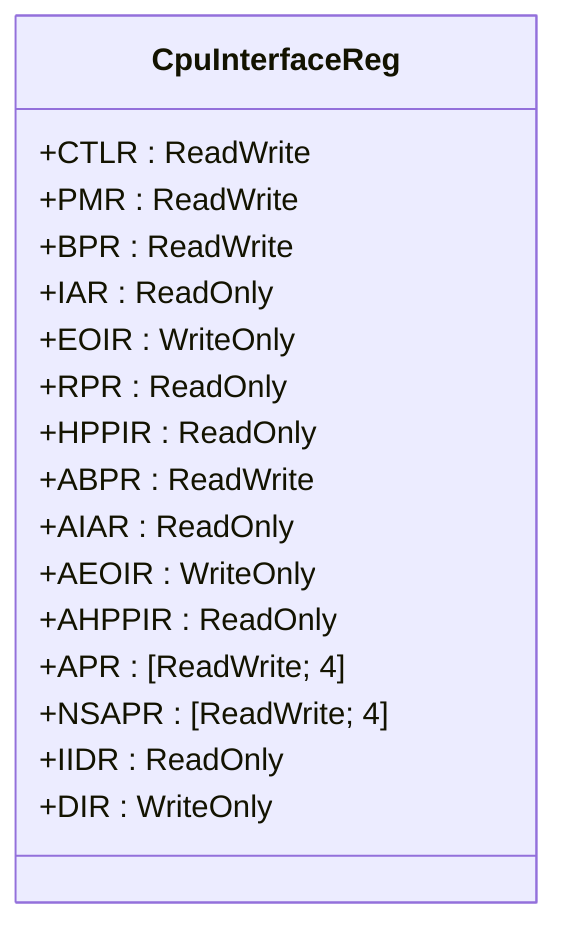
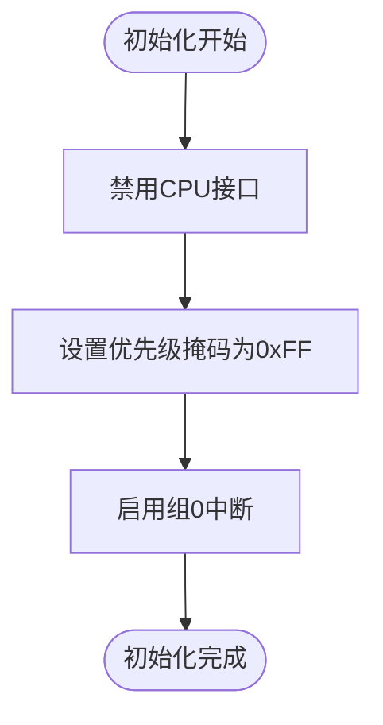
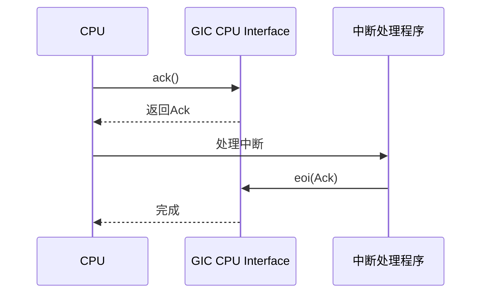
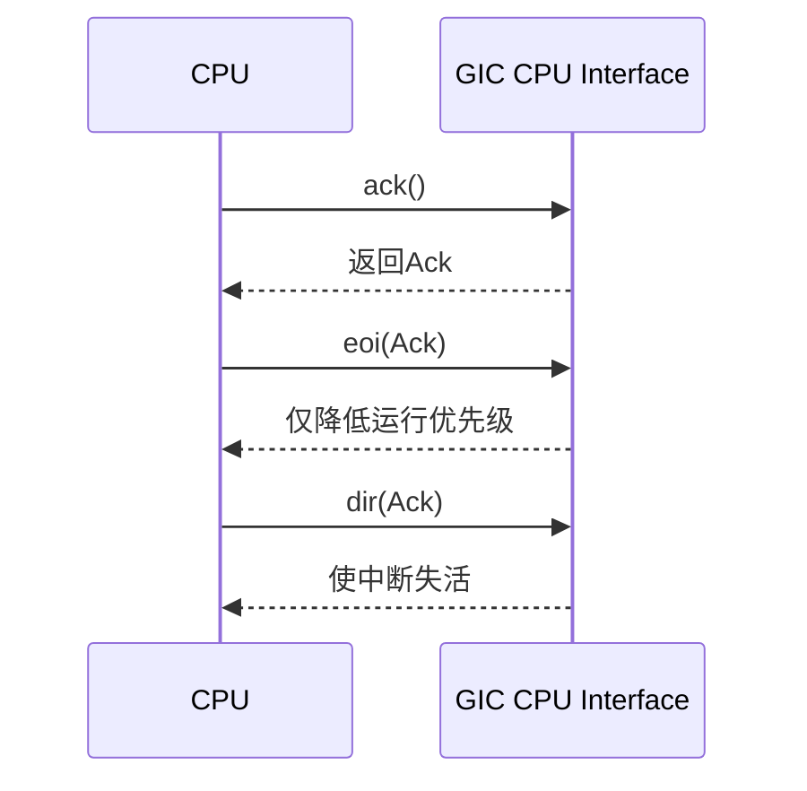

# CPU接口控制

<cite>
**Referenced Files in This Document**  
- [gicc.rs](file://gic-driver/src/version/v2/gicc.rs)
- [mod.rs](file://gic-driver/src/version/v2/mod.rs)
- [gicd.rs](file://gic-driver/src/version/v2/gicd.rs)
- [icc.rs](file://gic-driver/src/sys_reg/icc.rs)
</cite>

## 目录
1. [核心寄存器功能解析](#核心寄存器功能解析)
2. [CPU接口初始化流程](#cpu接口初始化流程)
3. [中断确认与结束机制](#中断确认与结束机制)
4. [优先级掩码控制](#优先级掩码控制)
5. [中断处理工作流](#中断处理工作流)
6. [两步EOI模式与DIR寄存器](#两步eoi模式与dir寄存器)

## 核心寄存器功能解析

GICv2 CPU接口（gicc.rs）定义了一组关键寄存器，用于管理CPU与中断控制器之间的交互。这些寄存器在`CpuInterfaceReg`结构中被声明，每个寄存器都有特定的功能。



**Diagram sources**  
- [gicc.rs](file://gic-driver/src/version/v2/gicc.rs#L1-L100)

### CTLR寄存器

CPU接口控制寄存器（CTLR）负责启用和配置CPU接口的基本功能。其主要字段包括：
- **EnableGrp0**: 启用组0（安全）中断
- **EnableGrp1**: 启用组1（非安全）中断
- **AckCtl**: 组1中断的确认控制
- **FIQEn**: 组0中断的FIQ使能
- **CBPR**: 公共二进制点寄存器
- **EOImodeNS**: 非安全状态的EOI模式

### PMR寄存器

中断优先级掩码寄存器（PMR）用于设置优先级掩码，控制哪些优先级的中断可以被传递到CPU。优先级值越小，优先级越高。通过设置PMR，可以屏蔽优先级低于（数值大于）掩码值的所有中断。

### IAR寄存器

中断确认寄存器（IAR）用于确认并获取当前最高优先级的待处理中断。读取IAR会返回中断ID和源CPU ID（对于SGI）。该操作会更新运行优先级，并将中断状态从"pending"变为"active"。

### EOIR寄存器

中断结束寄存器（EOIR）用于通知GIC中断处理已完成。写入EOIR会降低运行优先级，并可能使中断失活，具体行为取决于EOImodeNS设置。

### RPR寄存器

运行优先级寄存器（RPR）反映当前正在处理的中断的优先级。它决定了当前CPU可以接收的中断的最低优先级（最高数值）。

### HPPIR寄存器

最高优先级待处理中断寄存器（HPPIR）返回当前最高优先级的待处理中断ID，但不会改变中断状态或运行优先级。

**Section sources**  
- [gicc.rs](file://gic-driver/src/version/v2/gicc.rs#L1-L150)
- [mod.rs](file://gic-driver/src/version/v2/mod.rs#L308-L344)

## CPU接口初始化流程

`init_current_cpu()`函数负责初始化当前CPU的GIC接口，确保其处于正确的初始状态。



**Diagram sources**  
- [mod.rs](file://gic-driver/src/version/v2/mod.rs#L344-L362)

该流程包含以下关键步骤：

1. **禁用CPU接口**：首先将CTLR寄存器清零，确保在配置过程中不会产生意外中断。
2. **设置优先级掩码**：通过`set_priority_mask(0xFF)`将PMR设置为0xFF，允许所有优先级的中断通过。0xFF是最低优先级（最高数值），因此不会屏蔽任何中断。
3. **启用中断组**：通过设置CTLR的EnableGrp0位来启用组0中断。在初始化阶段，通常先启用组0，后续可根据安全需求配置组1。

此初始化流程确保了CPU接口在启动时能够接收所有中断，为后续的中断处理做好准备。

**Section sources**  
- [mod.rs](file://gic-driver/src/version/v2/mod.rs#L344-L362)

## 中断确认与结束机制

中断处理的核心机制包括确认（ack）和结束（eoi）两个阶段，通过`Ack`枚举类型和相关方法实现。

### Ack枚举类型

`Ack`枚举用于表示中断确认的结果，区分了SGI（软件生成中断）和其他类型的中断：

```mermaid
classDiagram
class Ack {
+SGI{intid : IntId, cpu_id : usize}
+Other(IntId)
+is_special() bool
}
```

**Diagram sources**  
- [mod.rs](file://gic-driver/src/version/v2/mod.rs#L308-L319)

- **Ack::SGI**: 用于SGI中断，包含中断ID和源CPU ID。
- **Ack::Other**: 用于PPI、SPI等其他中断，仅包含中断ID。

`From<u32>`和`From<Ack>`的实现允许在寄存器值和`Ack`类型之间进行转换，简化了与硬件寄存器的交互。

### EOI模式的影响

`EOImodeNS`模式决定了非安全状态下EOI操作的行为：

- **EOImodeNS = false（默认）**: EOIR寄存器同时执行优先级降低和中断失活功能。此时访问DIR寄存器是不可预测的。
- **EOImodeNS = true（两步模式）**: EOIR寄存器仅执行优先级降低功能，而中断失活功能由DIR寄存器完成。

`set_eoi_mode_ns()`方法用于配置此模式，影响后续的中断结束流程。

**Section sources**  
- [mod.rs](file://gic-driver/src/version/v2/mod.rs#L308-L344)
- [gicc.rs](file://gic-driver/src/version/v2/gicc.rs#L1-L150)

## 优先级掩码控制

`set_priority_mask`方法是控制中断屏蔽的关键接口。它通过写入PMR寄存器来设置优先级掩码。

当一个中断的优先级数值大于或等于PMR中设置的掩码值时，该中断将被屏蔽，不会被传递到CPU。例如，将掩码设置为0x80会屏蔽所有优先级数值在0x80到0xFF之间的中断（即优先级较低的中断），而允许0x00到0x7F之间的中断（即优先级较高的中断）通过。

`get_highest_priority_pending`和`get_running_priority`方法提供了查询当前中断状态的途径：
- `get_highest_priority_pending`返回当前最高优先级的待处理中断ID，用于在不确认中断的情况下检查中断状态。
- `get_running_priority`返回当前正在处理的中断的优先级，反映了CPU的当前中断屏蔽级别。

这些方法共同构成了中断优先级管理的基础，允许操作系统实现复杂的中断调度策略。

**Section sources**  
- [mod.rs](file://gic-driver/src/version/v2/mod.rs#L384-L400)

## 中断处理工作流

典型的中断处理工作流遵循"确认-处理-结束"的模式：



**Diagram sources**  
- [mod.rs](file://gic-driver/src/version/v2/mod.rs#L364-L382)

1. **中断确认（ack）**: 调用`ack()`方法读取IAR寄存器，获取`Ack`类型的中断描述符。这一步确认了中断并获取了中断ID。
2. **中断处理**: 在获取中断ID后，执行相应的中断服务程序（ISR）来处理中断事件。
3. **中断结束（eoi）**: 处理完成后，调用`eoi()`方法并传入之前获取的`Ack`对象，写入EOIR寄存器，通知GIC中断处理已完成。

这个工作流确保了中断处理的原子性和正确性，防止了中断丢失或重复处理。

**Section sources**  
- [mod.rs](file://gic-driver/src/version/v2/mod.rs#L364-L382)

## 两步EOI模式与DIR寄存器

在`EOImodeNS`设置为true的两步EOI模式下，中断结束过程被分为两个独立的步骤，DIR寄存器在此模式中扮演关键角色。

### 两步模式工作流程



**Diagram sources**  
- [mod.rs](file://gic-driver/src/version/v2/mod.rs#L382-L384)

1. **第一步 - EOIR**: 写入EOIR寄存器，这会降低运行优先级，允许更高优先级的中断抢占当前处理过程。
2. **第二步 - DIR**: 写入DIR寄存器，这会将中断状态从"active"变为"inactive"，完成中断的完整生命周期。

### DIR寄存器的特殊用途

DIR（Deactivate Interrupt Register）寄存器专门用于在两步模式下显式地使中断失活。它的格式与IAR/EOIR类似，包含中断ID和CPU ID。使用DIR的主要优势在于：
- **灵活性**: 允许在中断处理过程中的任何时刻降低运行优先级（通过EOIR），而将中断失活推迟到处理完成时（通过DIR）。
- **虚拟化支持**: 在虚拟化环境中，hypervisor可以使用两步模式来更精细地控制虚拟中断的生命周期。

`dir()`方法的实现与`eoi()`类似，都是将`Ack`对象转换为对应的寄存器值并写入DIR寄存器。

**Section sources**  
- [mod.rs](file://gic-driver/src/version/v2/mod.rs#L382-L384)