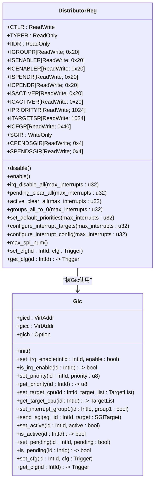
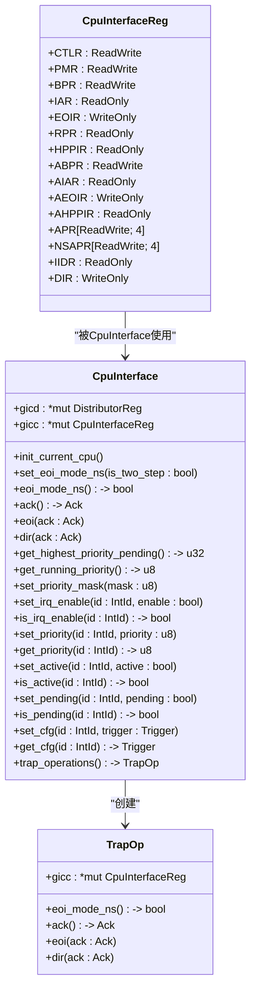

# GICv2功能详解

<cite>
**本文档引用的文件**   
- [gicd.rs](file://gic-driver/src/version/v2/gicd.rs)
- [gicc.rs](file://gic-driver/src/version/v2/gicc.rs)
- [gich.rs](file://gic-driver/src/version/v2/gich.rs)
- [mod.rs](file://gic-driver/src/version/v2/mod.rs)
- [define.rs](file://gic-driver/src/define.rs)
- [lib.rs](file://gic-driver/src/lib.rs)
</cite>

## 目录
1. [引言](#引言)
2. [分发器控制机制](#分发器控制机制)
3. [CPU接口实现](#cpu接口实现)
4. [虚拟化支持](#虚拟化支持)
5. [初始化流程与中断处理](#初始化流程与中断处理)
6. [中断配置示例](#中断配置示例)
7. [GICv2局限性与GICv3对比](#gicv2局限性与gicv3对比)
8. [结论](#结论)

## 引言
GICv2（Generic Interrupt Controller version 2）是ARM架构中用于管理中断的核心组件。本文档深入探讨GICv2在arceos_drivers项目中的具体实现细节，重点分析分发器（Distributor）、CPU接口（CPU Interface）和虚拟化支持（Hypervisor Interface）的实现机制。

**Section sources**
- [mod.rs](file://gic-driver/src/version/v2/mod.rs#L1-L957)

## 分发器控制机制
分发器（Distributor）负责管理所有中断的全局状态，包括中断使能、优先级设置、目标CPU分配等功能。在gicd.rs文件中，通过DistributorReg结构体定义了分发器的所有寄存器映射。

### 中断使能控制
分发器提供了中断使能和禁用的功能，通过ISENABLER（中断设置使能寄存器）和ICENABLER（中断清除使能寄存器）数组实现。每个寄存器可控制32个中断的使能状态。GICv2支持将中断分为Group 0（安全组）和Group 1（非安全组），通过IGROUPR寄存器进行分组配置。

### 优先级与目标CPU设置
中断优先级由IPRIORITYR寄存器数组管理，每个中断分配一个8位优先级值（0为最高优先级，255为最低优先级）。对于共享外设中断（SPI），通过ITARGETSR寄存器设置目标CPU核心，实现中断的多核分发。

### 中断状态管理
分发器维护中断的三种状态：挂起（Pending）、激活（Active）和活动（Active and Pending）。通过ISPENDR/ICPENDR寄存器控制挂起状态，ISACTIVER/ICACTIVER寄存器控制激活状态。



**Diagram sources **
- [gicd.rs](file://gic-driver/src/version/v2/gicd.rs#L1-L289)
- [mod.rs](file://gic-driver/src/version/v2/mod.rs#L1-L957)

**Section sources**
- [gicd.rs](file://gic-driver/src/version/v2/gicd.rs#L1-L289)
- [mod.rs](file://gic-driver/src/version/v2/mod.rs#L1-L957)

## CPU接口实现
CPU接口（CPU Interface）负责处理当前CPU核心的中断相关操作，包括中断确认（ACK）和结束（EOI）等关键操作。在gicc.rs文件中，通过CpuInterfaceReg结构体定义了CPU接口的所有寄存器。

### 中断确认与结束
中断确认通过IAR（Interrupt Acknowledge Register）寄存器实现，读取该寄存器会返回当前最高优先级的挂起中断ID，并将该中断状态从挂起变为激活。中断处理完成后，通过向EOIR（End of Interrupt Register）寄存器写入相同的中断ID来标记中断处理结束。

### 优先级管理
CPU接口通过PMR（Priority Mask Register）设置优先级掩码，只有优先级高于掩码值的中断才能被传递到CPU。RPR（Running Priority Register）记录当前正在处理的中断优先级，用于优先级仲裁。



**Diagram sources **
- [gicc.rs](file://gic-driver/src/version/v2/gicc.rs#L1-L149)
- [mod.rs](file://gic-driver/src/version/v2/mod.rs#L1-L957)

**Section sources**
- [gicc.rs](file://gic-driver/src/version/v2/gicc.rs#L1-L149)
- [mod.rs](file://gic-driver/src/version/v2/mod.rs#L1-L957)

## 虚拟化支持
GICv2通过Hypervisor Interface（gich.rs）提供虚拟化支持，允许虚拟机监控器（Hypervisor）管理虚拟中断。HypervisorRegs结构体定义了虚拟化相关的寄存器。

### 虚拟中断管理
虚拟中断通过64个List Register（LR）进行管理，每个LR可配置一个虚拟中断的属性，包括虚拟ID、优先级、状态和类型。虚拟中断可以是硬件中断（映射到物理中断）或软件中断。

### 维护中断
当虚拟中断状态发生变化时，会产生维护中断（Maintenance Interrupt），通知Hypervisor进行相应的处理。维护中断包括EOI维护、下溢维护、列表寄存器条目不存在维护等类型。

```mermaid
classDiagram
class HypervisorRegs {
+HCR : ReadWrite<u32, HCR : : Register>
+VTR : ReadOnly<u32, VTR : : Register>
+VMCR : ReadWrite<u32, VMCR : : Register>
+MISR : ReadOnly<u32, MISR : : Register>
+EISR0 : ReadOnly<u32>
+EISR1 : ReadOnly<u32>
+ELRSR0 : ReadOnly<u32>
+ELRSR1 : ReadOnly<u32>
+APR : ReadWrite<u32>
+LR[ReadWrite<u32, LR : : Register>; 64]
}
class HypervisorInterface {
+gich : *mut HypervisorRegs
+gicv : *mut CpuInterfaceReg
+init_current_cpu()
+gicv_address() -> NonNull<u8>
+enable()
+disable()
+set_underflow_interrupt(enable : bool)
+set_list_reg_entry_not_present_interrupt(enable : bool)
+set_no_pending_interrupt(enable : bool)
+set_vgrp0_enable_interrupt(enable : bool)
+set_vgrp0_disable_interrupt(enable : bool)
+set_vgrp1_enable_interrupt(enable : bool)
+set_vgrp1_disable_interrupt(enable : bool)
+set_virtual_interrupt(lr_index : usize, config : VirtualInterruptConfig)
+get_virtual_interrupt(lr_index : usize) -> VirtualInterruptConfig
+is_list_register_empty(lr_index : usize) -> bool
+clear_list_register(lr_index : usize) -> Result<(), &'static str>
+get_maintenance_status() -> u32
+get_list_register_count() -> usize
+get_eoi_status() -> (u32, u32)
+get_empty_lr_status() -> (u32, u32)
+gicv_aiar() -> Option<Ack>
}
class VirtualInterruptConfig {
+virtual_id : IntId
+priority : u8
+state : VirtualInterruptState
+group1 : bool
+interrupt_type : VirtualInterruptType
+new(virtual_id : IntId, priority : u8, state : VirtualInterruptState, group1 : bool, interrupt_type : VirtualInterruptType) -> Self
+hardware(virtual_id : IntId, physical_id : u32, priority : u8, state : VirtualInterruptState, group1 : bool) -> Self
+software(virtual_id : IntId, cpu_id : Option<usize>, priority : u8, state : VirtualInterruptState, group1 : bool, eoi_maintenance : bool) -> Self
}
class VirtualInterruptType {
+Software { cpu_id : Option<usize>, eoi_maintenance : bool }
+Hardware { physical_id : u32 }
+software(cpu_id : Option<usize>, eoi_maintenance : bool) -> Self
+hardware(physical_id : u32) -> Self
+is_hardware() -> bool
+is_software() -> bool
}
class VirtualInterruptState {
+Invalid = 0
+Pending = 1
+Active = 2
+PendingAndActive = 3
}
HypervisorRegs --> HypervisorInterface : "被HypervisorInterface使用"
HypervisorInterface --> VirtualInterruptConfig : "使用"
VirtualInterruptConfig --> VirtualInterruptType : "包含"
VirtualInterruptConfig --> VirtualInterruptState : "包含"
```

**Diagram sources **
- [gich.rs](file://gic-driver/src/version/v2/gich.rs#L1-L134)
- [mod.rs](file://gic-driver/src/version/v2/mod.rs#L1-L957)

**Section sources**
- [gich.rs](file://gic-driver/src/version/v2/gich.rs#L1-L134)
- [mod.rs](file://gic-driver/src/version/v2/mod.rs#L1-L957)

## 初始化流程与中断处理
GICv2的初始化流程在Gic结构体的init方法中实现，包括分发器和CPU接口的初始化。

### 初始化流程
1. 禁用分发器
2. 获取支持的最大SPI数量
3. 禁用所有中断
4. 清除所有挂起和激活的中断
5. 配置所有中断为Group 1（非安全组）
6. 设置默认优先级
7. 配置SPI的目标CPU
8. 配置中断触发方式
9. 启用分发器

### 中断处理