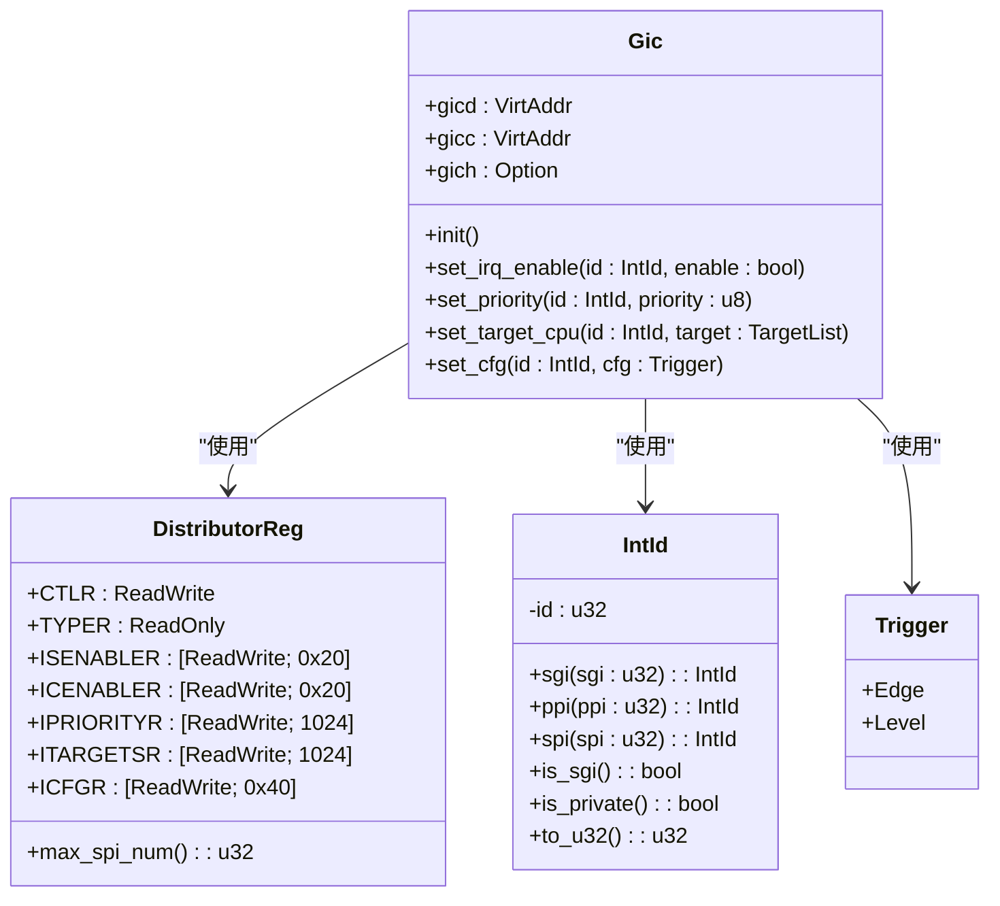

# 分发器控制

<cite>
**Referenced Files in This Document**  
- [gicd.rs](file://gic-driver/src/version/v2/gicd.rs)
- [mod.rs](file://gic-driver/src/version/v2/mod.rs)
- [define.rs](file://gic-driver/src/define.rs)
</cite>

## 目录
1. [分发器寄存器结构](#分发器寄存器结构)
2. [中断控制逻辑](#中断控制逻辑)
3. [初始化流程](#初始化流程)
4. [中断配置API](#中断配置api)
5. [中断分组与安全状态](#中断分组与安全状态)

## 分发器寄存器结构

GICv2分发器（Distributor）通过一组内存映射寄存器实现对中断的集中管理。这些寄存器定义在`gicd.rs`文件中的`DistributorReg`结构体中，每个寄存器都有特定的偏移地址和功能。

**DistributorReg**结构体定义了分发器的所有寄存器，包括：
- **CTLR** (0x0000): 分发器控制寄存器，用于启用/禁用中断组
- **TYPER** (0x0004): 中断控制器类型寄存器，提供中断线数量等信息
- **ISENABLER/ICENABLER** (0x0100/0x0180): 中断使能/禁用寄存器数组，每32个中断使用一个32位寄存器
- **IPRIORITYR** (0x0400): 中断优先级寄存器数组，每个中断使用8位，每4个中断占用一个32字节
- **ITARGETSR** (0x0800): 中断目标CPU寄存器数组，指定中断应路由到哪个CPU
- **ICFGR** (0x0c00): 中断配置寄存器数组，设置中断触发方式（边沿/电平）

这些寄存器通过`tock-registers`库的`register_structs!`宏进行内存布局定义，确保与硬件规范完全匹配。

**Section sources**
- [gicd.rs](file://gic-driver/src/version/v2/gicd.rs#L0-L199)

## 中断控制逻辑

分发器实现了对中断生命周期的完整控制，包括使能、优先级设置、目标CPU分配和触发模式配置等核心功能。

### 中断使能/禁用
通过`ISENABLER`和`ICENABLER`寄存器数组实现中断的使能和禁用。每个32位寄存器管理32个中断，通过位操作来控制单个中断的状态。在`DistributorReg`的实现中，`irq_disable_all`方法会遍历所有相关的`ICENABLER`寄存器并写入全1值，从而禁用所有中断。

### 优先级设置
`IPRIORITYR`寄存器数组为每个中断分配一个8位优先级值（0为最高优先级，255为最低）。系统在初始化时会调用`set_default_priorities`方法，将所有中断的默认优先级设置为0xA0（中间优先级）。

### 目标CPU分配
`ITARGETSR`寄存器数组用于指定SPI（共享外设中断）的目标CPU。每个中断对应一个8位值，其中每一位代表一个CPU核心。在初始化过程中，`configure_interrupt_targets`方法会将所有SPI中断默认配置为仅路由到CPU 0。

### 中断配置
`ICFGR`寄存器数组控制中断的触发模式，每个中断占用2位，其中第1位用于区分边沿触发和电平触发。`set_cfg`方法根据`Trigger`枚举值（`Edge`或`Level`）来设置相应的位。

**Section sources**
- [gicd.rs](file://gic-driver/src/version/v2/gicd.rs#L79-L289)

## 初始化流程

分发器的初始化流程在`Gic`结构体的`init`方法中实现，遵循GICv2规范的推荐步骤，确保系统处于已知的稳定状态。

**Diagram sources**
- [mod.rs](file://gic-driver/src/version/v2/mod.rs#L80-L150)

**Section sources**
- [mod.rs](file://gic-driver/src/version/v2/mod.rs#L80-L150)

初始化流程的关键步骤包括：
1. **禁用分发器**：首先通过`disable`方法关闭分发器，防止在配置过程中产生意外中断
2. **获取中断数量**：读取`TYPER`寄存器的`ITLinesNumber`字段，计算支持的最大中断数
3. **清除中断状态**：依次清除所有待处理和活动的中断，确保中断状态机处于干净状态
4. **配置中断分组**：将所有中断默认配置为Group 1（非安全组）
5. **设置默认值**：为所有中断设置默认优先级、目标CPU和触发模式
6. **启用分发器**：最后通过`enable`方法启用分发器，开始正常处理中断

## 中断配置API

驱动程序提供了高层API来简化中断配置，这些API封装了底层寄存器操作的复杂性。

### SPI和PPI中断配置
通过`Gic`结构体提供的API可以方便地配置各种中断：

- **set_irq_enable**: 通过`ISENABLER`/`ICENABLER`寄存器控制中断的使能状态
- **set_priority**: 通过`IPRIORITYR`寄存器设置中断优先级
- **set_target_cpu**: 通过`ITARGETSR`寄存器设置SPI中断的目标CPU
- **set_cfg**: 通过`ICFGR`寄存器设置中断的触发模式

这些API都接受`IntId`类型作为中断标识符，该类型在`define.rs`中定义，提供了`sgi`、`ppi`、`spi`等构造方法来创建不同类型的中断ID。

### 最大SPI数量计算
`max_spi_num`方法通过读取`TYPER`寄存器的`ITLinesNumber`字段来计算支持的最大SPI数量。根据GICv2规范，实际支持的中断线数为`(ITLinesNumber + 1) * 32`，这是因为`ITLinesNumber`字段表示的是32个中断线的组数。

**Diagram sources**
- [mod.rs](file://gic-driver/src/version/v2/mod.rs#L0-L956)
- [gicd.rs](file://gic-driver/src/version/v2/gicd.rs#L0-L289)
- [define.rs](file://gic-driver/src/define.rs#L0-L316)

**Section sources**
- [mod.rs](file://gic-driver/src/version/v2/mod.rs#L150-L300)
- [gicd.rs](file://gic-driver/src/version/v2/gicd.rs#L200-L289)
- [define.rs](file://gic-driver/src/define.rs#L0-L100)

## 中断分组与安全状态

GICv2支持中断分组机制，用于实现安全与非安全中断的隔离。分组信息由`IGROUPR`寄存器数组管理，每个位对应一个中断。

### 分组配置
- **Group 0**: 安全中断，通常由安全监控模式处理
- **Group 1**: 非安全中断，由普通操作系统处理

在初始化过程中，系统会调用`groups_all_to_0`方法将所有中断默认配置为Group 1。应用程序可以根据安全需求通过`set_interrupt_group1`API动态调整中断分组。

### 安全状态考量
中断分组机制与系统的安全状态密切相关。当GIC实现安全扩展时（通过`TYPER`寄存器的`SecurityExtn`位检测），系统可以利用分组机制实现安全与非安全世界之间的隔离。安全中断只能由安全软件处理，而非安全软件无法访问或修改安全中断的配置。

这种机制为TrustZone等安全技术提供了硬件支持，确保关键的安全相关中断不会被非安全软件干扰。

**Section sources**
- [gicd.rs](file://gic-driver/src/version/v2/gicd.rs#L150-L180)
- [mod.rs](file://gic-driver/src/version/v2/mod.rs#L300-L350)