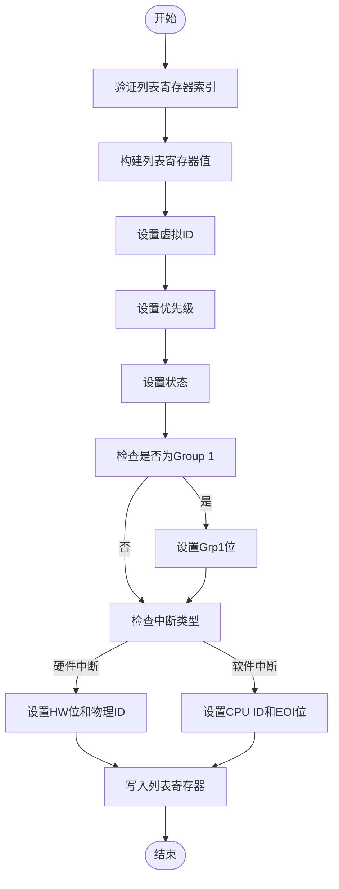
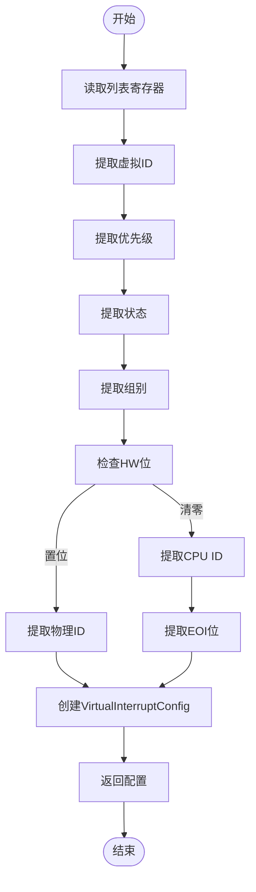
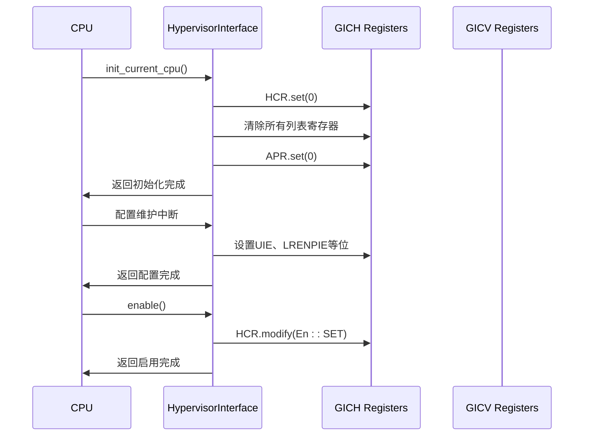
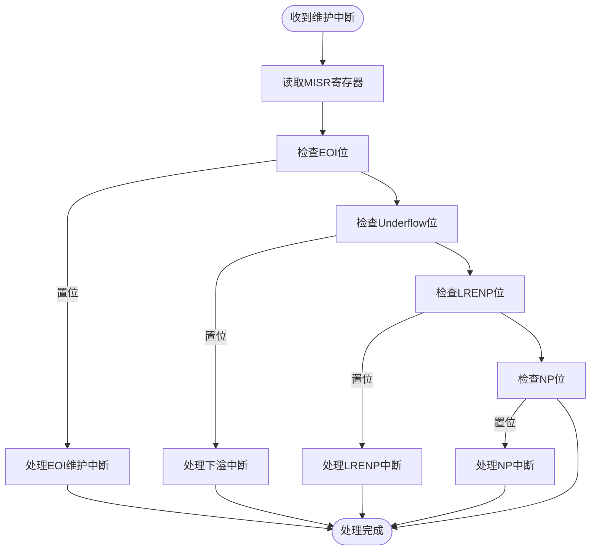

# 虚拟化支持

<cite>
**本文档引用的文件**
- [gich.rs](file://gic-driver/src/version/v2/gich.rs)
- [mod.rs](file://gic-driver/src/version/v2/mod.rs)
</cite>

## 目录
1. [简介](#简介)
2. [HypervisorInterface结构体分析](#hypervisorinterface结构体分析)
3. [HCR寄存器控制位详解](#hcr寄存器控制位详解)
4. [虚拟中断管理机制](#虚拟中断管理机制)
5. [虚拟中断属性配置](#虚拟中断属性配置)
6. [虚拟化初始化流程](#虚拟化初始化流程)
7. [维护中断处理机制](#维护中断处理机制)
8. [总结](#总结)

## 简介
本文档深入分析ARM GICv2架构中虚拟化支持的实现，重点讲解gich.rs文件中HypervisorInterface结构体提供的虚拟中断管理功能。文档详细阐述了Hypervisor Control Register（HCR）的各个控制位及其对虚拟机环境的影响，解释了如何通过64个列表寄存器（List Register）管理虚拟中断的配置和状态。同时，文档还讨论了虚拟中断的类型、优先级、组别等属性的设置方法，以及维护中断的触发条件和处理策略。

## HypervisorInterface结构体分析

HypervisorInterface结构体是GICv2虚拟化支持的核心组件，负责管理虚拟CPU接口和虚拟中断。该结构体通过两个指针分别指向Hypervisor Interface Control Registers（GICH）和Virtual CPU Interface Registers（GICV），实现了对虚拟中断的全面控制。

结构体提供了初始化、启用/禁用虚拟接口、配置维护中断、管理虚拟中断列表寄存器等一系列关键功能。其中，set_virtual_interrupt和get_virtual_interrupt方法是管理虚拟中断的核心接口，通过操作64个列表寄存器来实现虚拟中断的配置和状态查询。

**Section sources**
- [mod.rs](file://gic-driver/src/version/v2/mod.rs#L656-L720)

## HCR寄存器控制位详解

Hypervisor Control Register（HCR）是控制虚拟化功能的关键寄存器，包含多个重要的控制位：

### 全局使能位（En）
En位是虚拟CPU接口的全局使能位，当该位置1时，虚拟CPU接口被启用，虚拟机可以接收和处理虚拟中断。这是启动虚拟化功能的第一步。

### 维护中断使能位
HCR寄存器包含多个维护中断使能位，用于控制不同类型的维护中断：

- **UIE（Underflow Interrupt Enable）**：下溢中断使能位，当列表寄存器出现下溢情况时触发维护中断
- **LRENPIE（List Register Entry Not Present Interrupt Enable）**：列表寄存器条目不存在中断使能位，当尝试访问不存在的列表寄存器条目时触发
- **NPIE（No Pending Interrupt Enable）**：无挂起中断使能位，当没有挂起的虚拟中断时触发维护中断

### 虚拟组使能中断
HCR还包含虚拟组使能/禁用中断使能位，用于监控虚拟中断组的状态变化：

- **VGrp0EIE/VGrp0DIE**：虚拟Group 0中断使能/禁用中断使能位
- **VGrp1EIE/VGrp1DIE**：虚拟Group 1中断使能/禁用中断使能位

这些控制位共同构成了虚拟化环境的中断管理框架，允许hypervisor精确控制虚拟中断的行为和监控虚拟机的状态。

**Section sources**
- [gich.rs](file://gic-driver/src/version/v2/gich.rs#L15-L65)

## 虚拟中断管理机制

虚拟中断管理通过64个列表寄存器（LR）实现，每个列表寄存器可以配置一个虚拟中断的相关信息。HypervisorInterface结构体提供了set_virtual_interrupt和get_virtual_interrupt两个核心方法来管理这些列表寄存器。

### set_virtual_interrupt方法
该方法用于设置虚拟中断的配置，接受列表寄存器索引和VirtualInterruptConfig配置结构体作为参数。方法首先验证索引的有效性，然后根据配置构建列表寄存器的值，最后写入指定的列表寄存器。

**Diagram sources**
- [mod.rs](file://gic-driver/src/version/v2/mod.rs#L718-L755)

### get_virtual_interrupt方法
该方法用于从指定的列表寄存器获取虚拟中断的配置信息。方法读取列表寄存器的值，然后解析各个字段，包括虚拟ID、优先级、状态、组别和中断类型，最后返回一个VirtualInterruptConfig结构体。

**Diagram sources**
- [mod.rs](file://gic-driver/src/version/v2/mod.rs#L757-L796)

## 虚拟中断属性配置

虚拟中断具有多种属性，包括类型、优先级、组别等，这些属性在VirtualInterruptConfig结构体中定义。

### 虚拟中断类型
虚拟中断分为两种类型：
- **硬件中断**：通过PhysicalID字段关联到物理中断，HW位置1
- **软件中断**：通过CPUID字段指定目标CPU，可用于SGI（软件生成中断）

### 优先级配置
优先级字段占用5位，表示中断的优先级。在get_virtual_interrupt方法中，优先级值会左移3位转换为8位优先级值，以适应标准的优先级表示方式。

### 组别配置
虚拟中断可以属于Group 0或Group 1，通过Grp1位控制。Group 1通常用于非安全状态的中断。

### 状态管理
状态字段占用2位，表示中断的当前状态：
- **Invalid (0b00)**：无效状态
- **Pending (0b01)**：挂起状态
- **Active (0b10)**：激活状态
- **PendingAndActive (0b11)**：挂起且激活状态

这些属性的组合使得虚拟中断能够精确模拟物理中断的行为，为虚拟机提供完整的中断服务。

**Section sources**
- [gich.rs](file://gic-driver/src/version/v2/gich.rs#L100-L134)
- [mod.rs](file://gic-driver/src/version/v2/mod.rs#L893-L955)

## 虚拟化初始化流程

虚拟化环境的初始化遵循特定的流程，确保虚拟中断系统正确配置：

### 初始化步骤
1. **init_current_cpu()**：初始化当前CPU的hypervisor接口
2. **配置维护中断**：设置所需的维护中断使能位
3. **启用虚拟CPU接口**：通过设置HCR寄存器的En位启用虚拟接口

### 详细流程

**Diagram sources**
- [mod.rs](file://gic-driver/src/version/v2/mod.rs#L645-L654)

## 维护中断处理机制

维护中断是GICv2虚拟化支持的重要组成部分，用于通知hypervisor虚拟中断系统的状态变化。

### 维护中断类型
- **下溢中断（Underflow）**：当虚拟CPU接口尝试获取中断但没有可用的虚拟中断时触发
- **LRENP中断（List Register Entry Not Present）**：当虚拟CPU接口尝试获取中断但对应的列表寄存器条目不存在时触发
- **NP中断（No Pending）**：当没有挂起的虚拟中断时触发

### 触发条件
维护中断的触发条件由HCR寄存器中的相应使能位控制。只有当对应的使能位置1且满足触发条件时，才会产生维护中断。

### 处理策略
hypervisor通过读取Maintenance Interrupt Status Register（MISR）来确定触发维护中断的具体原因，然后采取相应的处理措施：

**Diagram sources**
- [gich.rs](file://gic-driver/src/version/v2/gich.rs#L75-L90)
- [mod.rs](file://gic-driver/src/version/v2/mod.rs#L810-L820)

## 总结
GICv2的虚拟化支持通过HypervisorInterface结构体和相关的寄存器实现了完整的虚拟中断管理功能。通过HCR寄存器的精细控制，hypervisor能够管理虚拟CPU接口的状态，监控虚拟中断系统的行为。64个列表寄存器为虚拟中断提供了灵活的配置能力，支持硬件和软件中断、多种优先级和状态管理。维护中断机制则为hypervisor提供了必要的状态反馈，确保虚拟化环境的稳定运行。整个虚拟化支持框架设计精巧，为ARM架构的虚拟化应用提供了坚实的基础。