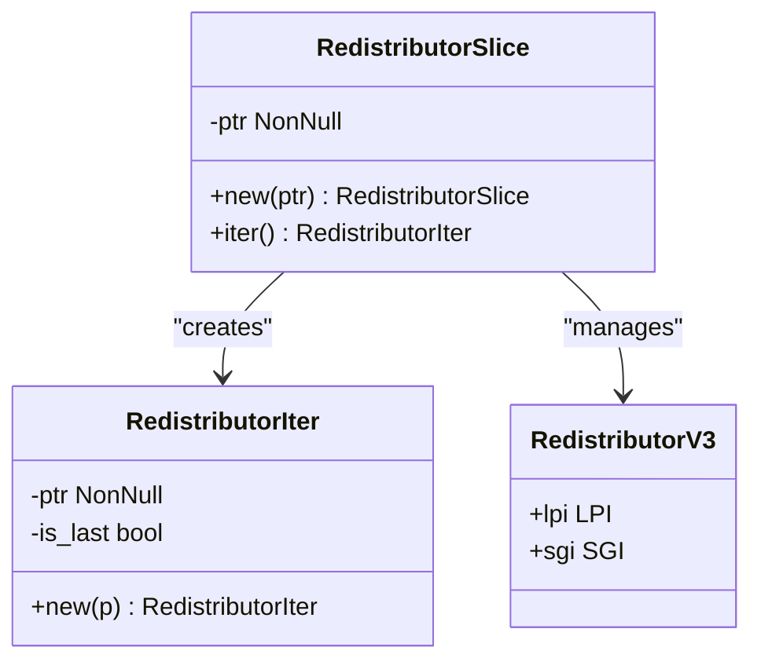
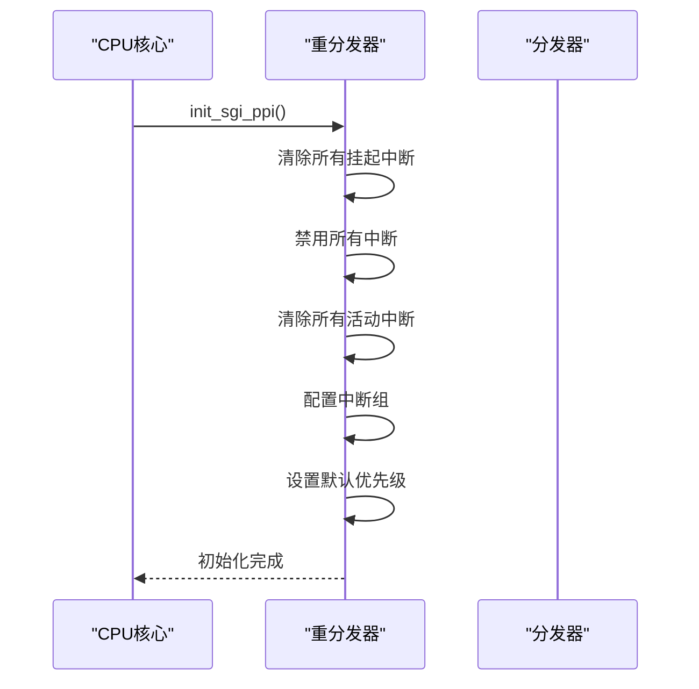
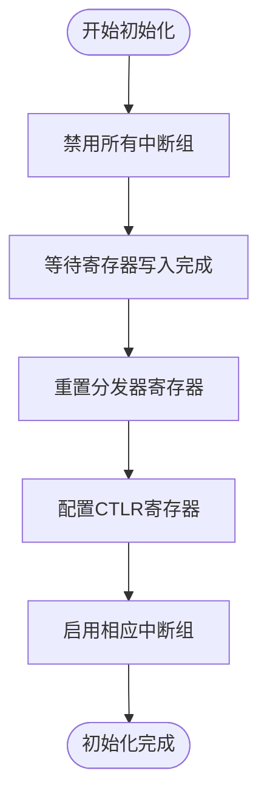
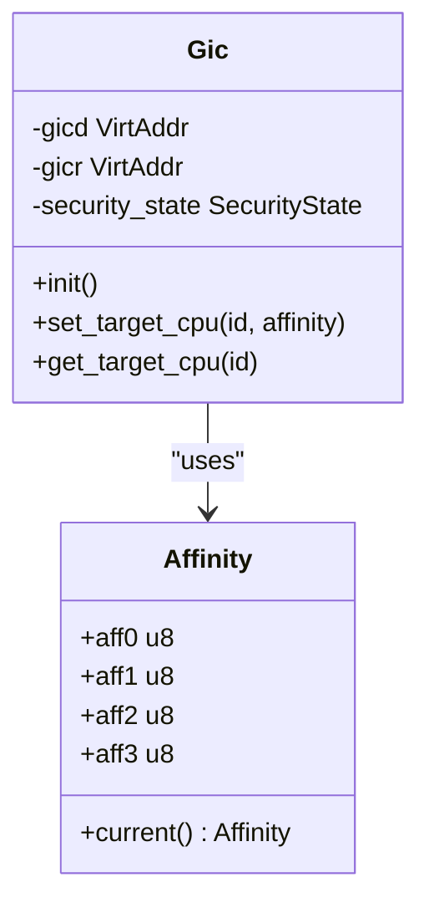

# GICv3功能详解

<cite>
**Referenced Files in This Document**   
- [gicd.rs](file://gic-driver/src/version/v3/gicd.rs)
- [gicr.rs](file://gic-driver/src/version/v3/gicr.rs)
- [mod.rs](file://gic-driver/src/version/v3/mod.rs)
</cite>

## 目录
1. [引言](#引言)
2. [分发器增强功能](#分发器增强功能)
3. [重分发器实现分析](#重分发器实现分析)
4. [GICv3初始化流程](#gicv3初始化流程)
5. [消息信号中断与中断ID空间](#消息信号中断与中断id空间)
6. [高级功能配置示例](#高级功能配置示例)
7. [结论](#结论)

## 引言

GICv3（Generic Interrupt Controller version 3）是ARM架构中用于管理中断的高级中断控制器，相较于GICv2，它引入了多项重要改进，包括支持更多中断、更复杂的优先级管理以及可扩展的多核系统支持。本文档深入探讨GICv3的具体实现细节，重点分析分发器（Distributor）和重分发器（Redistributor）的关键特性，以及GICv3特有的初始化流程和高级功能配置。

**Section sources**
- [mod.rs](file://gic-driver/src/version/v3/mod.rs#L1-L50)

## 分发器增强功能

在GICv3中，分发器（Distributor）负责管理共享外设中断（SPI）和全局配置。与GICv2相比，GICv3的分发器在功能上有了显著增强，主要体现在对更多中断的支持和更复杂的优先级管理上。

分发器通过`DistributorReg`结构体实现，该结构体定义了分发器的所有寄存器。分发器能够根据中断控制器类型寄存器（TYPER）中的IDbits字段确定支持的最大中断ID数量。此外，分发器还支持安全扩展，通过安全状态检测机制来确定当前是处于单安全状态还是双安全状态。

分发器提供了多种中断管理功能，包括中断使能/禁用、中断挂起/清除、中断优先级设置等。这些功能通过相应的寄存器操作实现，如中断使能寄存器（ISENABLER）、中断挂起寄存器（ISPENDR）和中断优先级寄存器（IPRIORITYR）等。

**Section sources**
- [gicd.rs](file://gic-driver/src/version/v3/gicd.rs#L1-L733)

## 重分发器实现分析

重分发器（Redistributor）是GICv3的关键特性之一，它支持可扩展的多核系统。每个CPU核心都有自己的重分发器，负责管理该核心的私有中断（SGI和PPI）以及低功耗中断（LPI）。

### 重分发器架构

重分发器由两个主要寄存器帧组成：
- **RD_base**：控制LPI功能和重分发器的整体行为
- **SGI_base**：控制SGI和PPI

在GICv4中，还有额外的帧用于虚拟LPI支持。

重分发器通过`RedistributorV3`结构体实现，该结构体包含LPI和SGI两个成员。`RedistributorSlice`结构体用于管理重分发器的切片，而`RedistributorIter`结构体则用于遍历重分发器。

**Diagram sources**
- [gicr.rs](file://gic-driver/src/version/v3/gicr.rs#L1-L100)

### 私有中断管理

重分发器负责管理每个CPU核心的私有中断，包括软件生成中断（SGI）和私有外设中断（PPI）。SGI用于在不同CPU核心之间发送中断，而PPI用于连接到特定CPU核心的外设中断。

重分发器通过`SGI`结构体实现SGI和PPI的管理。该结构体提供了初始化、中断使能/禁用、中断优先级设置、中断挂起/清除等功能。初始化过程包括清除所有挂起的中断、禁用所有中断、清除所有活动的中断，并根据安全状态配置中断组。

**Diagram sources**
- [gicr.rs](file://gic-driver/src/version/v3/gicr.rs#L100-L300)

### 与分发器协同工作

重分发器与分发器协同工作，共同管理系统的中断。分发器负责管理SPI，而重分发器负责管理SGI、PPI和LPI。当一个中断被触发时，分发器或重分发器会根据中断类型和目标CPU将中断路由到相应的CPU核心。

**Section sources**
- [gicr.rs](file://gic-driver/src/version/v3/gicr.rs#L1-L553)

## GICv3初始化流程

GICv3的初始化流程包括重分发器的唤醒和配置，这是GICv3特有的初始化步骤。

### 分发器初始化

分发器的初始化通过`Gic::init()`方法实现。该方法首先读取当前配置以确定安全状态，然后禁用所有中断组，等待寄存器写入完成，重置分发器寄存器，最后根据安全状态配置控制寄存器（CTLR）并启用相应的中断组。

**Diagram sources**
- [mod.rs](file://gic-driver/src/version/v3/mod.rs#L100-L200)

### 重分发器唤醒

重分发器的唤醒通过`LPI::wake()`方法实现。该方法首先清除处理器睡眠位，然后等待子节点睡眠位被清除，最后等待寄存器写入完成。

**Section sources**
- [gicr.rs](file://gic-driver/src/version/v3/gicr.rs#L300-L350)
- [mod.rs](file://gic-driver/src/version/v3/mod.rs#L200-L250)

## 消息信号中断与中断ID空间

GICv3支持消息信号中断（MSI）和更大的中断ID空间，这是其相对于GICv2的重要改进。

### 消息信号中断

GICv3通过`generate_spi_ns()`和`generate_spi_s()`方法支持消息信号中断。这些方法允许通过写入SETSPI_NSR和SETSPI_SR寄存器来生成非安全和安全的SPI。

### 更大的中断ID空间

GICv3通过中断控制器类型寄存器（TYPER）中的IDbits字段支持更大的中断ID空间。分发器的`max_intid()`方法根据IDbits字段计算支持的最大中断ID数量。

**Section sources**
- [gicd.rs](file://gic-driver/src/version/v3/gicd.rs#L700-L733)

## 高级功能配置示例

结合代码示例展示GICv3的高级功能配置。

### 中断路由配置

GICv3支持基于亲和性的中断路由。通过`set_target_cpu()`方法，可以将SPI路由到特定的CPU核心或任何参与的PE。

**Diagram sources**
- [mod.rs](file://gic-driver/src/version/v3/mod.rs#L500-L600)

### 软件生成中断

GICv3通过系统寄存器ICC_SGI1R_EL1发送软件生成中断，而不是使用GICv2中的GICD_SGIR寄存器。`send_sgi()`函数实现了这一功能，支持向所有CPU或特定CPU列表发送SGI。

**Section sources**
- [mod.rs](file://gic-driver/src/version/v3/mod.rs#L800-L1150)

## 结论

GICv3通过引入重分发器、支持更大的中断ID空间和消息信号中断等特性，显著提升了中断管理的能力和灵活性。分发器和重分发器的协同工作使得GICv3能够高效地管理多核系统中的中断，为现代高性能计算平台提供了强大的中断处理能力。