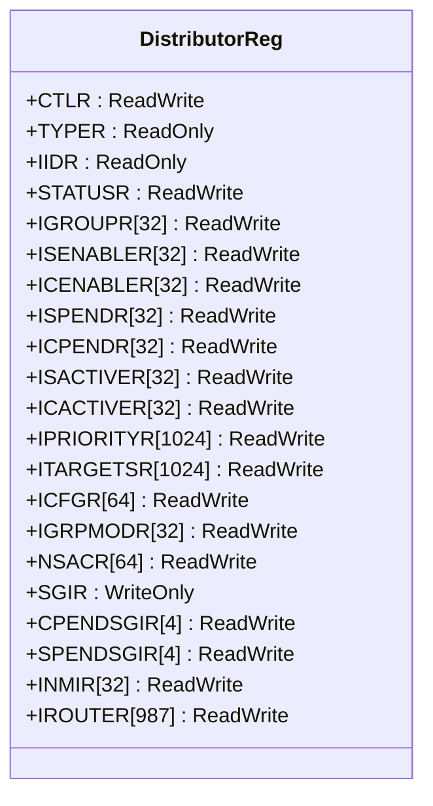
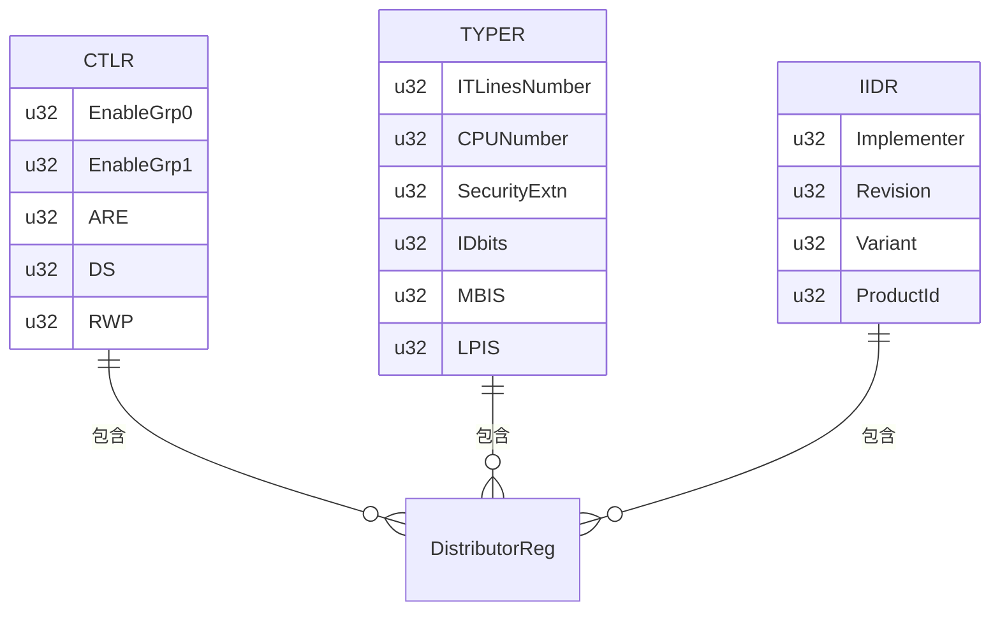
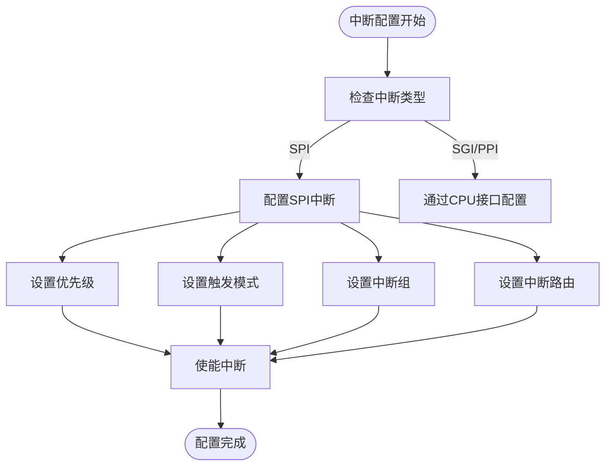
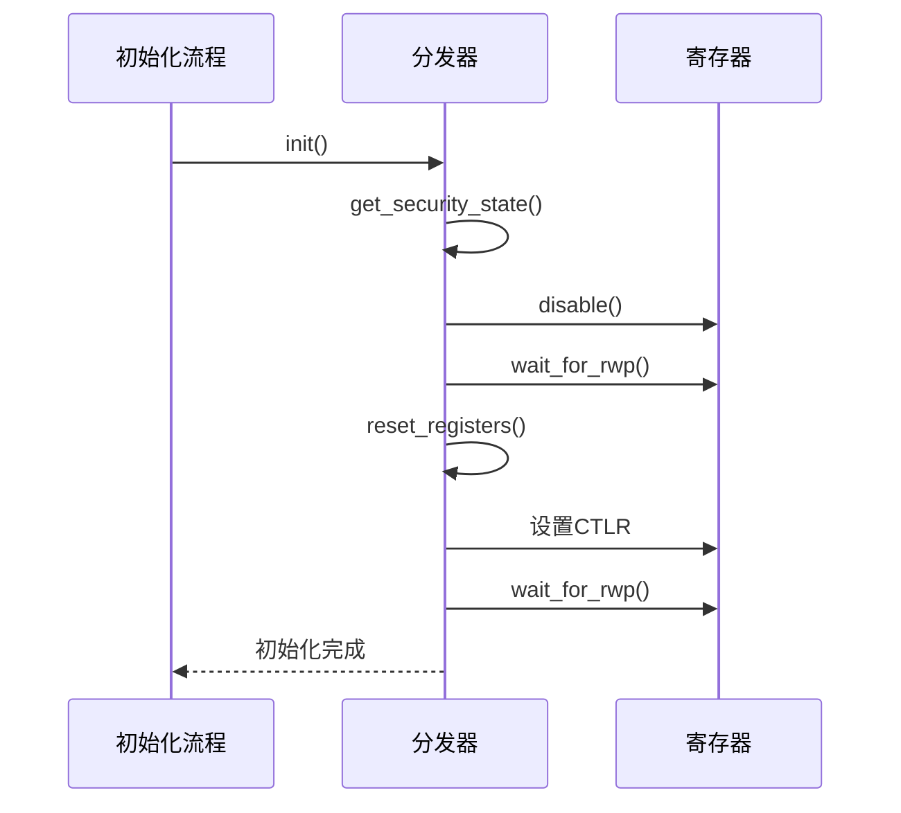
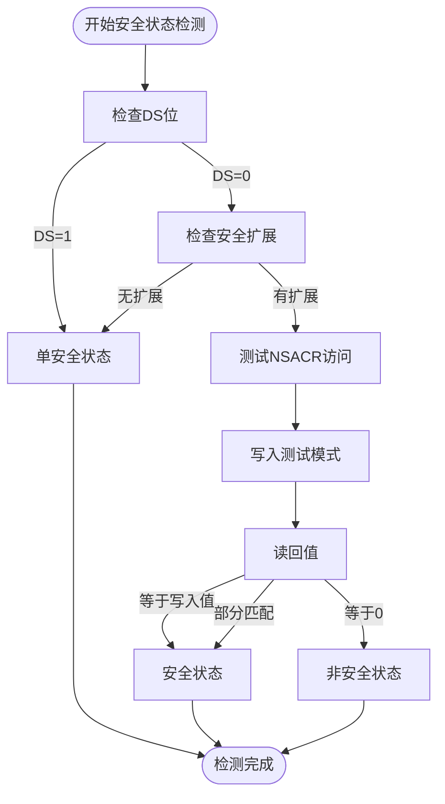
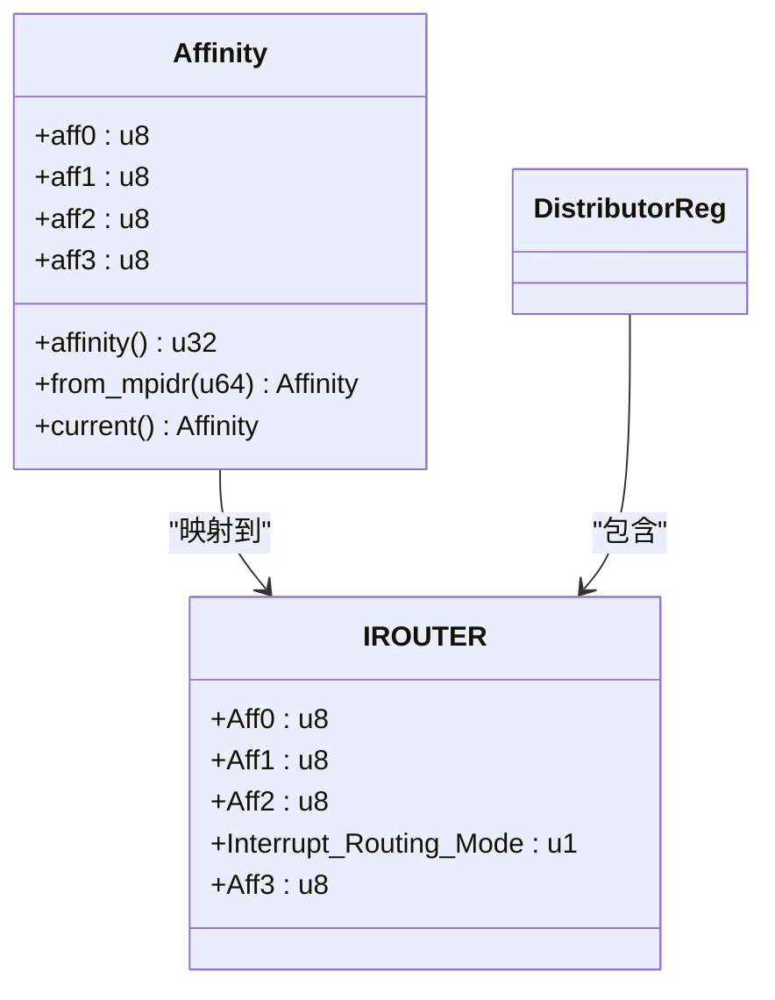
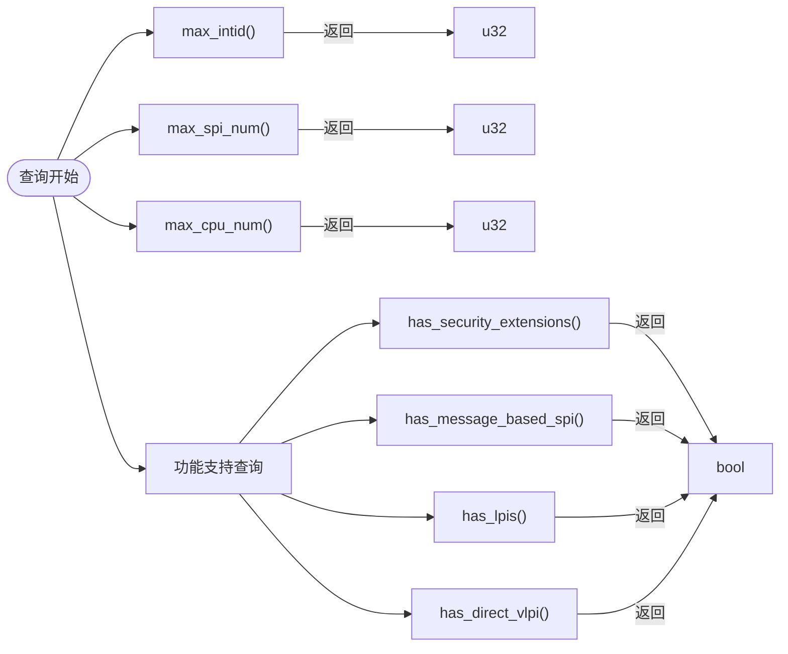
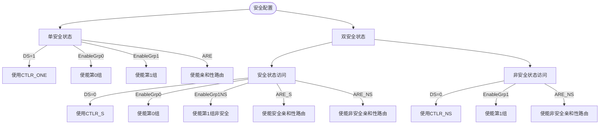

# 分发器控制

<cite>
**本文档引用的文件**  
- [gicd.rs](file://gic-driver/src/version/v3/gicd.rs)
- [define.rs](file://gic-driver/src/define.rs)
- [gicr.rs](file://gic-driver/src/version/v3/gicr.rs)
- [mod.rs](file://gic-driver/src/version/v3/mod.rs)
</cite>

## 目录
1. [简介](#简介)
2. [分发器寄存器结构](#分发器寄存器结构)
3. [关键寄存器功能分析](#关键寄存器功能分析)
4. [中断控制功能实现](#中断控制功能实现)
5. [分发器初始化流程](#分发器初始化流程)
6. [安全状态检测机制](#安全状态检测机制)
7. [中断路由配置](#中断路由配置)
8. [GIC实现信息查询](#gic实现信息查询)
9. [单安全状态与双安全状态配置](#单安全状态与双安全状态配置)

## 简介
本文档深入探讨GICv3分发器（Distributor）的实现细节，重点分析DistributorReg结构体如何通过内存映射寄存器控制共享外设中断（SPI）的全局配置。文档详细说明了中断使能、优先级设置、触发模式配置和中断路由等核心功能的实现机制。同时，对CTLR、TYPER、IIDR等关键寄存器的功能进行解析，并阐述分发器在不同安全状态下的初始化流程和配置策略。

## 分发器寄存器结构
DistributorReg结构体定义了GICv3分发器的所有内存映射寄存器，通过register_structs!宏实现寄存器到内存地址的映射。该结构体提供了对分发器所有功能的访问接口，包括中断控制、优先级管理、目标CPU设置等。

**图示来源**  
- [gicd.rs](file://gic-driver/src/version/v3/gicd.rs#L15-L100)

**本节来源**  
- [gicd.rs](file://gic-driver/src/version/v3/gicd.rs#L15-L100)

## 关键寄存器功能分析
分发器通过一组关键寄存器实现对中断系统的全面控制，这些寄存器提供了系统配置、类型信息和实现细节的访问。

### CTLR寄存器
分发器控制寄存器（CTLR）负责全局中断系统的启用和配置。该寄存器包含多个关键字段：
- **EnableGrp0**: 使能第0组中断（安全中断）
- **EnableGrp1**: 使能第1组中断（非安全中断）
- **ARE**: 使能亲和性路由
- **DS**: 禁用安全扩展，决定系统是单安全状态还是双安全状态
- **RWP**: 寄存器写入挂起状态标志

### TYPER寄存器
中断控制器类型寄存器（TYPER）提供GIC实现的关键特性信息：
- **ITLinesNumber**: 支持的中断线数量
- **CPUNumber**: 支持的CPU接口数量
- **SecurityExtn**: 安全扩展实现状态
- **IDbits**: 支持的中断ID位数
- **MBIS**: 消息传递SPI支持
- **LPIS**: 低功耗中断支持

### IIDR寄存器
分发器实现者标识寄存器（IIDR）包含GIC实现的厂商和版本信息：
- **Implementer**: 实现者标识号
- **Revision**: 修订版本号
- **Variant**: 变体号
- **ProductId**: 产品标识号

**图示来源**  
- [gicd.rs](file://gic-driver/src/version/v3/gicd.rs#L100-L200)

**本节来源**  
- [gicd.rs](file://gic-driver/src/version/v3/gicd.rs#L100-L200)

## 中断控制功能实现
分发器提供了一系列方法来控制SPI中断的各个方面，包括使能/禁用、优先级设置、触发模式配置等。

### 中断使能控制
通过ISENABLER和ICENABLER寄存器数组实现中断的使能和禁用。每个寄存器控制32个中断，通过位操作实现单个中断的控制。

### 优先级设置
IPRIORITYR寄存器数组为每个中断提供8位优先级设置。优先级值越小表示优先级越高，0为最高优先级，255为最低优先级。

### 触发模式配置
ICFGR寄存器数组配置中断的触发模式。每个中断占用2位，其中位1用于区分边沿触发和电平触发：
- 位1=0：电平触发
- 位1=1：边沿触发

### 中断状态管理
分发器提供对中断状态的完整管理：
- ISPENDR/ICPENDR：设置/清除挂起状态
- ISACTIVER/ICACTIVER：设置/清除激活状态
- IGROUPR：设置中断组

**图示来源**  
- [gicd.rs](file://gic-driver/src/version/v3/gicd.rs#L200-L400)

**本节来源**  
- [gicd.rs](file://gic-driver/src/version/v3/gicd.rs#L200-L400)

## 分发器初始化流程
分发器的初始化遵循严格的流程，确保系统在安全状态下正确配置。

### 初始化步骤
1. **获取安全状态**：通过get_security_state方法确定当前安全状态
2. **禁用中断组**：禁用所有中断组以防止在配置过程中产生中断
3. **等待寄存器写入完成**：检查CTLR寄存器的RWP位，确保之前的写操作已完成
4. **重置寄存器状态**：将所有相关寄存器重置为已知状态
5. **配置CTLR寄存器**：根据安全状态设置适当的控制位
6. **启用中断组**：重新启用所需的中断组

### 重置寄存器状态
reset_registers方法将分发器恢复到初始状态：
- 清除所有挂起和激活的中断
- 禁用所有中断
- 将所有中断设置为第1组
- 设置默认优先级（0xA0）
- 配置所有中断为电平触发
- 设置所有SPI路由到当前CPU

**图示来源**  
- [gicd.rs](file://gic-driver/src/version/v3/gicd.rs#L400-L500)
- [mod.rs](file://gic-driver/src/version/v3/mod.rs#L200-L300)

**本节来源**  
- [gicd.rs](file://gic-driver/src/version/v3/gicd.rs#L400-L500)
- [mod.rs](file://gic-driver/src/version/v3/mod.rs#L200-L300)

## 安全状态检测机制
分发器实现了精确的安全状态检测机制，以确定当前运行环境的安全配置。

### 安全状态枚举
SecurityState枚举定义了三种可能的安全状态：
- **Secure**: 双安全状态下的安全状态
- **NonSecure**: 双安全状态下的非安全状态
- **Single**: 单安全状态

### 检测逻辑
安全状态检测遵循以下逻辑：
1. 如果DS位为1或没有安全扩展，则为单安全状态
2. 如果DS位为0且存在安全扩展，则通过GICD_NSACR寄存器的访问行为确定具体状态
3. 通过向GICD_NSACR0写入测试模式并读回验证：
   - 如果写入值保持不变，则为安全状态
   - 如果读回为0，则为非安全状态
   - 如果部分位改变，则为安全状态但某些位为只读

**图示来源**  
- [gicd.rs](file://gic-driver/src/version/v3/gicd.rs#L500-L600)

**本节来源**  
- [gicd.rs](file://gic-driver/src/version/v3/gicd.rs#L500-L600)

## 中断路由配置
GICv3引入了基于亲和性的中断路由机制，通过IROUTER寄存器实现。

### 亲和性结构
Affinity结构体表示GICv3的多级亲和性路由：
- **aff0**: 0级亲和性（通常为核心ID）
- **aff1**: 1级亲和性（通常为集群ID）
- **aff2**: 2级亲和性（通常为组ID）
- **aff3**: 3级亲和性（系统级）

### 路由配置
set_interrupt_route方法配置中断路由：
- 对于SPI中断（32-1019），使用IROUTER寄存器
- 可以指定具体亲和性目标或"任何参与的PE"
- 路由模式由Interrupt_Routing_Mode位控制

### 路由查询
get_interrupt_route方法查询当前中断路由配置，返回相应的亲和性信息或"任何参与的PE"指示。

**图示来源**  
- [gicd.rs](file://gic-driver/src/version/v3/gicd.rs#L600-L700)
- [gicr.rs](file://gic-driver/src/version/v3/gicr.rs#L500-L550)
- [mod.rs](file://gic-driver/src/version/v3/mod.rs#L50-L100)

**本节来源**  
- [gicd.rs](file://gic-driver/src/version/v3/gicd.rs#L600-L700)
- [gicr.rs](file://gic-driver/src/version/v3/gicr.rs#L500-L550)
- [mod.rs](file://gic-driver/src/version/v3/mod.rs#L50-L100)

## GIC实现信息查询
分发器提供了一系列方法来查询GIC实现的具体信息。

### 最大中断ID
max_intid方法根据TYPER寄存器的IDbits字段计算最大支持的中断ID：
- IDbits表示支持的中断ID位数
- 最大中断ID = 1 << (IDbits + 1)

### SPI数量
max_spi_num方法计算支持的SPI数量：
- 基于TYPER寄存器的ITLinesNumber字段
- SPI数量 = (ITLinesNumber + 1) * 32

### CPU数量
max_cpu_num方法确定支持的CPU数量：
- 基于TYPER寄存器的CPUNumber字段
- CPU数量 = CPUNumber + 1

### 功能支持查询
提供多个方法检查特定功能的支持：
- has_security_extensions(): 检查安全扩展
- has_message_based_spi(): 检查消息传递SPI
- has_lpis(): 检查低功耗中断
- has_direct_vlpi(): 检查直接虚拟LPI注入

**图示来源**  
- [gicd.rs](file://gic-driver/src/version/v3/gicd.rs#L700-L732)

**本节来源**  
- [gicd.rs](file://gic-driver/src/version/v3/gicd.rs#L700-L732)

## 单安全状态与双安全状态配置
分发器根据安全状态采用不同的配置策略。

### 单安全状态配置
当系统处于单安全状态时（DS=1）：
- 使用CTLR_ONE位字段
- 同时使能第0组和第1组中断
- 使用ARE位使能亲和性路由
- 所有中断被视为同等安全

### 双安全状态配置
当系统处于双安全状态时（DS=0）：
- **安全状态访问**：使用CTLR_S位字段
  - 使能第0组中断（安全中断）
  - 使能第1组非安全中断
  - 分别使能安全和非安全的亲和性路由
- **非安全状态访问**：使用CTLR_NS位字段
  - 使能第1组中断
  - 使能非安全亲和性路由

### 配置差异
| 配置项 | 单安全状态 | 双安全状态（安全） | 双安全状态（非安全） |
|--------|------------|-------------------|---------------------|
| 控制寄存器 | CTLR_ONE | CTLR_S | CTLR_NS |
| 第0组中断 | 使能 | 使能 | 不适用 |
| 第1组中断 | 使能 | 使能（非安全） | 使能 |
| 亲和性路由 | ARE | ARE_S和ARE_NS | ARE_NS |

**图示来源**  
- [gicd.rs](file://gic-driver/src/version/v3/gicd.rs#L100-L200)
- [mod.rs](file://gic-driver/src/version/v3/mod.rs#L200-L300)

**本节来源**  
- [gicd.rs](file://gic-driver/src/version/v3/gicd.rs#L100-L200)
- [mod.rs](file://gic-driver/src/version/v3/mod.rs#L200-L300)