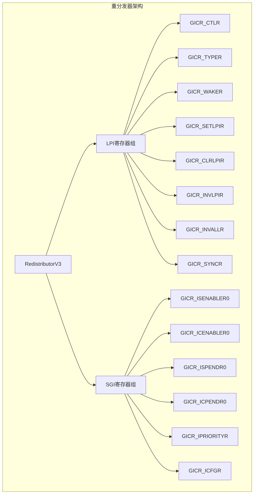
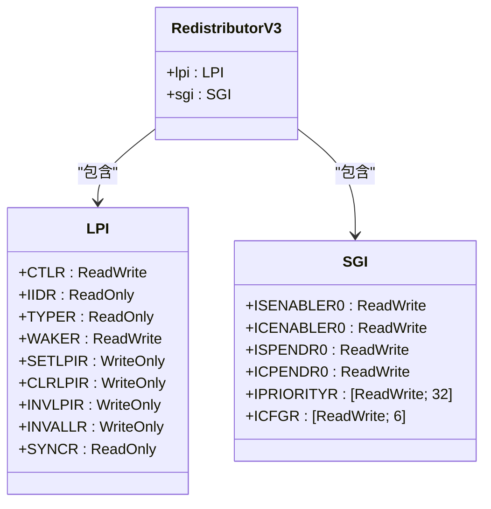
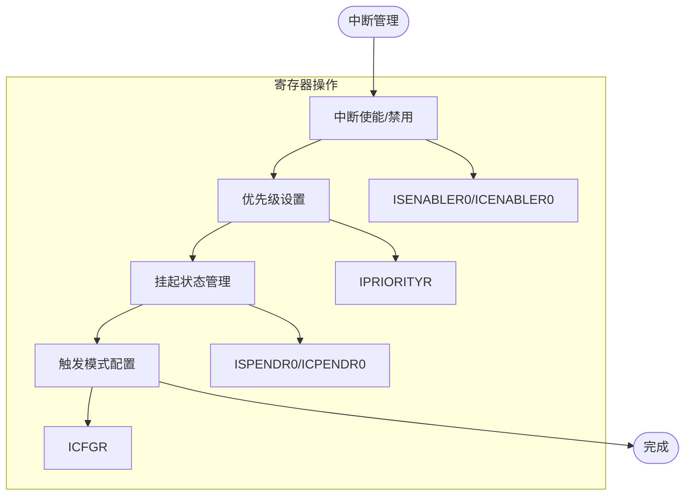
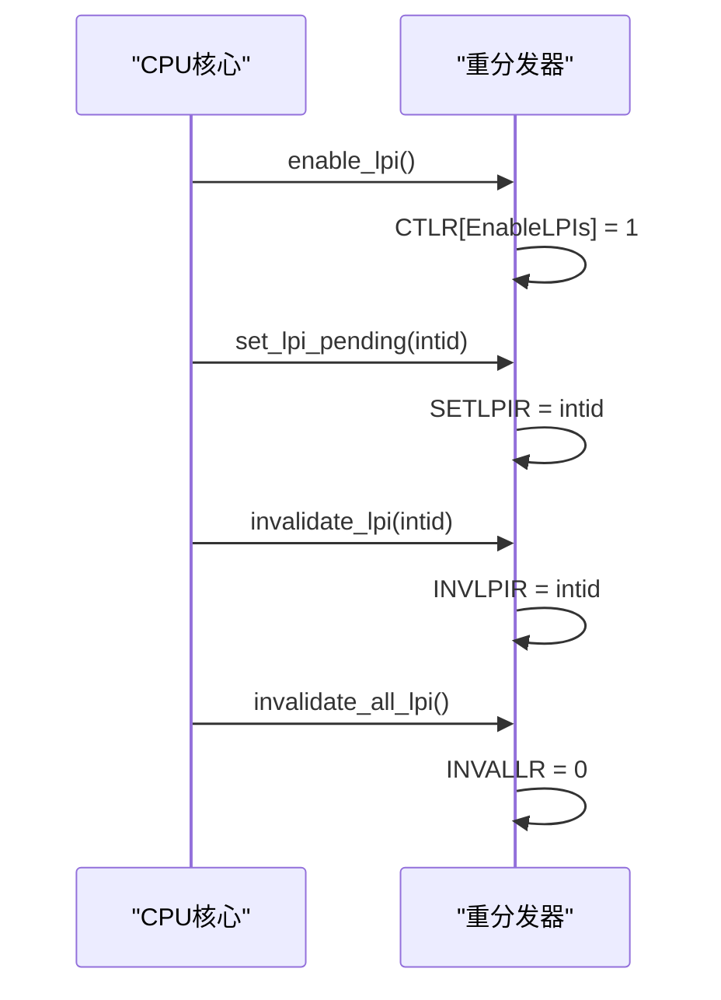
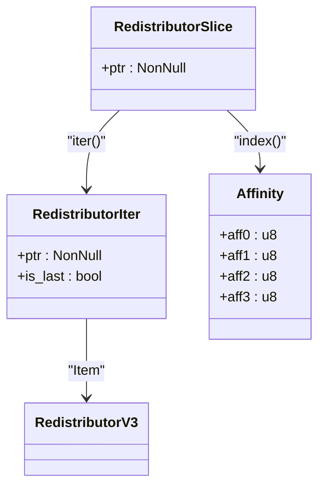
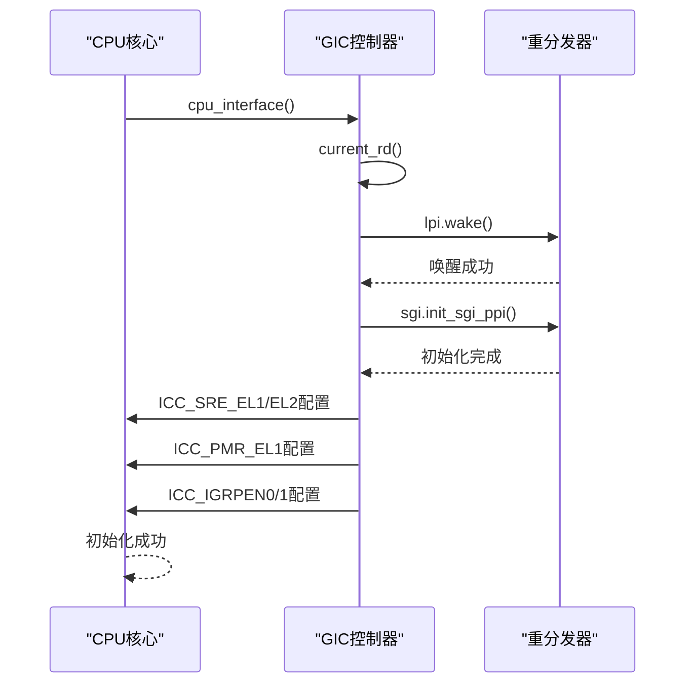

# 重分发器控制

<cite>
**Referenced Files in This Document**   
- [gicr.rs](file://gic-driver/src/version/v3/gicr.rs)
- [mod.rs](file://gic-driver/src/version/v3/mod.rs)
</cite>

## 目录
1. [引言](#引言)
2. [重分发器架构概述](#重分发器架构概述)
3. [RedistributorV3结构体分析](#redistributorv3结构体分析)
4. [SGI和PPI管理机制](#sgi和ppi管理机制)
5. [LPI支持功能](#lpi支持功能)
6. [唤醒机制与同步操作](#唤醒机制与同步操作)
7. [RedistributorSlice与CPU亲和性](#redistributorslice与cpu亲和性)
8. [CPU接口初始化流程](#cpu接口初始化流程)

## 引言
本文档详细分析GICv3重分发器（Redistributor）的实现机制，重点阐述`RedistributorV3`结构体如何管理每个CPU核心的私有中断（SGI和PPI），包括中断的使能、禁用、优先级设置、挂起状态管理和触发模式配置。同时，文档将解释LPI（本地私有中断）支持功能，描述重分发器的唤醒机制（WAKER寄存器）和同步操作，并说明`RedistributorSlice`如何通过CPU亲和性（Affinity）定位特定CPU的重分发器实例。

**Section sources**
- [gicr.rs](file://gic-driver/src/version/v3/gicr.rs#L1-L553)
- [mod.rs](file://gic-driver/src/version/v3/mod.rs#L1-L1151)

## 重分发器架构概述
GICv3重分发器是中断控制器的关键组件，负责处理每个CPU核心的私有中断。重分发器由两个主要寄存器帧组成：
- **RD_base**：控制LPI功能和重分发器的整体行为
- **SGI_base**：控制SGI和PPI

在GICv4中，还包含用于虚拟LPI支持的额外帧。重分发器通过`RedistributorV3`结构体实现，该结构体包含`lpi`和`sgi`两个字段，分别对应LPI和SGI/PPI的寄存器接口。



**Diagram sources**
- [gicr.rs](file://gic-driver/src/version/v3/gicr.rs#L1-L553)

**Section sources**
- [gicr.rs](file://gic-driver/src/version/v3/gicr.rs#L1-L553)

## RedistributorV3结构体分析
`RedistributorV3`结构体是GICv3重分发器的核心实现，封装了LPI和SGI/PPI的寄存器接口。该结构体通过`lpi`和`sgi`字段提供对相应功能的访问。



**Diagram sources**
- [gicr.rs](file://gic-driver/src/version/v3/gicr.rs#L1-L553)

**Section sources**
- [gicr.rs](file://gic-driver/src/version/v3/gicr.rs#L1-L553)

## SGI和PPI管理机制
`RedistributorV3`通过`SGI`结构体提供对SGI和PPI的全面管理功能，包括使能、优先级设置、挂起状态管理和触发模式配置。

### 中断使能与禁用
`SGI`结构体提供了`set_enable_interrupt`方法来控制中断的使能状态。该方法通过操作`ISENABLER0`（使能）和`ICENABLER0`（禁用）寄存器来实现。

### 优先级设置
每个中断的优先级可以通过`set_priority`方法进行设置，该方法操作`IPRIORITYR`寄存器数组。优先级值范围为0-255，其中0表示最高优先级。

### 挂起状态管理
中断的挂起状态通过`set_pending`方法管理，该方法操作`ISPENDR0`（设置挂起）和`ICPENDR0`（清除挂起）寄存器。

### 触发模式配置
中断的触发模式（边沿触发或电平触发）通过`set_cfgr`方法配置，该方法操作`ICFGR`寄存器。



**Diagram sources**
- [gicr.rs](file://gic-driver/src/version/v3/gicr.rs#L1-L553)

**Section sources**
- [gicr.rs](file://gic-driver/src/version/v3/gicr.rs#L1-L553)

## LPI支持功能
`RedistributorV3`通过`LPI`结构体提供对本地私有中断（LPI）的完整支持，包括LPI的启用、禁用、挂起和失效操作。

### LPI启用与禁用
LPI功能通过`enable_lpi`和`disable_lpi`方法控制，这些方法操作`CTLR`寄存器的`EnableLPIs`位。

### LPI挂起管理
LPI的挂起状态通过`set_lpi_pending`和`clear_lpi_pending`方法管理，这些方法分别写入`SETLPIR`和`CLRLPIR`寄存器。

### LPI失效操作
单个LPI可以通过`invalidate_lpi`方法失效，该方法写入`INVLPIR`寄存器。所有LPI可以通过`invalidate_all_lpi`方法一次性失效，该方法写入`INVALLR`寄存器。



**Diagram sources**
- [gicr.rs](file://gic-driver/src/version/v3/gicr.rs#L1-L553)

**Section sources**
- [gicr.rs](file://gic-driver/src/version/v3/gicr.rs#L1-L553)

## 唤醒机制与同步操作
重分发器提供了唤醒机制和同步操作，确保在低功耗状态下能够正确恢复中断功能。

### 唤醒机制
唤醒机制通过`WAKER`寄存器实现。`wake`方法通过清除`ProcessorSleep`位来唤醒重分发器，并等待`ChildrenAsleep`位被清除，表示唤醒完成。

### 同步操作
同步操作通过`SYNCR`寄存器实现。`sync`方法轮询`SYNCR`寄存器，直到其值为0，确保所有挂起的配置操作已完成。

```mermaid
flowchart TD
A([唤醒重分发器]) --> B["WAKER[ProcessorSleep] = 0"]
B --> C{WAKER[ChildrenAsleep] == 0?}
C --> |否| D[自旋等待]
D --> C
C --> |是| E[唤醒完成]
F([同步操作]) --> G{SYNCR == 0?}
G --> |否| H[自旋等待]
H --> G
G --> |是| I[同步完成]
```

**Diagram sources**
- [gicr.rs](file://gic-driver/src/version/v3/gicr.rs#L1-L553)

**Section sources**
- [gicr.rs](file://gic-driver/src/version/v3/gicr.rs#L1-L553)

## RedistributorSlice与CPU亲和性
`RedistributorSlice`结构体通过CPU亲和性（Affinity）机制定位特定CPU的重分发器实例，实现了多核系统中的精确中断管理。

### Affinity结构
`Affinity`结构体表示GICv3中的多级亲和性路由，包含四个层次：
- `aff0`：级别0亲和性（通常为集群内的核心ID）
- `aff1`：级别1亲和性（通常为组内的集群ID）
- `aff2`：级别2亲和性（通常为系统内的组ID）
- `aff3`：级别3亲和性（最高级别，用于大型系统）

### 定位机制
`RedistributorSlice`通过`Index` trait实现，使用`affinity`值遍历所有重分发器实例，找到与指定CPU亲和性匹配的实例。



**Diagram sources**
- [gicr.rs](file://gic-driver/src/version/v3/gicr.rs#L1-L553)
- [mod.rs](file://gic-driver/src/version/v3/mod.rs#L1-L1151)

**Section sources**
- [gicr.rs](file://gic-driver/src/version/v3/gicr.rs#L1-L553)
- [mod.rs](file://gic-driver/src/version/v3/mod.rs#L1-L1151)

## CPU接口初始化流程
CPU接口的初始化是重分发器配置的关键步骤，遵循GICv3架构规范的初始化序列。

### 初始化步骤
1. 唤醒重分发器
2. 初始化SGI/PPI寄存器到已知状态
3. 配置CPU接口系统寄存器
4. 设置中断优先级掩码
5. 启用适当的中断组

### 初始化序列图


**Diagram sources**
- [mod.rs](file://gic-driver/src/version/v3/mod.rs#L1-L1151)

**Section sources**
- [mod.rs](file://gic-driver/src/version/v3/mod.rs#L1-L1151)