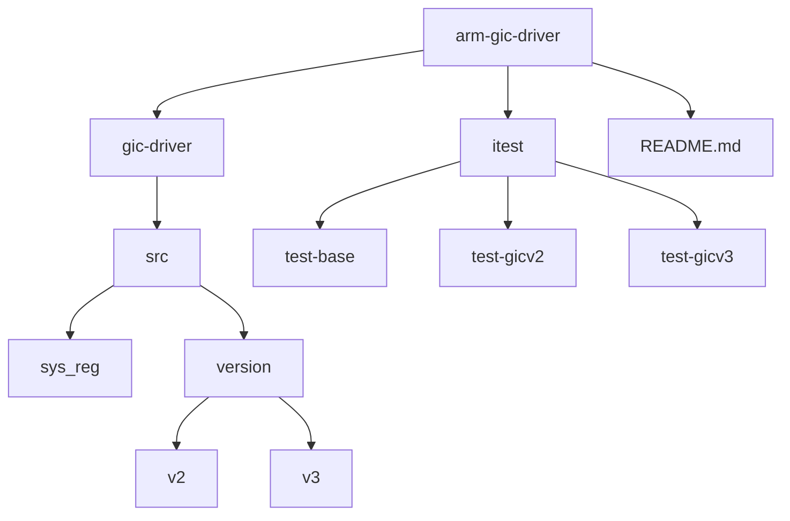

# 快速开始

<cite>
**本文档中引用的文件**  
- [README.md](file://README.md)
- [lib.rs](file://gic-driver/src/lib.rs)
- [v2/mod.rs](file://gic-driver/src/version/v2/mod.rs)
- [v3/mod.rs](file://gic-driver/src/version/v3/mod.rs)
- [gicd.rs](file://gic-driver/src/version/v2/gicd.rs)
- [gicc.rs](file://gic-driver/src/version/v2/gicc.rs)
- [test-gicv2/src/lib.rs](file://itest/test-gicv2/src/lib.rs)
- [test-gicv3/src/lib.rs](file://itest/test-gicv3/src/lib.rs)
</cite>

## 目录
1. [简介](#简介)
2. [项目结构](#项目结构)
3. [GIC控制器初始化](#gic控制器初始化)
4. [CPU接口初始化](#cpu接口初始化)
5. [中断处理流程](#中断处理流程)
6. [中断配置操作](#中断配置操作)
7. [常见错误与解决方案](#常见错误与解决方案)
8. [总结](#总结)

## 简介
`arm-gic-driver` 是一个用于ARM通用中断控制器（GIC）的Rust驱动程序，专为裸机和操作系统内核环境设计。该驱动支持GICv1、GICv2和GICv3版本，提供内存安全、无标准库依赖和类型安全的中断控制功能。本指南将指导新手开发者在5分钟内完成GIC驱动的基本集成和测试。

## 项目结构
项目包含核心驱动模块和多个测试用例，结构清晰，便于理解和使用。



**图示来源**  
- [README.md](file://README.md)
- [项目结构](file://)

## GIC控制器初始化
初始化GIC控制器是使用该驱动的第一步，需要获取寄存器基地址并创建Gic实例。

### GICv2初始化
```rust
use arm_gic_driver::v2::*;

let mut gic = unsafe { Gic::new(0xF901_0000.into(), 0xF902_0000.into(), None) };
gic.init();
```

### GICv3初始化
```rust
use arm_gic_driver::v3::*;

let mut gic = unsafe { Gic::new(0xF901_0000.into(), 0xF902_0000.into()) };
gic.init();
```

**代码来源**  
- [README.md](file://README.md#L1-L100)
- [v2/mod.rs](file://gic-driver/src/version/v2/mod.rs#L1-L799)
- [v3/mod.rs](file://gic-driver/src/version/v3/mod.rs#L1-L1151)

## CPU接口初始化
每个CPU核心都需要初始化其CPU接口，以便正确处理中断。

### GICv2 CPU接口初始化
```rust
let mut cpu = gic.cpu_interface();
cpu.init_current_cpu();
```

### GICv3 CPU接口初始化
```rust
let mut cpu = gic.cpu_interface();
cpu.init_current_cpu().unwrap();
```

**代码来源**  
- [test-gicv2/src/lib.rs](file://itest/test-gicv2/src/lib.rs#L1-L155)
- [test-gicv3/src/lib.rs](file://itest/test-gicv3/src/lib.rs#L1-L129)

## 中断处理流程
在中断处理程序中，需要使用`ack()`和`eoi()`方法完成中断处理流程。

### 中断处理示例
```rust
let ack = trap().ack();
if !ack.is_special() {
    trap().eoi(ack);
    if trap().eoi_mode() {
        trap().dir(ack);
    }
}
```

**代码来源**  
- [test-gicv2/src/lib.rs](file://itest/test-gicv2/src/lib.rs#L1-L155)
- [test-gicv3/src/lib.rs](file://itest/test-gicv3/src/lib.rs#L1-L129)

## 中断配置操作
本节介绍如何进行中断使能、优先级设置和触发类型配置等基本操作。

### 中断使能
```rust
let irq_id = IntId::ppi(14);
gic.set_irq_enable(irq_id, true);
```

### 优先级设置
```rust
gic.set_priority(irq_id, 0x80);
```

### 触发类型配置
```rust
gic.set_cfg(irq_id, Trigger::Edge);
```

**代码来源**  
- [v2/mod.rs](file://gic-driver/src/version/v2/mod.rs#L1-L799)
- [v3/mod.rs](file://gic-driver/src/version/v3/mod.rs#L1-L1151)

## 常见错误与解决方案
### 地址映射错误
确保提供的寄存器基地址正确且已正确映射到内存。

### 初始化顺序问题
确保先初始化GIC控制器，再初始化CPU接口。

### 安全状态配置
在GICv3中，确保根据系统安全状态正确配置CTLR寄存器。

**代码来源**  
- [v2/mod.rs](file://gic-driver/src/version/v2/mod.rs#L1-L799)
- [v3/mod.rs](file://gic-driver/src/version/v3/mod.rs#L1-L1151)

## 总结
通过本指南，开发者可以快速集成和使用`arm-gic-driver`，完成GIC控制器的初始化、CPU接口初始化和中断处理。遵循上述步骤，可以在5分钟内完成基本功能的集成和测试。

**代码来源**  
- [README.md](file://README.md#L1-L100)
- [lib.rs](file://gic-driver/src/lib.rs#L1-L113)