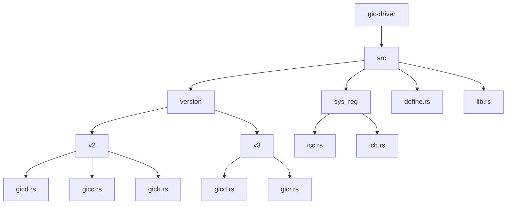
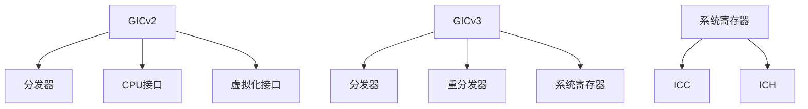
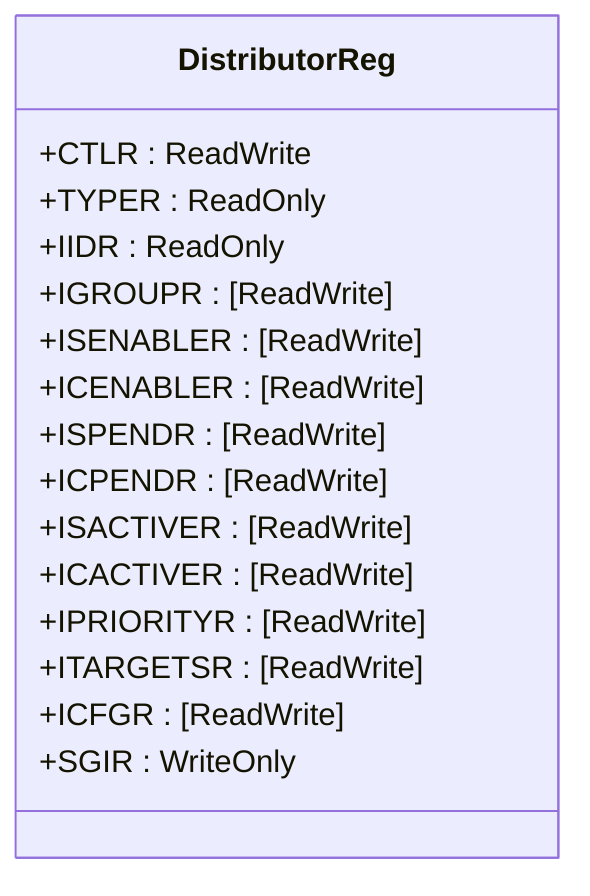
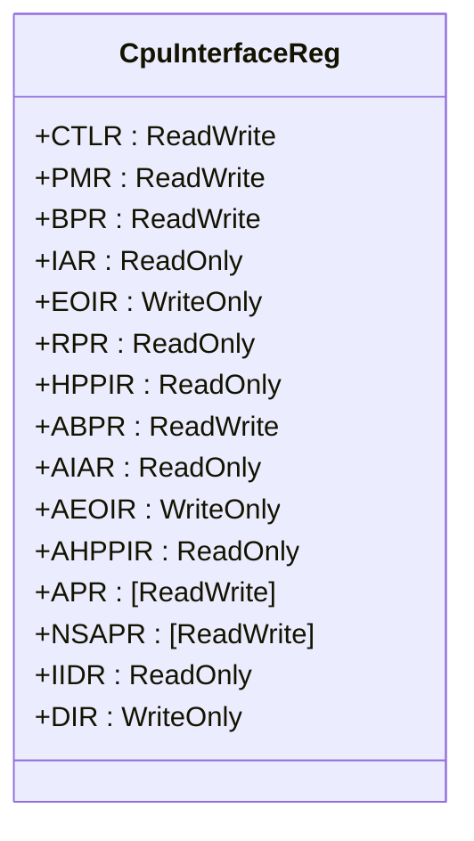
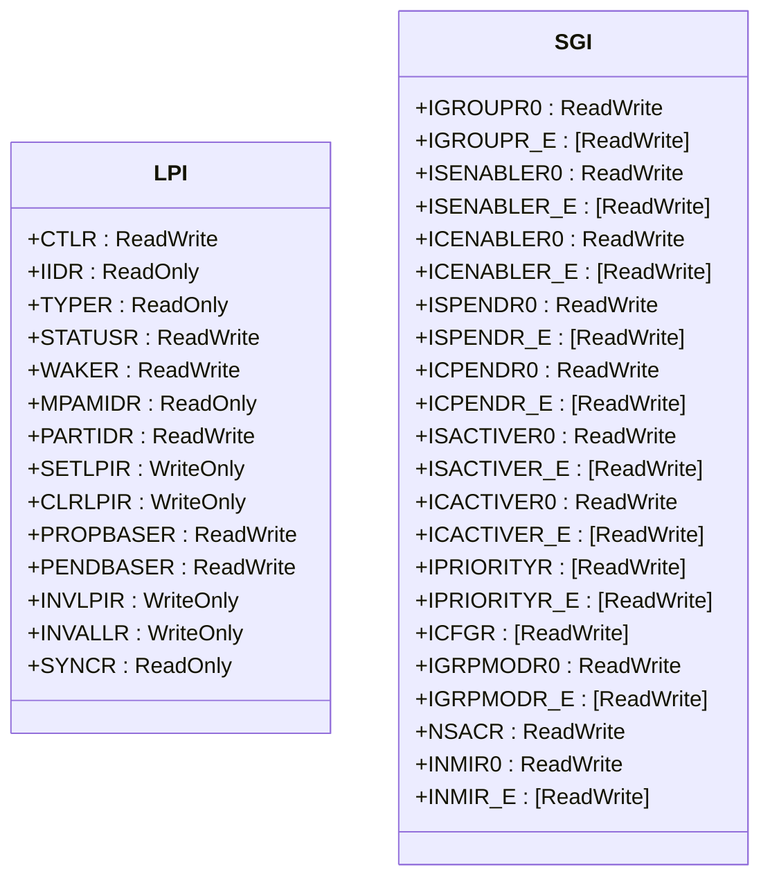
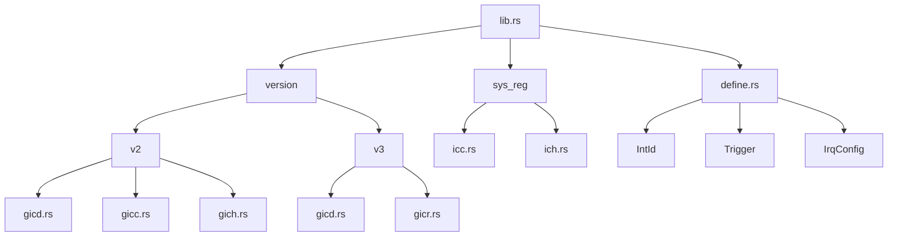

# ARM GIC架构

<cite>
**本文档中引用的文件**   
- [gicd.rs](file://gic-driver/src/version/v2/gicd.rs)
- [gicc.rs](file://gic-driver/src/version/v2/gicc.rs)
- [gicd.rs](file://gic-driver/src/version/v3/gicd.rs)
- [gicr.rs](file://gic-driver/src/version/v3/gicr.rs)
- [icc.rs](file://gic-driver/src/sys_reg/icc.rs)
- [ich.rs](file://gic-driver/src/sys_reg/ich.rs)
- [mod.rs](file://gic-driver/src/version/v2/mod.rs)
- [mod.rs](file://gic-driver/src/version/v3/mod.rs)
- [lib.rs](file://gic-driver/src/lib.rs)
- [define.rs](file://gic-driver/src/define.rs)
- [README.md](file://README.md)
</cite>

## 目录
1. [简介](#简介)
2. [项目结构](#项目结构)
3. [核心组件](#核心组件)
4. [架构概述](#架构概述)
5. [详细组件分析](#详细组件分析)
6. [依赖分析](#依赖分析)
7. [性能考虑](#性能考虑)
8. [故障排除指南](#故障排除指南)
9. [结论](#结论)

## 简介
ARM通用中断控制器（GIC）是ARM架构中用于管理中断的核心组件。本文档深入解释GIC的架构组成，包括分发器（Distributor）、CPU接口（CPU Interface）和重分发器（Redistributor）的功能与交互机制。详细说明GICv2与GICv3架构之间的关键差异，特别是GICv3引入的重分发器对多核系统中断管理的优化。结合代码中的模块组织结构，阐述硬件组件如何映射到驱动中的抽象层次。为初学者提供系统级框图概念，同时为高级开发者分析寄存器访问路径和中断路由策略。

## 项目结构
项目结构清晰地展示了GIC驱动的模块化设计，分为GICv2和GICv3两个主要版本，每个版本都有独立的实现模块。系统寄存器定义位于sys_reg目录中，而核心数据结构和类型定义位于根目录下。

**图源**
- [gic-driver/src/version/v2/gicd.rs](file://gic-driver/src/version/v2/gicd.rs)
- [gic-driver/src/version/v2/gicc.rs](file://gic-driver/src/version/v2/gicc.rs)
- [gic-driver/src/version/v3/gicd.rs](file://gic-driver/src/version/v3/gicd.rs)
- [gic-driver/src/version/v3/gicr.rs](file://gic-driver/src/version/v3/gicr.rs)
- [gic-driver/src/sys_reg/icc.rs](file://gic-driver/src/sys_reg/icc.rs)
- [gic-driver/src/sys_reg/ich.rs](file://gic-driver/src/sys_reg/ich.rs)

**节源**
- [gic-driver/src/version/v2/gicd.rs](file://gic-driver/src/version/v2/gicd.rs)
- [gic-driver/src/version/v2/gicc.rs](file://gic-driver/src/version/v2/gicc.rs)
- [gic-driver/src/version/v3/gicd.rs](file://gic-driver/src/version/v3/gicd.rs)
- [gic-driver/src/version/v3/gicr.rs](file://gic-driver/src/version/v3/gicr.rs)
- [gic-driver/src/sys_reg/icc.rs](file://gic-driver/src/sys_reg/icc.rs)
- [gic-driver/src/sys_reg/ich.rs](file://gic-driver/src/sys_reg/ich.rs)

## 核心组件
核心组件包括分发器、CPU接口和重分发器。分发器负责管理SPI中断的全局分发，CPU接口处理核心本地中断，而重分发器在节能状态下起关键作用。GICv3通过引入重分发器显著优化了多核系统的中断管理。

**节源**
- [gic-driver/src/version/v2/gicd.rs](file://gic-driver/src/version/v2/gicd.rs)
- [gic-driver/src/version/v2/gicc.rs](file://gic-driver/src/version/v2/gicc.rs)
- [gic-driver/src/version/v3/gicd.rs](file://gic-driver/src/version/v3/gicd.rs)
- [gic-driver/src/version/v3/gicr.rs](file://gic-driver/src/version/v3/gicr.rs)

## 架构概述
ARM GIC架构分为GICv2和GICv3两个主要版本。GICv2采用传统的分发器和CPU接口设计，而GICv3引入了重分发器，实现了更高效的中断管理。系统寄存器提供了对中断控制器的访问接口。

**图源**
- [gic-driver/src/version/v2/mod.rs](file://gic-driver/src/version/v2/mod.rs)
- [gic-driver/src/version/v3/mod.rs](file://gic-driver/src/version/v3/mod.rs)
- [gic-driver/src/sys_reg/icc.rs](file://gic-driver/src/sys_reg/icc.rs)
- [gic-driver/src/sys_reg/ich.rs](file://gic-driver/src/sys_reg/ich.rs)

## 详细组件分析

### 分发器分析
分发器是GIC的核心组件，负责管理所有中断的分发。在GICv2中，分发器通过内存映射寄存器进行访问，而在GICv3中，部分功能被移到了系统寄存器中。

**图源**
- [gic-driver/src/version/v2/gicd.rs](file://gic-driver/src/version/v2/gicd.rs)
- [gic-driver/src/version/v3/gicd.rs](file://gic-driver/src/version/v3/gicd.rs)

**节源**
- [gic-driver/src/version/v2/gicd.rs](file://gic-driver/src/version/v2/gicd.rs)
- [gic-driver/src/version/v3/gicd.rs](file://gic-driver/src/version/v3/gicd.rs)

### CPU接口分析
CPU接口负责处理特定CPU核心的中断。在GICv2中，CPU接口通过内存映射寄存器访问，而在GICv3中，主要通过系统寄存器（ICC）进行访问。

**图源**
- [gic-driver/src/version/v2/gicc.rs](file://gic-driver/src/version/v2/gicc.rs)
- [gic-driver/src/sys_reg/icc.rs](file://gic-driver/src/sys_reg/icc.rs)

**节源**
- [gic-driver/src/version/v2/gicc.rs](file://gic-driver/src/version/v2/gicc.rs)
- [gic-driver/src/sys_reg/icc.rs](file://gic-driver/src/sys_reg/icc.rs)

### 重分发器分析
重分发器是GICv3引入的关键组件，负责处理SGI、PPI和LPI中断。每个CPU核心都有自己的重分发器，实现了更高效的中断管理。

**图源**
- [gic-driver/src/version/v3/gicr.rs](file://gic-driver/src/version/v3/gicr.rs)

**节源**
- [gic-driver/src/version/v3/gicr.rs](file://gic-driver/src/version/v3/gicr.rs)

## 依赖分析
GIC驱动的依赖关系清晰，各组件之间耦合度低。GICv2和GICv3版本独立实现，通过统一的接口暴露功能。系统寄存器定义为底层访问提供了安全的抽象。

**图源**
- [gic-driver/src/lib.rs](file://g