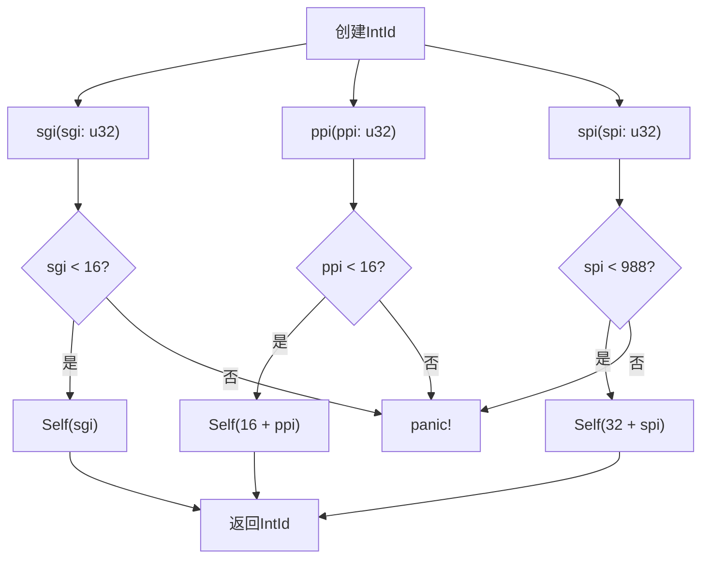
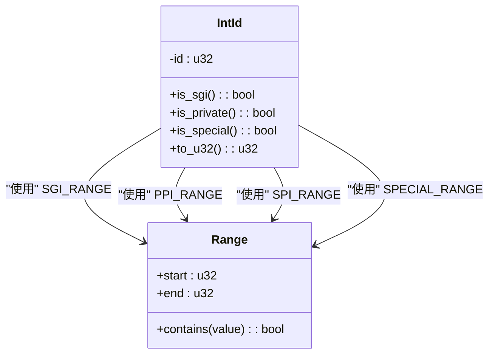

# IntId管理

<cite>
**Referenced Files in This Document**  
- [define.rs](file://gic-driver/src/define.rs)
- [rdif.rs](file://gic-driver/src/version/rdif.rs)
</cite>

## 目录
1. [IntId类型安全设计](#intid类型安全设计)
2. [中断ID范围与构造函数](#中断id范围与构造函数)
3. [中断类型判断方法](#中断类型判断方法)
4. [调试与格式化输出](#调试与格式化输出)
5. [与底层硬件的互操作性](#与底层硬件的互操作性)
6. [设计优势与错误预防](#设计优势与错误预防)

## IntId类型安全设计

`IntId`结构体通过私有字段封装和编译时/运行时检查机制，实现了对中断ID的安全管理。该设计采用透明元组结构`pub struct IntId(u32)`，将原始的`u32`值封装在私有字段中，防止外部直接访问和修改内部数据。这种封装确保了所有对中断ID的操作都必须通过预定义的方法进行，从而强制执行类型安全规则。

通过定义常量范围`SGI_RANGE`、`PPI_RANGE`、`SPI_RANGE`和`SPECIAL_RANGE`，系统为不同类型的中断建立了明确的边界。这些范围检查机制贯穿于所有构造函数和判断方法中，确保中断ID始终处于合法范围内。`IntId`实现了`Copy`、`Clone`、`Eq`、`PartialEq`等基础trait，保证了其作为轻量级值类型的高效性和一致性。

**Section sources**
- [define.rs](file://gic-driver/src/define.rs#L82-L108)

## 中断ID范围与构造函数

系统定义了四种中断ID范围：SGI（0-15）、PPI（16-31）、SPI（32-1019）和特殊ID（1020-1023）。每种中断类型都有对应的构造函数来创建`IntId`实例，包括`sgi()`、`ppi()`和`spi()`。这些构造函数采用`const fn`声明，允许在编译时进行求值，提高了运行时性能。

**Diagram sources**
- [define.rs](file://gic-driver/src/define.rs#L157-L211)

**Section sources**
- [define.rs](file://gic-driver/src/define.rs#L157-L211)

## 中断类型判断方法

`IntId`提供了多种方法来支持中断类型的动态查询。`is_sgi()`方法检查中断ID是否属于SGI范围（0-15），而`is_private()`方法则判断中断是否为私有类型（包括SGI和PPI，即ID小于32）。此外，`is_special()`方法用于检测特殊中断ID（1020-1023）。

这些判断方法基于预定义的范围常量进行检查，通过`contains()`方法实现高效的边界检测。例如，`is_sgi()`方法等价于`SGI_RANGE.contains(&self.0)`，这种设计不仅提高了代码可读性，还确保了逻辑的一致性和正确性。所有判断方法都以内联方式实现，减少了函数调用开销。

**Diagram sources**
- [define.rs](file://gic-driver/src/define.rs#L230-L274)

**Section sources**
- [define.rs](file://gic-driver/src/define.rs#L230-L274)

## 调试与格式化输出

`IntId`实现了`Debug` trait，提供了人性化的调试格式化输出。该实现根据中断ID的数值范围，将其分类显示为"SGI"、"PPI"、"SPI"或"Special IntId"，并显示其在各自类别中的编号。例如，ID为18的中断会显示为"PPI 2"（18-16=2），而ID为74的中断会显示为"SPI 42"（74-32=42）。

这种格式化策略极大地提升了调试体验，使开发者能够直观地识别中断类型和编号，而无需手动计算或查阅文档。对于无效的中断ID（超出1023），系统会标记为"Invalid IntId"，帮助快速发现配置错误。`Debug`实现使用模式匹配对不同范围进行处理，确保了输出的准确性和效率。

**Section sources**
- [define.rs](file://gic-driver/src/define.rs#L275-L288)

## 与底层硬件的互操作性

`IntId`通过`From<IntId> for u32` trait实现与底层硬件的互操作性。该转换允许将`IntId`实例无缝转换为原始的`u32`类型，满足硬件寄存器操作的需求。转换过程简单直接，仅提取内部的`u32`值，保证了高性能和零开销。

在`rdif.rs`文件中，可以看到`IntId`与其他系统组件的集成。`From<crate::define::IntId> for IrqId`实现将`IntId`转换为RDIF框架的`IrqId`类型，支持设备树解析等功能。反向转换`From<IrqId> for crate::define::IntId`则通过`unsafe`的`raw()`函数重建`IntId`实例，体现了安全抽象与底层操作的平衡。

**Diagram sources**
- [define.rs](file://gic-driver/src/define.rs#L289-L293)
- [rdif.rs](file://gic-driver/src/version/rdif.rs#L70-L75)

**Section sources**
- [define.rs](file://gic-driver/src/define.rs#L289-L293)
- [rdif.rs](file://gic-driver/src/version/rdif.rs#L70-L75)

## 设计优势与错误预防

`IntId`的设计有效避免了使用原始`u32`类型可能引发的逻辑错误。通过构造函数中的`assert!`宏，系统在运行时检查输入值的有效性，对于越界值会触发`panic!`，防止创建非法的中断ID。这种防御性编程策略确保了系统稳定性，将潜在错误暴露在早期阶段。

类型安全设计消除了魔法数字的使用，提高了代码可读性和可维护性。开发者不再需要记忆不同中断类型的偏移量，而是通过语义化的构造函数和判断方法进行操作。范围检查机制防止了跨类型误用，例如将PPI编号直接用作SPI编号的错误。

该设计遵循Rust的安全原则，在提供高性能的同时保证内存安全和类型安全。通过将不安全操作（如`raw()`函数）明确标记为`unsafe`，系统清晰地划分了安全与不安全代码的边界，指导开发者正确使用API。

**Section sources**
- [define.rs](file://gic-driver/src/define.rs#L110-L156)