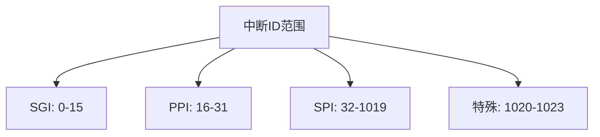
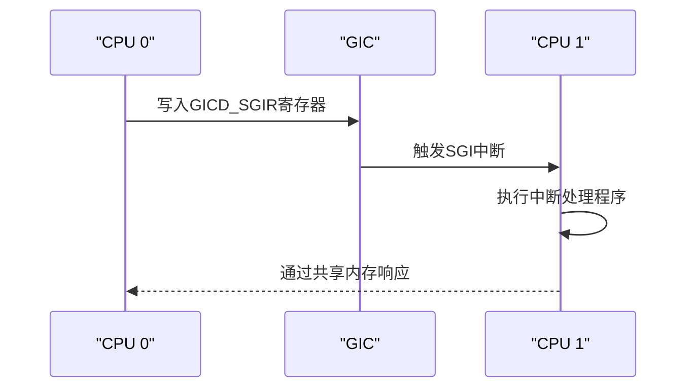
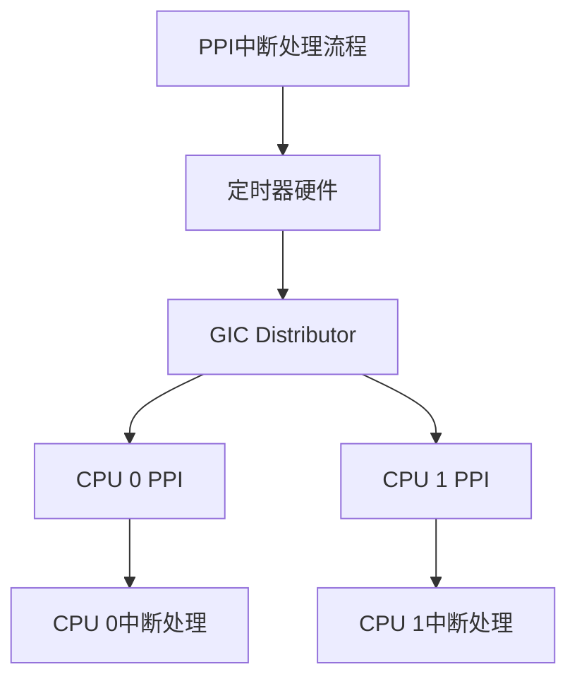
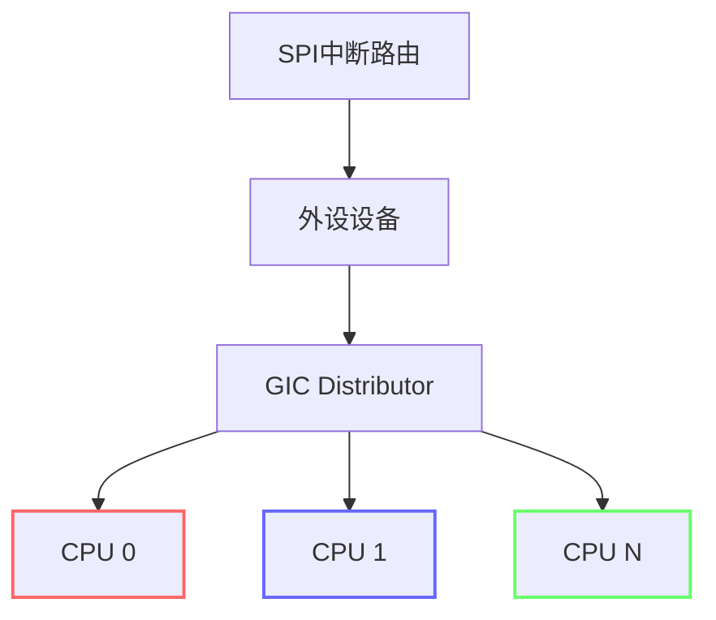
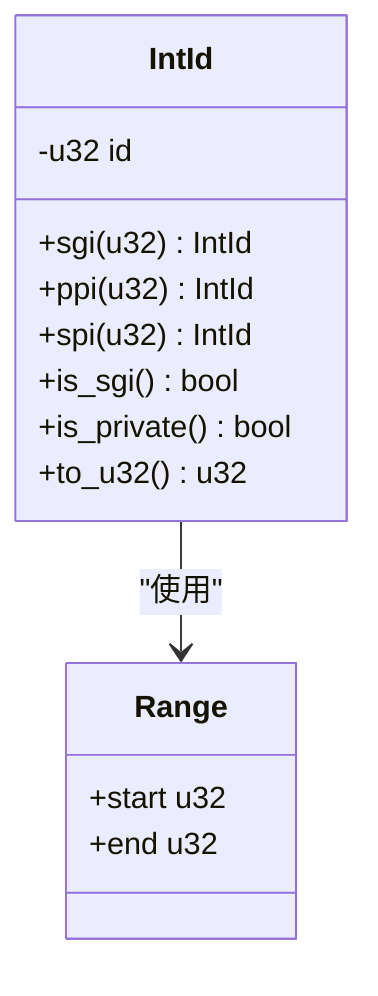

# 中断类型

<cite>
**Referenced Files in This Document**  
- [define.rs](file://gic-driver/src/define.rs)
- [lib.rs](file://gic-driver/src/lib.rs)
- [sgi.rs](file://itest/test-base/src/test_suit/sgi.rs)
- [ppi.rs](file://itest/test-base/src/test_suit/ppi.rs)
</cite>

## 目录
1. [引言](#引言)
2. [中断类型概述](#中断类型概述)
3. [中断ID范围定义](#中断id范围定义)
4. [SGI（软件生成中断）](#sgi软件生成中断)
5. [PPI（私有外设中断）](#ppi私有外设中断)
6. [SPI（共享外设中断）](#spi共享外设中断)
7. [IntId结构体与类型安全](#intid结构体与类型安全)
8. [实际应用场景与选择建议](#实际应用场景与选择建议)
9. [结论](#结论)

## 引言

ARM通用中断控制器（GIC）是ARM架构中用于管理中断的核心组件，它为多核处理器系统提供了灵活且高效的中断处理机制。GIC将中断分为三种主要类型：软件生成中断（SGI）、私有外设中断（PPI）和共享外设中断（SPI）。这些中断类型在ID范围、目标处理器和使用场景上各有不同，共同构成了一个完整的中断管理体系。本文将基于`define.rs`中的常量定义和`IntId`结构体的实现，深入分析这三种中断类型的技术细节、设计原理和实际应用。

## 中断类型概述

ARM GIC根据中断的来源和目标特性，将中断划分为三种基本类型：

- **SGI（Software Generated Interrupt）**：由软件通过写入特定寄存器生成的中断，主要用于处理器核心之间的通信。
- **PPI（Private Peripheral Interrupt）**：与特定处理器核心绑定的外设中断，每个核心都有独立的PPI集合。
- **SPI（Shared Peripheral Interrupt）**：可以被路由到一个或多个处理器核心的系统级外设中断。

这种分类方式体现了GIC在中断管理上的层次化设计：SGI用于核间通信，PPI用于核心私有资源管理，SPI用于系统级资源共享。每种中断类型都有明确的ID范围划分，确保了中断ID的唯一性和可预测性。

**Section sources**
- [define.rs](file://gic-driver/src/define.rs#L45-L105)

## 中断ID范围定义

GIC通过明确的ID范围来区分不同类型的中断，这种设计简化了中断类型的判断和处理逻辑。在`define.rs`文件中，通过常量定义了各中断类型的ID范围：

**Diagram sources**
- [define.rs](file://gic-driver/src/define.rs#L45-L75)

**Section sources**
- [define.rs](file://gic-driver/src/define.rs#L45-L75)

### SGI范围

SGI_RANGE常量定义了软件生成中断的ID范围为0到15（包含0，不包含16），共16个中断。这个范围的设计考虑了多核系统中核间通信的基本需求，提供了足够的中断通道用于不同类型的核间消息传递。

### PPI范围

PPI_RANGE常量定义了私有外设中断的ID范围为16到31（包含16，不包含32），同样提供16个中断。PPI范围紧随SGI之后，这种连续的地址分配简化了中断类型的判断逻辑——只需比较ID与32的大小即可区分私有中断和共享中断。

### SPI范围

SPI_RANGE常量定义了共享外设中断的ID范围为32到1019（包含32，不包含1020），提供了多达988个中断。这个大范围的设计满足了现代系统中大量外设设备的中断需求，支持复杂的系统配置。

### 特殊中断范围

SPECIAL_RANGE常量定义了1020到1023的特殊中断ID范围，用于保留目的。这些ID不用于常规中断处理，可能被GIC硬件用于特定功能。

## SGI（软件生成中断）

软件生成中断（SGI）是由处理器通过写入GICD_SGIR寄存器主动触发的中断，是实现多核系统中处理器间通信（IPC）的核心机制。

### 技术特性

SGI具有以下关键特性：
- **软件可控**：完全由软件通过寄存器写入操作生成
- **目标明确**：可以指定一个或多个目标处理器核心
- **低延迟**：由于是软件直接触发，响应速度极快
- **专用通道**：16个独立的SGI通道可用于不同类型的消息

在`IntId`结构体中，`sgi()`方法用于创建SGI类型的中断ID。该方法接受0-15的参数，并直接将其作为中断ID返回，因为SGI的ID范围从0开始。

**Diagram sources**
- [define.rs](file://gic-driver/src/define.rs#L125-L135)
- [sgi.rs](file://itest/test-base/src/test_suit/sgi.rs#L15-L111)

### 应用场景

SGI主要用于以下场景：
- **核间同步**：一个核心通知另一个核心执行特定任务
- **负载均衡**：调度器在核心间迁移任务时的通知机制
- **缓存一致性**：维护多核系统中缓存一致性的消息传递
- **中断重定向**：将SPI中断从一个核心重新分配到另一个核心

在`sgi.rs`测试文件中，展示了SGI的实际使用模式：通过`test_if().sgi_to_current(SGI_IRQ)`方法向当前CPU发送SGI，并在中断处理函数中验证中断来源。

**Section sources**
- [define.rs](file://gic-driver/src/define.rs#L125-L135)
- [sgi.rs](file://itest/test-base/src/test_suit/sgi.rs#L15-L111)

## PPI（私有外设中断）

私有外设中断（PPI）是与特定处理器核心绑定的外设中断，每个核心都有独立的PPI集合，这些中断不能被路由到其他核心。

### 技术特性

PPI具有以下关键特性：
- **核心私有**：每个核心独立拥有自己的PPI中断线
- **固定路由**：中断只能由所属核心处理
- **高优先级**：通常用于关键的系统功能，如定时器
- **低竞争**：由于是私有的，不存在多核竞争问题

在`IntId`结构体中，`ppi()`方法用于创建PPI类型的中断ID。该方法接受0-15的参数，并将其加上16的偏移量（PPI_RANGE.start），得到16-31范围内的实际中断ID。

**Diagram sources**
- [define.rs](file://gic-driver/src/define.rs#L137-L147)
- [ppi.rs](file://itest/test-base/src/test_suit/ppi.rs#L15-L145)

### 应用场景

PPI主要用于以下场景：
- **核心定时器**：每个核心的本地定时器中断（如ARM Generic Timer）
- **性能监控**：核心性能计数器溢出中断
- **调试支持**：核心调试事件中断
- **电源管理**：核心级电源状态变化通知

在`ppi.rs`测试文件中，展示了PPI的实际应用：使用`IntId::ppi(14)`创建系统定时器中断ID，并配置ARM Generic Timer在1ms后触发中断。

**Section sources**
- [define.rs](file://gic-driver/src/define.rs#L137-L147)
- [ppi.rs](file://itest/test-base/src/test_suit/ppi.rs#L15-L145)

## SPI（共享外设中断）

共享外设中断（SPI）是系统级外设产生的中断，GIC的分发器可以将其路由到一个或多个指定的处理器核心。

### 技术特性

SPI具有以下关键特性：
- **共享性**：多个核心可以接收同一个SPI中断
- **可配置路由**：通过GIC配置寄存器决定目标核心
- **负载均衡**：支持中断在多个核心间动态分配
- **优先级管理**：支持复杂的优先级和抢占机制

在`IntId`结构体中，`spi()`方法用于创建SPI类型的中断ID。该方法接受0-987的参数，并将其加上32的偏移量（SPI_RANGE.start），得到32-1019范围内的实际中断ID。

**Diagram sources**
- [define.rs](file://gic-driver/src/define.rs#L149-L159)

### 应用场景

SPI主要用于以下场景：
- **系统外设**：如UART、I2C、SPI等通信接口的中断
- **存储设备**：硬盘、SSD等存储控制器的中断
- **网络接口**：以太网、Wi-Fi等网络设备的中断
- **图形系统**：GPU、显示控制器的中断

虽然本文档未直接分析SPI的具体使用代码，但其设计原理与SGI和PPI一致，通过`spi()`构造方法创建类型安全的中断ID。

**Section sources**
- [define.rs](file://gic-driver/src/define.rs#L149-L159)

## IntId结构体与类型安全

`IntId`结构体是GIC驱动中中断ID的核心抽象，它通过类型安全的设计确保了中断操作的正确性。

### 设计原理

`IntId`采用封装u32值的元组结构体形式，提供了以下优势：
- **类型安全**：避免了原始u32值的误用
- **方法封装**：通过专用构造方法确保ID范围的正确性
- **语义清晰**：不同的构造方法明确表达了中断类型意图

**Diagram sources**
- [define.rs](file://gic-driver/src/define.rs#L107-L288)

### 构造方法

`IntId`提供了三个主要的构造方法：
- `sgi()`：创建SGI中断ID，参数范围0-15
- `ppi()`：创建PPI中断ID，参数范围0-15，自动加上16偏移
- `spi()`：创建SPI中断ID，参数范围0-987，自动加上32偏移

这些方法在编译时通过`assert!`宏检查参数范围，确保了运行时的安全性。

### 类型检查方法

`IntId`还提供了实用的类型检查方法：
- `is_sgi()`：检查是否为SGI中断
- `is_private()`：检查是否为私有中断（SGI或PPI）
- `is_special()`：检查是否为特殊中断

这些方法简化了中断类型的判断逻辑，提高了代码的可读性和可靠性。

**Section sources**
- [define.rs](file://gic-driver/src/define.rs#L107-L288)

## 实际应用场景与选择建议

在实际系统设计中，选择合适的中断类型对于系统性能和可靠性至关重要。

### 选择原则

| 中断类型 | 适用场景 | 选择理由 |
|---------|---------|---------|
| SGI | 核间通信、同步 | 软件直接控制，低延迟，专用通道 |
| PPI | 核心私有资源 | 避免竞争，高可靠性，固定路由 |
| SPI | 系统共享外设 | 资源共享，负载均衡，灵活路由 |

### 典型用例

1. **操作系统调度**：使用SGI实现核心间的任务迁移通知
2. **实时系统**：使用PPI确保关键定时任务的准时执行
3. **服务器应用**：使用SPI实现网络中断在多个核心间的负载均衡
4. **嵌入式系统**：结合使用三种中断类型实现复杂的中断管理策略

在测试代码中，`sgi.rs`和`ppi.rs`分别展示了SGI和PPI的实际应用，验证了中断机制的正确性和可靠性。

**Section sources**
- [sgi.rs](file://itest/test-base/src/test_suit/sgi.rs#L15-L111)
- [ppi.rs](file://itest/test-base/src/test_suit/ppi.rs#L15-L145)

## 结论

ARM GIC通过SGI、PPI和SPI三种中断类型的划分，构建了一个层次化、模块化的中断管理体系。这种设计既满足了多核系统中不同层次的中断需求，又通过清晰的ID范围划分和类型安全的编程接口确保了系统的可靠性和可维护性。SGI作为核间通信的桥梁，PPI作为核心私有资源的守护者，SPI作为系统共享外设的协调者，三者协同工作，共同支撑起复杂的多核中断处理机制。在实际应用中，理解这三种中断类型的特性和适用场景，能够帮助开发者设计出更高效、更可靠的系统软件。