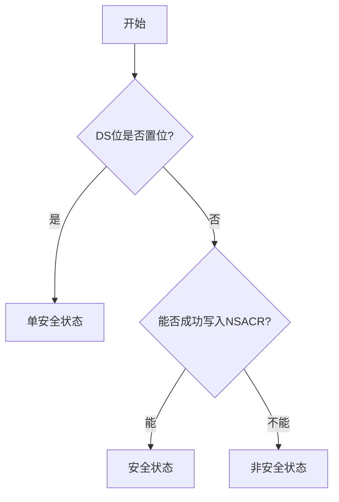
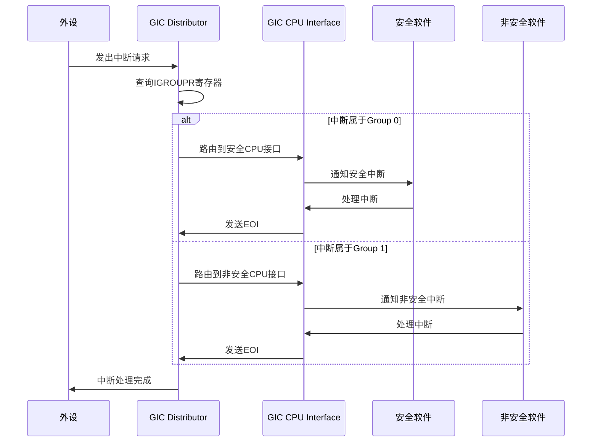
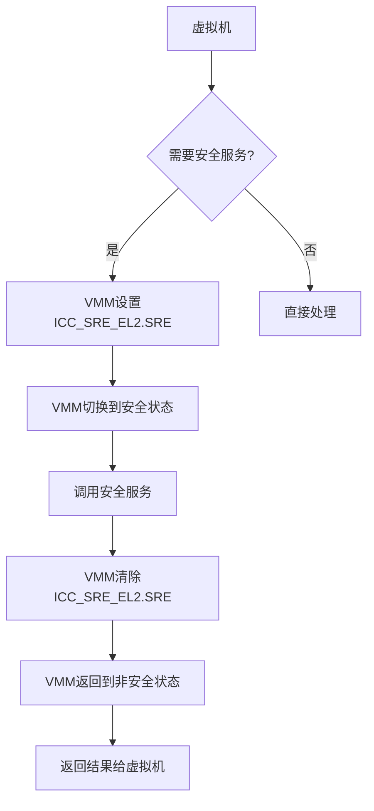

# 安全状态

<cite>
**本文档中引用的文件**  
- [gicd.rs](file://gic-driver/src/version/v3/gicd.rs)
- [gicr.rs](file://gic-driver/src/version/v3/gicr.rs)
- [mod.rs](file://gic-driver/src/version/v3/mod.rs)
- [icc.rs](file://gic-driver/src/sys_reg/icc.rs)
- [ich.rs](file://gic-driver/src/sys_reg/ich.rs)
- [define.rs](file://gic-driver/src/define.rs)
</cite>

## 目录
1. [引言](#引言)
2. [安全状态配置机制](#安全状态配置机制)
3. [中断分组与处理流程](#中断分组与处理流程)
4. [虚拟化支持与EL2环境下的安全状态](#虚拟化支持与el2环境下的安全状态)
5. [安全状态对中断属性的影响](#安全状态对中断属性的影响)
6. [系统开发者设计建议](#系统开发者设计建议)
7. [结论](#结论)

## 引言
ARM GIC（通用中断控制器）的安全状态机制是TrustZone技术的核心组成部分，用于实现安全与非安全世界之间的隔离。该机制通过硬件级别的中断控制，确保敏感操作在安全环境中执行，同时允许非安全环境访问必要的外设资源。GIC支持单安全状态和双安全状态两种配置模式，分别适用于不同安全需求的系统。在双安全状态下，中断被划分为安全中断和非安全中断，通过安全位控制其传播权限。本文档将深入解析GIC的安全状态机制，包括安全中断与非安全中断的处理流程、虚拟化支持以及安全状态对中断优先级、屏蔽机制和目标CPU选择的影响，并为系统开发者提供安全架构设计建议。

## 安全状态配置机制

ARM GICv3支持三种安全状态：单安全状态（Single Security State）、安全状态（Secure）和非安全状态（Non-secure）。安全状态的确定依赖于GICD_CTLR寄存器中的DS（Disable Security）位和GICD_NSACR寄存器的访问行为。当DS位被置位时，系统处于单安全状态，所有中断被视为非安全中断。当DS位被清零时，系统处于双安全状态，此时通过尝试写入GICD_NSACR寄存器并读回其值来判断当前的安全状态。如果写入的值能够成功读回，则当前处于安全状态；如果读回的值为零，则当前处于非安全状态。这种机制确保了只有在安全状态下才能修改NSACR寄存器，从而防止非安全软件篡改中断的安全属性。

**图示来源**
- [gicd.rs](file://gic-driver/src/version/v3/gicd.rs#L91-L122)

**本节来源**
- [gicd.rs](file://gic-driver/src/version/v3/gicd.rs#L91-L161)

## 中断分组与处理流程

在双安全状态下，GIC将中断分为两组：Group 0（安全中断）和Group 1（非安全中断）。安全中断只能由安全软件处理，而非安全中断可以由非安全软件处理。中断的分组通过IGROUPR寄存器进行配置，每个中断可以被分配到Group 0或Group 1。当一个中断发生时，GIC根据其中断ID和分组信息决定其处理方式。对于安全中断，GIC会将其路由到安全CPU接口，并由安全软件进行处理；对于非安全中断，GIC会将其路由到非安全CPU接口，并由非安全软件进行处理。这种分组机制确保了安全与非安全中断的隔离，防止非安全软件干扰安全中断的处理。

**图示来源**
- [gicd.rs](file://gic-driver/src/version/v3/gicd.rs#L557-L596)
- [gicr.rs](file://gic-driver/src/version/v3/gicr.rs#L330-L371)

**本节来源**
- [gicd.rs](file://gic-driver/src/version/v3/gicd.rs#L557-L596)
- [gicr.rs](file://gic-driver/src/version/v3/gicr.rs#L330-L371)

## 虚拟化支持与EL2环境下的安全状态

在虚拟化环境中，GIC通过ICH（Interrupt Controller Hypervisor）模块支持虚拟中断的处理。ICH模块允许虚拟机监控器（VMM）管理虚拟中断，并将其注入到虚拟机中。在EL2环境下，安全状态的切换通过ICC_SRE_EL2寄存器进行控制。当VMM需要切换到安全状态时，它会设置ICC_SRE_EL2寄存器的SRE位，从而获得对安全中断的控制权。一旦VMM完成了安全操作，它可以清除SRE位，返回到非安全状态。这种机制确保了VMM可以在需要时访问安全资源，同时保持对非安全虚拟机的隔离。

**图示来源**
- [ich.rs](file://gic-driver/src/sys_reg/ich.rs)
- [icc.rs](file://gic-driver/src/sys_reg/icc.rs)

**本节来源**
- [ich.rs](file://gic-driver/src/sys_reg/ich.rs)
- [icc.rs](file://gic-driver/src/sys_reg/icc.rs)

## 安全状态对中断属性的影响

安全状态对中断的优先级、屏蔽机制和目标CPU选择有显著影响。在双安全状态下，安全中断通常具有更高的优先级，以确保关键安全操作能够及时得到处理。中断的屏蔽通过ICC_PMR_EL1寄存器进行控制，该寄存器定义了当前执行状态下的优先级掩码。只有优先级高于掩码值的中断才能被处理。在安全状态下，软件可以设置较低的掩码值，允许更多中断通过；而在非安全状态下，掩码值通常较高，限制了可处理的中断范围。目标CPU的选择通过ITARGETSR寄存器进行配置，该寄存器指定了中断应路由到的CPU核心。在安全状态下，软件可以自由配置中断的目标CPU；而在非安全状态下，目标CPU的选择受到限制，以防止非安全软件干扰安全中断的处理。

**本节来源**
- [icc.rs](file://gic-driver/src/sys_reg/icc.rs)
- [gicd.rs](file://gic-driver/src/version/v3/gicd.rs)

## 系统开发者设计建议

对于系统开发者而言，在集成TrustZone时，应遵循以下最佳实践来配置中断：
1. **明确中断分类**：在系统设计初期，应明确哪些中断属于安全中断，哪些属于非安全中断，并在初始化阶段正确配置IGROUPR寄存器。
2. **合理设置优先级**：安全中断应被赋予较高的优先级，以确保其能够及时响应。同时，应注意避免优先级反转问题。
3. **严格控制访问权限**：通过NSACR寄存器限制非安全软件对关键寄存器的访问，防止其篡改中断配置。
4. **利用虚拟化功能**：在支持虚拟化的系统中，充分利用ICH模块提供的功能，实现虚拟中断的高效管理。
5. **测试与验证**：在开发过程中，应充分测试不同安全状态下的中断处理流程，确保系统的稳定性和安全性。

**本节来源**
- [define.rs](file://gic-driver/src/define.rs)
- [gicd.rs](file://gic-driver/src/version/v3/gicd.rs)

## 结论

ARM GIC的安全状态机制为系统提供了强大的安全隔离能力，通过硬件级别的中断控制，实现了安全与非安全世界的分离。理解并正确配置GIC的安全状态对于构建安全可靠的嵌入式系统至关重要。通过合理利用中断分组、优先级控制和虚拟化支持等功能，系统开发者可以设计出既高效又安全的系统架构。未来的研究方向可以探索更细粒度的中断安全控制机制，以及如何在多核系统中优化安全中断的负载均衡。