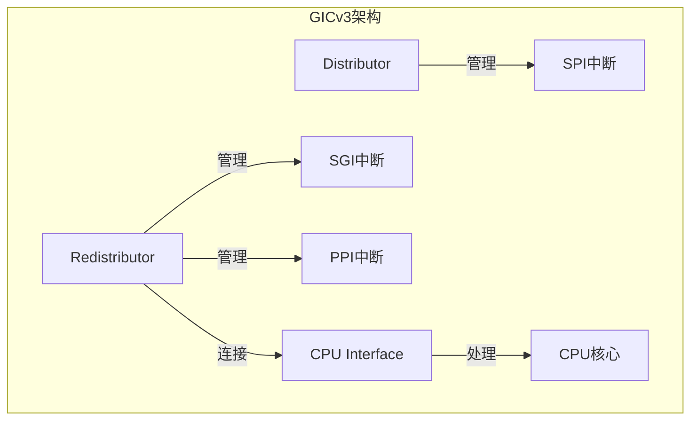
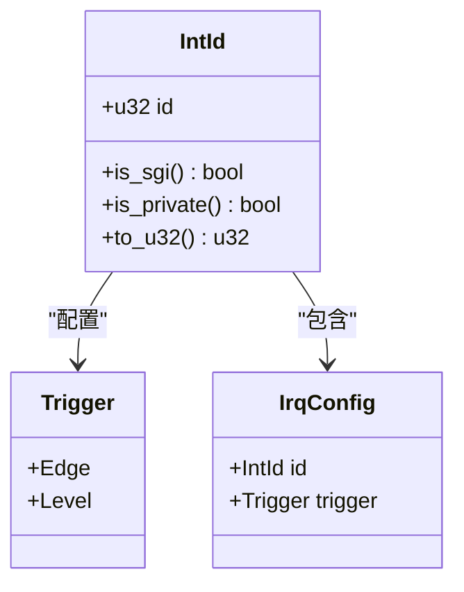
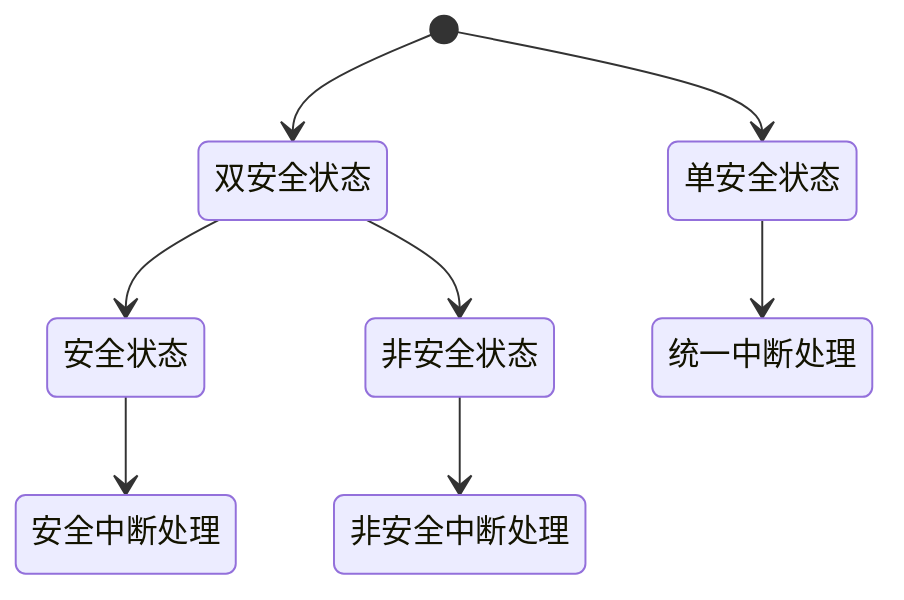
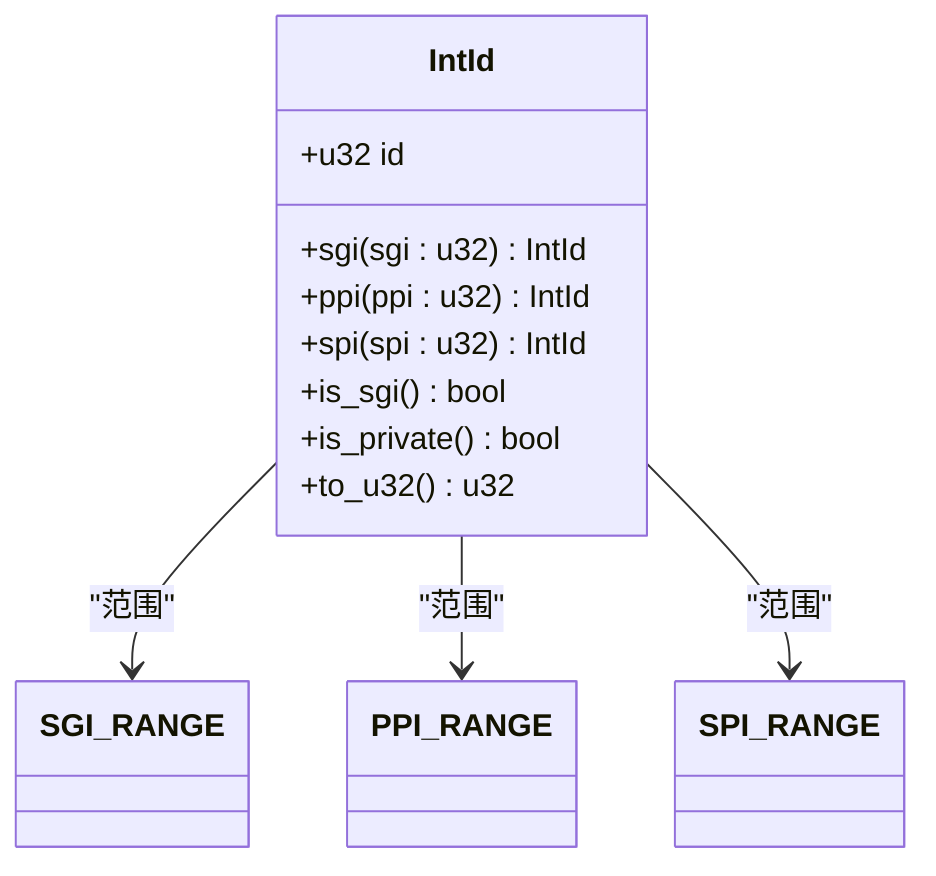
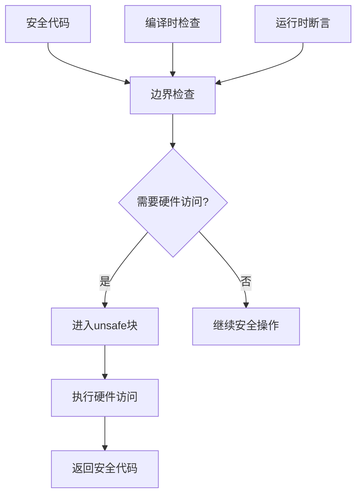

# 核心概念

<cite>
**本文档中引用的文件**  
- [define.rs](file://gic-driver/src/define.rs)
- [lib.rs](file://gic-driver/src/lib.rs)
- [v3/mod.rs](file://gic-driver/src/version/v3/mod.rs)
- [v3/gicd.rs](file://gic-driver/src/version/v3/gicd.rs)
- [v3/gicr.rs](file://gic-driver/src/version/v3/gicr.rs)
- [v2/mod.rs](file://gic-driver/src/version/v2/mod.rs)
</cite>

## 目录
1. [ARM GIC架构概述](#arm-gic架构概述)
2. [中断类型详解](#中断类型详解)
3. [安全状态机制](#安全状态机制)
4. [VirtAddr虚拟地址封装](#virtaddr虚拟地址封装)
5. [IntId中断ID管理](#intid中断id管理)
6. [内存映射I/O与unsafe代码](#内存映射io与unsafe代码)

## ARM GIC架构概述

ARM通用中断控制器（GIC）是ARM架构中用于管理中断的核心组件。GIC架构主要由三个基本组件构成：分发器（Distributor）、CPU接口（CPU Interface）和重分发器（Redistributor）。

分发器负责管理共享外设中断（SPI），控制中断的使能、优先级、目标CPU等全局配置。在代码实现中，`DistributorReg`结构体定义了分发器的寄存器布局，通过内存映射I/O进行访问。分发器还负责维护中断的挂起状态、激活状态和优先级信息。

CPU接口为每个CPU核心提供中断处理功能，包括中断确认（ACK）、结束中断处理（EOI）等操作。在GICv3架构中，CPU接口通过系统寄存器（如ICC_IAR0_EL1、ICC_EOIR0_EL1等）实现，而不是传统的内存映射寄存器。这种设计提高了中断处理的效率。

重分发器是GICv3引入的新组件，每个CPU核心都有一个对应的重分发器。它负责处理软件生成中断（SGI）和私有外设中断（PPI），并将中断路由到对应的CPU接口。重分发器还支持本地中断处理功能，如LPI（Locality-specific Peripheral Interrupts）。在代码中，`RedistributorV3`结构体封装了重分发器的功能，通过`RDv3Slice`管理多个重分发器实例。

GICv3架构通过将分发器和重分发器分离，实现了更好的可扩展性和灵活性。分发器集中管理SPI，而重分发器分布式管理SGI和PPI，这种架构设计使得系统能够支持更多的CPU核心和中断源。



**图示来源**
- [v3/mod.rs](file://gic-driver/src/version/v3/mod.rs#L213-L252)
- [v3/gicd.rs](file://gic-driver/src/version/v3/gicd.rs#L0-L100)
- [v3/gicr.rs](file://gic-driver/src/version/v3/gicr.rs#L0-L50)

## 中断类型详解

ARM GIC支持三种主要的中断类型：软件生成中断（SGI）、私有外设中断（PPI）和共享外设中断（SPI）。这些中断类型在中断ID范围、使用场景和路由方式上有所不同。

软件生成中断（SGI）的中断ID范围为0-15，用于处理器间的通信。SGI由软件通过写入特定寄存器（如ICC_SGI1R_EL1）来触发，可以定向发送到一个或多个指定的CPU核心。在代码实现中，`SGI_RANGE`常量定义了SGI的ID范围，`IntId::sgi()`方法用于创建SGI中断ID。SGI通常用于操作系统中的核间中断（IPI）机制，如TLB刷新、核间同步等。

私有外设中断（PPI）的中断ID范围为16-31，是每个CPU核心私有的中断。PPI通常与CPU核心紧密相关的外设相关联，如定时器、看门狗等。在代码中，`PPI_RANGE`常量定义了PPI的ID范围，`IntId::ppi()`方法用于创建PPI中断ID。PPI只能由所属的CPU核心处理，不能路由到其他核心。

共享外设中断（SPI）的中断ID范围为32-1019，是系统中所有CPU核心共享的中断。SPI通常与系统级外设相关联，如网络控制器、存储控制器等。在代码实现中，`SPI_RANGE`常量定义了SPI的ID范围，`IntId::spi()`方法用于创建SPI中断ID。SPI可以配置为路由到一个或多个CPU核心，支持灵活的中断负载均衡。



**图示来源**
- [define.rs](file://gic-driver/src/define.rs#L82-L108)
- [v3/mod.rs](file://gic-driver/src/version/v3/mod.rs#L766-L804)

## 安全状态机制

GIC支持单安全状态和双安全状态两种安全配置模式，这通过分发器控制寄存器（GICD_CTLR）中的DS位来控制。安全状态机制在系统安全中起着至关重要的作用，它为安全世界和非安全世界提供了隔离的中断处理环境。

在单安全状态模式下（DS=1），系统只存在一个安全状态，所有中断都被同等对待。这种模式适用于不需要安全扩展的简单系统。在代码实现中，当检测到单安全状态时，系统会启用Group 0和Group 1中断，并启用亲和性路由（ARE）。`SecurityState::Single`枚举值表示单安全状态，`CTLR_ONE`寄存器字段用于配置单安全状态下的控制寄存器。

在双安全状态模式下（DS=0），系统存在安全和非安全两个独立的安全状态。这种模式支持ARM TrustZone技术，为安全世界和非安全世界提供了隔离的中断处理路径。在双安全状态模式下，中断被分为安全中断（Group 0）和非安全中断（Group 1），每个安全状态都有独立的中断使能控制和优先级掩码。在代码中，`SecurityState::Secure`和`SecurityState::NonSecure`枚举值分别表示安全状态和非安全状态，`CTLR_S`和`CTLR_NS`寄存器字段用于配置相应安全状态下的控制寄存器。

安全状态的检测通过访问GICD_NSACR寄存器的行为来实现。在安全状态下，GICD_NSACR寄存器是可读写的；在非安全状态下，该寄存器表现为RAZ/WI（读零/写忽略）行为。通过尝试写入测试模式并读回值，可以确定当前的安全状态。这种机制确保了安全状态检测的可靠性，防止了非安全代码获取安全状态信息。



**图示来源**
- [v3/gicd.rs](file://gic-driver/src/version/v3/gicd.rs#L598-L635)
- [v2/gicd.rs](file://gic-driver/src/version/v2/gicd.rs#L237-L288)

## VirtAddr虚拟地址封装

`VirtAddr`是用于内存映射寄存器访问的虚拟地址封装类型，它提供了类型安全的内存映射I/O访问机制。这个封装在保证类型安全的同时，允许高效的指针操作，是硬件访问安全性的关键设计。

`VirtAddr`通过`#[repr(transparent)]`属性被定义为透明表示，这意味着它在内存布局上与`usize`完全相同，避免了额外的运行时开销。这种设计使得`VirtAddr`可以在不产生性能损失的情况下提供类型安全。`VirtAddr`实现了`Copy`、`Clone`、`Debug`、`Eq`和`PartialEq`等trait，支持值语义操作和调试输出。

`VirtAddr`的核心方法是`as_ptr<T>()`，它将虚拟地址转换为指定类型的可变指针。这个方法被标记为`unsafe`，因为调用者必须确保地址的有效性、内存区域的正确映射和适当的同步机制。通过将`unsafe`标记放在这个边界方法上，`VirtAddr`将安全性责任明确地交给了调用者，同时保护了内部实现的安全性。

`VirtAddr`还实现了多个`From` trait，支持从`usize`、`*mut u8`和`NonNull<T>`等类型进行转换。这种设计提供了灵活的创建方式，同时保持了类型安全。`Display` trait的实现提供了格式化的地址输出，便于调试和日志记录。

```mermaid
classDiagram
class VirtAddr {
+usize addr
+new(val : usize) VirtAddr
+as_ptr<T>() *mut T
}
VirtAddr --> usize : "转换"
VirtAddr --> "*mut T" : "转换"
```

**图示来源**
- [lib.rs](file://gic-driver/src/lib.rs#L25-L77)

## IntId中断ID管理

`IntId`是GIC中断ID的类型安全封装，它通过类型系统保证了中断ID的有效性和正确使用。这种设计避免了使用原始`u32`类型可能带来的类型错误和无效中断ID问题。

`IntId`内部封装了一个`u32`值，但通过提供特定的构造方法来确保中断ID的有效性。`IntId::raw()`方法被标记为`unsafe`，因为它允许创建任意值的中断ID，调用者必须确保ID的有效性。相比之下，`IntId::sgi()`、`IntId::ppi()`和`IntId::spi()`方法是安全的，它们在编译时通过`assert!`宏检查ID范围，确保创建的中断ID在有效范围内。

`IntId`提供了多个方法来查询中断类型和属性。`is_sgi()`方法检查中断是否为软件生成中断，`is_private()`方法检查中断是否为私有中断（SGI或PPI）。这些方法通过检查中断ID的范围来确定中断类型，提供了高效的类型查询功能。`to_u32()`方法将`IntId`转换为原始的`u32`值，用于与硬件寄存器交互。

`IntId`还实现了`From`和`Into` trait，支持与其他类型的转换。`From<IntId> for u32`的实现允许将`IntId`直接转换为`u32`，简化了与底层硬件接口的交互。`Debug` trait的实现提供了格式化的调试输出，根据中断类型显示为"SGI X"、"PPI Y"或"SPI Z"，便于调试和日志记录。



**图示来源**
- [define.rs](file://gic-driver/src/define.rs#L129-L288)

## 内存映射I/O与unsafe代码

内存映射I/O是硬件访问的基础机制，它将硬件寄存器映射到内存地址空间，通过普通的内存读写操作来访问硬件。在Rust中，这种访问必须使用`unsafe`代码，因为编译器无法验证硬件访问的安全性。

在arm-gic-driver中，内存映射I/O通过`VirtAddr`和`as_ptr()`方法实现。`as_ptr()`方法被标记为`unsafe`，因为它返回一个指向硬件寄存器的原始指针。调用者必须确保：地址对硬件寄存器有效、内存区域已正确映射、访问时有适当的同步机制。这种设计将安全性责任明确地交给了调用者，同时保护了安全代码的完整性。

`unsafe`代码在硬件访问中的必要性源于几个方面：首先，硬件寄存器的访问顺序和时机可能对系统行为有重要影响，编译器优化可能破坏这种时序；其次，多个CPU核心可能并发访问同一硬件资源，需要显式的同步机制；最后，硬件寄存器的内存映射可能涉及特殊的内存属性（如设备内存），需要特殊的访问语义。

风险控制通过多个层次实现：类型系统（如`VirtAddr`和`IntId`）在编译时捕获大部分错误；`unsafe`块将不安全代码隔离在最小范围内；文档和注释明确说明了`unsafe`代码的前提条件；运行时检查（如`assert!`）验证关键假设。这种分层的安全模型在保证性能的同时，最大限度地减少了安全风险。



**图示来源**
- [lib.rs](file://gic-driver/src/lib.rs#L60-L70)
- [define.rs](file://gic-driver/src/define.rs#L129-L131)