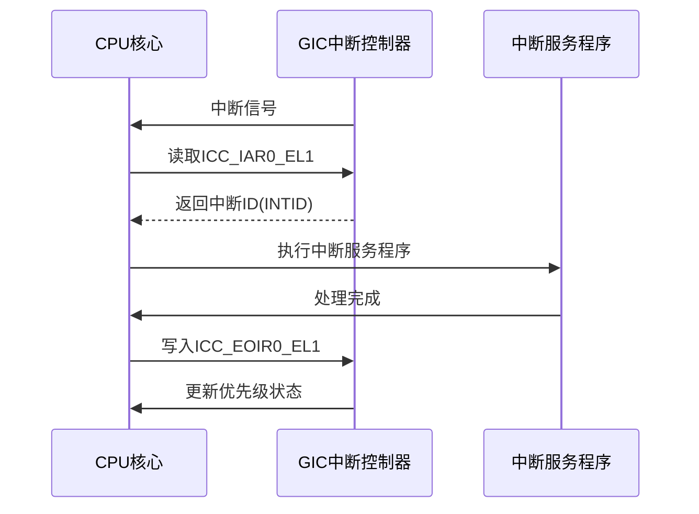
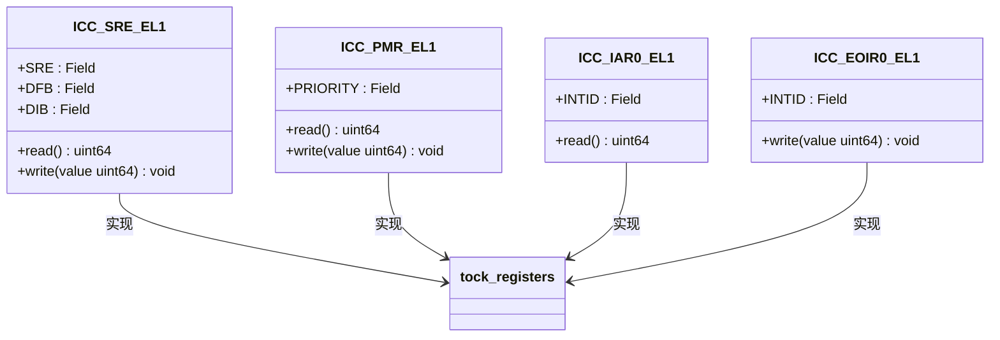

# ICC寄存器

<cite>
**Referenced Files in This Document**   
- [icc.rs](file://gic-driver/src/sys_reg/icc.rs)
- [macros.rs](file://gic-driver/src/sys_reg/macros.rs)
- [mod.rs](file://gic-driver/src/sys_reg/mod.rs)
- [v3/mod.rs](file://gic-driver/src/version/v3/mod.rs)
</cite>

## 目录
1. [ICC寄存器概述](#icc寄存器概述)
2. [核心ICC寄存器详解](#核心icc寄存器详解)
3. [中断处理工作流程](#中断处理工作流程)
4. [类型安全的寄存器访问](#类型安全的寄存器访问)
5. [性能与内存屏障考虑](#性能与内存屏障考虑)

## ICC寄存器概述

ICC（中断控制器CPU接口）系统寄存器是ARM GIC（通用中断控制器）架构中的关键组成部分，负责管理CPU与中断控制器之间的交互。这些寄存器为CPU提供了配置中断处理行为、确认中断、结束中断以及管理中断优先级的能力。在GICv3架构中，ICC寄存器通过系统寄存器接口进行访问，实现了高效且低延迟的中断管理。

ICC寄存器的设计遵循ARM架构的异常级别（EL）模型，允许不同特权级别的软件（如操作系统内核、hypervisor或安全监控器）配置和管理中断行为。这些寄存器在系统初始化期间被配置，并在中断生命周期中被频繁访问，以确保中断能够被正确地分发、处理和完成。

**Section sources**
- [icc.rs](file://gic-driver/src/sys_reg/icc.rs#L1-L10)

## 核心ICC寄存器详解

### ICC_SRE_EL1（系统寄存器使能寄存器）

ICC_SRE_EL1寄存器用于控制CPU接口是否使用系统寄存器接口来访问GIC功能。该寄存器中的SRE（System Register Enable）位是关键控制位，当设置为1时，启用系统寄存器接口，禁用内存映射的GICC寄存器。DFB（Disable FIQ Binding）和DIB（Disable IRQ Binding）位用于控制快速中断（FIQ）和普通中断（IRQ）的绑定行为。

**Section sources**
- [icc.rs](file://gic-driver/src/sys_reg/icc.rs#L12-L22)

### ICC_CTLR_EL1（控制寄存器）

ICC_CTLR_EL1寄存器包含多个配置位，用于微调中断控制器的行为。CBPR（Common Binary Point Register）位决定是否为Group 0和Group 1中断使用相同的二进制点，从而统一优先级屏蔽行为。EOIMODE（End of Interrupt Mode）位控制EOI（中断结束）操作的模式：当设置为0时，ICC_EOIRx写入同时执行优先级降级和中断停用；当设置为1时，ICC_EOIRx仅执行优先级降级，需要单独的ICC_DIR_EL1写入来停用中断。

PRIBITS位指定用于中断优先级的位数，而IDBITS位指定中断ID字段的有效位数。这些配置位允许系统根据实际需求优化中断处理性能和资源使用。

**Section sources**
- [icc.rs](file://gic-driver/src/sys_reg/icc.rs#L56-L70)

### ICC_IAR0_EL1 和 ICC_EOIR0_EL1（中断确认与结束寄存器）

ICC_IAR0_EL1是只读寄存器，用于中断确认（ACK）。当CPU读取此寄存器时，它会返回当前最高优先级待处理中断的中断ID（INTID），并自动更新CPU接口的运行优先级。INTID字段占用24位，足以表示GIC支持的所有中断源。

ICC_EOIR0_EL1是只写寄存器，用于中断结束（EOI）操作。向此寄存器写入中断ID会通知GIC该中断已被处理，允许GIC恢复CPU的优先级并可能触发新的中断。这两个寄存器共同构成了中断处理的核心流程：先通过IAR获取中断源，处理中断服务程序，然后通过EOIR通知中断结束。

**Section sources**
- [icc.rs](file://gic-driver/src/sys_reg/icc.rs#L88-L100)

### ICC_PMR_EL1（优先级掩码寄存器）

ICC_PMR_EL1寄存器用于设置中断优先级掩码。CPU只会被优先级高于此掩码值的中断打断。优先级值越小表示优先级越高（0为最高优先级）。通过配置此寄存器，操作系统可以实现中断优先级管理，例如在执行关键代码段时临时屏蔽低优先级中断。

**Section sources**
- [icc.rs](file://gic-driver/src/sys_reg/icc.rs#L148-L152)

## 中断处理工作流程

**Diagram sources**
- [v3/mod.rs](file://gic-driver/src/version/v3/mod.rs#L940-L945)
- [icc.rs](file://gic-driver/src/sys_reg/icc.rs#L88-L100)

中断处理工作流程始于GIC向CPU发送中断信号。CPU响应后，首先读取ICC_IAR0_EL1寄存器以确认中断，获取中断ID并提升运行优先级。随后，CPU执行相应的中断服务程序（ISR）来处理中断事件。处理完成后，CPU写入ICC_EOIR0_EL1寄存器以结束中断，通知GIC可以恢复之前的优先级状态。如果配置了两步EOI模式（EOIMODE=1），则还需要写入ICC_DIR_EL1来显式停用中断。

## 类型安全的寄存器访问

**Diagram sources**
- [icc.rs](file://gic-driver/src/sys_reg/icc.rs#L12-L152)
- [macros.rs](file://gic-driver/src/sys_reg/macros.rs#L30-L150)

本实现通过`tock-registers`库提供了类型安全的寄存器访问机制。`define_readonly_register!`、`define_readwrite_register!`和`define_writeonly_register!`宏在`macros.rs`中定义，用于生成类型安全的寄存器访问代码。这些宏利用`tock_registers::register_bitfields`创建具有字段级类型安全的寄存器定义，防止位域操作错误。

例如，对`ICC_PMR_EL1`的写入必须使用`.PRIORITY.val(mask)`语法，确保只写入有效的优先级值。这种设计避免了直接操作原始位掩码可能导致的硬件编程错误，提高了代码的可靠性和可维护性。

**Section sources**
- [macros.rs](file://gic-driver/src/sys_reg/macros.rs#L30-L150)
- [icc.rs](file://gic-driver/src/sys_reg/icc.rs#L12-L152)

## 性能与内存屏障考虑

ICC寄存器的访问顺序对系统稳定性至关重要。在初始化GIC时，必须确保寄存器写入操作按正确顺序完成。例如，在`v3/mod.rs`中，代码在配置ICC_SRE_EL1后立即配置ICC_PMR_EL1，确保中断系统在启用后立即处于已知的优先级掩码状态。

虽然系统寄存器访问通常具有隐含的排序语义，但在关键路径上仍需注意内存屏障的使用。特别是当多个CPU核心并发访问GIC寄存器时，可能需要显式的内存屏障指令来确保操作的全局可见性。然而，在大多数情况下，ARM架构的系统寄存器访问已经提供了足够的顺序保证，无需额外的屏障。

**Section sources**
- [v3/mod.rs](file://gic-driver/src/version/v3/mod.rs#L875-L892)