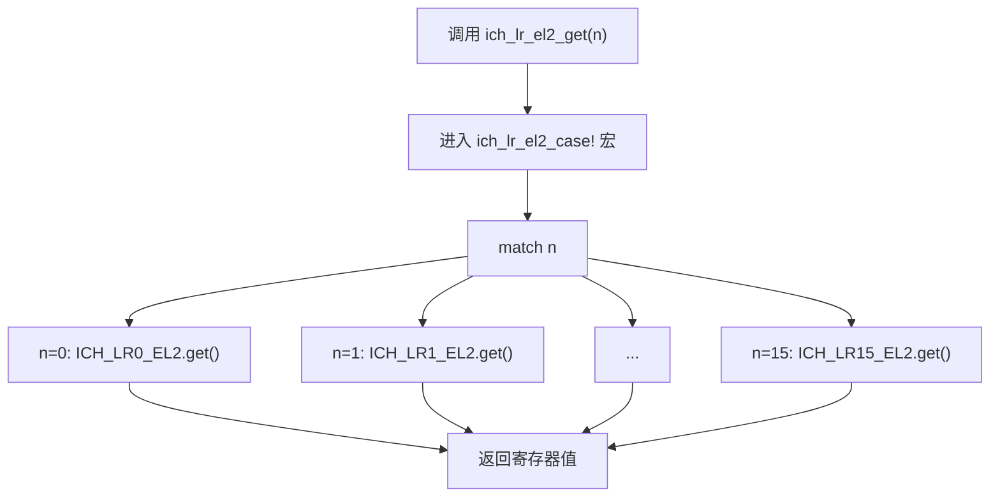

# ICH寄存器

<cite>
**Referenced Files in This Document**   
- [ich.rs](file://gic-driver/src/sys_reg/ich.rs)
- [macros.rs](file://gic-driver/src/sys_reg/macros.rs)
- [mod.rs](file://gic-driver/src/sys_reg/mod.rs)
- [v2/mod.rs](file://gic-driver/src/version/v2/mod.rs)
</cite>

## 目录
1. [引言](#引言)
2. [核心寄存器功能详解](#核心寄存器功能详解)
3. [ICH_LR_EL2寄存器结构与字段](#ich_lr_el2寄存器结构与字段)
4. [安全访问与统一操作宏](#安全访问与统一操作宏)
5. [维护中断状态读取](#维护中断状态读取)
6. [虚拟机控制寄存器配置](#虚拟机控制寄存器配置)
7. [虚拟化中断生命周期管理](#虚拟化中断生命周期管理)
8. [性能优化策略](#性能优化策略)

## 引言

在ARM架构的虚拟化环境中，中断控制器虚拟化接口（ICH）是一组关键的系统寄存器，它们为虚拟机监控程序（Hypervisor）提供了对虚拟中断进行高效管理和控制的能力。这些寄存器运行在EL2（Hypervisor）异常级别，是实现高效、安全的虚拟化中断处理的核心。本文档旨在深入解析`arceos_drivers`项目中`arm-gic-driver`驱动所实现的ICH寄存器，包括`ICH_HCR_EL2`、`ICH_VTR_EL2`、`ICH_VMCR_EL2`以及`ICH_LR_EL2`系列寄存器的结构、功能和操作方法。

**Section sources**
- [ich.rs](file://gic-driver/src/sys_reg/ich.rs#L0-L278)

## 核心寄存器功能详解

### ICH_HCR_EL2（虚拟化控制寄存器）

`ICH_HCR_EL2`是中断控制器虚拟化控制寄存器，它负责启用和配置整个虚拟化中断处理框架。该寄存器的`EN`（Enable）位是整个虚拟化功能的总开关。当`EN`位被置位时，虚拟CPU接口（GICV）被激活，虚拟机（VM）可以通过读写GICV寄存器来管理其虚拟中断。此外，该寄存器还包含多个中断使能位，用于控制不同类型的维护中断（Maintenance Interrupt），例如`UIE`（Underflow Interrupt Enable）用于在虚拟中断列表寄存器（List Register）下溢时产生中断，`VGRP0EIE`和`VGRP1EIE`则分别用于在虚拟Group 0和Group 1中断被使能时产生维护中断。

**Section sources**
- [ich.rs](file://gic-driver/src/sys_reg/ich.rs#L63-L96)

### ICH_VTR_EL2（虚拟GIC类型寄存器）

`ICH_VTR_EL2`是一个只读寄存器，它向Hypervisor报告虚拟GIC的实现细节。其中，`LISTREGS`字段指示了可用的虚拟中断列表寄存器的数量，这对于Hypervisor分配和管理中断至关重要。`IDBITS`字段定义了虚拟中断ID（VINTID）的有效位数，而`PRIBITS`和`PREBITS`字段则分别指明了虚拟优先级和抢占优先级的位数。这些信息使Hypervisor能够根据硬件能力来配置虚拟中断。

**Section sources**
- [ich.rs](file://gic-driver/src/sys_reg/ich.rs#L85-L96)

### ICH_VMCR_EL2（虚拟机控制寄存器）

`ICH_VMCR_EL2`允许Hypervisor为每个虚拟CPU配置虚拟中断处理的行为。它包含了虚拟中断的使能位（`VENG0`和`VENG1`），用于控制虚拟Group 0和Group 1中断的传递。`VFIQEN`位用于启用虚拟FIQ（快速中断请求），当置位时，高优先级的虚拟中断可以作为FIQ传递给虚拟机。`VPMR`（Virtual Priority Mask Register）字段则定义了虚拟机的优先级掩码，只有优先级高于此掩码的虚拟中断才会被传递给虚拟机。

**Section sources**
- [ich.rs](file://gic-driver/src/sys_reg/ich.rs#L127-L138)

## ICH_LR_EL2寄存器结构与字段

`ICH_LR_EL2`系列寄存器是虚拟中断管理的核心，它们将物理中断映射到虚拟中断，并维护其状态。每个`ICH_LR_EL2`寄存器都是一个64位的结构，包含以下关键字段：

- **VINTID (Virtual Interrupt ID)**: 该字段存储了虚拟中断的ID，是虚拟机所感知的中断标识符。当虚拟机读取其虚拟中断状态时，它看到的就是这个ID。
- **PINTID (Physical Interrupt ID)**: 该字段存储了与虚拟中断相关联的物理中断ID。当虚拟中断被确认（EOI）时，Hypervisor需要使用这个ID来向物理GIC发送EOI信号。
- **STATE (状态)**: 该字段表示虚拟中断的当前状态，可以是`Invalid`（无效）、`Pending`（挂起）、`Active`（激活）或`PendingAndActive`（挂起并激活）。Hypervisor通过修改此字段来管理虚拟中断的生命周期。
- **PRIORITY (优先级)**: 该字段定义了虚拟中断的优先级，用于在多个挂起的虚拟中断中确定哪个应该被首先传递给虚拟机。
- **GROUP (中断组)**: 该字段指示虚拟中断属于Group 0（安全）还是Group 1（非安全）。这决定了中断的处理方式和权限。

**Section sources**
- [ich.rs](file://gic-driver/src/sys_reg/ich.rs#L142-L189)

## 安全访问与统一操作宏

为了安全、高效地访问16个`ICH_LR_EL2`寄存器（从`ICH_LR0_EL2`到`ICH_LR15_EL2`），代码库定义了两个强大的宏：`define_ich_lr_register!`和`ich_lr_el2_case!`。

`define_ich_lr_register!`宏利用Rust的`paste`库，通过代码生成的方式，为每一个`ICH_LRn_EL2`寄存器创建一个独立的模块和结构体。这个结构体实现了`Readable`和`Writeable` trait，封装了底层的`mrs`（读系统寄存器）和`msr`（写系统寄存器）汇编指令，从而提供了类型安全的寄存器访问接口。

`ich_lr_el2_case!`宏则提供了一个统一的、基于索引的访问模式。它接受一个寄存器索引`n`和一个操作（如`get`、`set`、`write`等），然后通过`match`表达式将索引映射到对应的`ICH_LRn_EL2`实例上执行操作。这极大地简化了对多个列表寄存器的循环或条件操作。

**Diagram sources**
- [ich.rs](file://gic-driver/src/sys_reg/ich.rs#L190-L257)

**Section sources**
- [ich.rs](file://gic-driver/src/sys_reg/ich.rs#L190-L278)
- [macros.rs](file://gic-driver/src/sys_reg/macros.rs#L0-L150)

## 维护中断状态读取

维护中断是Hypervisor与物理GIC之间通信的桥梁。当物理GIC需要Hypervisor介入时（例如，一个虚拟中断需要被注入），它会触发一个维护中断。Hypervisor可以通过读取`ICH_MISR_EL2`（Maintenance Interrupt Status Register）来获取维护中断的具体原因。

例如，当`ICH_MISR_EL2`的`EOI`位被置位时，表示有一个虚拟中断的结束（End of Interrupt）需要处理。Hypervisor需要检查相应的`ICH_LR_EL2`寄存器，确认虚拟中断的`PINTID`，然后向物理GIC的`GICC_EOIR`寄存器写入该`PINTID`来完成物理中断的确认流程。

**Section sources**
- [ich.rs](file://gic-driver/src/sys_reg/ich.rs#L97-L126)

## 虚拟机控制寄存器配置

配置`ICH_VMCR_EL2`是为虚拟机设置中断环境的关键步骤。以下是一个典型的配置流程：

1.  **启用虚拟中断**: 通过设置`VENG0`和/或`VENG1`位来启用虚拟Group 0和Group 1中断。
2.  **配置虚拟FIQ**: 如果需要，将`VFIQEN`位置1，允许高优先级虚拟中断作为FIQ传递。
3.  **设置优先级掩码**: 使用`VPMR`字段设置一个合适的优先级掩码。较低的数值表示更高的优先级，因此一个较小的`VPMR`值会屏蔽更多的低优先级中断。
4.  **配置抢占行为**: `VCBPR`（Virtual Common Binary Point Register）字段可以用来控制虚拟中断的抢占行为。

这些配置通常在虚拟机启动或上下文切换时由Hypervisor完成。

**Section sources**
- [ich.rs](file://gic-driver/src/sys_reg/ich.rs#L127-L138)
- [v2/mod.rs](file://gic-driver/src/version/v2/mod.rs#L609-L654)

## 虚拟化中断生命周期管理

虚拟中断的生命周期由Hypervisor通过操作`ICH_LR_EL2`寄存器来管理，主要流程如下：

1.  **中断注入 (Injection)**: 当一个物理中断需要传递给虚拟机时，Hypervisor找到一个空闲的`ICH_LR_EL2`寄存器，将`VINTID`、`PINTID`、`PRIORITY`和`GROUP`等字段填入，并将`STATE`设置为`Pending`。
2.  **中断传递 (Delivery)**: 物理GIC会向Hypervisor触发一个维护中断。Hypervisor处理该中断，将虚拟中断的状态从`Pending`变为`Active`，并确保虚拟机能够感知到这个中断（例如，通过设置虚拟CPU的中断标志）。
3.  **中断确认 (Acknowledgment)**: 虚拟机执行中断服务例程（ISR）后，会读取其虚拟`GICC_IAR`寄存器来确认中断。Hypervisor捕获此操作，将`ICH_LR_EL2`中的`STATE`从`Active`清除。
4.  **物理EOI**: Hypervisor读取`ICH_LR_EL2`中的`PINTID`，并向物理`GICC_EOIR`寄存器写入该ID，完成物理中断的确认。

**Section sources**
- [v2/mod.rs](file://gic-driver/src/version/v2/mod.rs#L692-L796)

## 性能优化策略

高效的虚拟中断处理对系统性能至关重要。以下是一些关键的优化策略：

- **批量处理**: Hypervisor应尽可能批量处理维护中断，而不是对每个中断都进行一次上下文切换。
- **减少寄存器访问**: 通过缓存`ICH_VTR_EL2`等静态信息，避免在每次中断处理时都读取。
- **优化列表寄存器分配**: 使用高效的算法来分配和查找空闲的`ICH_LR_EL2`寄存器，例如维护一个空闲列表。
- **延迟EOI**: 在某些情况下，Hypervisor可以延迟向物理GIC发送EOI信号，以合并多个虚拟中断的处理，但这需要仔细处理以避免死锁。

通过精心设计和实现这些ICH寄存器的操作，`arceos_drivers`项目为ARM虚拟化环境提供了一个强大且高效的中断管理基础。