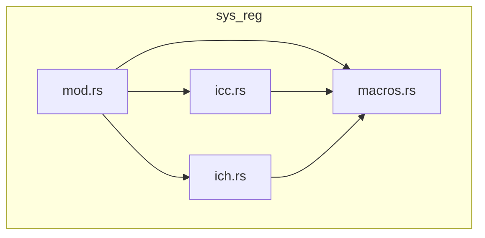
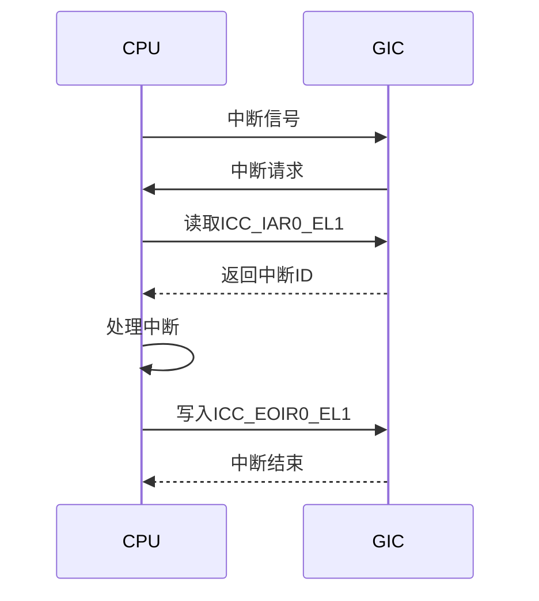
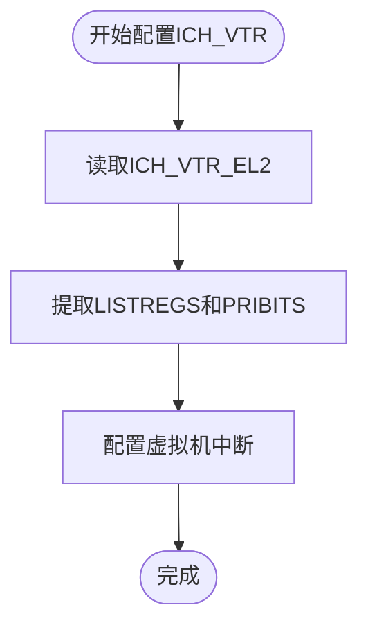
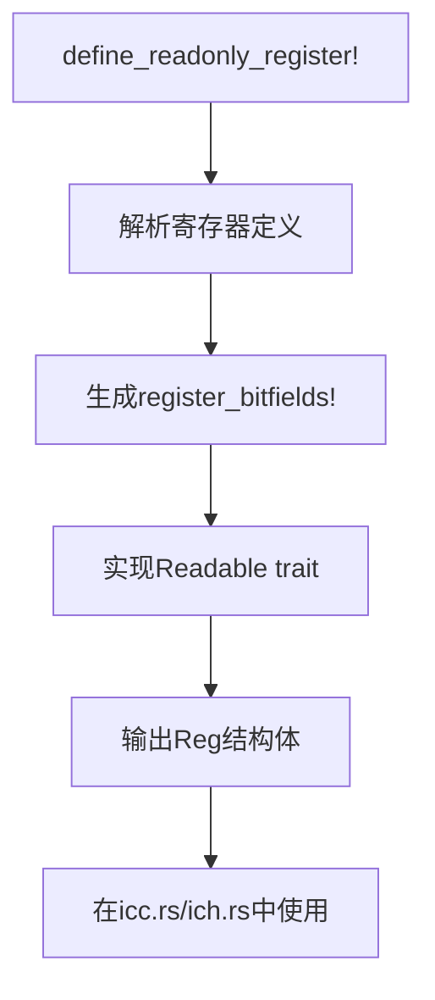
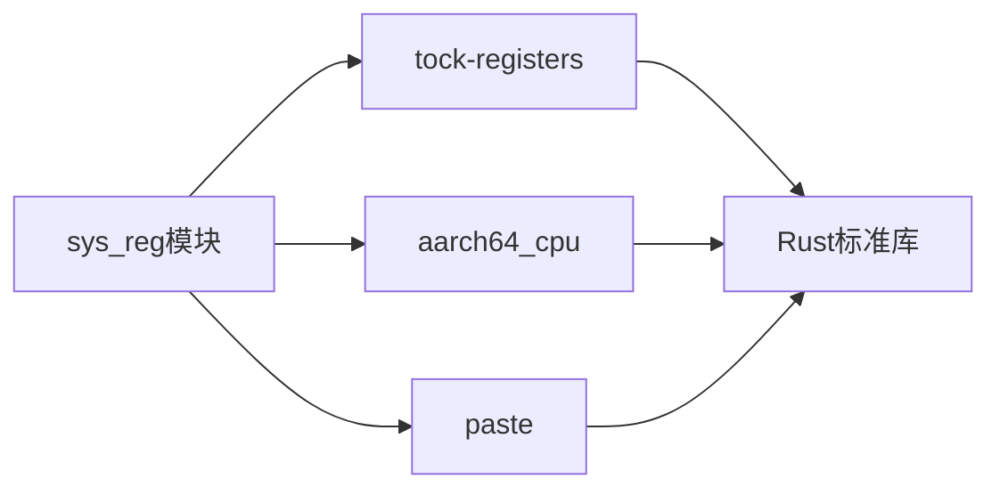

# 系统寄存器

<cite>
**Referenced Files in This Document**   
- [icc.rs](file://gic-driver/src/sys_reg/icc.rs)
- [ich.rs](file://gic-driver/src/sys_reg/ich.rs)
- [macros.rs](file://gic-driver/src/sys_reg/macros.rs)
- [mod.rs](file://gic-driver/src/sys_reg/mod.rs)
- [define.rs](file://gic-driver/src/define.rs)
- [lib.rs](file://gic-driver/src/lib.rs)
</cite>

## 目录
1. [简介](#简介)
2. [项目结构](#项目结构)
3. [核心组件](#核心组件)
4. [架构概述](#架构概述)
5. [详细组件分析](#详细组件分析)
6. [依赖分析](#依赖分析)
7. [性能考虑](#性能考虑)
8. [故障排除指南](#故障排除指南)
9. [结论](#结论)

## 简介
本文档详细介绍了ARM GICv3架构中的系统寄存器，重点阐述了ICC（中断控制器CPU接口）和ICH（中断控制器虚拟化接口）寄存器的结构与功能。文档解释了这些寄存器如何通过tock-registers库进行内存映射和安全访问，详细描述了每个寄存器字段的含义、读写权限和访问时机。同时，文档深入探讨了sys_reg模块如何利用宏和类型系统提供类型安全的寄存器访问，以防止常见的硬件编程错误。

## 项目结构
系统寄存器相关的代码主要位于`gic-driver/src/sys_reg`目录下，该目录通过模块化设计组织了不同类型的寄存器定义。主模块`mod.rs`负责聚合和重新导出ICC和ICH子模块，而`macros.rs`则提供了定义寄存器的核心宏。这种结构实现了关注点分离，使得寄存器定义清晰且易于维护。



**Diagram sources**
- [mod.rs](file://gic-driver/src/sys_reg/mod.rs#L1-L21)
- [icc.rs](file://gic-driver/src/sys_reg/icc.rs#L1-L253)
- [ich.rs](file://gic-driver/src/sys_reg/ich.rs#L1-L279)
- [macros.rs](file://gic-driver/src/sys_reg/macros.rs#L1-L151)

**Section sources**
- [mod.rs](file://gic-driver/src/sys_reg/mod.rs#L1-L21)
- [icc.rs](file://gic-driver/src/sys_reg/icc.rs#L1-L253)
- [ich.rs](file://gic-driver/src/sys_reg/ich.rs#L1-L279)

## 核心组件
核心组件包括ICC和ICH寄存器模块，它们分别处理CPU接口和虚拟化接口的系统寄存器。`macros.rs`中定义的宏（如`define_readonly_register!`、`define_readwrite_register!`）是构建这些寄存器类型的基础，确保了类型安全和内存安全的寄存器访问。`define.rs`文件提供了中断ID和触发类型的抽象，而`lib.rs`则定义了虚拟地址的封装。

**Section sources**
- [icc.rs](file://gic-driver/src/sys_reg/icc.rs#L1-L253)
- [ich.rs](file://gic-driver/src/sys_reg/ich.rs#L1-L279)
- [macros.rs](file://gic-driver/src/sys_reg/macros.rs#L1-L151)
- [define.rs](file://gic-driver/src/define.rs#L1-L317)
- [lib.rs](file://gic-driver/src/lib.rs#L1-L113)

## 架构概述
系统寄存器模块采用基于宏的元编程方法，将底层的ARM系统寄存器（如ICC_IAR0_EL1）抽象为Rust中的类型安全结构。通过`tock-registers`库，这些宏生成实现了`Readable`和`Writeable` trait的结构体，从而允许通过高级API进行寄存器的读写操作，避免了直接使用汇编指令的风险。

```mermaid
classDiagram
class define_readonly_register {
+define_readonly_register!()
}
class define_readwrite_register {
+define_readwrite_register!()
}
class ICC_IAR0_EL1 {
+get() u64
}
class ICH_VTR_EL2 {
+get() u64
}
define_readonly_register --> ICC_IAR0_EL1 : "生成"
define_readwrite_register --> ICH_VTR_EL2 : "生成"
ICC_IAR0_EL1 --> tock_registers : : interfaces : : Readable
ICH_VTR_EL2 --> tock_registers : : interfaces : : Readable
ICH_VTR_EL2 --> tock_registers : : interfaces : : Writeable
```

**Diagram sources**
- [macros.rs](file://gic-driver/src/sys_reg/macros.rs#L1-L151)
- [icc.rs](file://gic-driver/src/sys_reg/icc.rs#L94-L100)
- [ich.rs](file://gic-driver/src/sys_reg/ich.rs#L85-L95)

## 详细组件分析

### ICC寄存器分析
ICC寄存器用于CPU与GIC之间的直接通信。例如，`ICC_IAR0_EL1`是一个只读寄存器，用于获取最高优先级的待处理中断ID。当CPU需要处理中断时，会读取此寄存器以获取中断号，这会将中断状态从“待处理”变为“活跃”。相应的，`ICC_EOIR0_EL1`是一个只写寄存器，用于在中断处理完成后通知GIC，使中断退出“活跃”状态。



**Diagram sources**
- [icc.rs](file://gic-driver/src/sys_reg/icc.rs#L94-L116)

**Section sources**
- [icc.rs](file://gic-driver/src/sys_reg/icc.rs#L1-L253)

### ICH寄存器分析
ICH寄存器专为虚拟化环境设计，允许hypervisor管理虚拟中断。`ICH_VTR_EL2`是一个只读寄存器，它向hypervisor报告虚拟GIC的实现细节，如支持的列表寄存器数量（LISTREGS字段）和优先级位数（PRIBITS字段）。`ICH_HCR_EL2`是一个读写寄存器，用于控制虚拟GIC的行为，例如通过EN位全局启用虚拟CPU接口。

#### 虚拟化控制寄存器配置


**Diagram sources**
- [ich.rs](file://gic-driver/src/sys_reg/ich.rs#L85-L95)

**Section sources**
- [ich.rs](file://gic-driver/src/sys_reg/ich.rs#L1-L279)

### 宏系统分析
`macros.rs`中的宏是整个系统寄存器模块的基石。`define_readonly_register!`宏接受寄存器名和字段定义，生成一个包含`register_bitfields!`调用和`Readable` trait实现的模块。这确保了所有只读寄存器都有一致的接口。类似地，`define_readwrite_register!`为可读写寄存器生成代码。这种宏系统极大地减少了重复代码，并保证了类型安全。



**Diagram sources**
- [macros.rs](file://gic-driver/src/sys_reg/macros.rs#L1-L151)

**Section sources**
- [macros.rs](file://gic-driver/src/sys_reg/macros.rs#L1-L151)

## 依赖分析
系统寄存器模块依赖于`tock-registers`库来提供底层的寄存器访问接口和字段操作功能。`aarch64_cpu`库用于访问CPU特定的寄存器。`paste`宏库用于在`ich.rs`中生成一系列ICH_LR寄存器的模块。这些外部依赖通过Cargo.toml进行管理，确保了构建的可重复性。



**Diagram sources**
- [Cargo.toml](file://gic-driver/Cargo.toml#L1-L20)
- [ich.rs](file://gic-driver/src/sys_reg/ich.rs#L1-L10)

**Section sources**
- [ich.rs](file://gic-driver/src/sys_reg/ich.rs#L1-L10)
- [Cargo.toml](file://gic-driver/Cargo.toml#L1-L20)

## 性能考虑
直接通过系统寄存器访问硬件提供了最低的延迟，但频繁的寄存器访问可能成为性能瓶颈。`ICC_IAR`和`ICC_EOIR`的读写操作应尽可能高效，以减少中断处理时间。内存屏障的使用在多核环境中至关重要，以确保寄存器操作的顺序性。`tock-registers`库生成的内联函数有助于最小化函数调用开销。

## 故障排除指南
当遇到中断处理问题时，首先应检查`ICC_CTLR_EL1`寄存器的配置，确保中断组已启用。对于虚拟化环境，应验证`ICH_HCR_EL2`的EN位是否已设置。使用`ICC_HPPIR0_EL1`可以检查是否有高优先级中断挂起但未被处理。调试时，可以利用`ICC_PMR_EL1`临时屏蔽低优先级中断，以便专注于特定问题。

**Section sources**
- [icc.rs](file://gic-driver/src/sys_reg/icc.rs#L1-L253)
- [ich.rs](file://gic-driver/src/sys_reg/ich.rs#L1-L279)

## 结论
本文档全面分析了ARM GICv3系统寄存器的实现。通过利用Rust的宏系统和`tock-registers`库，该驱动程序实现了类型安全、内存安全且高效的寄存器访问。这种设计不仅防止了常见的硬件编程错误，还为上层软件提供了清晰、一致的API。对ICC和ICH寄存器的深入理解对于开发高性能、可靠的中断处理和虚拟化功能至关重要。