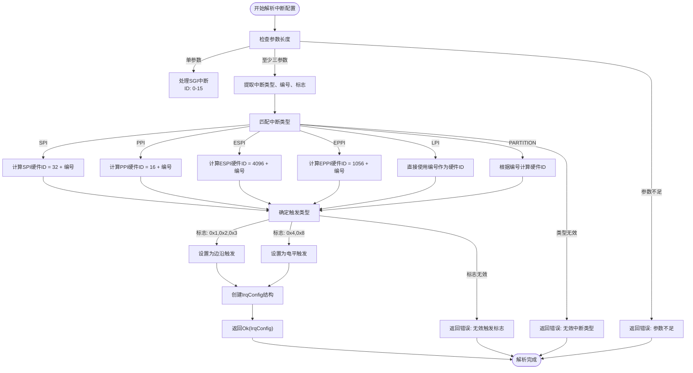
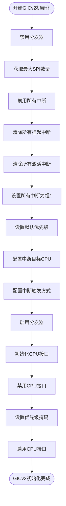
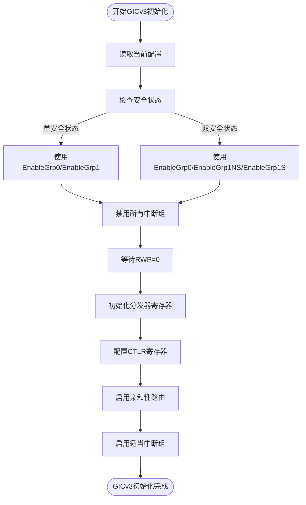

# 设备树集成

<cite>
**本文档引用的文件**  
- [define.rs](file://gic-driver/src/define.rs)
- [version/mod.rs](file://gic-driver/src/version/mod.rs)
- [version/rdif.rs](file://gic-driver/src/version/rdif.rs)
- [version/v2/mod.rs](file://gic-driver/src/version/v2/mod.rs)
- [version/v3/mod.rs](file://gic-driver/src/version/v3/mod.rs)
- [itest/test-gicv2/src/lib.rs](file://itest/test-gicv2/src/lib.rs)
</cite>

## 目录
1. [引言](#引言)
2. [设备树中断配置解析](#设备树中断配置解析)
3. [GIC设备树节点结构](#gic设备树节点结构)
4. [驱动初始化流程](#驱动初始化流程)
5. [不同平台的设备树配置差异](#不同平台的设备树配置差异)
6. [系统集成指导](#系统集成指导)
7. [结论](#结论)

## 引言
arm-gic-driver通过设备树（Device Tree）机制与硬件平台进行集成，实现对ARM通用中断控制器（GIC）的配置和管理。设备树作为一种描述硬件资源的数据结构，为驱动提供了GIC控制器的物理地址、中断类型、触发方式等关键信息。本文档详细说明驱动如何解析设备树中的中断配置信息，并将其转换为内部数据结构，确保驱动能够正确初始化和管理GIC控制器。

## 设备树中断配置解析
驱动通过`fdt_parse_irq_config`函数解析设备树中的中断配置信息。该函数根据ARM GIC设备树绑定规范，将设备树中断说明符（interrupt specifier）转换为驱动可用的`IrqConfig`内部数据结构。



**图示来源**
- [version/mod.rs](file://gic-driver/src/version/mod.rs#L46-L117)

**中断类型与硬件ID映射**
| 中断类型 | 设备树类型值 | 硬件ID计算方式 | 说明 |
| :--- | :--- | :--- | :--- |
| SGI | 单参数(0-15) | 直接使用 | 软件生成中断，用于处理器间通信 |
| SPI | 0 | 32 + 编号 | 共享外设中断，可路由到任意处理器 |
| PPI | 1 | 16 + 编号 | 私有外设中断，特定于单个处理器核心 |
| ESPI | 2 | 4096 + 编号 | 扩展共享外设中断 |
| EPPI | 3 | 1056 + 编号 | 扩展私有外设中断 |
| LPI | 4 | 直接使用编号 | 本地性特定外设中断 |
| PARTITION | 5 | 根据编号计算 | 分区PPI |

**中断触发标志**
| 标志值 | 触发类型 | 说明 |
| :--- | :--- | :--- |
| 0x1 | 边沿上升 | 信号从低到高变化时触发 |
| 0x2 | 边沿下降 | 信号从高到低变化时触发 |
| 0x3 | 双边沿 | 信号任意变化时触发 |
| 0x4 | 高电平 | 信号为高电平时持续触发 |
| 0x8 | 低电平 | 信号为低电平时持续触发 |

**本节来源**
- [version/mod.rs](file://gic-driver/src/version/mod.rs#L46-L117)
- [define.rs](file://gic-driver/src/define.rs)

## GIC设备树节点结构
GIC设备树节点包含驱动初始化所需的关键信息，包括兼容性属性、寄存器地址和中断父节点定义。

### 典型设备树片段
```dts
gic: interrupt-controller@8000000 {
    compatible = "arm,gic-v3";
    interrupt-controller;
    #address-cells = <2>;
    #size-cells = <2>;
    #interrupt-cells = <4>;
    ranges;
    
    reg = <0x0 0x8000000 0x0 0x10000>, /* Distributor */
          <0x0 0x8060000 0x0 0x20000>; /* Redistributor */
          
    interrupts = <1 9 0x4>;
};
```

### 节点属性说明
| 属性 | 说明 |
| :--- | :--- |
| `compatible` | 兼容性字符串，驱动通过此属性匹配设备。GICv2使用"arm,gic-400"等，GICv3使用"arm,gic-v3" |
| `reg` | 寄存器地址和大小，包含GICD（分发器）和GICR（重分发器）的基地址 |
| `#interrupt-cells` | 中断说明符的单元格数量，GICv2为3，GICv3为4 |
| `interrupt-controller` | 标记此节点为中断控制器 |
| `interrupts` | 用于连接到上级中断控制器的中断 |

**本节来源**
- [itest/test-gicv2/src/lib.rs](file://itest/test-gicv2/src/lib.rs#L42-L60)

## 驱动初始化流程
驱动根据设备树信息初始化GIC控制器，包括GICv2和GICv3两种版本的初始化流程。

### GICv2初始化流程


**图示来源**
- [version/v2/mod.rs](file://gic-driver/src/version/v2/mod.rs#L56-L102)

### GICv3初始化流程


**图示来源**
- [version/v3/mod.rs](file://gic-driver/src/version/v3/mod.rs#L298-L337)

**本节来源**
- [version/v2/mod.rs](file://gic-driver/src/version/v2/mod.rs#L56-L102)
- [version/v3/mod.rs](file://gic-driver/src/version/v3/mod.rs#L298-L337)

## 不同平台的设备树配置差异
不同平台（如QEMU模拟器和真实硬件）的设备树配置存在差异，这些差异会影响驱动的初始化过程。

### QEMU平台配置特点
- **地址空间**：通常使用固定的内存映射地址，如GICD在0x8000000，GICR在0x8060000
- **兼容性字符串**：可能使用"arm,gic-v3"或特定的QEMU兼容字符串
- **寄存器布局**：简化了某些高级特性，如LPI（本地性特定中断）

### 真实硬件平台配置特点
- **地址空间**：根据具体SoC设计，地址可能有所不同
- **兼容性字符串**：使用具体的芯片型号，如"arm,cortex-a53-gic" 
- **高级特性**：完整支持GICv3的所有特性，包括LPI、虚拟化等

### 配置差异对驱动的影响
| 差异点 | QEMU平台 | 真实硬件 | 对驱动的影响 |
| :--- | :--- | :--- | :--- |
| GIC版本 | 可能只支持GICv2 | 通常支持GICv3 | 驱动需要检测并选择正确的初始化路径 |
| 安全扩展 | 通常禁用 | 可能启用 | 影响CTLR寄存器的配置方式 |
| 虚拟化支持 | 可能不完整 | 完整支持 | 影响HCR寄存器的初始化 |
| LPI支持 | 可能不支持 | 支持 | 影响重分发器的初始化 |

**本节来源**
- [version/v3/gicd.rs](file://gic-driver/src/version/v3/gicd.rs#L557-L596)
- [version/v3/gicr.rs](file://gic-driver/src/version/v3/gicr.rs#L491-L510)

## 系统集成指导
为确保设备树配置与驱动期望相匹配，系统集成工程师应遵循以下指导原则。

### 设备树配置检查清单
- **兼容性字符串**：确保`compatible`属性与驱动支持的GIC版本匹配
- **寄存器地址**：验证`reg`属性中的地址与硬件手册一致
- **中断单元格**：GICv2使用3个单元格，GICv3使用4个单元格
- **安全配置**：根据系统安全需求正确配置安全扩展

### 常见问题排查
| 问题现象 | 可能原因 | 解决方案 |
| :--- | :--- | :--- |
| 驱动无法找到GIC节点 | 兼容性字符串不匹配 | 检查设备树中的compatible属性 |
| 中断无法正常工作 | 触发方式配置错误 | 验证中断标志是否正确设置 |
| 系统启动失败 | 寄存器地址错误 | 核对GICD和GICR的基地址 |
| 多核系统中断路由错误 | 目标CPU配置不当 | 检查ITARGETSR寄存器的配置 |

### 最佳实践
1. **版本匹配**：确保驱动版本与GIC硬件版本兼容
2. **地址验证**：在初始化前验证内存映射地址的正确性
3. **错误处理**：实现完善的错误处理机制，捕获设备树解析失败的情况
4. **日志记录**：在关键初始化步骤添加调试日志，便于问题排查

**本节来源**
- [version/rdif.rs](file://gic-driver/src/version/rdif.rs)
- [itest/test-gicv2/src/lib.rs](file://itest/test-gicv2/src/lib.rs)

## 结论
arm-gic-driver通过`fdt_parse_irq_config`等函数实现了与设备树的深度集成，能够正确解析中断配置信息并初始化GIC控制器。驱动支持GICv2和GICv3两种版本，能够适应不同平台的设备树配置差异。系统集成工程师应确保设备树配置与驱动期望相匹配，遵循最佳实践，以保证中断系统的稳定运行。