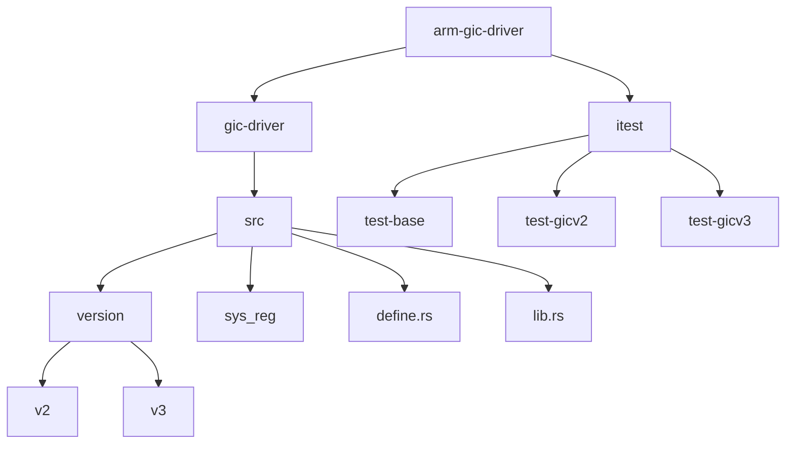
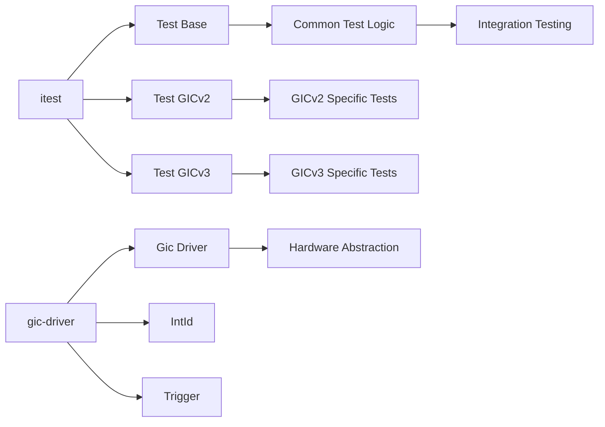

# 项目概述

<cite>
**本文档引用的文件**  
- [README.md](file://README.md)
- [gic-driver/Cargo.toml](file://gic-driver/Cargo.toml)
- [gic-driver/src/lib.rs](file://gic-driver/src/lib.rs)
- [gic-driver/src/define.rs](file://gic-driver/src/define.rs)
- [gic-driver/src/version/mod.rs](file://gic-driver/src/version/mod.rs)
- [gic-driver/src/version/v2/mod.rs](file://gic-driver/src/version/v2/mod.rs)
- [gic-driver/src/version/v3/mod.rs](file://gic-driver/src/version/v3/mod.rs)
- [itest/test-base/src/lib.rs](file://itest/test-base/src/lib.rs)
- [itest/test-gicv2/src/lib.rs](file://itest/test-gicv2/src/lib.rs)
- [itest/test-gicv3/src/lib.rs](file://itest/test-gicv3/src/lib.rs)
- [itest/test-base/src/test_suit/mod.rs](file://itest/test-base/src/test_suit/mod.rs)
- [itest/test-base/src/test_suit/ppi.rs](file://itest/test-base/src/test_suit/ppi.rs)
- [itest/test-base/src/test_suit/sgi.rs](file://itest/test-base/src/test_suit/sgi.rs)
</cite>

## 目录
1. [简介](#简介)
2. [项目结构](#项目结构)
3. [核心功能与用途](#核心功能与用途)
4. [设计目标](#设计目标)
5. [Rust生态系统集成](#rust生态系统集成)
6. [架构概览](#架构概览)
7. [主要特性](#主要特性)
8. [基本用法流程](#基本用法流程)
9. [测试套件分析](#测试套件分析)
10. [真实场景应用](#真实场景应用)

## 简介

arm-gic-driver 是一个为ARM通用中断控制器（GIC）设计的Rust驱动程序，专为裸机和操作系统内核环境而构建。该项目提供了一个安全、高效且类型安全的接口来管理ARM架构中的中断处理。GIC作为ARM系统中关键的中断管理单元，负责协调多个处理器核心之间的中断分发与处理。

该驱动支持GICv1、GICv2和GICv3等多个版本的硬件抽象，确保在不同ARM平台上具有良好的兼容性。通过使用Rust语言的安全特性，该项目实现了内存安全和零成本抽象，同时避免了对标准库的依赖（`#![no_std]`），使其非常适合嵌入式系统和操作系统开发。

**Section sources**
- [README.md](file://README.md#L1-L100)

## 项目结构

本项目的目录结构清晰地划分了驱动核心代码与测试代码。`gic-driver`目录包含驱动的主要实现，而`itest`目录则包含了针对不同GIC版本的测试套件。



**Diagram sources**
- [gic-driver/src/version/mod.rs](file://gic-driver/src/version/mod.rs#L1-L205)
- [gic-driver/src/lib.rs](file://gic-driver/src/lib.rs#L1-L112)

**Section sources**
- [gic-driver/src/lib.rs](file://gic-driver/src/lib.rs#L1-L112)
- [gic-driver/src/version/mod.rs](file://gic-driver/src/version/mod.rs#L1-L205)

## 核心功能与用途

arm-gic-driver的核心功能是为ARM架构的通用中断控制器提供一个安全、高效的软件接口。它在裸机和操作系统内核环境中扮演着至关重要的角色，负责管理中断的启用、禁用、优先级设置、目标CPU分配以及中断的确认与结束处理。

该驱动通过抽象GICv2和GICv3的硬件寄存器访问，提供了统一的编程接口。对于GICv2，驱动实现了对分发器（Distributor）和CPU接口（CPU Interface）的初始化与控制；对于GICv3，则进一步支持了重分发器（Redistributor）和系统寄存器接口。这种抽象使得开发者无需直接操作复杂的硬件寄存器，而是可以通过高级API进行中断管理。

在操作系统内核中，该驱动可用于实现中断服务例程（ISR）的注册与调度，支持多核环境下的中断负载均衡。在裸机环境中，它可以作为基础中断框架，为外设驱动提供中断处理能力。

**Section sources**
- [README.md](file://README.md#L1-L100)
- [gic-driver/src/version/v2/mod.rs](file://gic-driver/src/version/v2/mod.rs#L1-L799)
- [gic-driver/src/version/v3/mod.rs](file://gic-driver/src/version/v3/mod.rs#L1-L799)

## 设计目标

该项目的设计目标体现了现代系统编程的最佳实践，特别是在安全性和性能方面。首先，**内存安全**是通过Rust语言的所有权和借用机制实现的，避免了传统C/C++驱动中常见的缓冲区溢出和空指针解引用问题。

其次，**无标准库依赖**（`#![no_std]`）的设计使得该驱动可以在资源受限的嵌入式环境中运行，不依赖于操作系统的动态内存分配和运行时支持。这使得它非常适合用于操作系统内核或裸机程序的开发。

**类型安全**体现在对中断ID（IntId）和触发类型（Trigger）的强类型定义上。通过枚举和结构体封装，防止了非法的中断ID操作和错误的触发模式配置。最后，**零成本抽象**确保了高级API的使用不会带来额外的运行时开销，所有抽象都在编译期被优化为直接的硬件寄存器访问。

**Section sources**
- [README.md](file://README.md#L1-L100)
- [gic-driver/src/define.rs](file://gic-driver/src/define.rs#L1-L316)

## Rust生态系统集成

arm-gic-driver深度集成了Rust生态系统中的关键组件，以提高代码质量和可维护性。其中，`tock-registers`库被用于安全地访问内存映射的硬件寄存器，提供了类型安全的寄存器读写操作。`aarch64-cpu`库则提供了对AArch64架构特定寄存器和指令的访问，如MPIDR_EL1用于获取当前CPU的亲和性信息。

此外，项目还使用了`log`库进行调试信息输出，`bitflags`用于定义寄存器中的位字段，`enum_dispatch`用于实现高效的枚举分发。这些依赖共同构建了一个健壮且易于调试的驱动框架。`Cargo.toml`文件中明确列出了这些依赖及其版本，确保了构建的可重复性。

**Section sources**
- [gic-driver/Cargo.toml](file://gic-driver/Cargo.toml#L1-L26)
- [gic-driver/src/version/v3/mod.rs](file://gic-driver/src/version/v3/mod.rs#L1-L799)

## 架构概览

该项目的架构分为两个主要部分：`gic-driver`库和`itest`测试套件。`gic-driver`提供了核心的中断管理功能，而`itest`则验证了驱动在不同GIC版本下的正确性。



**Diagram sources**
- [gic-driver/src/lib.rs](file://gic-driver/src/lib.rs#L1-L112)
- [itest/test-base/src/lib.rs](file://itest/test-base/src/lib.rs#L1-L31)

**Section sources**
- [gic-driver/src/lib.rs](file://gic-driver/src/lib.rs#L1-L112)
- [itest/test-base/src/lib.rs](file://itest/test-base/src/lib.rs#L1-L31)

## 主要特性

arm-gic-driver具备多项关键特性，使其成为ARM中断管理的理想选择：

- **多版本支持**：兼容GICv1、GICv2和GICv3，确保在不同ARM平台上的一致性。
- **中断类型管理**：支持SGI（软件生成中断）、PPI（私有外设中断）和SPI（共享外设中断）的完整管理。
- **虚拟化支持**：通过GICH（Hypervisor Interface）寄存器支持虚拟化环境下的中断管理。
- **设备树集成**：提供`fdt_parse_irq_config`函数，可从设备树中解析中断配置。
- **安全初始化**：提供完整的GIC初始化流程，包括分发器和CPU接口的配置。
- **灵活的目标CPU设置**：支持将中断定向到特定CPU或CPU组。

这些特性使得该驱动不仅适用于简单的单核系统，也能满足复杂多核和虚拟化环境的需求。

**Section sources**
- [README.md](file://README.md#L1-L100)
- [gic-driver/src/version/mod.rs](file://gic-driver/src/version/mod.rs#L1-L205)

## 基本用法流程

根据README中的代码示例，使用arm-gic-driver的基本流程如下：首先创建Gic实例并初始化分发器，然后为当前CPU初始化CPU接口，最后通过TrapOp进行中断处理。

```rust
use arm_gic_driver::v3::*;

let mut gic = unsafe { Gic::new(0xF901_0000.into(), 0xF902_0000.into()) };
gic.init();

let mut cpu = gic.cpu_interface();
cpu.init_current_cpu().unwrap();

let trap = cpu.trap_operations();

let irq_id = IntId::ppi(14);
gic.set_irq_enable(irq_id, true);
gic.set_priority(irq_id, 0x80);

let ack = trap.ack1();
if !ack.is_special() {
    trap.eoi1(ack);
    if trap.eoi_mode() {
        trap.dir(ack);
    }
}
```

这一流程展示了如何安全地初始化GIC、启用特定中断并处理中断响应。`Send`和`Sync` trait的实现使得`TrapOp`可以在中断处理程序中作为静态值使用，便于在多核环境中共享。

**Section sources**
- [README.md](file://README.md#L1-L100)
- [gic-driver/src/version/v3/mod.rs](file://gic-driver/src/version/v3/mod.rs#L1-L799)

## 测试套件分析

`itest`目录包含了一套完整的测试框架，用于验证驱动在不同GIC版本下的行为。`test-base`提供了通用的测试基础设施，包括日志记录、内存映射和测试接口抽象。`test-gicv2`和`test-gicv3`则分别针对GICv2和GICv3实现了具体的测试用例。

测试用例涵盖了PPI（如定时器中断）和SGI的测试。通过`test_suit::ppi::test_irq`和`test_suit::sgi::test_to_current_cpu`等函数，验证了中断的启用、优先级设置、触发和处理的正确性。测试框架使用`spin::Mutex`和`Once`来管理共享状态，确保在多核环境下的线程安全。

**Section sources**
- [itest/test-base/src/lib.rs](file://itest/test-base/src/lib.rs#L1-L31)
- [itest/test-gicv2/src/lib.rs](file://itest/test-gicv2/src/lib.rs#L1-L154)
- [itest/test-gicv3/src/lib.rs](file://itest/test-gicv3/src/lib.rs#L1-L128)
- [itest/test-base/src/test_suit/ppi.rs](file://itest/test-base/src/test_suit/ppi.rs#L1-L145)
- [itest/test-base/src/test_suit/sgi.rs](file://itest/test-base/src/test_suit/sgi.rs#L1-L111)

## 真实场景应用

在真实场景中，arm-gic-driver可用于操作系统内核的中断子系统实现。例如，在ArceOS等Rust编写的操作系统中，该驱动可以作为中断管理的基础组件，负责处理来自定时器、串口、网络控制器等外设的中断。

在多核系统中，驱动的SGI功能可用于实现核间通信（IPI），如核间调度、缓存一致性维护等。通过设备树集成，驱动可以自动识别硬件平台上的中断配置，无需硬编码中断号。此外，虚拟化支持使得该驱动也能在KVM等虚拟化环境中使用，为虚拟机提供中断服务。

**Section sources**
- [README.md](file://README.md#L1-L100)
- [itest/test-gicv2/src/lib.rs](file://itest/test-gicv2/src/lib.rs#L1-L154)
- [itest/test-gicv3/src/lib.rs](file://itest/test-gicv3/src/lib.rs#L1-L128)