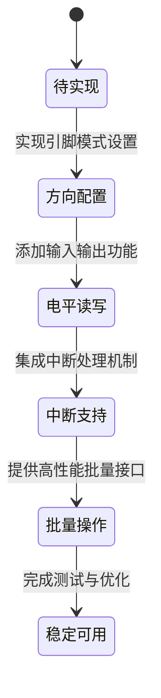

# 开发路线图

<cite>
**Referenced Files in This Document **  
- [lib.rs](file://src/lib.rs)
- [Cargo.toml](file://Cargo.toml)
</cite>

## 目录
1. [项目概述](#项目概述)  
2. [当前状态与核心目标](#当前状态与核心目标)  
3. [功能开发阶段规划](#功能开发阶段规划)  
4. [技术挑战分析](#技术挑战分析)  
5. [开发者参与指引](#开发者参与指引)  
6. [代码规范要求](#代码规范要求)  

## 项目概述

本项目旨在为 Phytium Pi 平台开发一个安全、高效且符合嵌入式系统标准的 GPIO 驱动程序。该驱动将作为 ArceOS 操作系统的一部分，提供对底层硬件引脚的抽象控制接口。项目采用 Rust 语言编写，确保内存安全和并发安全性，并遵循 `no-std` 环境下的编程实践。

**Section sources**  
- [lib.rs](file://src/lib.rs#L1-L4)

## 当前状态与核心目标

目前项目处于初始阶段，仅包含基础模块声明和一条 TODO 注释，尚未实现任何功能性 API 或运行时行为。核心目标是逐步构建完整的 GPIO 控制能力，最终形成稳定可用的驱动组件。

**Diagram sources**  
- [lib.rs](file://src/lib.rs#L3)

**Section sources**  
- [lib.rs](file://src/lib.rs#L3)

## 功能开发阶段规划

### 第一阶段：GPIO 引脚方向配置（输入/输出模式设置）

首要任务是实现对 GPIO 引脚工作模式的配置，即支持将指定引脚设置为输入或输出模式。此功能依赖于对 SoC 寄存器中方向控制位域的正确解析与写入。

**Section sources**  
- [lib.rs](file://src/lib.rs#L3)

### 第二阶段：数字电平读取与写入

在完成方向配置的基础上，实现对引脚电平状态的读取（input）和写入（output）。这包括从数据寄存器读取当前电平值以及向寄存器写入高/低电平信号。

**Section sources**  
- [lib.rs](file://src/lib.rs#L3)

### 第三阶段：中断支持机制

为支持事件驱动型应用，需添加中断注册与处理机制。允许用户为特定引脚配置上升沿、下降沿或双边沿触发条件，并在中断发生时调用回调函数。

**Section sources**  
- [lib.rs](file://src/lib.rs#L3)

### 第四阶段：批量操作接口

最后实现批量操作接口，允许多个引脚同时进行方向设置或电平变更，以减少寄存器访问次数，提升性能并降低延迟。

**Section sources**  
- [lib.rs](file://src/lib.rs#L3)

## 技术挑战分析

### 寄存器位域解析

Phytium Pi 的 GPIO 控制器通过多个内存映射寄存器管理引脚状态，每个寄存器包含多个位域（bitfield），分别对应不同功能（如方向、数据、中断使能等）。必须精确解析这些位域结构，避免误操作影响其他引脚。

### 原子操作保障

由于多线程环境下可能并发访问同一组寄存器，所有寄存器修改操作必须保证原子性。建议使用 `spin` 提供的互斥锁机制来保护共享资源。

### 中断向量注册

Rust 在 `no-std` 环境下不自动支持中断向量表注册，需手动对接平台级中断控制器。开发者需了解如何将 GPIO 中断号映射到全局中断向量，并注册相应的中断服务例程（ISR）。

**Section sources**  
- [Cargo.toml](file://Cargo.toml#L10-L14)
- [lib.rs](file://src/lib.rs#L1)

## 开发者参与指引

### 起始点：从 lib.rs 开始

所有开发应以 `src/lib.rs` 文件为核心入口。当前文件已标注 `#![no_std]` 属性，表明其运行于无操作系统环境。开发者应在该文件中定义主要结构体（如 `GpioPin`、`GpioPort`）及其方法。

### 使用 tock-registers 定义寄存器映射

推荐使用 `tock-registers` 库来声明和操作内存映射寄存器。通过宏定义（如 `register_bitfields!` 和 `register_structs!`）可清晰表达寄存器布局，并生成类型安全的访问方法。

### 利用 log 输出调试信息

尽管嵌入式环境通常缺乏标准输出设备，但仍可通过 `log` crate 输出调试日志。结合日志级别（info!、debug!、error!）有助于追踪驱动执行流程和排查问题。

**Section sources**  
- [lib.rs](file://src/lib.rs#L1-L4)
- [Cargo.toml](file://Cargo.toml#L10-L14)

## 代码规范要求

- **遵循 Rust 嵌入式编程最佳实践**：使用 `volatile` 访问寄存器，避免未定义行为。
- **保持 no-std 兼容性**：禁止使用 `std` 库中的动态分配、线程、文件系统等功能。
- **避免动态内存分配**：所有数据结构应在编译期确定大小，优先使用栈分配或静态分配。
- **确保异步安全**：若未来扩展支持异步操作，需确保所有 API 满足 `Send` 和 `Sync` 约束。
- **文档注释完整**：每个公共接口都应附带清晰的文档说明，包括参数含义、返回值及可能的错误情况。

**Section sources**  
- [lib.rs](file://src/lib.rs#L1)
- [Cargo.toml](file://Cargo.toml#L10-L14)