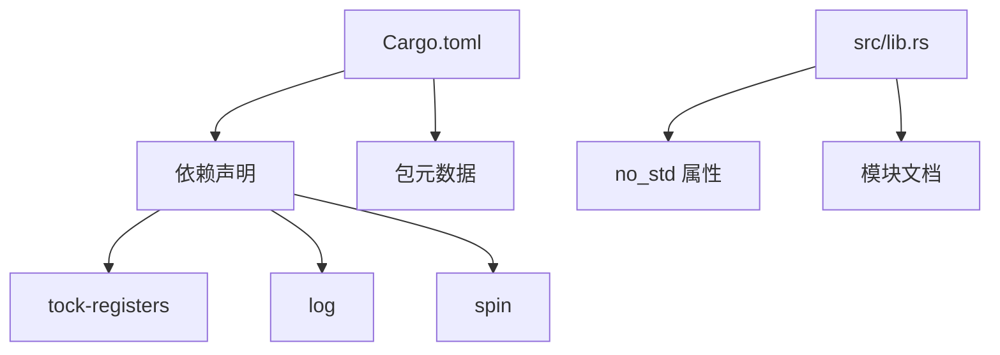
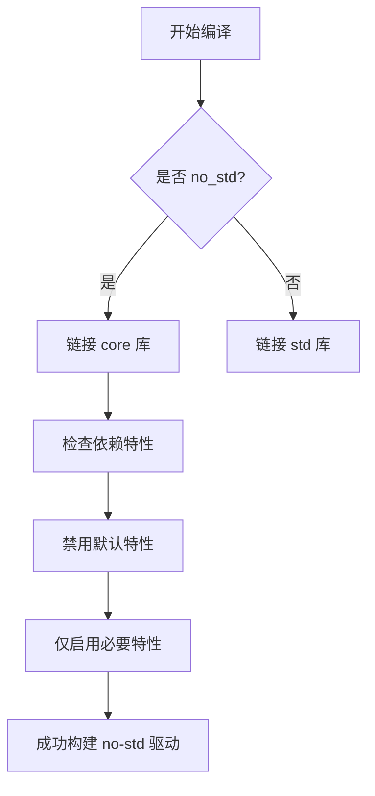
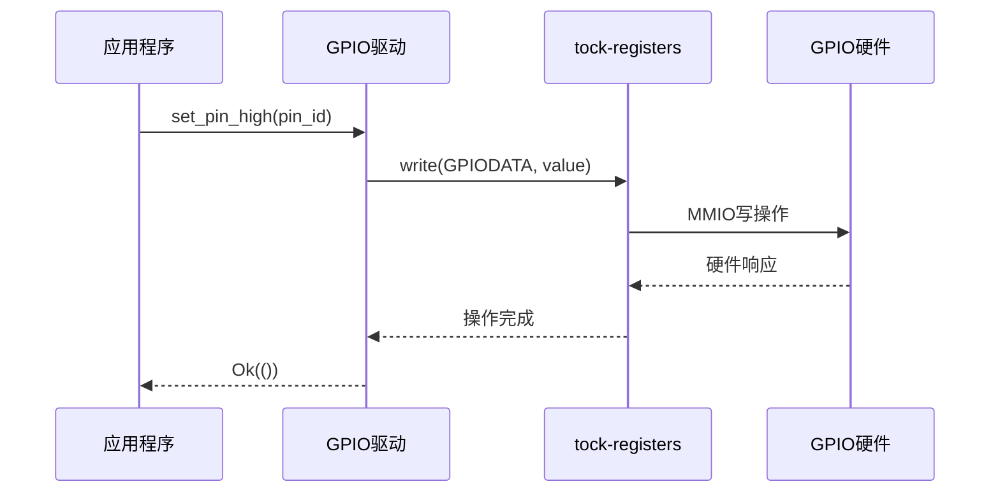

# 技术架构

<cite>
**本文档引用的文件**  
- [Cargo.toml](file://Cargo.toml)
- [lib.rs](file://src/lib.rs)
</cite>

## 目录
1. [引言](#引言)
2. [项目结构](#项目结构)
3. [核心依赖分析](#核心依赖分析)
4. [no-std 构建环境配置](#no-std-构建环境配置)
5. [设计范式与抽象层级](#设计范式与抽象层级)
6. [数据流路径预测](#数据流路径预测)
7. [扩展性与集成方式](#扩展性与集成方式)
8. [结论](#结论)

## 引言

本文件旨在深入剖析 `phytium-pi-gpio` 驱动库的技术架构设计，重点聚焦其作为嵌入式系统设备驱动的构建原理。尽管当前代码尚未实现具体功能，但通过分析其元信息和依赖结构，可清晰揭示其设计意图与技术选型逻辑。该驱动面向 Phytium Pi 平台，采用 Rust 语言开发，遵循 `no-std` 原则，适用于无操作系统或资源受限的嵌入式场景。

## 项目结构

该项目采用典型的 Rust 库结构，包含一个源码目录 `src` 和一个包管理配置文件 `Cargo.toml`。主模块文件为 `lib.rs`，位于 `src` 目录下，是整个驱动的功能入口点。`Cargo.toml` 定义了包的元数据、作者信息、许可证以及关键的外部依赖项。

**Diagram sources**
- [Cargo.toml](file://Cargo.toml)
- [lib.rs](file://src/lib.rs)

**Section sources**
- [Cargo.toml](file://Cargo.toml)
- [lib.rs](file://src/lib.rs)

## 核心依赖分析

### tock-registers：类型安全的寄存器访问

`tock-registers` 是一个专为嵌入式系统设计的库，提供编译时类型安全的硬件寄存器读写操作。它通过 Rust 的类型系统防止常见的寄存器访问错误，如误写只读位域或使用错误的数据宽度。在本项目中，其 `register_types` 特性被启用，表明将使用该库提供的基础寄存器类型（如 `ReadWrite`, `ReadOnly`, `WriteOnly`）来定义 GPIO 控制器的寄存器接口。

**Section sources**
- [Cargo.toml](file://Cargo.toml#L11)

### log：无标准库日志支持

`log` 库为 `no-std` 环境提供了灵活的日志记录框架。由于不启用默认特性，该项目避免了对标准库的依赖。实际的日志输出需由运行时环境中的日志门面（logger facade）实现。此依赖允许驱动在调试阶段输出诊断信息，同时保持核心代码的轻量化和可移植性。

**Section sources**
- [Cargo.toml](file://Cargo.toml#L12)

### spin：同步原语

`spin` 库提供了 `no-std` 兼容的同步机制，包括自旋锁（`SpinMutex`）和一次性初始化（`Once`）。`spin_mutex` 特性的启用意味着多线程或中断上下文下的临界区保护将通过自旋锁实现；而 `once` 特性则确保全局资源（如驱动实例或硬件句柄）的单次初始化，这对于静态分配的驱动对象至关重要。

**Section sources**
- [Cargo.toml](file://Cargo.toml#L13)

## no-std 构建环境配置

`Cargo.toml` 中所有依赖均禁用了默认特性（`default-features = false`），这是 `no-std` 项目的关键实践，以避免意外引入标准库依赖。主模块 `lib.rs` 明确标注了 `#![no_std]` 属性，指示编译器不链接标准库 `std`，而是使用精简的 `core` 库。这种配置使得驱动可以直接在裸机（bare-metal）环境中运行，满足嵌入式系统的严格要求。

**Diagram sources**
- [Cargo.toml](file://Cargo.toml)
- [lib.rs](file://src/lib.rs)

**Section sources**
- [Cargo.toml](file://Cargo.toml#L11-L13)
- [lib.rs](file://src/lib.rs#L0)

## 设计范式与抽象层级

当前架构体现了一种直接的**硬件抽象层**（HAL）设计范式。其目标是为 Phytium Pi 平台的 GPIO 硬件提供最接近寄存器层面的安全封装。未来可能的演进方向是将其重构为**模块化 GPIO 控制器**，即分离出通用的 GPIO 接口 trait，并为不同平台（如 Phytium Pi）提供具体实现，从而提升代码复用性和可测试性。目前的设计更侧重于快速适配特定硬件，而非建立广泛的抽象体系。

**Section sources**
- [lib.rs](file://src/lib.rs)

## 数据流路径预测

基于行业标准实践，可预测该驱动未来的数据流路径如下：

1. **应用请求**：上层应用调用驱动暴露的 API（如 `set_pin_high()`）。
2. **驱动接口**：驱动函数接收请求，进行参数验证和状态管理。
3. **寄存器操作**：利用 `tock-registers` 生成安全的内存映射 I/O 指令，读写 GPIO 控制器的特定寄存器。
4. **硬件响应**：GPIO 控制器根据寄存器状态改变引脚电平，完成物理操作。

此流程强调了从软件到硬件的逐层转换，其中 `tock-registers` 确保了底层操作的安全性，`spin` 保证了并发访问的正确性，`log` 提供了必要的可观测性。

**Diagram sources**
- [lib.rs](file://src/lib.rs)

## 扩展性与集成方式

当前架构中未设计插件或动态扩展机制，这符合嵌入式驱动通常静态链接的特点。其主要集成方式是通过 Cargo 依赖引用，即其他项目在 `Cargo.toml` 中添加 `phytium-pi-gpio` 作为依赖项。这种方式简单直接，便于版本管理和编译时优化，但牺牲了运行时灵活性。未来的模块化设计可能会引入 trait 对象或条件编译来支持更多变体。

**Section sources**
- [Cargo.toml](file://Cargo.toml)

## 结论

`phytium-pi-gpio` 项目通过精心选择的依赖栈（`tock-registers`, `log`, `spin`）和严格的 `no-std` 配置，构建了一个面向嵌入式环境的安全、高效且可移植的 GPIO 驱动框架。其当前设计聚焦于为特定平台提供直接的硬件抽象，虽缺乏高级扩展机制，但通过 Cargo 依赖实现了简洁的集成路径。随着功能的完善，向模块化控制器模式的演进将有助于提升其在 ArceOS 生态中的复用价值。