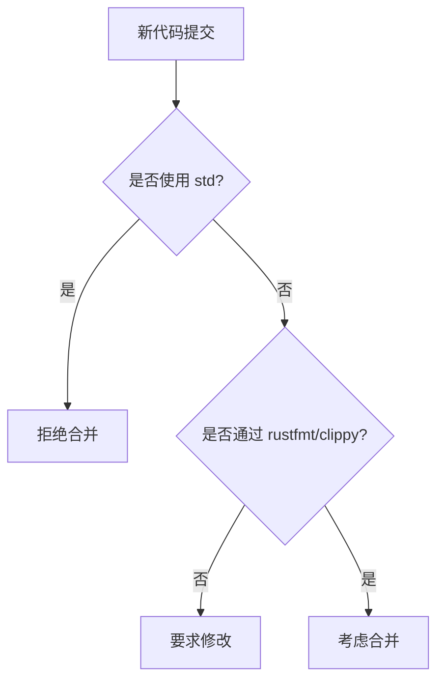

# 贡献指南

<cite>
**本文档引用的文件**
- [lib.rs](file://src/lib.rs)
- [Cargo.toml](file://Cargo.toml)
</cite>

## 目录
1. [简介](#简介)
2. [开发环境搭建](#开发环境搭建)
3. [代码风格与质量要求](#代码风格与质量要求)
4. [no-std 兼容性要求](#no-std-兼容性要求)
5. [文档与测试要求](#文档与测试要求)
6. [核心贡献方向：GPIO 驱动实现](#核心贡献方向gpio-驱动实现)
7. [依赖管理规范](#依赖管理规范)
8. [许可证要求](#许可证要求)

## 简介
本指南旨在为 `phytium-pi-gpio` 项目提供清晰的贡献指引。该项目是一个为 Phytium Pi 平台设计的 GPIO（通用输入输出）硬件驱动，属于 ArceOS 操作系统生态的一部分。我们欢迎社区开发者参与，共同完善此驱动功能。

**Section sources**
- [lib.rs](file://src/lib.rs#L1-L4)
- [Cargo.toml](file://Cargo.toml#L1-L5)

## 开发环境搭建
要开始贡献，请首先克隆仓库并配置 Rust 开发环境：
1. 克隆仓库：`git clone https://github.com/arceos-org/phytium-pi-gpio.git`
2. 安装 Rust 工具链（推荐使用 rustup）
3. 确保安装了 `rustfmt` 和 `clippy` 组件：`rustup component add rustfmt clippy`
4. 进入项目目录后，即可使用 `cargo build` 编译代码。

## 代码风格与质量要求
所有提交的代码必须遵循以下标准：
- **格式化**：使用 `rustfmt` 进行代码格式化。在提交前请运行 `cargo fmt --check` 确保符合规范。
- **静态检查**：通过 `clippy` 的 lint 检查。在提交前请运行 `cargo clippy -- -D warnings` 以发现潜在问题。

这些工具是保证代码库一致性和质量的关键。

## no-std 兼容性要求
本项目严格遵循 `no-std` 原则，即不依赖 Rust 标准库（`std`）。这是嵌入式和操作系统内核开发的基本要求。

从源码可见，模块已声明 `#![no_std]` 属性，并且依赖项均配置了 `default-features = false` 以禁用对 `std` 的依赖。贡献者**严禁**引入任何依赖或使用 `std` 库的功能。



**Diagram sources**
- [lib.rs](file://src/lib.rs#L1)
- [Cargo.toml](file://Cargo.toml#L10-L14)

**Section sources**
- [lib.rs](file://src/lib.rs#L1)
- [Cargo.toml](file://Cargo.toml#L10-L14)

## 文档与测试要求
为了确保代码的可维护性和可靠性，所有新增功能必须满足：
- **文档注释**：为公共（`pub`）结构体、枚举、函数和方法添加适当的文档注释（`///`），解释其用途和用法。
- **单元测试**：在适用的情况下，为关键逻辑编写单元测试（`#[cfg(test)]` 模块），验证功能正确性。

## 核心贡献方向：GPIO 驱动实现
当前项目最急需的贡献是完成 GPIO 驱动的核心功能。目前代码中仅有一个 TODO 注释，表明驱动尚未实现。

### 建议的实现步骤
1. **定义寄存器结构体**：根据 Phytium Pi 平台的技术手册，使用 `tock-registers` 库定义 GPIO 控制器的内存映射寄存器。
2. **实现基本引脚控制**：创建一个驱动结构体，并实现如 `set_pin_mode`, `set_pin_high`, `set_pin_low`, `read_pin` 等基础方法。
3. **集成日志与同步**：利用 `log` 库输出调试信息，并使用 `spin` 提供的 `Mutex` 或 `Once` 确保多线程安全访问。

```mermaid
classDiagram
class GpioDriver {
+set_pin_mode(pin : u8, mode : PinMode) Result<(), Error>
+set_pin_high(pin : u8) Result<(), Error>
+set_pin_low(pin : u8) Result<(), Error>
+read_pin(pin : u8) Result<bool, Error>
}
class PinMode {
<<enumeration>>
Input
Output
AltFunction(u8)
}
class RegisterBlock {
+MODER : ReadWrite<u32>
+OTYPER : ReadWrite<u32>
+OSPEEDR : ReadWrite<u32>
+PUPDR : ReadWrite<u32>
+IDR : ReadOnly<u32>
+ODR : ReadWrite<u32>
}
GpioDriver --> RegisterBlock : "controls"
note right of GpioDriver
使用 tock-registers 宏定义寄存器布局
end note
```

**Diagram sources**
- [lib.rs](file://src/lib.rs#L3)
- [Cargo.toml](file://Cargo.toml#L12)

**Section sources**
- [lib.rs](file://src/lib.rs#L3)

## 依赖管理规范
修改 `Cargo.toml` 文件时需格外谨慎：
- 所有依赖必须明确指定版本号。
- 新增依赖必须同样支持 `no-std`，并禁用默认特性（`default-features = false`）。
- 确保所选版本与 ArceOS 生态系统的其他组件兼容，避免版本冲突。

## 许可证要求
本项目采用 GPL-2.0 或 Apache-2.0 双许可模式。您的贡献将被视为同意按照这两个许可证的条款发布。在提交 Pull Request 时，即表示您授予项目维护者按此双许可分发您代码的权利。