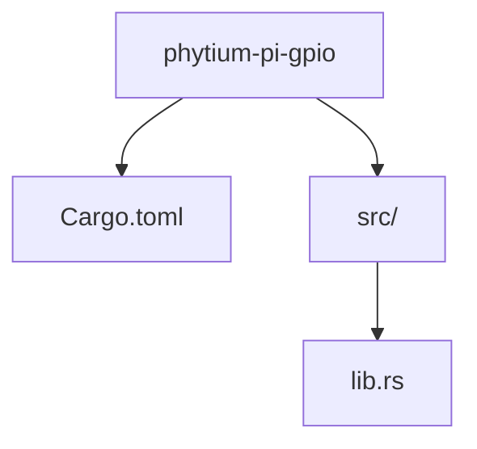
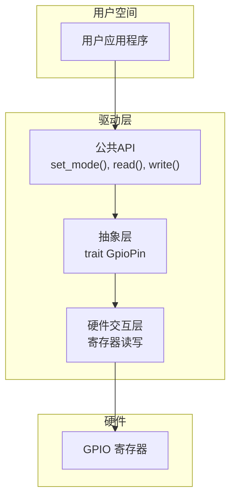
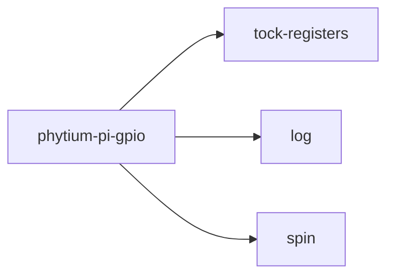

# 项目概述

<cite>
**本文档引用的文件**
- [lib.rs](file://src/lib.rs)
- [Cargo.toml](file://Cargo.toml)
</cite>

## 目录
1. [简介](#简介)
2. [项目结构](#项目结构)
3. [核心组件](#核心组件)
4. [架构概览](#架构概览)
5. [详细组件分析](#详细组件分析)
6. [依赖分析](#依赖分析)
7. [性能考量](#性能考量)
8. [故障排除指南](#故障排除指南)
9. [结论](#结论)

## 简介

`phytium-pi-gpio` 是一个专为 Phytium Pi 嵌入式平台设计的通用输入输出（GPIO）驱动库，采用 Rust 语言开发。该项目旨在为 Phytium Pi 提供安全、高效的硬件引脚控制能力，是构建底层嵌入式系统和设备驱动的重要组成部分。

本项目的一个关键特性是其 `no_std` 兼容性，这意味着它不依赖于 Rust 标准库，能够在资源受限的裸机环境或操作系统内核中运行。这种设计使其非常适合用于 ArceOS 等微内核操作系统中的设备驱动开发。

目前，该项目处于初期开发阶段。代码库主要包含基础的模块声明、依赖项配置以及明确的待办事项（TODO），尚未实现具体的 GPIO 控制功能。其核心设计理念是利用 `tock-registers` 库来实现对硬件寄存器的安全、原子访问，从而避免直接操作内存可能带来的未定义行为和数据竞争问题。

项目的元数据信息表明，它由“Phytium Pi Driver Team”维护，遵循 GPL-2.0 或 Apache-2.0 双许可证模式，鼓励开源社区的协作与共享。关键词如 "embedded"、"driver"、"gpio" 和 "no-std" 准确地描述了其技术领域和应用场景。

## 项目结构

`phytium-pi-gpio` 项目的结构极为简洁，体现了典型的 Rust 库项目布局。整个项目由两个核心文件构成：`Cargo.toml` 配置文件和位于 `src/` 目录下的 `lib.rs` 源文件。

这种扁平化的结构在项目初期非常常见，便于快速搭建框架。随着功能的逐步实现，预计未来会扩展出更多的模块，例如按功能划分的 `pin.rs`、`port.rs` 或 `interrupt.rs` 等。

**Diagram sources**
- [Cargo.toml](file://Cargo.toml#L1-L15)
- [lib.rs](file://src/lib.rs#L1-L4)

**Section sources**
- [Cargo.toml](file://Cargo.toml#L1-L15)
- [lib.rs](file://src/lib.rs#L1-L4)

## 核心组件

本项目的核心组件目前主要体现在其设计意图和基础配置上。`src/lib.rs` 文件通过 `#![no_std]` 属性声明了其无标准库的运行环境，这是所有嵌入式 Rust 开发的起点。该文件中的文档注释明确了其作为 Phytium Pi 平台 GPIO 驱动的定位。

`Cargo.toml` 文件则定义了项目的基本信息和外部依赖。其中，`tock-registers` 库是未来实现安全寄存器访问的关键，`log` 库将用于运行时日志记录，而 `spin` 库提供的自旋锁和 `Once` 类型对于管理全局状态和确保初始化过程的线程安全至关重要。

尽管具体功能代码尚不存在，但这些基础组件共同构成了项目未来的骨架。

**Section sources**
- [lib.rs](file://src/lib.rs#L1-L4)
- [Cargo.toml](file://Cargo.toml#L1-L15)

## 架构概览

从当前代码来看，`phytium-pi-gpio` 的预期架构是一个典型的分层驱动模型。顶层是面向用户的 API，负责提供简单易用的函数来设置引脚模式、读取电平或触发中断。中间层是抽象层，可能会定义 `GpioPin` 或 `GpioPort` 等 trait，以支持不同类型的 GPIO 操作。最底层是硬件交互层，它将直接使用 `tock-registers` 来读写特定于 Phytium Pi 芯片组的物理寄存器。

由于项目尚处早期，此架构目前仅存在于规划中，代码中尚未体现具体的类或模块关系。

**Diagram sources**
- [lib.rs](file://src/lib.rs#L1-L4)
- [Cargo.toml](file://Cargo.toml#L1-L15)

## 详细组件分析

### lib.rs 分析

`lib.rs` 文件是整个库的入口点。其内容虽然简短，但包含了至关重要的信息。

第一行 `#![no_std]` 是一个 crate 级别的属性，它告诉 Rust 编译器这个库不能链接到标准库（`std`）。这要求开发者手动提供如内存分配等基本功能，或者使用 `alloc` 库。这对于在没有完整操作系统的环境中运行代码是必需的。

第二行是一个文档注释 `//!`，它为整个 crate 提供描述，即“Phytium Pi platform 的 GPIO 驱动”。这是一个良好的实践，有助于其他开发者理解库的用途。

第三行是一个 TODO 注释，明确指出了项目当前的状态：完整的 GPIO 驱动功能有待实现。这为后续的开发工作提供了清晰的指引。

**Section sources**
- [lib.rs](file://src/lib.rs#L1-L4)

### Cargo.toml 分析

`Cargo.toml` 文件是 Rust 项目的清单文件，它包含了包的元数据和依赖关系。

在 `[package]` 部分，定义了包的名称、版本（0.1.0，符合初期开发阶段）、Rust 版本（2021 edition）、作者、描述、仓库地址、许可证以及关键词和分类。双许可证（GPL-2.0 OR Apache-2.0）为使用者提供了灵活的选择。

在 `[dependencies]` 部分，列出了三个关键依赖：
- `tock-registers`: 用于安全地生成和操作硬件寄存器的宏和类型。
- `log`: 一个日志门面（facade），允许库记录信息而不绑定到特定的日志实现。
- `spin`: 提供了在 `no_std` 环境下可用的同步原语，如自旋锁，这对于保护共享的硬件资源至关重要。

**Section sources**
- [Cargo.toml](file://Cargo.toml#L1-L15)

## 依赖分析

`phytium-pi-gpio` 项目目前有三个明确的外部依赖，它们都针对 `no_std` 环境进行了优化。

**Diagram sources**
- [Cargo.toml](file://Cargo.toml#L10-L14)

**Section sources**
- [Cargo.toml](file://Cargo.toml#L10-L14)

## 性能考量

作为一个底层硬件驱动，性能是核心关注点之一。`no_std` 环境本身就意味着低开销和确定性执行时间。使用 `tock-registers` 库可以保证寄存器访问的原子性和正确性，避免因竞态条件导致的性能下降或硬件故障。

`spin` 库提供的自旋锁在单核或临界区极短的场景下是高效的，但在多核系统中长时间持有锁可能会浪费 CPU 周期。因此，在未来的实现中，需要仔细评估锁的使用范围和持续时间。

## 故障排除指南

鉴于项目目前处于初始阶段，尚无实际可运行的代码，因此不存在已知的运行时错误或异常情况。主要的“问题”是功能缺失，这已在源码中的 TODO 注释中明确指出。

对于开发者而言，如果遇到编译错误，应首先检查是否正确设置了 `no_std` 环境，并确保所有依赖项都已正确安装且兼容。任何关于如何实现 GPIO 功能的疑问，都应回归到 Phytium Pi 平台的技术参考手册，以获取准确的寄存器映射和操作时序。

**Section sources**
- [lib.rs](file://src/lib.rs#L3-L4)

## 结论

`phytium-pi-gpio` 项目为 Phytium Pi 平台的 GPIO 功能提供了一个坚实且规范的开发起点。通过采用 Rust 语言和 `no_std` 设计，它具备了内存安全和高可靠性的先天优势。项目结构清晰，依赖选择恰当，为后续的功能开发奠定了良好的基础。

下一步的工作重点将是根据硬件规格书，利用 `tock-registers` 库实现对 GPIO 寄存器的具体读写操作，并逐步构建出一套完整、安全、易用的 API 接口。随着功能的完善，项目结构也将相应地进行模块化拆分。