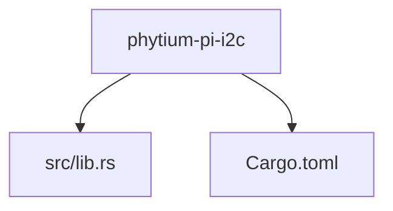
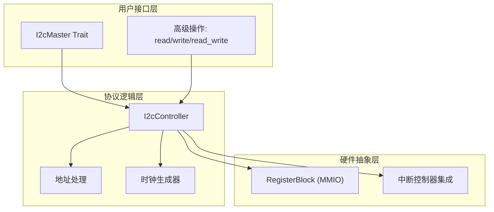
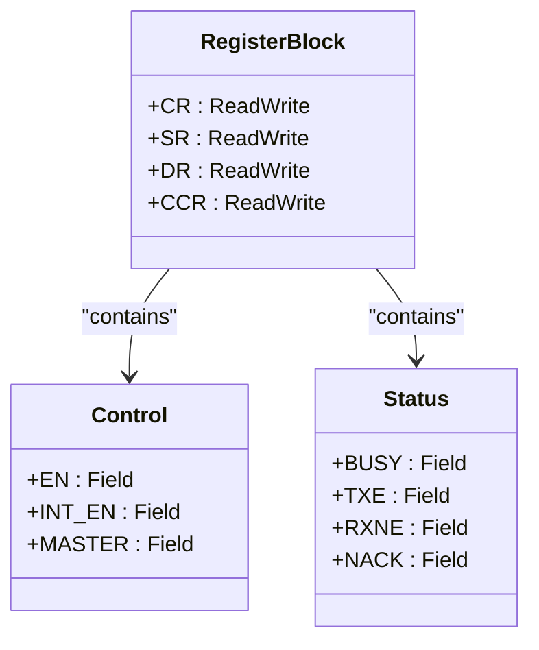
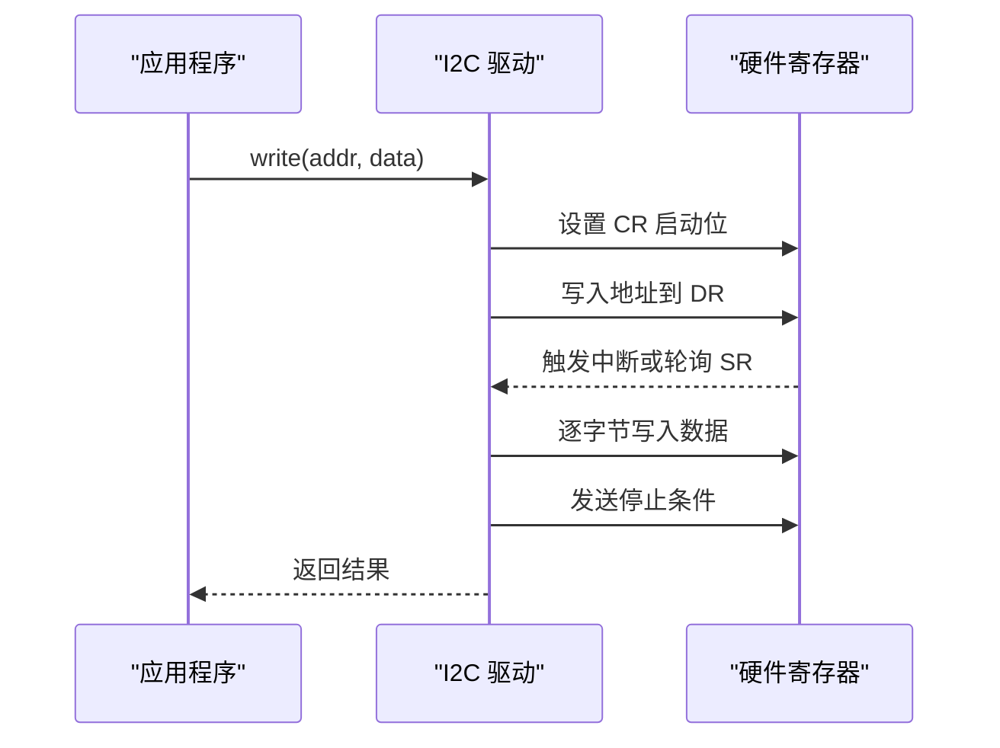
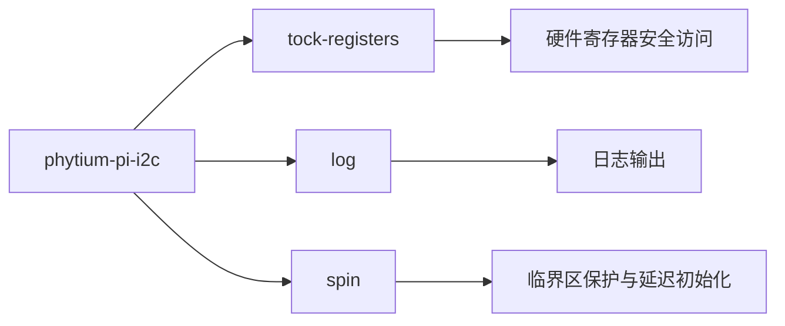

# 开发路线图

<cite>
**Referenced Files in This Document**   
- [lib.rs](file://src/lib.rs)
- [Cargo.toml](file://Cargo.toml)
</cite>

## 目录
1. [引言](#引言)
2. [项目结构](#项目结构)
3. [核心组件规划](#核心组件规划)
4. [架构设计展望](#架构设计展望)
5. [详细模块开发计划](#详细模块开发计划)
6. [依赖关系分析](#依赖关系分析)
7. [性能与安全性考量](#性能与安全性考量)
8. [错误处理与调试支持](#错误处理与调试支持)
9. [结论](#结论)

## 引言

本文档旨在为 `phytium-pi-i2c` 项目制定一份前瞻性的开发路线图，指导未来 I2C 驱动功能的完整实现。当前项目处于初始阶段，仅包含基础框架和一个明确的待办事项：“实现完整的 I2C 驱动功能”。本路线图将基于此目标，规划从寄存器抽象到高级特性的分阶段开发路径，并遵循 Rust 嵌入式开发的最佳实践，确保最终 API 的安全性与易用性。

## 项目结构

目前项目结构极为简洁，仅包含一个源文件 `lib.rs` 和配置文件 `Cargo.toml`。这种扁平化结构适合初期原型开发，但随着功能扩展，建议按模块化原则重构目录结构。

**Diagram sources**
- [lib.rs](file://src/lib.rs)
- [Cargo.toml](file://Cargo.toml)

**Section sources**
- [lib.rs](file://src/lib.rs)
- [Cargo.toml](file://Cargo.toml)

## 核心组件规划

根据 TODO 注释及嵌入式 I2C 驱动的通用需求，未来需实现的核心组件包括：
- **寄存器抽象层**：使用 `tock-registers` 库对硬件寄存器进行安全访问。
- **主模式读写逻辑**：实现标准的 I2C 主设备数据发送与接收流程。
- **时钟配置模块**：支持可编程的 SCL 时钟频率设置。
- **地址传输机制**：处理 7 位/10 位从机地址的格式化与传输。
- **中断处理支持**：集成中断驱动的数据传输与状态监控。
- **错误状态解析**：定义并解析总线错误、NACK、超时等异常情况。

这些组件将在后续章节中逐一展开说明。

**Section sources**
- [lib.rs](file://src/lib.rs#L3)

## 架构设计展望

未来的系统架构应采用分层设计思想，分离硬件抽象、协议逻辑与用户接口。

该架构支持未来扩展 DMA 支持或多主机竞争处理等高级特性。

**Diagram sources**
- [lib.rs](file://src/lib.rs)

## 详细模块开发计划

### 寄存器抽象层实现

首要任务是定义 I2C 控制器的内存映射寄存器块。应利用 `tock-registers` 提供的类型安全机制，创建对应的 `RegisterBlock` 结构体，涵盖控制寄存器（CR）、状态寄存器（SR）、数据寄存器（DR）、时钟分频寄存器（CCR）等关键部件。

#### 对于对象导向的寄存器建模：

**Diagram sources**
- [lib.rs](file://src/lib.rs)

**Section sources**
- [lib.rs](file://src/lib.rs)

### 基础读写操作实现

在完成寄存器抽象后，下一步是实现主模式下的基础通信功能。这包括启动条件生成、地址传输、数据收发以及停止条件的完整序列控制。

#### 对于 API 调用流程的可视化：

**Diagram sources**
- [lib.rs](file://src/lib.rs)

**Section sources**
- [lib.rs](file://src/lib.rs)

### 高级特性扩展

在基础功能稳定后，可逐步引入以下高级特性：

| 特性 | 描述 | 实现要点 |
|------|------|----------|
| DMA 支持 | 提高大数据量传输效率 | 集成 DMA 控制器通道，实现零拷贝传输 |
| 多主机竞争处理 | 支持多主设备环境 | 实现仲裁丢失检测与自动重试机制 |
| 动态时钟调整 | 自适应不同从设备速度要求 | 提供运行时 set_frequency 接口 |
| 超时保护 | 防止总线死锁 | 使用定时器监控每个操作阶段 |

**Section sources**
- [lib.rs](file://src/lib.rs)

## 依赖关系分析

当前项目的外部依赖清晰且精简，均为嵌入式 Rust 生态中的成熟库：

**Diagram sources**
- [Cargo.toml](file://Cargo.toml)

**Section sources**
- [Cargo.toml](file://Cargo.toml)

## 性能与安全性考量

作为运行在 `no_std` 环境下的驱动程序，必须兼顾性能与内存安全。所有对外暴露的 API 应通过 `unsafe` 边界进行严格封装，确保用户无法直接操作裸指针或未初始化内存。同时，应避免动态分配，优先使用栈上缓冲区或静态分配策略。

建议采用 `embedded-hal` 兼容的 trait 设计模式，提升与其他嵌入式组件的互操作性。对于并发访问，可通过 `spin::Mutex` 实现内部可变性保护。

**Section sources**
- [lib.rs](file://src/lib.rs)
- [Cargo.toml](file://Cargo.toml)

## 错误处理与调试支持

错误处理应建立统一的枚举类型，涵盖常见故障场景：

- `BusError`: 总线电气异常
- `NackReceived`: 从机拒绝应答
- `Timeout`: 操作超时
- `ArbitrationLost`: 多主机竞争失败
- `InvalidConfig`: 参数配置错误

结合 `log` 库，在关键路径插入调试信息输出，便于现场问题排查。所有错误码应具备可恢复性设计，允许上层应用决定重试或降级策略。

**Section sources**
- [lib.rs](file://src/lib.rs)

## 结论

尽管当前代码库尚为空白，但已确立了明确的发展方向。建议按照“寄存器抽象 → 基础通信 → 中断集成 → 高级特性”的渐进式路线推进开发。每一步都应伴随充分的单元测试与集成验证，确保代码质量。最终目标是打造一个符合 Rust 安全理念、高效可靠的 I2C 驱动，为 Phytium Pi 平台提供坚实的底层支持。