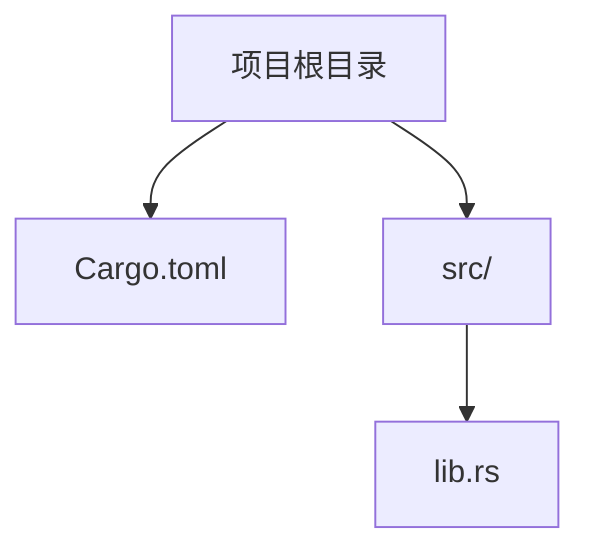

<cite>
**Referenced Files in This Document**   
- [Cargo.toml](file://Cargo.toml)
- [src/lib.rs](file://src/lib.rs)
</cite>

## 目录
1. [简介](#简介)
2. [项目结构](#项目结构)
3. [开发环境搭建](#开发环境搭建)
4. [代码风格与质量要求](#代码风格与质量要求)
5. [内存安全与并发安全实践](#内存安全与并发安全实践)
6. [贡献流程](#贡献流程)
7. [结论](#结论)

## 简介

本文档为开源贡献者提供参与 `phytium-pi-i2c` 项目开发的完整指导。该项目是一个针对 Phytium Pi 平台的 I2C 通信驱动程序，采用 Rust 语言编写，遵循嵌入式系统开发的最佳实践。文档涵盖从环境配置到代码提交的全流程，旨在帮助开发者快速上手并高效地为项目做出贡献。

## 项目结构

本项目采用标准的 Rust crate 结构，主要包含以下组件：

- `src/lib.rs`: 项目的主源码文件，目前仅包含基本模块声明和 TODO 提示。
- `Cargo.toml`: 项目的依赖管理和元数据配置文件，定义了包信息、许可证、关键词以及关键依赖项。

该结构简洁明了，符合 Rust 社区惯例，便于新贡献者理解和维护。

**Diagram sources**
- [Cargo.toml](file://Cargo.toml#L1-L15)
- [src/lib.rs](file://src/lib.rs#L1-L5)

**Section sources**
- [Cargo.toml](file://Cargo.toml#L1-L15)
- [src/lib.rs](file://src/lib.rs#L1-L5)

## 开发环境搭建

为了参与本项目的开发，您需要配置一个支持嵌入式目标平台的 Rust 开发环境。

首先，确保已安装最新稳定版的 Rust 工具链（推荐使用 rustup 进行管理）。随后，添加适用于目标架构的交叉编译 target。由于本项目运行于无标准库（`no_std`）环境中，需确认所选 target 支持裸机或嵌入式场景。

接下来，通过 `xbuild` 工具进行构建，它能够自动处理 `no_std` crate 的编译需求。基本构建命令如下：
- `cargo xbuild --target <your-target.json>`：执行交叉编译
- `cargo xbuild --release --target <your-target.json>`：生成优化后的发布版本

具体的 target 配置文件（如 `target.json`）应根据 Phytium Pi 平台的硬件特性进行定制，包括 CPU 架构、ABI、链接脚本等参数。

**Section sources**
- [Cargo.toml](file://Cargo.toml#L1-L15)
- [src/lib.rs](file://src/lib.rs#L1-L5)

## 代码风格与质量要求

所有贡献必须严格遵守 Rust 官方代码风格规范。请在提交前使用 `rustfmt` 自动格式化代码，确保代码布局一致性和可读性。

静态检查是保证代码质量的重要环节。务必运行 `clippy` 工具以发现潜在的逻辑错误、性能问题和不良编码习惯。建议将 `clippy` 集成到 CI 流程中，作为合并请求的前提条件。

此外，每个公共 API 接口都应附带完整的文档注释（doc comments），并通过 `cargo doc` 生成可浏览的文档。对于核心功能，还应提供充分的单元测试，验证其正确性和边界行为。

尽管当前代码库尚处于初期阶段，但未来实现将严格遵循这些标准。

**Section sources**
- [Cargo.toml](file://Cargo.toml#L1-L15)
- [src/lib.rs](file://src/lib.rs#L1-L5)

## 内存安全与并发安全实践

作为运行在资源受限环境下的驱动程序，内存安全和并发安全至关重要。本项目通过采用 Rust 的所有权系统和类型安全机制，从根本上避免常见的内存错误。

项目依赖的关键库提供了额外的安全保障：
- `tock-registers`：用于安全地访问硬件寄存器，防止误操作导致的设备异常。
- `spin`：提供轻量级的自旋锁（spinlock）和一次性初始化原语（Once），适用于 `no_std` 环境下的同步控制。

在实现新功能时，应优先利用这些库提供的抽象接口，而非直接操作底层资源。例如，在多线程访问共享状态时，应使用 `spin::Mutex` 来保护临界区；在读写设备寄存器时，应使用 `tock-registers` 定义的寄存器结构体。

**Section sources**
- [Cargo.toml](file://Cargo.toml#L10-L14)

## 贡献流程

我们鼓励社区协作，并遵循标准的开源贡献流程：

1. **创建议题（Issue）**：在提出新功能或修复 bug 前，请先在 GitHub 仓库中创建 issue，描述问题背景和解决方案思路，以便获得反馈。
2. **分支开发**：基于主分支创建新特性分支进行开发。
3. **提交拉取请求（PR）**：完成开发后，提交 PR 并填写详细的变更说明。
4. **代码审查**：维护者和其他贡献者将对代码进行审查，提出改进建议。
5. **持续集成验证**：CI 系统会自动运行格式化检查、静态分析、构建测试等任务，确保代码质量。
6. **合并与发布**：通过审查且 CI 通过后，PR 将被合并至主分支。

此流程确保了代码质量和项目稳定性，同时促进了知识共享和技术讨论。

## 结论

虽然当前项目代码较为简单，仅包含基础框架和 TODO 注释，但其设计原则和依赖选择体现了对嵌入式 Rust 开发最佳实践的遵循。随着功能逐步实现，上述指南将成为保障代码质量、安全性和可维护性的基石。欢迎广大开发者依据本文档参与贡献，共同推进 Phytium Pi 平台的生态建设。