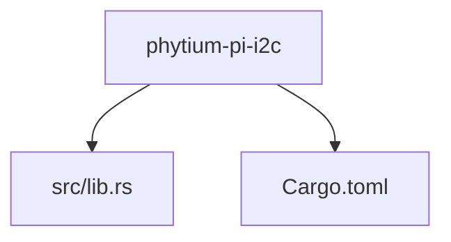
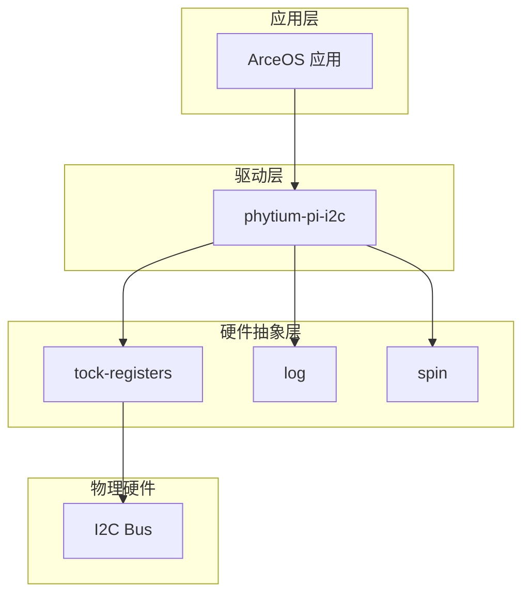
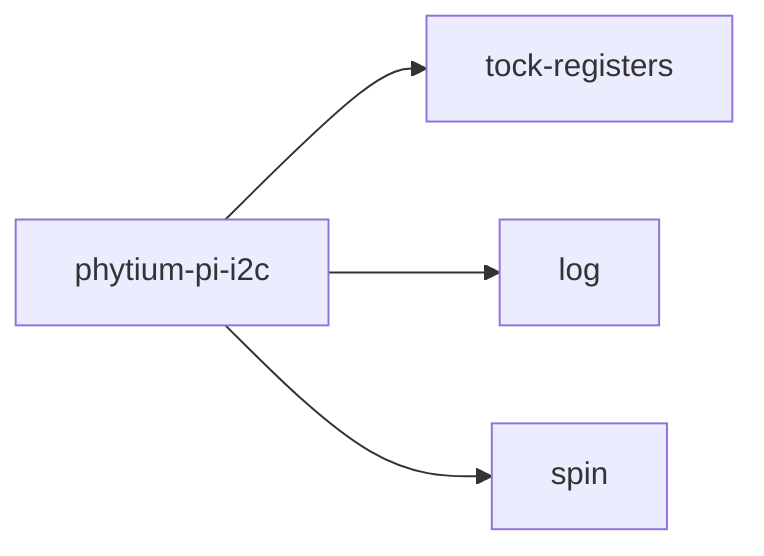

# 项目概述

<cite>
**本文档引用的文件**
- [lib.rs](file://src/lib.rs)
- [Cargo.toml](file://Cargo.toml)
</cite>

## 目录
1. [简介](#简介)
2. [项目结构](#项目结构)
3. [核心组件](#核心组件)
4. [架构概览](#架构概览)
5. [详细组件分析](#详细组件分析)
6. [依赖分析](#依赖分析)
7. [性能考量](#性能考量)
8. [故障排除指南](#故障排除指南)
9. [结论](#结论)

## 简介

`phytium-pi-i2c` 是一个专为 Phytium Pi 平台设计的 I2C 通信驱动程序，旨在为嵌入式系统中的硬件级 I2C 总线通信提供安全、可靠的软件支持。该项目是 ArceOS 操作系统生态的一部分，专注于在无标准库（`no_std`）环境下运行，以适应资源受限的嵌入式设备需求。

当前代码库处于初始开发阶段，仅包含基础框架结构，尚未实现具体的 I2C 功能逻辑。未来预期将逐步完善寄存器配置、数据读写操作以及错误处理机制等功能模块。本项目采用双许可证模式（GPL-2.0 或 Apache-2.0），鼓励社区协作与开源贡献。

## 项目结构

该项目采用典型的 Rust 驱动库结构，组织清晰且易于扩展：

```
.
├── src
│   └── lib.rs          # 核心驱动模块入口
└── Cargo.toml          # 项目元信息与依赖管理
```

源码位于 `src/` 目录下，主文件 `lib.rs` 定义了整个驱动的基础属性和编译特性。`Cargo.toml` 文件则声明了项目的名称、版本、作者信息、许可证类型及外部依赖项。



**Diagram sources**
- [Cargo.toml](file://Cargo.toml#L1-L14)
- [lib.rs](file://src/lib.rs#L1-L5)

**Section sources**
- [Cargo.toml](file://Cargo.toml#L1-L14)
- [lib.rs](file://src/lib.rs#L1-L5)

## 核心组件

`phytium-pi-i2c` 的核心职责是作为 Phytium Pi 平台上 I2C 总线的底层驱动接口。其主要目标包括：

- 在 `no_std` 环境中提供稳定的 I2C 通信能力
- 封装硬件寄存器访问逻辑，确保内存安全
- 支持同步 I2C 数据传输（读/写）
- 提供可扩展的错误检测与恢复机制

目前该驱动仍处于框架搭建阶段，实际功能尚未实现，所有具体操作均需后续开发完成。

**Section sources**
- [lib.rs](file://src/lib.rs#L1-L5)

## 架构概览

该驱动遵循 Rust 嵌入式生态系统常见的分层设计原则，整体架构简洁明了：



**Diagram sources**
- [Cargo.toml](file://Cargo.toml#L10-L13)
- [lib.rs](file://src/lib.rs#L1-L5)

## 详细组件分析

### 主模块分析

`lib.rs` 是整个驱动的核心入口文件，通过 `#![no_std]` 属性明确指示该库不依赖于 Rust 标准库，适用于裸机或操作系统内核环境。文件中包含简要的文档注释，说明其用途为“I2C communication driver for Phytium Pi platform”。

目前该文件仅包含占位符注释 `// TODO: 实现完整的 I2C 驱动功能`，表明功能实现尚待开发。

#### 对象模型概览
由于当前未定义任何结构体或枚举类型，暂无具体类图可展示。

[无具体代码结构，暂不生成类图]

[无具体实现内容，暂不添加 Diagram sources]

**Section sources**
- [lib.rs](file://src/lib.rs#L1-L5)

## 依赖分析

本项目依赖以下关键第三方库：

- `tock-registers`: 用于安全地访问和操作硬件寄存器
- `log`: 提供日志输出接口，便于调试和运行时追踪
- `spin`: 提供自旋锁和一次性初始化原语，适用于 `no_std` 环境下的并发控制

这些依赖均禁用了默认功能特性，并启用了适合嵌入式环境的轻量级选项，体现了对资源效率的高度重视。



**Diagram sources**
- [Cargo.toml](file://Cargo.toml#L10-L13)

**Section sources**
- [Cargo.toml](file://Cargo.toml#L10-L13)

## 性能考量

由于当前代码仅为框架结构，尚未涉及具体性能优化策略。但基于所选依赖和技术栈，可以预见以下性能优势：

- 使用 `no_std` 减少运行时开销
- `spin` 提供低延迟的同步机制
- `tock-registers` 确保零成本抽象的寄存器访问

未来在实现数据传输逻辑时，应重点关注中断处理、DMA 支持和时序精度等关键性能指标。

## 故障排除指南

当前阶段尚无运行时错误或异常处理逻辑。开发者应注意：

- 确保目标平台支持 Phytium Pi 的 I2C 寄存器布局
- 在启用日志前正确配置全局 logger
- 注意自旋锁在长时间阻塞场景下的适用性限制

建议在后续开发中引入详细的错误枚举类型和诊断信息输出机制。

**Section sources**
- [lib.rs](file://src/lib.rs#L1-L5)
- [Cargo.toml](file://Cargo.toml#L10-L13)

## 结论

`phytium-pi-i2c` 项目是一个面向 Phytium Pi 平台的嵌入式 I2C 驱动框架，目前处于初期开发阶段。其设计充分考虑了 `no_std` 环境下的安全性与效率，依托 ArceOS 生态构建可靠硬件支持。尽管当前功能尚未实现，但已具备清晰的技术路线和合理的依赖结构，为后续开发奠定了坚实基础。建议下一步优先实现寄存器映射与基本读写功能，并配套编写单元测试与集成测试用例。