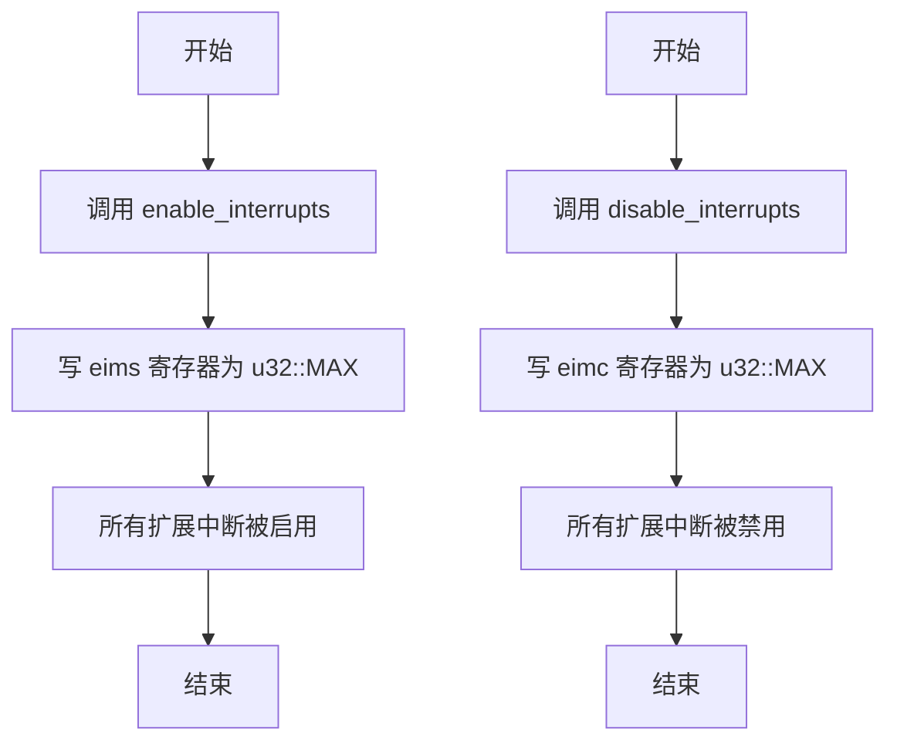
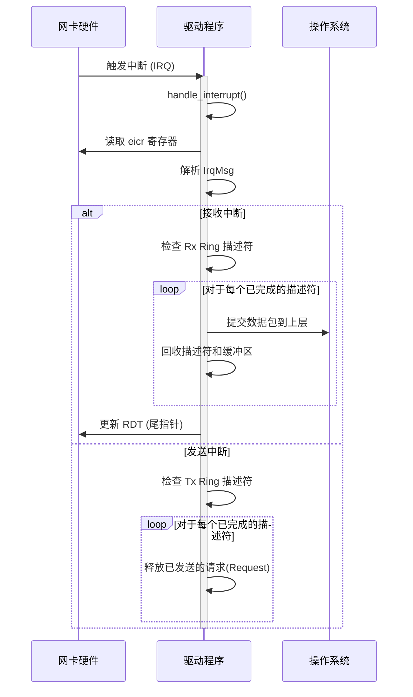

# 中断处理

<cite>
**Referenced Files in This Document **   
- [mac.rs](file://igb/src/mac.rs)
- [lib.rs](file://igb/src/lib.rs)
- [ring/mod.rs](file://igb/src/ring/mod.rs)
- [ring/rx.rs](file://igb/src/ring/rx.rs)
- [ring/tx.rs](file://igb/src/ring/tx.rs)
- [descriptor.rs](file://igb/src/descriptor.rs)
</cite>

## 目录
1. [中断机制概述](#中断机制概述)
2. [寄存器配置与中断模式设置](#寄存器配置与中断模式设置)
3. [中断处理函数分析](#中断处理函数分析)
4. [中断上下文约束与安全考量](#中断上下文约束与安全考量)
5. [中断与环形缓冲区联动机制](#中断与环形缓冲区联动机制)
6. [中断驱动模式与轮询模式对比](#中断驱动模式与轮询模式对比)

## 中断机制概述

Intel IGB以太网驱动程序采用基于硬件中断的事件响应机制，通过PCIe设备的中断信号通知CPU网络数据包的到达或发送完成。该机制的核心是中断向量的读取、中断源的识别以及相应的资源清理操作。当网卡硬件检测到特定事件（如接收队列有新数据包、发送描述符写回等）时，会触发中断信号，驱动程序通过`handle_interrupt`函数响应并处理这些事件。

**Section sources**
- [lib.rs](file://igb/src/lib.rs#L150-L178)
- [mac.rs](file://igb/src/mac.rs#L200-L250)

## 寄存器配置与中断模式设置

### 中断使能与禁用

驱动通过`mac.rs`文件中的寄存器映射结构`MacRegister`来配置中断。关键寄存器包括：
- `ims` (Interrupt Mask Set/Read): 用于启用特定类型的中断。
- `imc` (Interrupt Mask Clear): 用于禁用中断。
- `eims` 和 `eimc`: 扩展中断掩码寄存器，用于管理多队列中断。

`enable_interrupts`和`disable_interrupts`方法通过向`eims`和`eimc`寄存器写入全1值来批量启用或禁用所有扩展中断。



**Diagram sources **
- [mac.rs](file://igb/src/mac.rs#L200-L210)

### 中断模式配置

驱动支持配置不同的中断模式，主要通过`GPIE` (General Purpose Interrupt Enable) 寄存器实现。`irq_mode_legacy`方法在`lib.rs`中调用`configure_legacy_mode`，将`GPIE`寄存器配置为传统单向量模式。

```mermaid
classDiagram
class Mac {
+configure_legacy_mode()
+configure_msix_mode()
+set_nsicr(enable : bool)
+set_ll_interval(interval : u8)
}
Mac --> "uses" GPIE : 配置中断模式
GPIE : Multiple_MSIX : : SingleVector
GPIE : EIAME : : Disabled
GPIE : PBA_Support : : Legacy
```

**Diagram sources **
- [lib.rs](file://igb/src/lib.rs#L175-L178)
- [mac.rs](file://igb/src/mac.rs#L350-L370)

## 中断处理函数分析

### handle_interrupt 方法实现

`unsafe fn handle_interrupt`方法是整个中断处理流程的核心入口点，定义于`lib.rs`文件中。其逻辑如下：

1.  **ACK中断**: 调用`self.mac.interrupts_ack()`读取并清除中断状态。
2.  **解析中断源**: 解析返回的`IrqMsg`结构体，确定中断来源。
3.  **处理队列中断**: 根据`queue_idx`判断哪个接收/发送队列产生了中断，并进行相应处理。

目前代码中的处理逻辑是示意性的，注释掉的部分表明了未来需要实现的功能：识别出具体队列后，应调用对应`RxRing`的`clean`方法来处理接收到的数据包。

**Section sources**
- [lib.rs](file://igb/src/lib.rs#L150-L160)

### interrupts_ack 方法实现

`interrupts_ack`方法位于`mac.rs`中，负责读取中断向量并进行确认（ACK）。它通过以下步骤工作：
1.  读取`eicr` (Extended Interrupt Cause Register) 获取中断原因。
2.  读取`eims` (Extended Interrupt Mask Set/Read) 获取当前启用的中断掩码。
3.  将两者进行按位与运算，得到实际发生的、且未被屏蔽的中断状态。
4.  返回一个包含`queue_idx`、`tcp_timer`和`other`标志的`IrqMsg`结构体。

此方法确保了只有被启用的中断才会被报告给上层处理函数。

**Section sources**
- [mac.rs](file://igb/src/mac.rs#L240-L250)

## 中断上下文约束与安全考量

### unsafe 关键字的原因

`handle_interrupt`方法被标记为`unsafe`，主要原因如下：
1.  **调用者责任**: 该函数只能从真正的硬件中断处理程序中调用。如果从普通线程或错误的上下文中调用，可能会导致系统不稳定或数据竞争。
2.  **直接内存访问**: 函数内部直接访问和修改了硬件寄存器和环形缓冲区，这绕过了Rust的所有权和借用检查，必须由程序员保证其安全性。
3.  **并发风险**: 中断处理可能与其他CPU核心上的驱动操作并发执行，需要额外的同步机制来保护共享资源。

### 调用者需承担的责任

调用`handle_interrupt`的中断服务例程（ISR）必须确保：
- 在正确的中断上下文中执行。
- 不持有任何可能导致死锁的锁。
- 尽快完成处理，避免长时间占用中断线程。

## 中断与环形缓冲区联动机制

### 硬件触发流程

1.  **接收路径**: 当网卡物理层接收到一个完整的数据包后，DMA引擎会将其写入预先分配好的内存缓冲区，并更新对应的接收描述符（`AdvRxDesc`）的状态为“已完成”（DD bit set）。
2.  **发送路径**: 当CPU将待发送的数据包信息写入发送描述符环形队列（Tx Ring）并更新尾指针（TDT）后，网卡硬件会自动处理这些描述符。当一个描述符被成功发送后，硬件会设置其“描述符完成”（DD）位。
3.  **中断生成**: 无论是接收还是发送，当满足中断条件（如达到描述符阈值、定时器超时等）时，硬件会通过`RXDCTL`或`TXDCTL`寄存器的配置，向CPU发出中断信号。

### 驱动响应流程

1.  **中断响应**: CPU响应中断，执行`handle_interrupt`。
2.  **环清理**: 驱动程序遍历Rx Ring，检查每个描述符的`write`字段（`AdvRxDescWB`），通过`is_done()`方法判断是否已完成。对于已完成的描述符，提取数据包长度等信息，将数据包传递给上层协议栈，并回收该描述符及其关联的缓冲区，然后更新尾指针（RDT）。
3.  **发送完成处理**: 类似地，对于Tx Ring，驱动会检查已完成的发送描述符，释放已发送的数据包内存。



**Diagram sources **
- [lib.rs](file://igb/src/lib.rs#L150-L160)
- [ring/rx.rs](file://igb/src/ring/rx.rs#L150-L200)
- [ring/tx.rs](file://igb/src/ring/tx.rs#L100-L150)

## 中断驱动模式与轮询模式对比

| 特性 | 中断驱动模式 | 纯轮询模式 |
| :--- | :--- | :--- |
| **CPU利用率** | 低负载时高效，高负载时因频繁中断而升高 | 始终保持较高，即使无数据传输 |
| **延迟** | 受中断延迟影响，但通常较低 | 取决于轮询间隔，可预测 |
| **吞吐量** | 高负载下可能因中断风暴而下降 | 在高负载下表现稳定，可达理论峰值 |
| **实现复杂度** | 较高，需处理中断上下文、并发等问题 | 较低，逻辑简单直接 |
| **适用场景** | 通用场景，尤其是流量不均匀的情况 | 高性能、低延迟要求的专用场景（如DPDK） |

**使用建议**:
- **默认选择中断模式**：对于大多数应用，中断模式提供了良好的性能和资源利用平衡。
- **考虑混合模式**：在现代高性能网络栈中，常采用NAPI（New API）等技术，在空闲时使用中断，在活跃时切换到轮询，以兼顾低延迟和高吞吐。
- **纯轮询用于极致性能**：仅在对延迟和吞吐有极端要求，且可以接受高CPU占用的场景下使用。