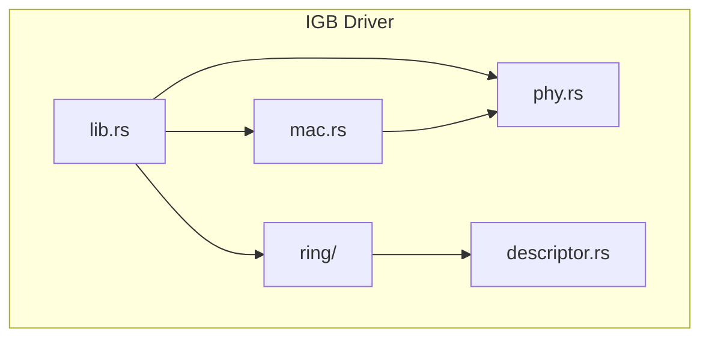
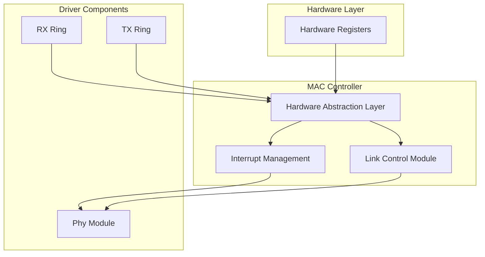
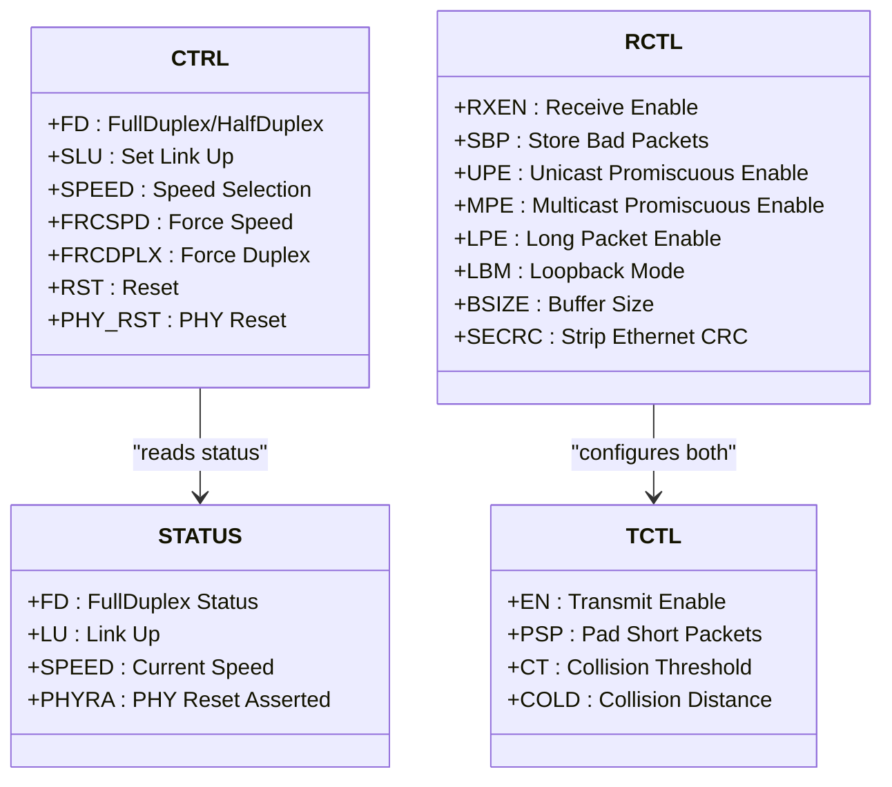
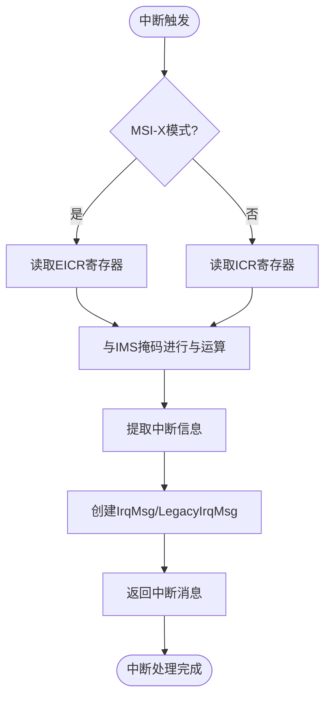
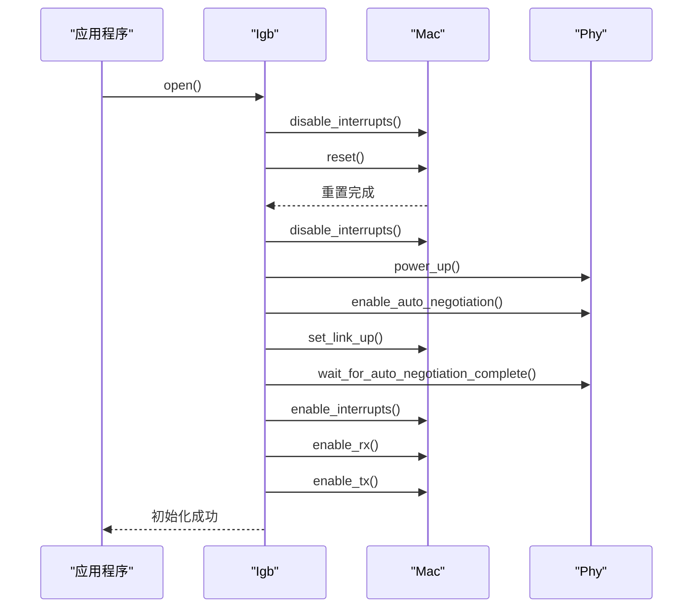
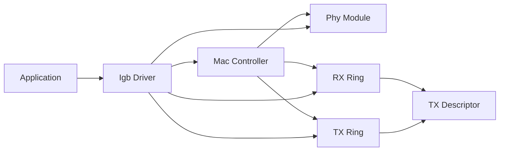

# MAC控制器

<cite>
**Referenced Files in This Document**   
- [mac.rs](file://igb/src/mac.rs)
- [lib.rs](file://igb/src/lib.rs)
- [ring/mod.rs](file://igb/src/ring/mod.rs)
- [ring/rx.rs](file://igb/src/ring/rx.rs)
- [ring/tx.rs](file://igb/src/ring/tx.rs)
- [descriptor.rs](file://igb/src/descriptor.rs)
- [phy.rs](file://igb/src/phy.rs)
</cite>

## 目录
1. [简介](#简介)
2. [项目结构](#项目结构)
3. [核心组件](#核心组件)
4. [架构概述](#架构概述)
5. [详细组件分析](#详细组件分析)
6. [依赖关系分析](#依赖关系分析)
7. [性能考量](#性能考量)
8. [故障排查指南](#故障排查指南)
9. [结论](#结论)

## 简介

MAC控制器是Intel IGB网卡驱动的核心组件，负责管理硬件寄存器、中断系统和链路状态。该文档深入分析了`Mac`结构体如何通过`tock-registers`安全地封装对硬件寄存器的读写操作，阐述了中断处理机制，并解析了MAC初始化过程中的关键方法执行逻辑。

**Section sources**
- [mac.rs](file://igb/src/mac.rs#L0-L692)
- [lib.rs](file://igb/src/lib.rs#L0-L178)

## 项目结构

IGB网卡驱动采用模块化设计，主要包含以下组件：
- `mac.rs`: MAC控制器核心实现，管理硬件寄存器和中断
- `phy.rs`: PHY物理层管理，处理自动协商和链路建立
- `ring/`: 环形缓冲区管理，包含接收和发送队列
- `descriptor.rs`: 描述符定义，用于DMA数据传输
- `lib.rs`: 驱动入口点和公共接口

**Diagram sources **
- [mac.rs](file://igb/src/mac.rs#L0-L692)
- [phy.rs](file://igb/src/phy.rs#L0-L342)
- [ring/mod.rs](file://igb/src/ring/mod.rs#L0-L164)

**Section sources**
- [mac.rs](file://igb/src/mac.rs#L0-L692)
- [phy.rs](file://igb/src/phy.rs#L0-L342)

## 核心组件

`Mac`结构体是设备控制层的核心，通过`NonNull<MacRegister>`安全地访问硬件寄存器。它提供了对CTRL、STATUS、RCTL、TCTL等关键寄存器的读写操作，并实现了中断管理和链路控制功能。

**Section sources**
- [mac.rs](file://igb/src/mac.rs#L0-L692)

## 架构概述

MAC控制器作为IGB网卡的中枢，协调PHY层、环形缓冲区和主机系统的交互。其架构分为三个主要层次：硬件抽象层、中断管理层和链路控制层。

**Diagram sources **
- [mac.rs](file://igb/src/mac.rs#L0-L692)
- [phy.rs](file://igb/src/phy.rs#L0-L342)

## 详细组件分析

### MAC寄存器管理分析

`Mac`结构体使用`tock-registers`库安全地封装对硬件寄存器的访问。通过`register_structs!`宏定义了`MacRegister`结构，映射到实际的硬件寄存器地址。

#### 寄存器位域设计

**Diagram sources **
- [mac.rs](file://igb/src/mac.rs#L0-L692)

**Section sources**
- [mac.rs](file://igb/src/mac.rs#L0-L692)

### 中断处理机制分析

MAC控制器支持legacy和MSI-X两种中断模式，通过`IrqMsg`和`LegacyIrqMsg`结构体传递中断信息。

#### 中断处理流程

**Diagram sources **
- [mac.rs](file://igb/src/mac.rs#L0-L692)

**Section sources**
- [mac.rs](file://igb/src/mac.rs#L0-L692)

### 初始化过程分析

MAC控制器的初始化过程涉及多个步骤，包括重置、配置和启用收发功能。

#### 初始化序列图

**Diagram sources **
- [lib.rs](file://igb/src/lib.rs#L0-L178)
- [mac.rs](file://igb/src/mac.rs#L0-L692)
- [phy.rs](file://igb/src/phy.rs#L0-L342)

**Section sources**
- [lib.rs](file://igb/src/lib.rs#L0-L178)
- [mac.rs](file://igb/src/mac.rs#L0-L692)

## 依赖关系分析

MAC控制器与其他组件存在紧密的依赖关系，形成了完整的网络数据路径。

**Diagram sources **
- [lib.rs](file://igb/src/lib.rs#L0-L178)
- [mac.rs](file://igb/src/mac.rs#L0-L692)
- [ring/mod.rs](file://igb/src/ring/mod.rs#L0-L164)

**Section sources**
- [lib.rs](file://igb/src/lib.rs#L0-L178)
- [mac.rs](file://igb/src/mac.rs#L0-L692)

## 性能考量

在no-std环境下实现线程安全共享状态面临挑战，本驱动通过以下方式解决：
1. 使用`Arc<UnsafeCell<T>>`实现跨线程共享
2. 在关键操作中使用内存屏障(`mb()`)确保内存一致性
3. 通过原子操作管理环形缓冲区的头尾指针

这些机制确保了在无操作系统环境下的高效并发访问。

## 故障排查指南

### 常见问题及诊断步骤

| 问题现象 | 可能原因 | 诊断步骤 |
|---------|--------|--------|
| 链路无法建立 | PHY未正确初始化 | 1. 检查`phy.power_up()`是否成功 2. 验证自动协商是否完成 3. 检查`