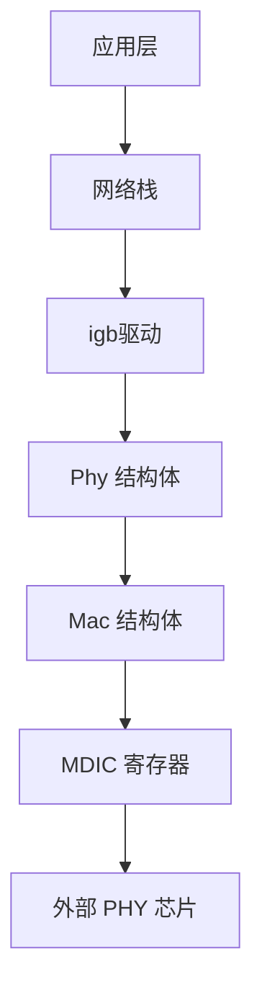

# PHY控制器

<cite>
**Referenced Files in This Document **   
- [phy.rs](file://igb/src/phy.rs)
- [mac.rs](file://igb/src/mac.rs)
- [lib.rs](file://igb/src/lib.rs)
</cite>

## 目录
1. [引言](#引言)
2. [PHY控制器架构与通信机制](#phy控制器架构与通信机制)
3. [核心寄存器详解](#核心寄存器详解)
4. [关键方法实现逻辑](#关键方法实现逻辑)
5. [PHY寻址与多PHY支持](#phy寻址与多phy支持)
6. [链路状态管理与自动协商流程](#链路状态管理与自动协商流程)
7. [PHY复位与MAC复位的协作关系](#phy复位与mac复位的协作关系)
8. [调试建议](#调试建议)

## 引言

本技术文档深入解析了以太网驱动中PHY物理层控制器的设计与实现。该控制器通过`Phy`结构体封装，利用MAC层提供的MDI接口（`read_mdic`/`write_mdic`）与外部PHY芯片进行通信，负责管理物理层连接、执行自动协商并监控链路状态。文档将详细阐述其核心寄存器、关键方法的调用时序，并提供实用的调试指导。

## PHY控制器架构与通信机制

PHY控制器的核心是`Phy`结构体，它作为MAC层与外部PHY芯片之间的桥梁。`Phy`结构体持有对`Mac`实例的引用和一个PHY地址，通过调用`Mac`提供的`read_mdic`和`write_mdic`方法来访问PHY芯片的内部寄存器。



**Diagram sources**
- [phy.rs](file://igb/src/phy.rs#L229-L230)
- [mac.rs](file://igb/src/mac.rs#L47-L113)

**Section sources**
- [phy.rs](file://igb/src/phy.rs#L229-L277)
- [mac.rs](file://igb/src/mac.rs#L47-L113)

## 核心寄存器详解

### PCTRL (PHY Control Register - 0x00)

PCTRL寄存器（定义于`phy.rs`）是控制PHY芯片行为的主要寄存器，其位域定义如下：

| 位域 | 名称 | 描述 |
| :--- | :--- | :--- |
| 15 | RESET | PHY复位。置1后复位PHY，但不会从EEPROM加载默认配置。 |
| 14 | LOOPBACK | 环回模式。用于测试，启用后数据在PHY内部环回。 |
| 13, 6 | SPEED_SELECTION | 速度选择（LSB和MSB）。组合使用可设置为10/100/1000 Mbps。当自动协商启用时，此设置无效。 |
| 12 | AUTO_NEGOTIATION_ENABLE | 自动协商使能。必须启用此位才能进行1000BASE-T操作。 |
| 11 | POWER_DOWN | 电源关闭。置1后PHY进入低功耗模式，所有状态指示均失效。 |
| 10 | ISOLATE | 隔离。对功能无影响，应保持为0。 |
| 9 | RESTART_AUTO_NEGOTIATION | 重启自动协商。置1后触发一次新的自动协商过程。 |
| 8 | DUPLEX_MODE | 双工模式。1=全双工，0=半双工。当自动协商启用时，此设置无效。 |

**Section sources**
- [phy.rs](file://igb/src/phy.rs#L0-L77)

### PSTATUS (PHY Status Register - 0x01)

PSTATUS寄存器是一个只读寄存器，用于查询PHY的状态和能力。

| 位域 | 名称 | 描述 |
| :--- | :--- | :--- |
| 15-11 | CAPABILITY_* | 能力标志位。指示PHY是否支持100BASE-T4、100BASE-TX全/半双工、10BASE-T全/半双工等。 |
| 8 | EXTENDED_STATUS | 扩展状态信息。为1时表示寄存器15包含扩展状态信息。 |
| 6 | MF_PREAMBLE_SUPPRESSION | 管理帧前导码抑制。指示PHY是否接受省略前导码的管理帧。 |
| 5 | AUTO_NEGOTIATION_COMPLETE | 自动协商完成。为1时表示自动协商过程已完成。 |
| 4 | REMOTE_FAULT | 远端故障。为1时表示检测到远端设备故障。 |
| 3 | AUTO_NEGOTIATION_ABILITY | 自动协商能力。为1时表示PHY具备自动协商能力。 |
| 2 | LINK_STATUS | 链路状态。为1时表示已建立有效链路。注意：这是一个锁存低电平的位，一旦变低，需读取后才会更新。 |
| 1 | JABBER_DETECT | 冲突检测。为1时表示检测到jabber（持续发送）条件。 |
| 0 | EXTENDED_CAPABILITY | 扩展能力。为1时表示支持扩展寄存器集。 |

**Section sources**
- [phy.rs](file://igb/src/phy.rs#L115-L227)

## 关键方法实现逻辑

### power_up()

`power_up()`方法用于唤醒处于电源关闭状态的PHY。其实现逻辑是：
1.  读取当前的PCTRL寄存器值。
2.  清除`POWER_DOWN`位（第11位）。
3.  将修改后的值写回PCTRL寄存器。

此操作使PHY退出低功耗模式，恢复正常的通信功能。

**Section sources**
- [phy.rs](file://igb/src/phy.rs#L269-L274)

### enable_auto_negotiation()

`enable_auto_negotiation()`方法用于启动自动协商过程。其调用时序如下：
1.  通过`read_mdic`读取PCTRL寄存器。
2.  设置`AUTO_NEGOTIATION_ENABLE`位（第12位）以启用自动协商。
3.  同时设置`RESTART_AUTO_NEGOTIATION`位（第9位）以立即重启协商过程。
4.  将修改后的控制字写回PCTRL寄存器。

**Section sources**
- [phy.rs](file://igb/src/phy.rs#L295-L304)

### wait_for_auto_negotiation_complete()

`wait_for_auto_negotiation_complete()`方法用于阻塞等待自动协商完成。其工作流程为：
1.  它依赖于`is_auto_negotiation_complete()`方法。
2.  `is_auto_negotiation_complete()`会周期性地（每100ms）读取PSTATUS寄存器。
3.  检查`AUTO_NEGOTIATION_COMPLETE`位（第5位）是否被置起。
4.  最多重试30次（最长等待3秒），若超时则返回错误。

**Section sources**
- [phy.rs](file://igb/src/phy.rs#L279-L293)

## PHY寻址与多PHY支持

PHY控制器通过`addr: u32`字段指定目标PHY芯片的地址。在初始化时，`Phy::new()`方法将地址硬编码为1。MDI接口（MDIC寄存器）中的`PHY_ADDR`字段（位21-25）允许主机访问同一总线上的多个PHY设备。虽然当前实现固定使用地址1，但其设计具备支持多PHY的潜力，只需在创建`Phy`实例时传入不同的地址即可。

**Section sources**
- [phy.rs](file://igb/src/phy.rs#L230)
- [mac.rs](file://igb/src/mac.rs#L101)

## 链路状态管理与自动协商流程

完整的链路建立流程通常在驱动的`open()`方法中编排：
1.  **重置与上电**：首先调用`mac.reset()`进行MAC层复位，然后调用`phy.power_up()`唤醒PHY。
2.  **启动协商**：调用`phy.enable_auto_negotiation()`开启自动协商。
3.  **等待完成**：调用`phy.wait_for_auto_negotiation_complete()`阻塞等待协商结果。
4.  **确认链路**：协商成功后，可通过读取PSTATUS寄存器的`LINK_STATUS`位来最终确认链路是否已建立。

```mermaid
sequenceDiagram
participant Driver as 驱动程序
participant Phy as Phy控制器
participant Mac as MAC控制器
participant PHY as 外部PHY芯片
Driver->>Phy : power_up()
Phy->>Mac : read_mdic(PHY_CONTROL)
Mac->>PHY : MDIC读操作
PHY-->>Mac : 返回控制寄存器值
Mac-->>Phy :
Phy->>Mac : write_mdic(PHY_CONTROL, ...)
Mac->>PHY : MDIC写操作
PHY-->>Mac :
Mac-->>Phy :
Driver->>Phy : enable_auto_negotiation()
Phy->>Mac : read_mdic(PHY_CONTROL)
Mac->>PHY : MDIC读操作
PHY-->>Mac : 返回控制寄存器值
Mac-->>Phy :
Phy->>Mac : write_mdic(PHY_CONTROL, ...)
Mac->>PHY : MDIC写操作
PHY-->>Mac :
Mac-->>Phy :
Driver->>Phy : wait_for_auto_negotiation_complete()
loop 每100ms轮询一次
Phy->>Mac : read_mdic(PHY_STATUS)
Mac->>PHY : MDIC读操作
PHY-->>Mac : 返回状态寄存器值
Mac-->>Phy :
alt 协商未完成
Phy->>Driver : 继续等待
else 协商完成
break
end
end
Phy-->>Driver : 成功
```

**Diagram sources**
- [phy.rs](file://igb/src/phy.rs#L269-L304)
- [lib.rs](file://igb/src/lib.rs#L87-L93)

**Section sources**
- [lib.rs](file://igb/src/lib.rs#L87-L93)

## PHY复位与MAC复位的协作关系

PHY复位和MAC复位是两个