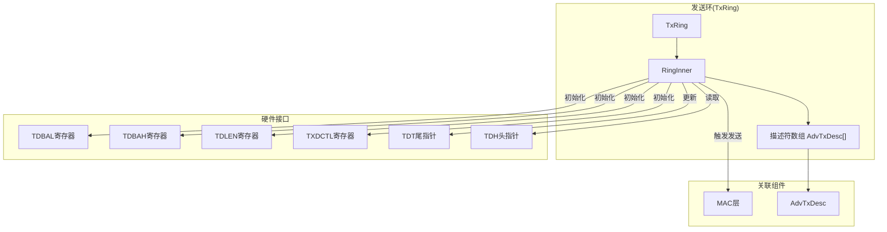
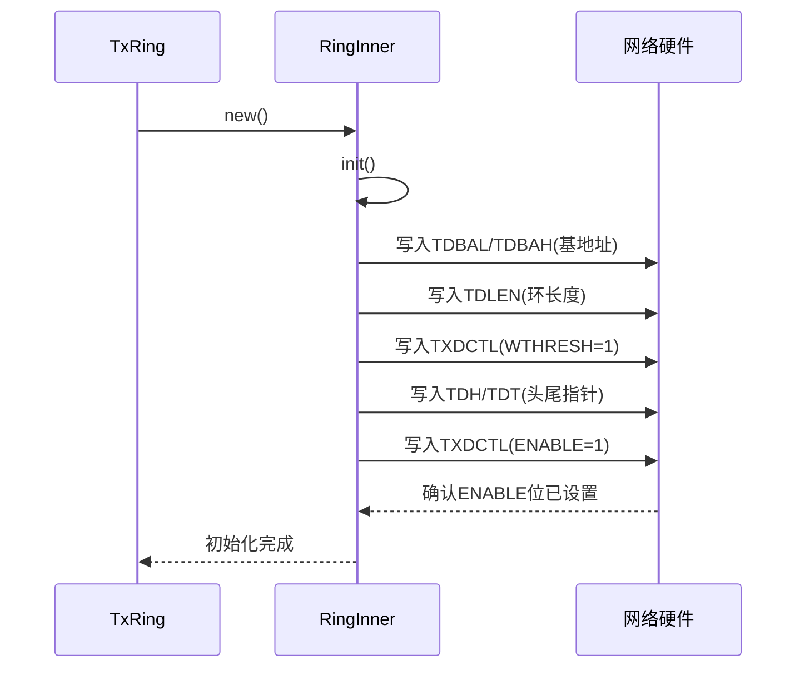
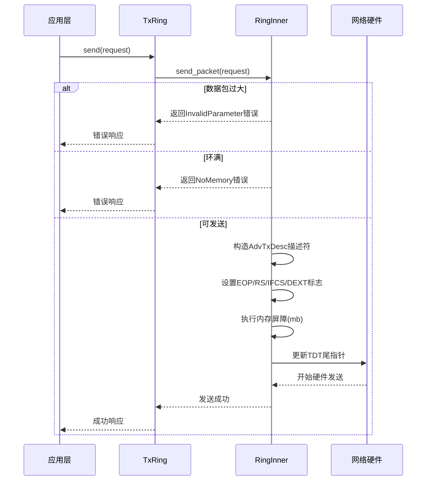

# 发送环（TxRing）

<cite>
**Referenced Files in This Document**
- [tx.rs](file://igb/src/ring/tx.rs)
- [descriptor.rs](file://igb/src/descriptor.rs)
- [mac.rs](file://igb/src/mac.rs)
</cite>

## 目录
1. [引言](#引言)
2. [核心组件分析](#核心组件分析)
3. [架构概览](#架构概览)
4. [详细组件分析](#详细组件分析)
5. [依赖关系分析](#依赖关系分析)
6. [性能考量](#性能考量)
7. [故障排除指南](#故障排除指南)
8. [结论](#结论)

## 引言

发送环（TxRing）是Intel以太网驱动程序中负责数据包异步传输的核心组件。它基于环形缓冲区机制，通过硬件描述符队列实现高效的数据发送。本技术文档全面解析了TxRing的设计与实现，重点阐述其在数据发送路径中的角色、内部状态管理机制以及与MAC层的协作关系。

**Section sources**
- [tx.rs](file://igb/src/ring/tx.rs#L1-L194)

## 核心组件分析

发送环（TxRing）由`TxRing`结构体和其内部的`RingInner`组成，采用环形缓冲区存储传输描述符。该组件实现了对TDBAL/TDBAH寄存器、TDLEN长度配置及TXDCTL控制寄存器的初始化，并通过`send_packet()`方法处理数据包发送流程。完成队列机制`next_finished()`用于跟踪已传输的数据包并回收资源，确保内存安全。

**Section sources**
- [tx.rs](file://igb/src/ring/tx.rs#L1-L194)

## 架构概览



**Diagram sources**
- [tx.rs](file://igb/src/ring/tx.rs#L1-L194)
- [descriptor.rs](file://igb/src/descriptor.rs#L1-L525)
- [mac.rs](file://igb/src/mac.rs#L1-L692)

## 详细组件分析

### RingInner 内部状态管理

`RingInner`结构体封装了发送环的核心状态，包括环形缓冲区基址、已完成传输计数器等。其初始化过程严格按照Intel网卡规范执行：

1. **描述符基地址设置**：将环形缓冲区总线地址写入TDBAL（低32位）和TDBAH（高32位）寄存器。
2. **环长度配置**：通过TDLEN寄存器设置描述符环的字节大小。
3. **写回策略配置**：在TXDCTL寄存器中设置WTHRESH（写回阈值）为1，优化性能。
4. **队列使能**：最后通过设置TXDCTL.ENABLE位激活发送队列。

此设计遵循严格的初始化顺序，确保硬件正确识别描述符环。

**Section sources**
- [tx.rs](file://igb/src/ring/tx.rs#L20-L75)

#### 初始化序列图



**Diagram sources**
- [tx.rs](file://igb/src/ring/tx.rs#L20-L75)

### send_packet() 方法执行流程

`send_packet()`方法负责单个数据包的发送，其执行流程如下：

1. **参数校验**：检查数据包大小是否超过最大限制。
2. **缓冲区确认**：调用`confirm_write_all()`确保DMA缓冲区就绪。
3. **空间检查**：比较当前尾指针与头指针，判断环形缓冲区是否有空闲槽位。
4. **描述符构造**：创建包含EOP（包结束）、RS（状态报告）、IFCS（插入FCS）、DEXT（扩展描述符）标志的AdvTxDesc描述符。
5. **内存屏障**：执行`mb()`内存屏障指令，确保描述符写入对硬件可见。
6. **触发发送**：通过更新TDT（尾指针）寄存器通知硬件有新的待发送数据包。

该流程严格保证了数据一致性和硬件同步。

**Section sources**
- [tx.rs](file://igb/src/ring/tx.rs#L77-L120)

#### 数据包发送时序图



**Diagram sources**
- [tx.rs](file://igb/src/ring/tx.rs#L77-L120)
- [descriptor.rs](file://igb/src/descriptor.rs#L1-L525)

### next_finished() 完成队列机制

`next_finished()`方法实现了完成队列的轮询机制，用于回收已传输的数据包资源：

1. **头指针获取**：读取硬件更新的TDH（头指针）值。
2. **完成检查**：若软件维护的`finished`索引等于硬件头指针，则无新完成项。
3. **状态验证**：检查对应描述符的写回状态是否标记为“完成”（DD位）。
4. **资源回收**：取出关联的Request对象，递增`finished`索引并返回Request，供上层释放DMA缓冲区。

此机制有效避免了内存泄漏，是实现资源安全回收的关键。

**Section sources**
- [tx.rs](file://igb/src/ring/tx.rs#L122-L150)

### 与MAC层的协作关系

发送环与MAC层之间存在明确的职责分离：
- **TxRing**：负责描述符环的管理、数据包排队和硬件交互细节。
- **MAC层**：通过`mac.enable_tx()`控制TCTL.EN位来全局启用或禁用发送功能。

这种设计体现了关注点分离原则，使得发送环可以在MAC层完全初始化后再被激活，提高了系统的稳定性和可配置性。

**Section sources**
- [tx.rs](file://igb/src/ring/tx.rs#L68-L70)
- [mac.rs](file://igb/src/mac.rs#L380-L382)

## 依赖关系分析

```mermaid
graph LR
TxRing --> RingInner
RingInner --> AdvTxDesc
RingInner --> Request
RingInner --> DError
RingInner --> mb[内存屏障]
RingInner --> wait_for
TxRing --> Arc
TxRing --> UnsafeCell
RingInner -.-> TCTL_EN[TCTL.EN]
TCTL_EN --> mac[mac.enable_tx()]
```

**Diagram sources**
- [tx.rs](file://igb/src/ring/tx.rs#L1-L194)
- [mac.rs](file://igb/src/mac.rs#L380-L382)

**Section sources**
- [tx.rs](file://igb/src/ring/tx.rs#L1-L194)
- [mac.rs](file://igb/src/mac.rs#L380-L382)

## 性能考量

发送环的设计充分考虑了高性能网络传输的需求：
- **WTHRESH设置为1**：最小化描述符写回延迟，提高小包吞吐量。
- **内存屏障使用**：精确使用`mb()`确保关键操作的顺序性，避免不必要的