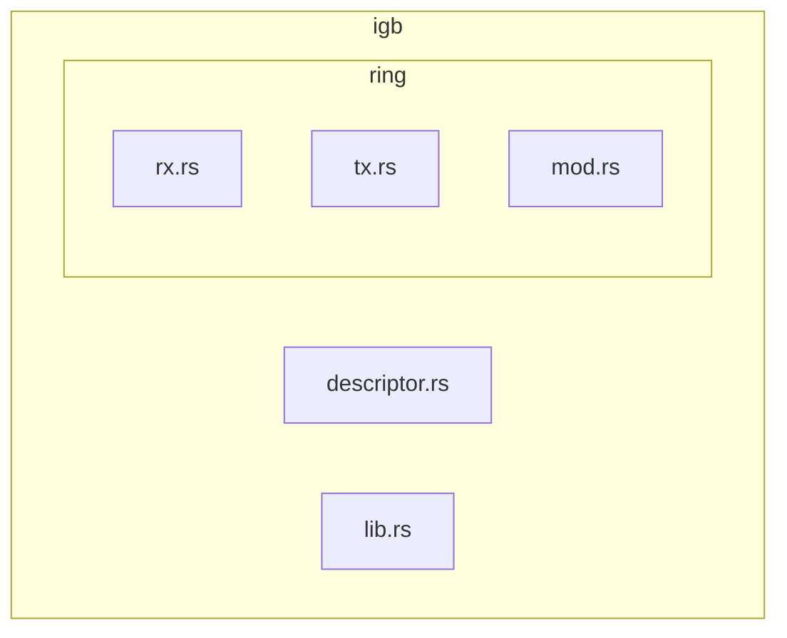
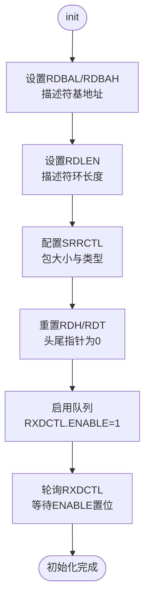
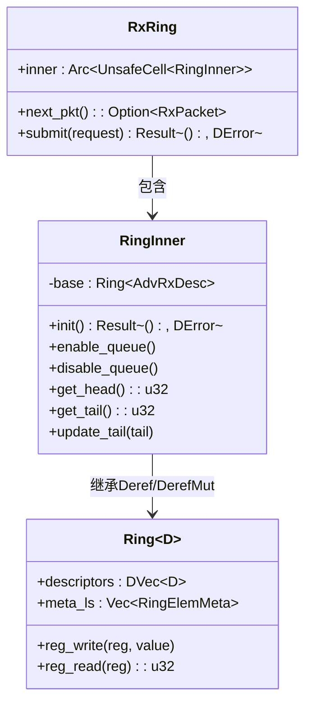
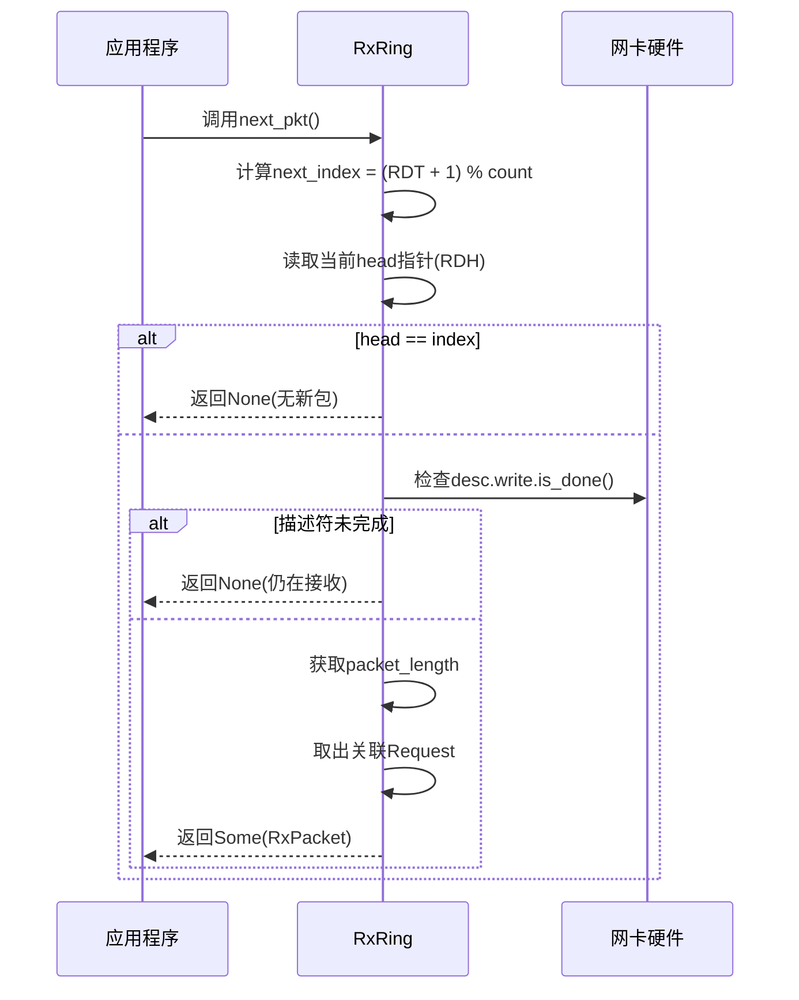
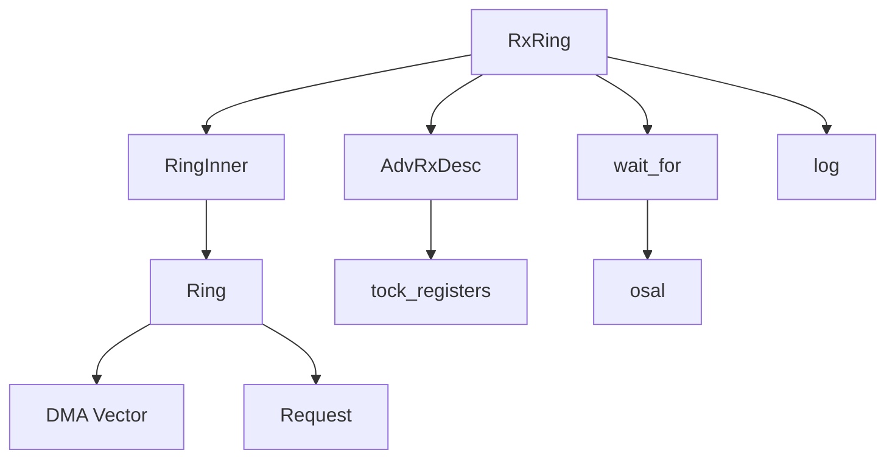

# 接收环（RxRing）

<cite>
**本文档中引用的文件**
- [rx.rs](file://igb/src/ring/rx.rs)
- [mod.rs](file://igb/src/ring/mod.rs)
- [descriptor.rs](file://igb/src/descriptor.rs)
- [lib.rs](file://igb/src/lib.rs)
</cite>

## 目录
1. [简介](#简介)
2. [项目结构](#项目结构)
3. [核心组件](#核心组件)
4. [架构概述](#架构概述)
5. [详细组件分析](#详细组件分析)
6. [依赖关系分析](#依赖关系分析)
7. [性能考虑](#性能考虑)
8. [故障排除指南](#故障排除指南)
9. [结论](#结论)

## 简介
接收环（RxRing）是Intel以太网驱动程序中负责高效管理从网卡硬件到应用程序数据流的核心组件。它通过环形缓冲区机制实现零拷贝接收，利用描述符队列与DMA内存请求协同工作，确保高性能的数据包处理能力。本文档深入解析其设计与实现细节。

## 项目结构
`igb`驱动模块采用分层架构组织代码，其中`ring`子模块专门处理发送和接收队列逻辑。接收功能由`rx.rs`文件实现，封装了底层寄存器操作、描述符管理和多线程安全访问机制。



**Diagram sources**
- [rx.rs](file://igb/src/ring/rx.rs)
- [mod.rs](file://igb/src/ring/mod.rs)

**Section sources**
- [rx.rs](file://igb/src/ring/rx.rs)
- [mod.rs](file://igb/src/ring/mod.rs)

## 核心组件
RxRing作为数据接收路径的核心，封装了对底层描述符队列的访问，并提供高层接口用于轮询接收到的数据包和提交新的接收缓冲区。其关键组成部分包括`RingInner`结构体、`AdvRxDesc`描述符格式以及`RxPacket`抽象。

**Section sources**
- [rx.rs](file://igb/src/ring/rx.rs#L13-L248)
- [descriptor.rs](file://igb/src/descriptor.rs#L0-L525)

## 架构概述
RxRing基于Intel 82576EB控制器的高级接收描述符机制构建，使用环形缓冲区协调CPU与网卡之间的数据交换。软件预分配DMA内存并填充描述符队列，网卡将接收到的数据写入指定缓冲区并在完成时更新状态位，驱动程序通过检查头部指针和完成标志来安全提取数据。

```mermaid
graph LR
NIC[NIC Hardware] --> |Writes Data & Updates DD Bit| DescriptorQueue[Rx Descriptor Queue]
DescriptorQueue --> |Poll RDH & Check is_done()| RxRing[RxRing]
RxRing --> |Extract RxPacket| Application[Application]
Application --> |Re-submit Buffer via submit()| RxRing
RxRing --> |Update RDT| DescriptorQueue
```

**Diagram sources**
- [rx.rs](file://igb/src/ring/rx.rs#L137-L248)
- [descriptor.rs](file://igb/src/descriptor.rs#L0-L525)

## 详细组件分析

### RingInner 结构体分析
`RingInner`封装了底层描述符队列及其相关元数据，负责初始化接收队列所需的寄存器配置。

#### 初始化流程


**Diagram sources**
- [rx.rs](file://igb/src/ring/rx.rs#L20-L55)

#### 寄存器编程说明
- **RDBAL/RDBAH**: 设置描述符环的物理地址（低/高32位）
- **RDLEN**: 描述符环总字节数，必须为128字节对齐
- **SRRCTL**: 配置缓冲区大小（BSIZEPACKET）、描述符类型（DESCTYPE=AdvancedOneBuffer）
- **RXDCTL**: 控制队列行为，含PTHRESH/HTHRESH/WTHRESH阈值及ENABLE位

**Section sources**
- [rx.rs](file://igb/src/ring/rx.rs#L20-L80)
- [mod.rs](file://igb/src/ring/mod.rs#L0-L40)

### RxRing 多线程安全性分析
`RxRing`使用`Arc<UnsafeCell<RingInner>>`实现跨线程共享访问，结合`Send`标记允许在线程间传递。



**Diagram sources**
- [rx.rs](file://igb/src/ring/rx.rs#L137-L248)
- [mod.rs](file://igb/src/ring/mod.rs#L97-L163)

**Section sources**
- [rx.rs](file://igb/src/ring/rx.rs#L137-L248)

### next_pkt 与 submit 方法工作机制

#### next_pkt 工作流程


**Diagram sources**
- [rx.rs](file://igb/src/ring/rx.rs#L162-L177)

#### submit 提交缓冲区流程
```mermaid
flowchart TD
A([submit]) --> B{检查是否有可用缓冲区<br/>(index+1 ≠ head)}
B --> |否| C[返回NoMemory错误]
B --> |是| D[创建AdvRxDesc<br/>包含bus_addr]
D --> E[更新descriptors[index]]
E --> F[保存request到meta_ls]
F --> G[调用update_tail(index+1)]
G --> H[写RDT寄存器触发硬件识别]
H --> I[完成]
```

**Diagram sources**
- [rx.rs](file://igb/src/ring/rx.rs#L192-L208)

**Section sources**
- [rx.rs](file://igb/src/ring/rx.rs#L162-L208)

### Drop 特质资源清理逻辑
当`RxRing`被释放时，自动禁用接收队列以防止进一步中断或DMA操作。


**Diagram sources**
- [rx.rs](file://igb/src/ring/rx.rs#L223-L227)

**Section sources**
- [rx.rs](file://igb/src/ring/rx.rs#L223-L227)

## 依赖关系分析
RxRing依赖多个底层组件协同工作，形成完整的接收链路。



**Diagram sources**
- [rx.rs](file://igb/src/ring/rx.rs)
- [mod.rs](file://igb/src/ring/mod.rs)
- [descriptor.rs](file://igb/src/descriptor.rs)

**Section sources**
- [rx.rs](file://igb/src/ring/rx.rs)
- [mod