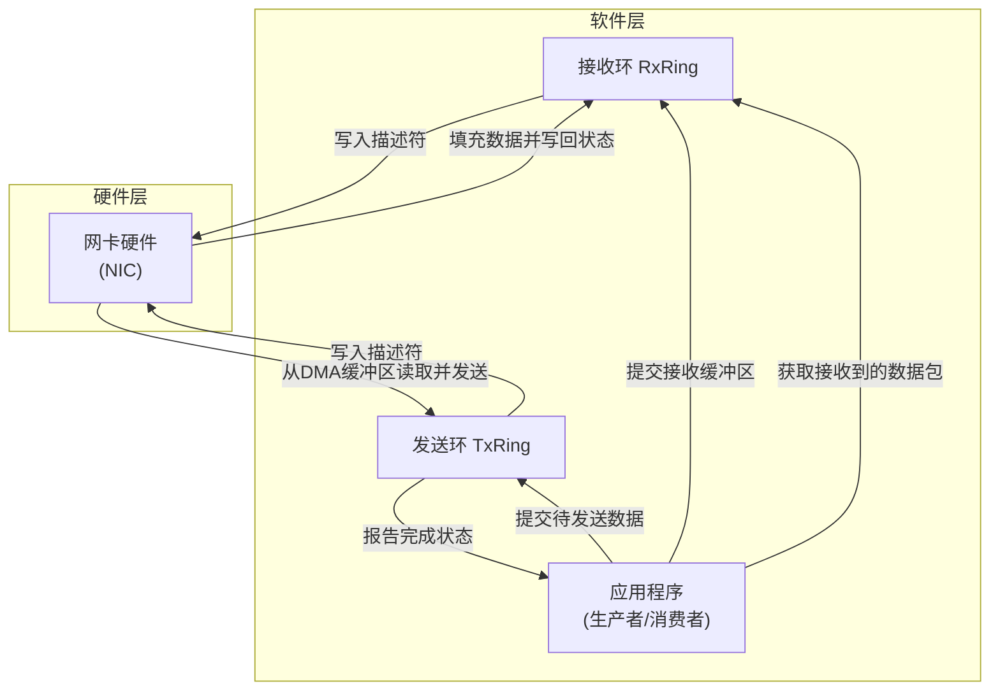
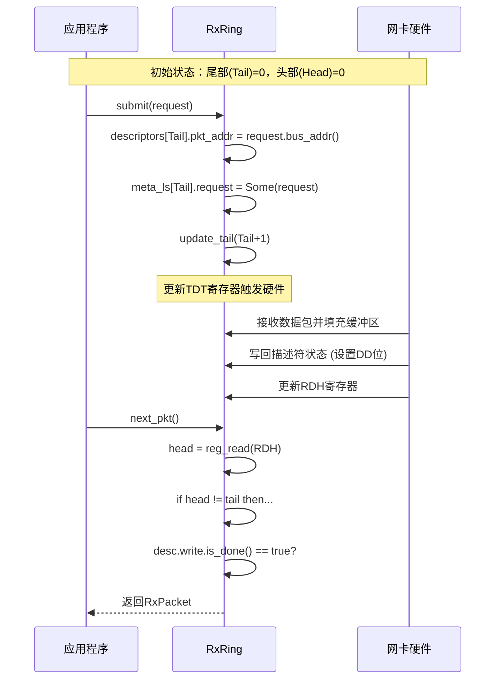
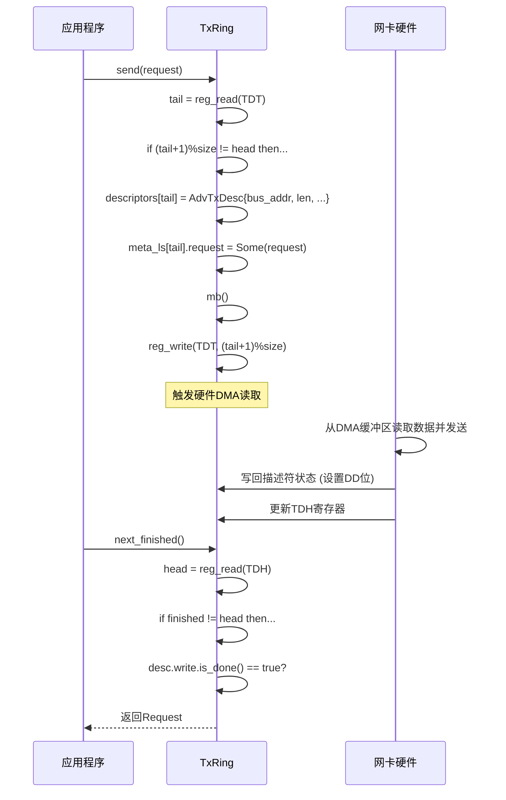

<cite>
**本文档中引用的文件**
- [mod.rs](file://igb/src/ring/mod.rs)
- [rx.rs](file://igb/src/ring/rx.rs)
- [tx.rs](file://igb/src/ring/tx.rs)
- [descriptor.rs](file://igb/src/descriptor.rs)
</cite>

## 目录
1. [引言](#引言)
2. [环形缓冲区架构概览](#环形缓冲区架构概览)
3. [核心组件与数据结构](#核心组件与数据结构)
4. [接收环（RxRing）机制详解](#接收环rxring机制详解)
5. [发送环（TxRing）机制详解](#发送环txring机制详解)
6. [描述符与DMA内存管理](#描述符与dma内存管理)
7. [生产者-消费者模型在收发路径的应用](#生产者-消费者模型在收发路径的应用)
8. [性能优化建议](#性能优化建议)
9. [典型使用场景](#典型使用场景)
10. [结论](#结论)

## 引言

本技术文档系统性地阐述了基于Intel IGB网卡驱动实现的环形缓冲区机制。该机制作为网络数据流管理层的核心，通过接收环（RxRing）和发送环（TxRing）实现了高效、低延迟的数据包收发。文档深入解析了其内存布局、描述符队列管理策略以及生产者-消费者并发模型，并阐明了零拷贝传输中总线地址的关键作用。

## 环形缓冲区架构概览

环形缓冲区是网卡驱动与硬件之间进行批量数据交换的标准接口。它采用预分配的连续内存区域来存储描述符，形成一个逻辑上的环形队列。驱动程序作为软件生产者/消费者，而网卡硬件则扮演相反的角色。

**Diagram sources**
- [mod.rs](file://igb/src/ring/mod.rs#L1-L164)
- [rx.rs](file://igb/src/ring/rx.rs#L1-L249)
- [tx.rs](file://igb/src/ring/tx.rs#L1-L194)

**Section sources**
- [mod.rs](file://igb/src/ring/mod.rs#L1-L164)

## 核心组件与数据结构

环形缓冲区机制由多个核心模块构成，它们协同工作以实现高效的数据传输。

### Ring 泛型基类

`Ring<D: Descriptor>` 是所有环形缓冲区的通用基类，它封装了与具体描述符类型无关的公共功能，如MMIO寄存器访问、内存管理等。

**Section sources**
- [mod.rs](file://igb/src/ring/mod.rs#L100-L164)

### 描述符定义

描述符（Descriptor）是环形缓冲区中的基本单元，用于在软件和硬件之间传递数据位置和控制信息。

#### 接收描述符 (AdvRxDesc)

`AdvRxDesc` 联合体包含两个视图：
- **read**: 软件写入格式，提供数据包缓冲区的物理地址。
- **write**: 硬件写回格式，包含数据包长度、校验和状态、VLAN标签等元信息。

#### 发送描述符 (AdvTxDesc)

`AdvTxDesc` 联合体同样包含两个视图：
- **read**: 软件写入格式，包含数据缓冲区地址、长度和命令标志（如EOP, RS）。
- **write**: 硬件写回格式，仅包含一个简单的状态位（DD - Descriptor Done），用于通知软件传输已完成。

**Section sources**
- [descriptor.rs](file://igb/src/descriptor.rs#L1-L525)

## 接收环（RxRing）机制详解

接收环（RxRing）负责管理从网卡硬件接收数据包的流程，其设计遵循异步非阻塞的原则。

### 初始化与配置

`RxRing::new()` 在创建时会调用 `init()` 方法，该方法执行以下关键步骤：
1.  将描述符环的DMA总线地址写入网卡的RDBAL/RDBAH寄存器。
2.  设置RDLEN寄存器为描述符环的总字节数。
3.  配置SRRCTL寄存器，指定使用高级单缓冲区模式（AdvancedOneBuffer）和数据包大小。
4.  启用RXDCTL寄存器中的队列使能位，并轮询等待硬件确认。

### 数据包获取流程

`next_pkt()` 方法是接收数据包的核心接口，其实现体现了典型的生产者-消费者模式：
1.  计算下一个可能有数据的描述符索引。
2.  读取硬件更新的头部指针（RDH）。
3.  比较计算出的索引与头部指针，若不一致，则说明有新数据到达。
4.  检查对应描述符的写回状态（`is_done()`），确保硬件已完全填充。
5.  提取数据包长度和关联的`Request`对象，构造并返回一个`RxPacket`。

**Diagram sources**
- [rx.rs](file://igb/src/ring/rx.rs#L1-L249)

**Section sources**
- [rx.rs](file://igb/src/ring/rx.rs#L1-L249)

## 发送环（TxRing）机制详解

发送环（TxRing）负责将应用程序的数据包通过DMA方式发送到网络上。

### 数据包发送流程

`send()` 方法的处理流程如下：
1.  检查环形缓冲区是否已满（通过比较尾部和头部指针）。
2.  获取当前尾部指针作为新描述符的槽位。
3.  构造一个`AdvTxDesc`，填入数据缓冲区的总线地址、长度和必要的命令标志（EOP, RS, IFCS等）。
4.  使用`mb()`内存屏障确保描述符对硬件可见。
5.  更新尾部指针（TDT寄存器），正式通知网卡硬件可以开始DMA传输。

### 完成事件处理

`next_finished()` 方法用于轮询已完成的发送操作：
1.  读取硬件更新的头部指针（TDH）。
2.  比较内部跟踪的`finished`索引与头部指针。
3.  若有新的完成项，则检查描述符的写回状态（`is_done()`）。
4.  成功验证后，取出并返回关联的`Request`对象，允许应用程序回收资源。

**Diagram sources**
- [tx.rs](file://igb/src/ring/tx.rs#L1-L194)

**Section sources**
- [tx.rs](file://igb/src/ring/tx.rs#L1-L194)

## 描述符与DMA内存管理

### 描述符与DMA缓冲区的映射关系

每个描述符都直接指向一个由`Request`对象管理的DMA缓冲区。`Request`封装了一个可被设备直接访问的内存区域，其`bus_addr()`方法返回该区域的物理总线地址。

这种映射关系是实现零拷贝传输的基础。软件只需将`bus_addr`写入描述符，硬件即可直接通过DMA引擎访问该内存，无需操作系统介入进行数据复制。

### 总线地址（bus_addr）的重要性

总线地址是CPU和外设（如网卡）共同理解的物理内存地址。在现代系统中，由于