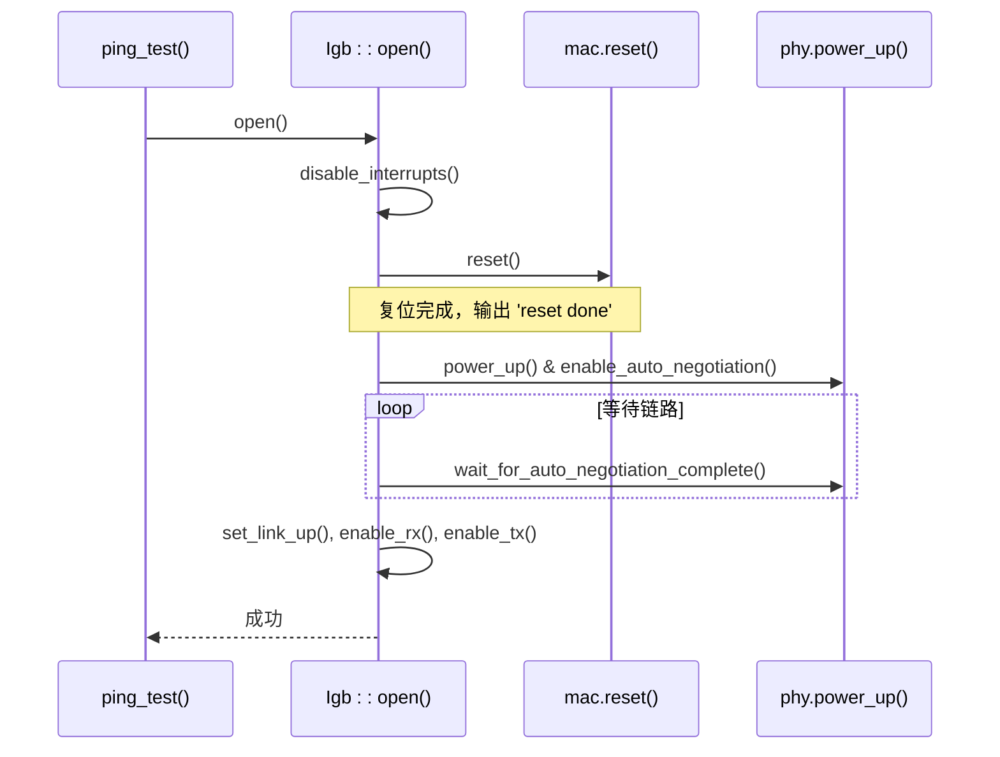
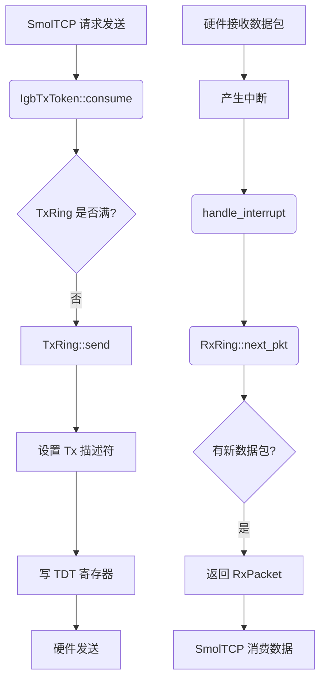

# 测试与调试

<cite>
**Referenced Files in This Document**  
- [test.rs](file://igb/tests/test.rs)
- [lib.rs](file://igb/src/lib.rs)
- [mac.rs](file://igb/src/mac.rs)
- [phy.rs](file://igb/src/phy.rs)
- [ring/mod.rs](file://igb/src/ring/mod.rs)
- [ring/rx.rs](file://igb/src/ring/rx.rs)
- [ring/tx.rs](file://igb/src/ring/tx.rs)
</cite>

## 目录
1. [测试套件结构与运行方法](#测试套件结构与运行方法)
2. [关键路径验证分析](#关键路径验证分析)
3. [调试信息与诊断技巧](#调试信息与诊断技巧)
4. [常见故障排查指南](#常见故障排查指南)
5. [no-std环境调试策略](#no-std环境调试策略)

## 测试套件结构与运行方法

位于 `igb/tests/test.rs` 的测试套件采用 `#![no_std]` 和 `#![no_main]` 属性，专为裸机环境设计。该测试框架通过 `bare_test` crate 提供支持，允许在无操作系统环境下执行硬件驱动测试。

测试套件的核心是 `ping_test` 函数，它验证了以太网驱动的基本通信能力。测试流程包括：获取 IGB 设备实例、注册中断处理程序、打开设备、等待链路建立、创建发送和接收环形缓冲区，并最终通过 ICMP 协议执行 ping 操作来验证网络连通性。

测试使用 `cargo test` 命令执行。为了在真实的 U-Boot 开发板上进行硬件测试，需要使用 `--uboot` 标志。此标志指示构建系统生成适用于 U-Boot 环境的二进制文件，并通过 U-Boot 加载器在目标硬件上启动测试。这使得开发者能够在真实硬件环境中验证驱动的行为，而不仅仅是在模拟器或 QEMU 中。

**Section sources**
- [test.rs](file://igb/tests/test.rs#L1-L422)

## 关键路径验证分析

测试用例通过模拟和利用真实硬件相结合的方式，验证了驱动的关键路径。

### 初始化路径
初始化过程从 `Igb::open()` 方法开始，该方法执行了一系列关键操作：
1.  **禁用中断**：确保在配置过程中不会被中断干扰。
2.  **硬件复位**：调用 `mac.reset()` 对 MAC 控制器进行软复位。
3.  **PHY 配置**：调用 `setup_phy_and_the_link()` 来启用 PHY 的自动协商功能。
4.  **链路建立**：调用 `set_link_up()` 并等待 `wait_for_auto_negotiation_complete()` 完成，确保物理层链路已成功建立。
5.  **启用收发**：最后调用 `enable_rx()` 和 `enable_tx()` 启用数据包的接收和发送功能。

**Diagram sources**
- [lib.rs](file://igb/src/lib.rs#L70-L109)
- [mac.rs](file://igb/src/mac.rs#L286-L300)
- [phy.rs](file://igb/src/phy.rs#L180-L200)

### 数据包收发路径
数据包收发通过环形缓冲区（Ring Buffer）机制实现。`new_ring()` 方法创建了独立的 `TxRing` 和 `RxRing` 实例。

- **发送路径**：当 SmolTCP 库请求发送一个 ICMP 包时，会调用 `IgbTxToken::consume()`。该函数将数据复制到 DMA 缓冲区，创建一个 `Request`，并将其提交给 `TxRing::send()`。`TxRing` 随后更新传输描述符环，并写入尾部指针（TDT），触发硬件开始发送。
- **接收路径**：当硬件接收到数据包并产生中断时，`handle_interrupt()` 被调用。`RxRing::next_pkt()` 方法检查接收描述符环的头部，如果发现已完成的数据包，则返回一个包含有效载荷的 `RxPacket`。SmolTCP 随后可以消费这个数据包。

**Diagram sources**
- [test.rs](file://igb/tests/test.rs#L170-L200)
- [ring/tx.rs](file://igb/src/ring/tx.rs#L120-L160)
- [ring/rx.rs](file://igb/src/ring/rx.rs#L150-L180)
- [lib.rs](file://igb/src/lib.rs#L111-L120)

## 调试信息与诊断技巧

本驱动充分利用 `log` crate 输出详细的调试信息，这对于在 `no-std` 环境中诊断问题至关重要。

### 关键日志信息
- **'reset done'**：出现在 `Igb::open()` 方法中，标志着 MAC 控制器的复位过程已经成功完成。如果未看到此消息，表明复位可能失败或超时。
- **'Interrupt message: {msg:?}'**：由 `handle_interrupt()` 函数输出，显示了中断寄存器（ICR/EICR）的具体内容。这是判断中断源（如链路状态改变、接收完成、发送完成等）的直接依据。
- **'PHY powered up'** 和 **'Auto-negotiation complete'**：这些日志来自 `phy.rs`，用于跟踪 PHY 初始化和链路协商的状态。

### 调试技巧
1.  **日志级别控制**：在 `Cargo.toml` 中调整 `log` crate 的依赖或通过编译器特性（feature）来控制日志级别。在开发阶段使用 `info!` 或 `debug!`，在生产环境中可降低至 `warn!` 或 `error!` 以减少开销。
2.  **print-style debugging**：在关键代码路径（如中断处理、DMA 缓冲区管理）中插入 `println!` 或 `info!` 语句，打印变量值、寄存器状态或执行流标记。例如，在 `RxRing::next_pkt()` 中打印 `head` 和 `tail` 指针，有助于诊断环形缓冲区同步问题。
3.  **JTAG 调试器**：对于更深层次的问题，应使用 JTAG 调试器连接到目标开发板。它可以提供单步执行、断点设置、内存和寄存器查看等强大功能，是解决死锁、内存损坏等问题的终极手段。

**Section sources**
- [lib.rs](file://igb/src/lib.rs#L80-L81)
- [mac.rs](file://igb/src/mac.rs#L286-L290)
- [phy.rs](file://igb/src/phy.rs#L180-L185)

## 常见故障排查指南

以下列出了一些常见的故障现象及其可能原因和排查步骤。

### 故障一：链路无法建立 (Link Not Up)
- **现象**：`ping_test` 在 `while !igb.status().link_up` 循环中无限等待。
- **可能原因**：
    - 物理连接问题（网线松动、交换机端口故障）。
    - PHY 自动协商失败。
    - 驱动未能正确配置 MAC 或 PHY 寄存器。
- **排查步骤**：
    1.  检查物理连接和对端设备状态。
    2.  查看日志是否输出 `'Auto-negotiation complete'`。如果没有，检查 `phy.enable_auto_negotiation()` 是否被正确调用。
    3.  使用 JTAG 调试器读取 PHY 状态寄存器（PSTATUS）的 `LINK_STATUS` 位，确认是硬件层面还是软件层面的问题。

### 故障二：中断不触发 (Interrupts Not Triggered)
- **现象**：数据包已发送或到达，但 `handle_interrupt` 从未被调用。
- **可能原因**：
   