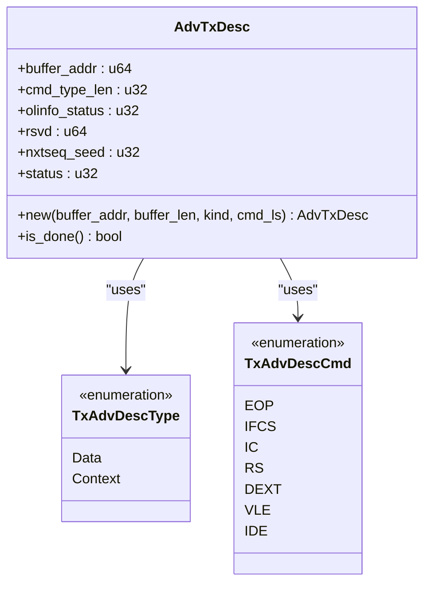
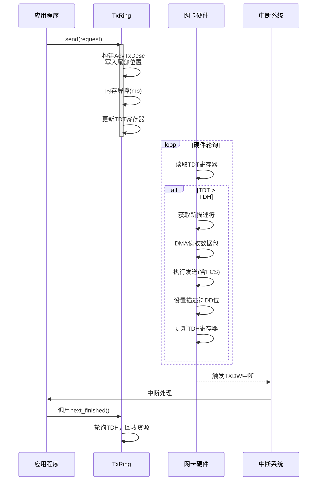

# 发送环机制

<cite>
**Referenced Files in This Document**   
- [tx.rs](file://igb/src/ring/tx.rs)
- [mod.rs](file://igb/src/ring/mod.rs)
- [descriptor.rs](file://igb/src/descriptor.rs)
- [lib.rs](file://igb/src/lib.rs)
- [mac.rs](file://igb/src/mac.rs)
</cite>

## 目录
1. [引言](#引言)
2. [发送环核心职责与工作流程](#发送环核心职责与工作流程)
3. [发送描述符构建与高级特性配置](#发送描述符构建与高级特性配置)
4. [头尾指针更新与发送完成状态检测](#头尾指针更新与发送完成状态检测)
5. [DMA内存分配与方向控制](#dma内存分配与方向控制)
6. [发送生命周期时序分析](#发送生命周期时序分析)
7. [阻塞处理、零拷贝优化与多队列扩展](#阻塞处理零拷贝优化与多队列扩展)
8. [高频率发送性能调优指南](#高频率发送性能调优指南)

## 引言

发送环（TxRing）是网络驱动中负责数据包发送的核心组件，它作为应用层与网卡硬件之间的桥梁，通过环形队列的机制高效地管理待发送的数据缓冲区。本文档将深入剖析`arceos_drivers/ethernet-intel`项目中基于Intel IGB网卡的发送环实现，详细阐述其初始化、数据发送、资源回收等关键流程，并结合代码分析其如何利用DMA技术、硬件卸载等特性实现高性能的数据传输。

## 发送环核心职责与工作流程

发送环的核心职责是为网卡硬件提供一个结构化的指令队列，使得硬件能够按序读取并发送数据包。其工作流程遵循典型的生产者-消费者模型：软件（驱动）作为生产者，将待发送的数据包信息封装成描述符并放入环形队列；硬件（网卡）作为消费者，从队列中取出描述符并执行发送操作。

在本实现中，`TxRing`结构体是对外暴露的主要接口，它封装了内部的`RingInner`和底层的通用`Ring<AdvTxDesc>`。当上层应用调用`TxRing::send()`方法时，该请求最终会传递给`RingInner::send_packet()`方法进行处理。此方法首先检查环形队列是否有空闲空间，然后构造一个`AdvTxDesc`（Advanced Transmit Descriptor），将其写入当前尾部指针指向的位置，最后通过更新TDT（TX Descriptor Tail）寄存器来通知硬件有新的待发送任务。

**Section sources**
- [tx.rs](file://igb/src/ring/tx.rs#L100-L150)
- [mod.rs](file://igb/src/ring/mod.rs#L100-L120)

## 发送描述符构建与高级特性配置

发送描述符（`AdvTxDesc`）是发送环中的核心数据结构，它包含了硬件执行发送操作所需的所有信息。在`descriptor.rs`文件中定义的`AdvTxDesc`联合体，其`read`字段用于软件向硬件提供信息。

`AdvTxDesc::new()`方法负责构建描述符。它接收数据缓冲区的物理地址（`buffer_addr`）、长度（`buffer_len`）、类型（`kind`）以及一系列命令标志（`cmd_ls`）。其中，命令标志数组是实现高级特性的关键：
- `TxAdvDescCmd::EOP` (End of Packet): 标记这是一个数据包的最后一个描述符。
- `TxAdvDescCmd::RS` (Report Status): 要求硬件在发送完成后，在描述符的状态字段写回完成标记（DD bit），这是驱动回收资源的基础。
- `TxAdvDescCmd::IFCS` (Insert FCS): 指示硬件自动为数据包生成并插入帧校验序列（FCS），实现了校验和卸载。
- `TxAdvDescCmd::DEXT` (Descriptor Extension): 启用高级描述符格式，支持更复杂的特性，如分段（Scatter-Gather）和TSO（TCP Segmentation Offload）。

这些标志被编码到描述符的`cmd_type_len`字段中，硬件解析后即可执行相应的操作，极大地减轻了CPU的负担。

**Diagram sources**
- [descriptor.rs](file://igb/src/descriptor.rs#L200-L250)

**Section sources**
- [descriptor.rs](file://igb/src/descriptor.rs#L200-L300)
- [tx.rs](file://igb/src/ring/tx.rs#L120-L130)

## 头尾指针更新与发送完成状态检测

发送环使用头（Head）指针和尾（Tail）指针来管理环形队列。尾指针（TDT）由软件维护，指向下一个可写入描述符的位置。每次成功发送一个数据包后，软件都会将描述符写入尾指针位置，然后通过内存屏障（`mb()`）确保写入对硬件可见，最后原子性地递增尾指针并更新TDT寄存器。这一过程在`RingInner::send_packet()`中完成。

头指针（TDH）由硬件维护，指向第一个尚未完成发送的描述符。驱动需要定期轮询TDH寄存器，以确定哪些描述符已经完成发送，从而可以安全地回收其关联的内存资源。`TxRing::next_finished()`方法实现了这一逻辑：它比较内部记录的`finished`索引与硬件报告的TDH值，如果两者不一致，则说明有新的描述符已完成。此时，驱动会检查对应描述符的`status`字段是否设置了DD（Descriptor Done）位，确认无误后，便可以取出之前保存的`Request`对象并返回给上层，完成一次完整的资源回收。

**Section sources**
- [tx.rs](file://igb/src/ring/tx.rs#L130-L150)
- [tx.rs](file://igb/src/ring/tx.rs#L160-L190)

## DMA内存分配与方向控制

发送环的底层依赖于`mod.rs`中定义的通用`Ring<D: Descriptor>`结构。该结构利用`dma_api`库中的`DVec`来分配描述符数组。`DVec`不仅提供了虚拟内存，更重要的是能获取到对应的物理总线地址（`bus_addr`），这对于DMA操作至关重要，因为硬件只能通过物理地址访问内存。

在创建`Ring`实例时，`Direction::Bidirectional`被指定为内存方向。这表明分配的内存区域既可以从设备（ToDevice）写入（即CPU向描述符写入信息），也可以从设备读取（FromDevice）（即网卡读取数据包内容）。这种双向权限确保了整个发送流程的顺畅：CPU可以设置描述符和数据缓冲区，而网卡则可以直接从内存中DMA读取数据包内容进行发送。

**Section sources**
- [mod.rs](file://igb/src/ring/mod.rs#L100-L150)
- [lib.rs](file://igb/src/lib.rs#L50-L60)

## 发送生命周期时序分析

以下时序图展示了从应用层调用`send`到硬件触发中断的完整生命周期：

**Diagram sources**
- [tx.rs](file://igb/src/ring/tx.rs#L100-L190)
- [mac.rs](file://igb/src/mac.rs#L300-L350)

## 阻塞处理、零拷贝