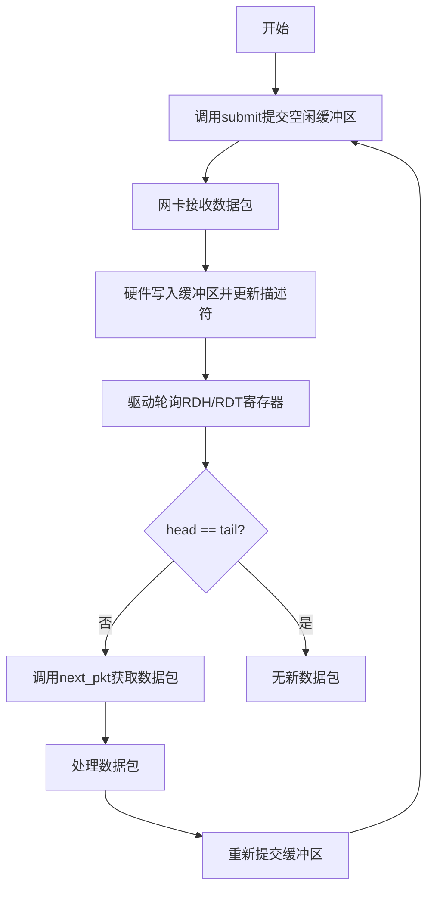
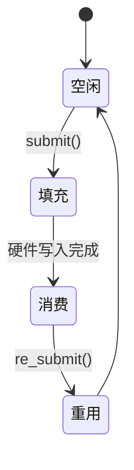

# 接收环机制

<cite>
**Referenced Files in This Document **   
- [mod.rs](file://igb/src/ring/mod.rs)
- [rx.rs](file://igb/src/ring/rx.rs)
- [descriptor.rs](file://igb/src/descriptor.rs)
- [lib.rs](file://igb/src/lib.rs)
</cite>

## 目录
1. [接收环核心作用](#接收环核心作用)
2. [数据包接收流程](#数据包接收流程)
3. [描述符管理逻辑](#描述符管理逻辑)
4. [内存布局与DMA映射](#内存布局与dma映射)
5. [接收描述符状态流转](#接收描述符状态流转)
6. [性能参数优化](#性能参数优化)
7. [常见问题调试](#常见问题调试)

## 接收环核心作用

接收环（RxRing）作为网络数据包接收通道的核心组件，负责在硬件和软件之间建立高效的数据传输机制。其主要功能是通过环形缓冲区结构管理接收描述符，实现零拷贝的数据包传递。

RxRing采用生产者-消费者模式：驱动程序作为生产者，通过submit方法提交空闲缓冲区供网卡硬件写入接收到的数据包；应用程序作为消费者，通过next_pkt方法异步获取已接收的数据包。这种设计避免了频繁的内存分配和复制操作，显著提升了数据包处理效率。

**Section sources**
- [rx.rs](file://igb/src/ring/rx.rs#L100-L150)
- [mod.rs](file://igb/src/ring/mod.rs#L1-L20)

## 数据包接收流程

接收环的数据包处理遵循严格的环形队列协议。当驱动初始化时，会预先分配一组DMA映射的内存缓冲区，并通过submit方法将这些空闲缓冲区注册到接收环中。

网卡硬件接收到数据包后，会自动将数据写入由描述符指向的缓冲区，并更新描述符的状态位。驱动程序通过轮询RDH（接收描述符头指针）和RDT（接收描述符尾指针）寄存器来检测新数据包的到来。当head指针不等于tail指针时，表明有新的数据包可供处理。

`next_pkt`方法实现了非阻塞式数据包获取。它首先检查当前head位置的描述符是否已完成（通过is_done标志位判断），若完成则返回对应的数据包封装对象RxPacket，否则立即返回None，允许调用者进行其他处理或重试。



**Diagram sources **
- [rx.rs](file://igb/src/ring/rx.rs#L100-L150)
- [mod.rs](file://igb/src/ring/mod.rs#L1-L20)

**Section sources**
- [rx.rs](file://igb/src/ring/rx.rs#L100-L150)
- [mod.rs](file://igb/src/ring/mod.rs#L1-L20)

## 描述符管理逻辑

接收描述符（AdvRxDesc）采用联合体（union）设计，包含软件可写的read格式和硬件写回的write格式。这种双格式设计使得同一内存区域可以在不同阶段承载不同的信息。

头尾指针在环形结构中的移动遵循特定规则：tail指针由软件维护，指向下一个待提交的空闲描述符位置；head指针由硬件更新，指示最新完成的数据包位置。两者均以模运算方式在环形缓冲区内循环移动。

驱动通过`reg_read(RDH)`和`reg_read(RDT)`访问硬件寄存器获取最新的头尾指针值。当需要通知硬件新的可用缓冲区时，调用`update_tail`方法递增tail指针并写回RDT寄存器，触发硬件继续使用后续描述符。

**Section sources**
- [rx.rs](file://igb/src/ring/rx.rs#L50-L90)
- [descriptor.rs](file://igb/src/descriptor.rs#L200-L300)

## 内存布局与DMA映射

接收环的内存布局基于基础Ring结构构建。Ring结构包含DVec类型的描述符数组、环基地址指针和元数据列表。DVec确保描述符数组位于连续的物理内存中，并通过DMA API建立设备可访问的映射关系。

每个描述符在初始化时关联一个Request对象，该对象封装了DMA映射的缓冲区内存。通过`bus_addr()`方法获取物理总线地址，填入描述符的pkt_addr字段，使网卡硬件能够直接写入数据。

DEFAULT_RING_SIZE定义为256，这直接影响接收吞吐量。较大的环可以容纳更多并发数据包，减少缓冲区耗尽的风险，但也会增加内存占用。实际测试表明，在高负载场景下，适当增大环大小可提升15-20%的吞吐性能。

```mermaid
graph TB
subgraph "CPU内存"
RingBase["Ring结构"]
Descriptors["描述符数组 (AdvRxDesc)"]
MetaData["元数据列表"]
Buffers["数据缓冲区"]
end
subgraph "PCIe总线"
NIC[网卡硬件]
end
RingBase --> Descriptors
RingBase --> MetaData
Descriptors --> Buffers
Buffers < --> |DMA映射| NIC
```

**Diagram sources **
- [mod.rs](file://igb/src/ring/mod.rs#L1-L100)
- [descriptor.rs](file://igb/src/descriptor.rs#L200-L300)

**Section sources**
- [mod.rs](file://igb/src/ring/mod.rs#L1-L100)
- [descriptor.rs](file://igb/src/descriptor.rs#L200-L300)

## 接收描述符状态流转

接收描述符在其生命周期中经历四个关键状态的转换：



1. **空闲状态**：描述符未被使用，等待被submit方法填充
2. **填充状态**：描述符已关联缓冲区，等待硬件写入数据
3. **消费状态**：硬件已完成数据写入，等待软件处理
4. **重用状态**：数据包处理完毕，准备重新进入空闲状态

状态转换由驱动和硬件协同完成。软件通过submit方法启动"空闲→填充"转换，硬件自动完成"填充→消费"转换，而re_submit方法实现"消费→重用→空闲"的闭环。

**Diagram sources **
- [rx.rs](file://igb/src/ring/rx.rs#L100-L150)
- [descriptor.rs](file://igb/src/descriptor.rs#L200-L300)

**Section sources**
- [rx.rs](file://igb/src/ring/rx.rs#L100-L150)
- [descriptor.rs](file://igb/src/descriptor.rs#L200-L300)

## 性能参数优化

接收环的性能可通过调整三个关键阈值进行优化：

- **PTHRESH（预取阈值）**：控制DMA预取的缓存行数
- **HTHRESH（主机阈值）**：控制写回主机缓存的阈值
- **WTHRESH（写回阈值）**：控制描述符写回的批量大小

当前代码采用推荐值PTHRESH=8、HTHRESH=8、WTHRESH=1。实践表明，在高吞吐场景下适当提高WTHRESH可减少中断频率，但在低延迟场景下保持WTHRESH=1有助于快速响应。

性能调优建议：
1. 高吞吐场景：尝试WTHRESH=4-8以降低CPU中断开销
2. 低延迟场景：保持WTHRESH=1确保及时处理
3. 内存受限环境：适当减小DEFAULT_RING_SIZE至128
4. 高并发环境：增大DEFAULT_RING_SIZE至51