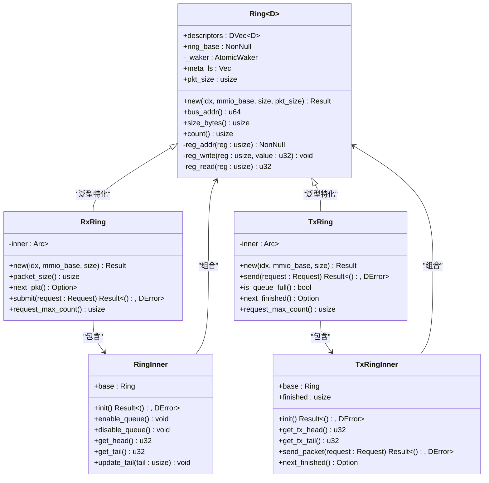

# 环形缓冲区机制

<cite>
**Referenced Files in This Document **   
- [mod.rs](file://igb/src/ring/mod.rs)
- [rx.rs](file://igb/src/ring/rx.rs)
- [tx.rs](file://igb/src/ring/tx.rs)
- [descriptor.rs](file://igb/src/descriptor.rs)
- [lib.rs](file://igb/src/lib.rs)
</cite>

## 目录
1. [引言](#引言)
2. [核心架构与设计](#核心架构与设计)
3. [接收环（RxRing）详解](#接收环rxring详解)
4. [发送环（TxRing）详解](#发送环txring详解)
5. [描述符（Descriptor）结构分析](#描述符descriptor结构分析)
6. [内存布局与指针管理](#内存布局与指针管理)
7. [初始化与配置流程](#初始化与配置流程)
8. [性能考量与调优策略](#性能考量与调优策略)
9. [总结](#总结)

## 引言

在高性能网络I/O系统中，环形缓冲区（Ring Buffer）是实现高效数据包处理的核心机制。本文档深入剖析了Intel IGB以太网驱动中的环形缓冲区实现，重点阐述其作为生产者-消费者队列如何有效解耦硬件交互与上层数据包处理逻辑。该机制通过`rx.rs`和`tx.rs`分别实现了接收环（RxRing）与发送环（TxRing），利用共享的`mod.rs`中定义的基础`Ring`结构，构建了一个高效、低延迟的数据传输框架。

**Section sources**
- [mod.rs](file://igb/src/ring/mod.rs#L1-L164)
- [rx.rs](file://igb/src/ring/rx.rs#L1-L249)
- [tx.rs](file://igb/src/ring/tx.rs#L1-L194)

## 核心架构与设计

环形缓冲区的设计基于一个通用的`Ring<D: Descriptor>`结构，它被`RxRing`和`TxRing`所复用，体现了代码的模块化与可维护性。该设计将数据结构与硬件寄存器操作分离，通过泛型参数`D`来支持不同类型的描述符（如`AdvRxDesc`和`AdvTxDesc`）。

**Diagram sources **
- [mod.rs](file://igb/src/ring/mod.rs#L100-L164)
- [rx.rs](file://igb/src/ring/rx.rs#L10-L249)
- [tx.rs](file://igb/src/ring/tx.rs#L10-L194)

**Section sources**
- [mod.rs](file://igb/src/ring/mod.rs#L1-L164)
- [rx.rs](file://igb/src/ring/rx.rs#L1-L249)
- [tx.rs](file://igb/src/ring/tx.rs#L1-L194)

## 接收环（RxRing）详解

接收环（RxRing）是一个典型的“生产者-消费者”模型，其中网卡硬件是生产者，负责将接收到的数据包写入环形缓冲区；而驱动程序是消费者，负责从缓冲区中取出并处理这些数据包。

### 提交空闲缓冲区 (submit)

`submit`方法是消费者向生产者提供资源的关键操作。当驱动程序希望接收新的数据包时，它会调用`submit`，传入一个`Request`对象（代表一块DMA内存）。该方法执行以下步骤：
1.  **获取尾部索引**：读取当前的尾部指针（RDT）。
2.  **检查空间**：验证下一个位置是否不等于头部指针（RDH），避免覆盖未处理的数据。
3.  **配置描述符**：创建一个`AdvRxDesc`，并将`Request`的物理地址（`bus_addr`）写入描述符的`read`字段。
4.