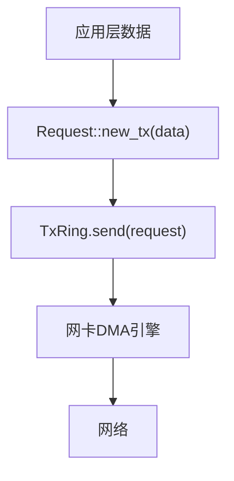

# 项目概述

<cite>
**Referenced Files in This Document**  
- [igb/Cargo.toml](file://igb/Cargo.toml)
- [igb/README.md](file://igb/README.md)
- [igb/src/lib.rs](file://igb/src/lib.rs)
- [igb/src/mac.rs](file://igb/src/mac.rs)
- [igb/src/phy.rs](file://igb/src/phy.rs)
- [igb/src/ring/mod.rs](file://igb/src/ring/mod.rs)
- [igb/src/ring/rx.rs](file://igb/src/ring/rx.rs)
- [igb/src/ring/tx.rs](file://igb/src/ring/tx.rs)
- [igb/src/descriptor.rs](file://igb/src/descriptor.rs)
</cite>

## 目录
1. [项目目的与核心功能](#项目目的与核心功能)
2. [目标受众与应用场景](#目标受众与应用场景)
3. [关键特性分析](#关键特性分析)
4. [驱动架构与模块关系](#驱动架构与模块关系)
5. [设备初始化流程](#设备初始化流程)
6. [数据包收发机制](#数据包收发机制)

## 项目目的与核心功能

Intel IGB以太网驱动是一个专为82576系列网络控制器设计的Rust语言实现，旨在为无标准库（no-std）环境提供高性能、安全可靠的网络硬件抽象层。该项目的核心目的是在操作系统内核和裸机环境中实现对Intel 82576系列以太网控制器的完整支持。

根据`README.md`文件中的描述，该驱动明确支持以下设备：
- **厂商ID (VID)**: 0x8086 (Intel)
- **设备ID (DID)**:
  - 0x10C9 (82576千兆网络连接)
  - 0x1533 (I210千兆网络连接)

驱动通过`check_vid_did`函数实现了设备识别逻辑，确保只对支持的硬件进行初始化和操作。其主要功能包括设备初始化、MAC/PHY控制、数据包收发等，为上层网络协议栈提供了稳定的数据通道。

**Section sources**
- [igb/README.md](file://igb/README.md#L15-L24)
- [igb/src/lib.rs](file://igb/src/lib.rs#L170-L178)

## 目标受众与应用场景

本驱动主要面向两类技术用户群体：

第一类是操作系统开发者，特别是正在构建自定义内核或微内核系统的团队。由于驱动采用`#![no_std]`属性编译，不依赖标准库，因此非常适合集成到各种操作系统内核中。它为内核提供了直接访问物理网络硬件的能力，是实现网络子系统的基础组件。

第二类是嵌入式系统和裸机环境开发者。对于运行在资源受限环境下的应用程序，该驱动提供了轻量级、高效的网络通信解决方案。通过`dma-api`依赖项，驱动实现了与底层内存管理系统的解耦，使得它可以灵活地适应不同的DMA框架。

驱动的设计充分考虑了安全性，利用Rust的所有权和借用检查机制，有效防止了常见的内存安全问题，如缓冲区溢出、空指针解引用等，这对于系统级软件至关重要。

**Section sources**
- [igb/Cargo.toml](file://igb/Cargo.toml#L3-L7)
- [igb/src/lib.rs](file://igb/src/lib.rs#L1)

## 关键特性分析

### 高性能零拷贝DMA传输

驱动的核心优势之一是实现了基于DMA的零拷贝数据传输。通过`dma-api`依赖项，驱动能够直接在物理连续内存区域与网卡之间传输数据，避免了传统方式中多次内存复制带来的性能损耗。

`Request`结构体是这一机制的关键，它封装了一个由`DVec<u8>`构成的DMA缓冲区。当发送数据包时，用户创建一个包含数据的`Request`对象，驱动将其总线地址写入传输描述符，网卡直接从该物理地址读取数据。接收过程同理，网卡将接收到的数据直接写入预分配的缓冲区，CPU无需参与数据搬运。



**Diagram sources**
- [igb/src/lib.rs](file://igb/src/lib.rs#L15-L44)
- [igb/src/ring/tx.rs](file://igb/src/ring/tx.rs#L120-L145)

### 环形缓冲区机制

驱动采用了经典的环形缓冲区（Ring Buffer）设计来管理传输和接收队列。`RxRing`和`TxRing`分别代表接收和传输环，它们基于`Ring<AdvTxDesc>`和`Ring<AdvRxDesc>`模板实现，其中`AdvTxDesc`和`AdvRxDesc`是高级描述符类型。

环形缓冲区的大小默认为256个描述符（`DEFAULT_RING_SIZE`），可以通过参数调整。每个描述符指向一个DMA缓冲区，形成一个循环队列。驱动通过维护头部（Head）和尾部（Tail）指针来跟踪可用和已使用的描述符，这种设计保证了O(1)时间复杂度的入队和出队操作。

**Section sources**
- [igb/src/ring/mod.rs](file://igb/src/ring/mod.rs#L1-L20)
- [igb/src/ring/rx.rs](file://igb/src/ring/rx.rs#L1-L20)
- [igb/src/ring/tx.rs](file://igb/src/ring/tx.rs#L1-L20)

## 驱动架构与模块关系

整个驱动由四个核心模块构成：`Igb`主控制器、`Mac`（媒体访问控制）、`Phy`（物理层）和`Ring`（环形缓冲区）。这些模块协同工作，共同完成网络通信任务。

```mermaid
classDiagram
    class Igb {
        +mac: Mac
        +phy: Phy
        +_rx_ring_addrs: [usize; 16]
        +_tx_ring_addrs: [usize; 16]
        +new(iobase) Result~Self, DError~
        +open() Result~(), DError~
        +new_ring() Result~(TxRing, RxRing), DError~
    }
    
    class Mac {
        +reg: NonNull~MacRegister~
        +iobase~T~()
        +write_mdic(phys_addr, offset, data) Result~(), DError~
        +read_mdic(phys_addr, offset) Result~u16, DError~
        +disable_interrupts()
        +enable_interrupts()
        +reset() Result~(), DError~
        +set_link_up()
        +enable_rx()
        +enable_tx()
    }
    
    class Phy {
        +mac: Mac
        +addr: u32
        +power_up() Result~(), DError~
        +wait_for_auto_negotiation_complete() Result~(), DError~
        +enable_auto_negotiation() Result~(), DError~
    }
    
    class Ring~D~ {
        +descriptors: DVec~D~
        +ring_base: NonNull~u8~
        +meta_ls: Vec~RingElemMeta~
        +pkt_size: usize
        +new(idx, mmio_base, size, pkt_size) Result~Self, DError~
        +bus_addr() u64
        +size_bytes() usize
        +count() usize
    }
    
    class RxRing {
        +submit(request) Result~(), DError~
        +next_pkt