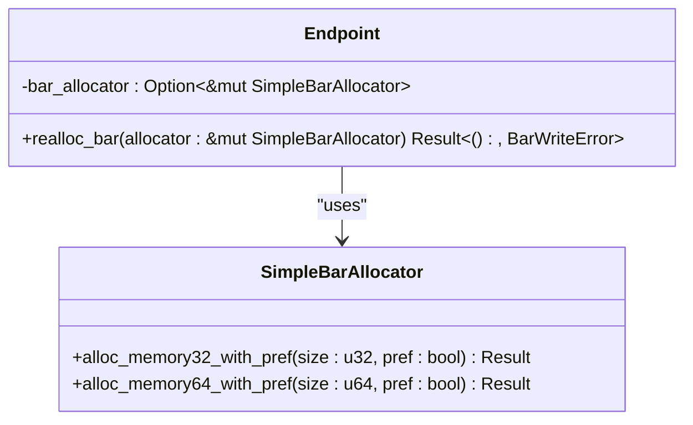
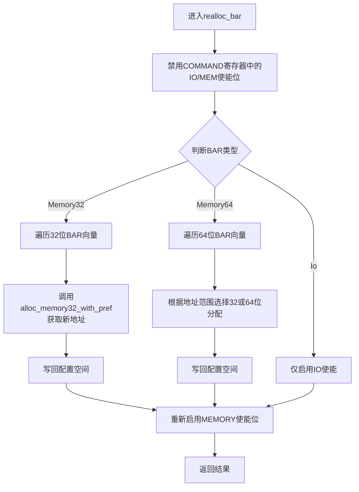
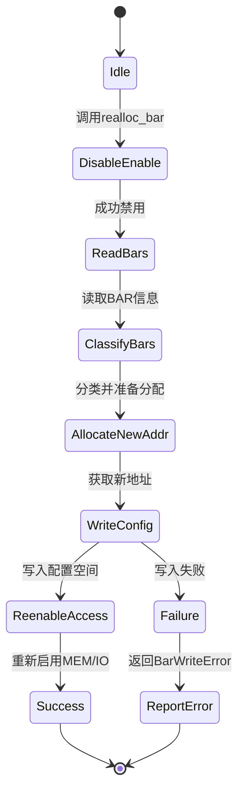

# BAR分配器集成

<cite>
**Referenced Files in This Document **   
- [bar_alloc.rs](file://src/bar_alloc.rs)
- [endpoint.rs](file://src/types/config/endpoint.rs)
- [err.rs](file://src/err.rs)
</cite>

## 目录
1. [引言](#引言)
2. [BAR重映射机制概述](#bar重映射机制概述)
3. [SimpleBarAllocator集成设计](#simplebarallocator集成设计)
4. [realloc_bar方法执行流程](#realloc_bar方法执行流程)
5. [典型使用场景分析](#典型使用场景分析)
6. [错误处理与异常路径](#错误处理与异常路径)
7. [扩展性与自定义策略](#扩展性与自定义策略)
8. [并发安全性考量](#并发安全性考量)

## 引言
在现代PCIe设备驱动开发中，基础地址寄存器（BAR）的动态重映射是一项关键功能。本文档深入解析`arceos_drivers/pcie`库中BAR分配器的集成机制，重点阐述`SimpleBarAllocator`如何通过`realloc_bar()`方法实现安全的资源重编程。该机制允许操作系统内核将设备BAR重新映射到高内存区域以避免地址冲突，同时保持对底层硬件抽象的灵活性。

## BAR重映射机制概述
BAR重映射是指在设备初始化过程中，由软件主导重新分配设备内存或I/O地址空间的过程。这一过程通常发生在固件设置之后、设备正式启用之前，其核心目的是解决物理地址空间冲突问题，并优化系统整体内存布局。

### 重映射必要性
直接使用固件预设的BAR地址存在以下风险：
- 地址空间碎片化
- 与内核保留区域发生冲突
- 缺乏统一的内存管理策略

因此，操作系统需要一个可控的重映射机制来确保设备资源被合理分配。

**Section sources**
- [endpoint.rs](file://src/types/config/endpoint.rs#L0-L237)

## SimpleBarAllocator集成设计
本库采用依赖注入的方式集成外部BAR分配策略，体现了清晰的关注点分离原则。



**Diagram sources **
- [bar_alloc.rs](file://src/bar_alloc.rs#L1)
- [endpoint.rs](file://src/types/config/endpoint.rs#L15)

如代码所示，`src/bar_alloc.rs`仅通过`pub use rdif_pcie::SimpleBarAllocator;`引入外部定义的分配器类型，表明本库不提供具体分配算法，而是依赖于`rdif_pcie`模块提供的策略实现。这种设计允许用户根据实际需求注入不同的分配逻辑，增强了系统的可扩展性和适应性。

## realloc_bar方法执行流程
`realloc_bar()`是BAR重映射的核心方法，其实现位于`endpoint.rs`文件中，遵循严格的硬件操作时序。

### 调用时机
该方法通常在`Endpoint::new()`构造函数中被调用，即设备实例化阶段，在任何数据传输开始前完成地址重编程。

### 执行步骤


**Diagram sources **
- [endpoint.rs](file://src/types/config/endpoint.rs#L45-L200)

#### 关键安全措施
1. **先关闭使能位**：在修改BAR值前，必须清除`CommandRegister::IO_ENABLE`和`CommandRegister::MEMORY_ENABLE`标志位，防止在重编程期间产生非法访问。
2. **批量更新后启用**：所有BAR更新完成后才重新开启内存使能，保证设备状态的一致性。
3. **错误传播机制**：任何配置写入失败都会通过`BarWriteError`向上层报告。

**Section sources**
- [endpoint.rs](file://src/types/config/endpoint.rs#L45-L200)

## 典型使用场景分析
最常见的应用场景是操作系统内核为避免地址冲突而进行的主动重映射。

例如，当检测到多个设备的BAR地址落在同一物理内存区间时，内核可通过以下方式调用本机制：

```rust
let mut allocator = MyCustomAllocator::new();
let endpoint = Endpoint::new(base, Some(&mut allocator));
```

在此过程中，`MyCustomAllocator`实现了`SimpleBarAllocator`接口，能够智能地将新BAR分配至高内存区域（如>4GB），从而避开传统低地址段的竞争。

该机制作为关键扩展点，允许开发者实现诸如：
- NUMA感知的地址分配
- 内存压缩下的紧凑布局
- 安全隔离区间的专用分配

**Section sources**
- [endpoint.rs](file://src/types/config/endpoint.rs#L15-L30)

## 错误处理与异常路径
尽管当前代码中未显式暴露`BarWriteError`的具体变体，但其存在表明了对硬件交互失败的预期管理。



**Diagram sources **
- [endpoint.rs](file://src/types/config/endpoint.rs#L45-L200)
- [err.rs](file://src/err.rs#L1-L10)

值得注意的是，当前项目中的`err.rs`定义了一个通用的`Error`枚举，但并未包含`BarWriteError`的具体定义，后者应来自`pci_types`或`rdif_pcie`依赖库。这提示我们在实际部署时需确保外部错误类型的正确传递与转换。

**Section sources**
- [err.rs](file://src/err.rs#L1-L10)

## 扩展性与自定义策略
本设计的最大优势在于其开放的分配策略接口。通过依赖`rdif_pcie::SimpleBarAllocator` trait，用户可以自由实现各种高级分配算法：

- **基于拓扑感知的分配**：结合CPU缓存亲和性优化DMA性能
- **安全沙箱模式**：限制设备只能访问特定受保护内存页
- **热插拔支持**：动态释放和重新分配已移除设备的BAR资源

这种解耦设计使得驱动核心无需关心“如何分配”，只需关注“何时分配”和“如何应用”，极大提升了代码的可维护性和复用性。

**Section sources**
- [bar_alloc.rs](file://src/bar_alloc.rs#L1)

## 并发安全性考量
对于专家级使用者而言，并发环境下的线程安全性是一个重要议题。

虽然当前代码未展示锁机制，但从`&mut self`和`&mut SimpleBarAllocator`的引用签名可以看出：
- `realloc_bar`要求独占访问`Endpoint`实例
- 分配器本身也需独占访问，暗示其内部可能维护状态

建议在多线程环境中：
1. 在设备枚举阶段集中完成BAR重映射
2. 使用互斥锁保护共享分配器实例
3. 避免在中断上下文或异步任务中执行重映射操作

未来可考虑引入`Sync + Send`约束并对分配器内部状态加锁，以支持更复杂的并发场景。

**Section sources**
- [endpoint.rs](file://src/types/config/endpoint.rs#L45-L200)