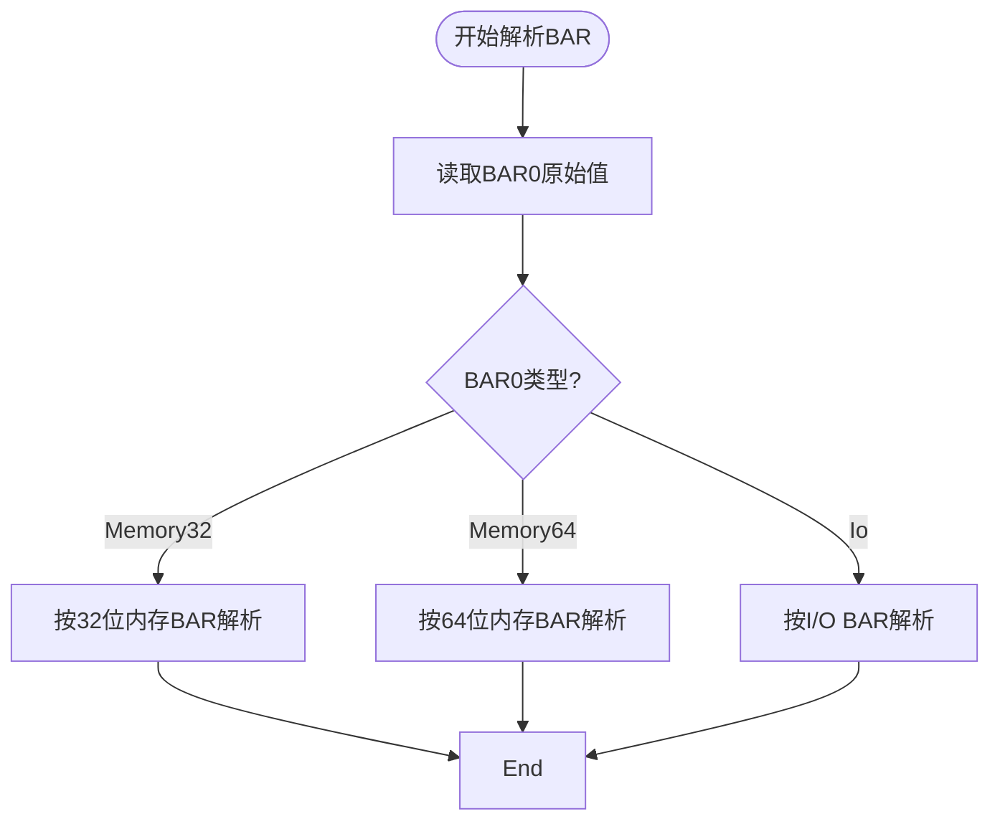
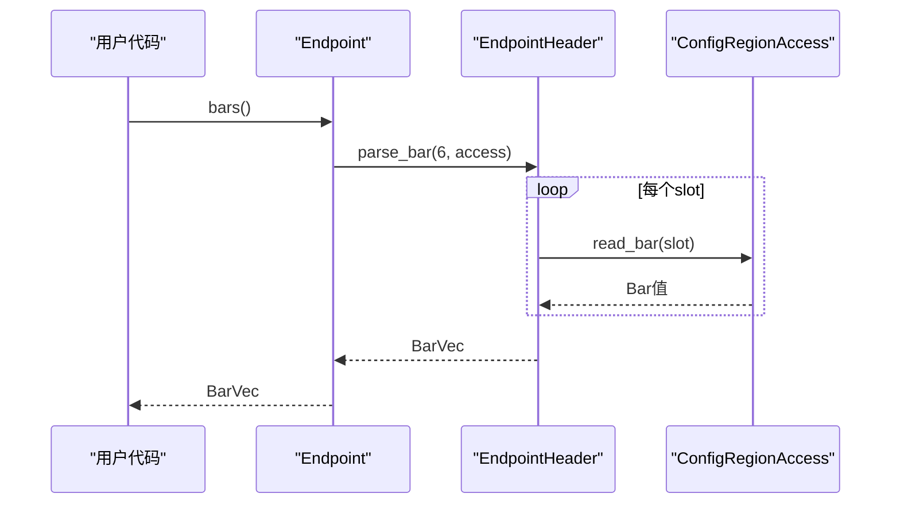
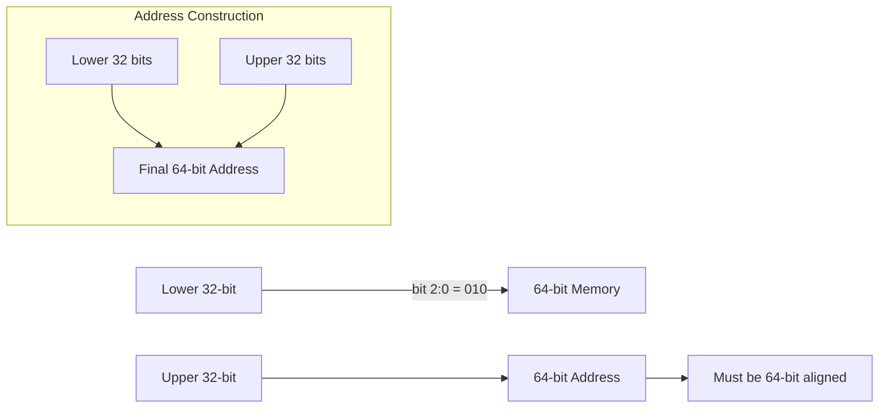

# BAR解析机制

<cite>
**本文档引用的文件**
- [bar.rs](file://src/types/bar.rs)
- [endpoint.rs](file://src/types/config/endpoint.rs)
</cite>

## 目录
1. [简介](#简介)
2. [BAR解析流程概述](#bar解析流程概述)
3. [BarVec枚举类型的作用](#barvec枚举类型的作用)
4. [Endpoint结构体与bars()方法](#endpoint结构体与bars方法)
5. [bar()方法与物理地址范围返回](#bar方法与物理地址范围返回)
6. [IO BAR未实现大小计算的原因](#io-bar未实现大小计算的原因)
7. [遍历所有BAR并判断有效性的代码示例](#遍历所有bar并判断有效性的代码示例)
8. [初学者指南：探测设备内存大小的设计原理](#初学者指南探测设备内存大小的设计原理)
9. [专家分析：64位BAR跨寄存器合并技术细节](#专家分析64位bar跨寄存器合并技术细节)
10. [Deref/DerefMut模式简化配置访问的优势](#derefderefmut模式简化配置访问的优势)

## 简介
本文详细阐述了PCIe设备中BAR（Base Address Register）寄存器的解析机制，重点介绍如何通过`bars()`方法解析6个标准BAR寄存器。我们将深入探讨`BarVec`枚举类型在表示不同地址空间和位宽时的作用，并结合`pci_types::Bar`与`EndpointHeader::parse_bar`的调用关系说明整个解析流程。

**Section sources**
- [bar.rs](file://src/types/bar.rs#L0-L248)
- [endpoint.rs](file://src/types/config/endpoint.rs#L0-L237)

## BAR解析流程概述
BAR解析的核心在于读取PCIe设备配置空间中的前六个双字（dword）寄存器，以确定每个BAR所映射的地址空间类型（内存或I/O）、位宽（32位或64位）以及是否可预取。该过程首先读取第一个BAR值，根据其类型决定后续解析策略。



**Diagram sources**
- [bar.rs](file://src/types/bar.rs#L46-L88)
- [endpoint.rs](file://src/types/config/endpoint.rs#L75-L81)

## BarVec枚举类型的作用
`BarVec`是一个关键的枚举类型，用于统一管理不同类型和位宽的BAR信息：

```rust
pub enum BarVec {
    Memory32(BarVecT<Bar32>),
    Memory64(BarVecT<Bar64>),
    Io(BarVecT<BarIO>),
}
```

它封装了三种可能的BAR配置：
- `Memory32`：表示32位内存映射BAR
- `Memory64`：表示64位内存映射BAR
- `Io`：表示I/O端口映射BAR

这种设计使得上层代码可以安全地处理不同类型的BAR而无需关心底层细节。

**Section sources**
- [bar.rs](file://src/types/bar.rs#L1-L20)

## Endpoint结构体与bars方法
`Endpoint`结构体代表一个PCIe终端设备，其`bars()`方法是BAR解析的入口点：

```rust
pub fn bars(&self) -> BarVec {
    self.header.parse_bar(6, &self.base.root)
}
```

此方法通过调用`EndpointHeader::parse_bar`来完成实际解析工作。`parse_bar`函数实现了完整的BAR探测逻辑，包括识别BAR类型、计算大小及地址对齐等。



**Diagram sources**
- [endpoint.rs](file://src/types/config/endpoint.rs#L75-L81)
- [bar.rs](file://src/types/bar.rs#L46-L88)

## bar方法与物理地址范围返回
`bar()`方法根据索引返回具体的物理地址范围（`Range<usize>`），便于直接进行内存映射操作：

```rust
pub fn bar(&self, index: usize) -> Option<Range<usize>> {
    assert!(index < 6, "BAR index out of range");
    let bars = self.bars();
    let r = match &bars {
        BarVec::Memory32(bar_vec) => {
            let b = bar_vec.get(index)?;
            b.address as usize..(b.address as usize + b.size as usize)
        }
        BarVec::Memory64(bar_vec) => {
            let b = bar_vec.get(index)?;
            b.address as usize..(b.address + b.size) as usize
        }
        BarVec::Io(_) => unimplemented!(),
    };
    Some(r)
}
```

该方法确保了地址转换的安全性，并提供了直观的地址区间表示。

**Section sources**
- [endpoint.rs](file://src/types/config/endpoint.rs#L38-L73)

## IO BAR未实现大小计算的原因
目前IO BAR的大小计算被标记为`unimplemented!()`，主要原因如下：
1. **历史兼容性**：传统PCI规范中I/O BAR通常固定为4字节。
2. **使用频率低**：现代设备多采用内存映射I/O而非端口I/O。
3. **复杂度权衡**：完整支持需要额外的探测逻辑，当前架构优先保证内存BAR的正确性。

未来可通过向`BarIO`添加`size`字段并实现相应探测逻辑来完善此功能。

**Section sources**
- [endpoint.rs](file://src/types/config/endpoint.rs#L70-L73)

## 遍历所有BAR并判断有效性的代码示例
以下是如何遍历所有BAR并检查其有效性的典型用法：

```rust
for i in 0..6 {
    if let Some(range) = endpoint.bar(i) {
        println!("BAR{} is valid: {:#x} - {:#x}", i, range.start, range.end);
    } else {
        println!("BAR{} is invalid or unused", i);
    }
}
```

或者更底层的方式：

```rust
let bars = endpoint.bars();
for (i, bar_opt) in bars.iter().enumerate() {
    if bar_opt.is_some() {
        println!("BAR{} data present", i);
    }
}
```

**Section sources**
- [endpoint.rs](file://src/types/config/endpoint.rs#L38-L73)
- [bar.rs](file://src/types/bar.rs#L170-L174)

## 初学者指南：探测设备内存大小的设计原理
PCIe规范要求驱动程序先向BAR写入全1再读回，以此探测设备所需的最小内存空间。设计原理如下：
1. **硬件响应**：设备会忽略地址线中它不使用的高位。
2. **大小计算**：读回值的低位连续1的数量指示了所需对齐大小。
3. **安全性**：避免分配过大或过小的资源。

例如，若读回`0xFFFFF000`，则表明需要4KB对齐，即大小为4KB。

**Section sources**
- [bar.rs](file://src/types/bar.rs#L46-L88)

## 专家分析：64位BAR跨寄存器合并技术细节
64位BAR占用两个连续的32位寄存器，带来特殊的对齐要求和技术挑战：



关键技术点：
- **对齐要求**：64位BAR必须位于64位边界上。
- **原子性**：修改时需同时更新两个寄存器。
- **顺序性**：先写高32位，再写低32位，防止中间状态导致错误映射。

**Diagram sources**
- [bar.rs](file://src/types/bar.rs#L60-L88)

## Deref/DerefMut模式简化配置访问的优势
`Endpoint`实现了`Deref`和`DerefMut` trait，使其能透明访问基类`PciHeaderBase`的方法：

```rust
impl Deref for Endpoint {
    type Target = PciHeaderBase;
    fn deref(&self) -> &Self::Target { &self.base }
}

impl DerefMut for Endpoint {
    fn deref_mut(&mut self) -> &mut Self::Target { &mut self.base }
}
```

优势包括：
- **接口简洁**：无需显式访问`.base`字段。
- **组合灵活**：可在保持扩展性的同时复用基础功能。
- **语义清晰**：表达“Endpoint IS-A PciHeaderBase”的继承关系。

**Section sources**
- [endpoint.rs](file://src/types/config/endpoint.rs#L174-L186)