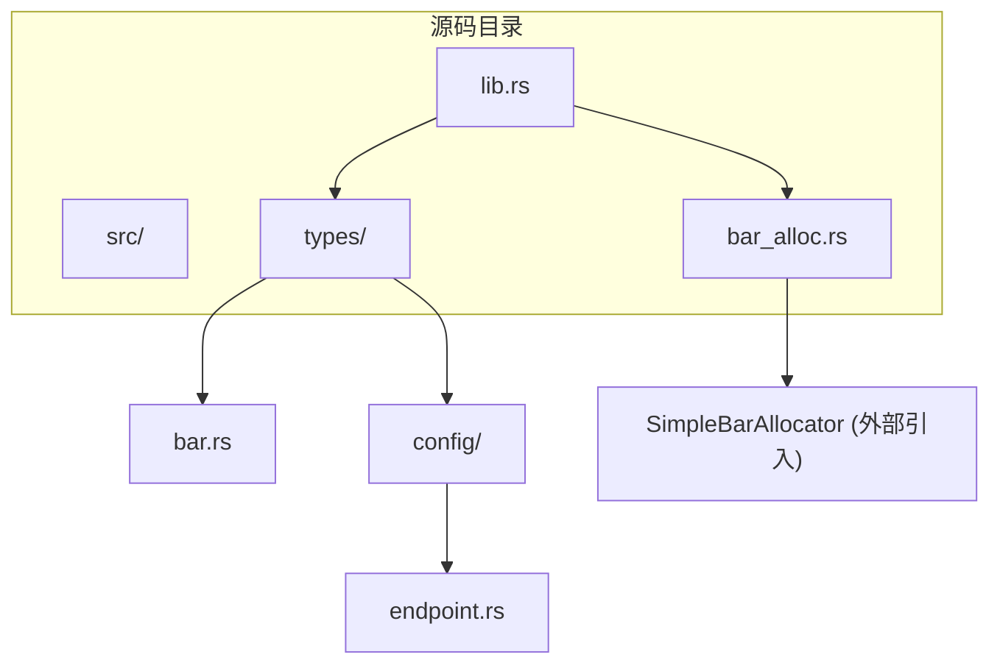
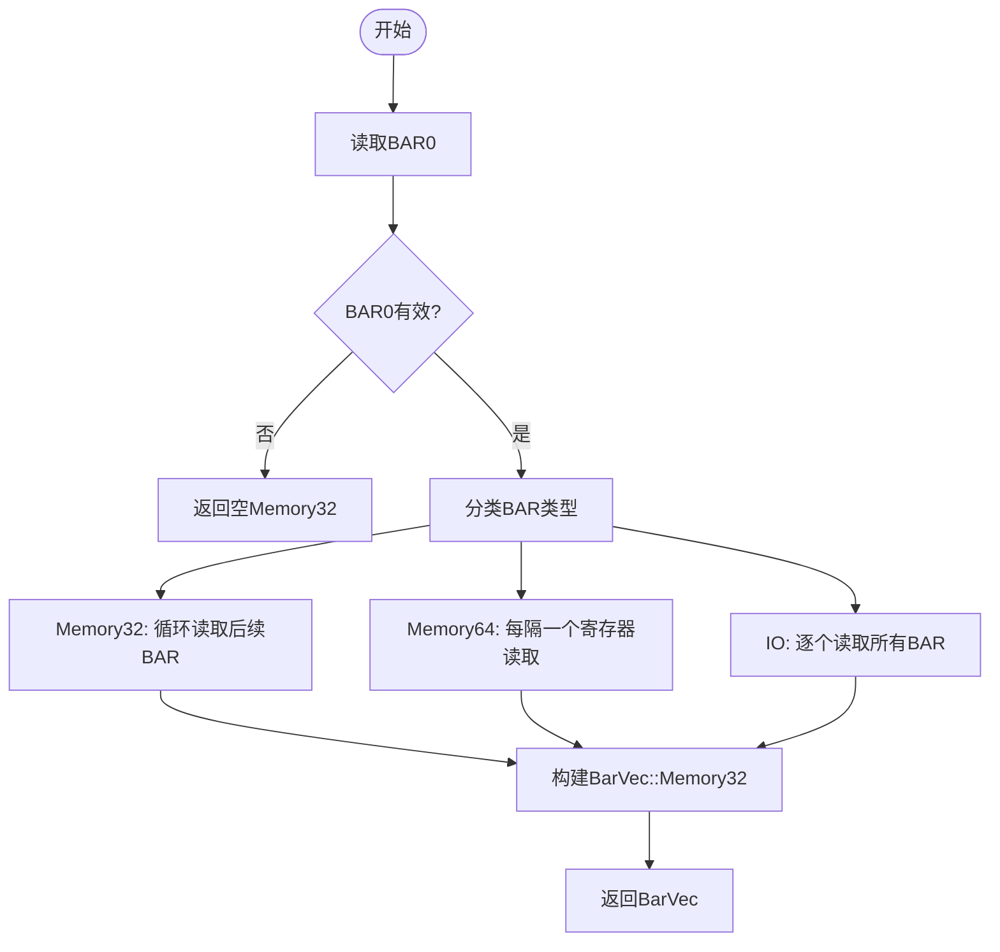
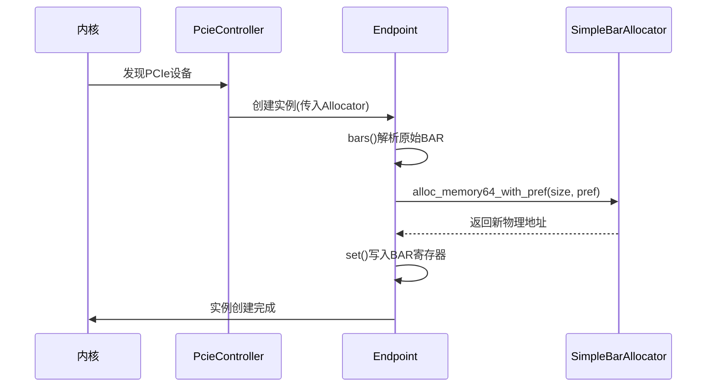

# BAR资源管理

<cite>
**本文档引用的文件**
- [endpoint.rs](file://src/types/config/endpoint.rs)
- [bar.rs](file://src/types/bar.rs)
- [bar_alloc.rs](file://src/bar_alloc.rs)
- [lib.rs](file://src/lib.rs)
</cite>

## 目录
1. [简介](#简介)
2. [项目结构](#项目结构)
3. [核心组件](#核心组件)
4. [架构概述](#架构概述)
5. [详细组件分析](#详细组件分析)
6. [依赖分析](#依赖分析)
7. [性能考虑](#性能考虑)
8. [故障排除指南](#故障排除指南)
9. [结论](#结论)

## 简介
本文档全面解析BAR（Base Address Register）资源管理机制，重点阐述PCIe设备中Endpoint如何通过`bars()`方法解析标准BAR寄存器，识别其类型与大小，并在设备启用前通过`realloc_bar()`函数重新映射内存区域以满足系统布局需求。同时介绍`SimpleBarAllocator`接口设计及其集成方式，说明典型使用场景及可扩展点。

## 项目结构
本项目为PCIe驱动模块，采用分层结构组织代码，主要包含芯片抽象、类型定义、BAR分配器等组件。核心功能集中在`types`目录下的配置解析与BAR管理。



**Diagram sources**
- [lib.rs](file://src/lib.rs#L1-L22)
- [bar_alloc.rs](file://src/bar_alloc.rs#L1)

## 核心组件

`Endpoint`结构体是BAR管理的核心实体，负责解析设备的6个标准BAR寄存器并支持重分配。`BarVec`枚举封装了不同类型的BAR向量（32位内存、64位内存、IO空间），而`SimpleBarAllocator`提供地址分配策略。

**Section sources**
- [endpoint.rs](file://src/types/config/endpoint.rs#L0-L238)
- [bar.rs](file://src/types/bar.rs#L0-L249)

## 架构概述

系统通过分层协作实现BAR资源管理：`PcieController`发现设备后创建`Endpoint`实例；`Endpoint`调用`bars()`解析原始BAR信息；若提供分配器，则触发`realloc_bar()`进行重映射；最终由外部分配器返回新物理地址写入寄存器。

```mermaid
graph LR
Controller[PcieController] --> Enumerate[enumerate_by_controller]
Enumerate --> CreateEndpoint[创建Endpoint]
CreateEndpoint --> ParseBAR[bars()解析BAR]
ParseBAR --> CheckAllocator{是否有分配器?}
CheckAllocator --> |是| Realloc[realloc_bar()]
Realloc --> Allocate[调用alloc_memory*]
Allocate --> WriteBAR[写入新BAR值]
WriteBAR --> EnableDevice[启用设备]
```

**Diagram sources**
- [lib.rs](file://src/lib.rs#L22)
- [endpoint.rs](file://src/types/config/endpoint.rs#L15-L25)

## 详细组件分析

### Endpoint结构体分析

`Endpoint`在初始化时接收可选的`SimpleBarAllocator`引用，若存在则立即调用`realloc_bar()`完成BAR重映射。该过程确保设备在启用前已获得符合系统要求的内存布局。

#### BAR解析流程


**Diagram sources**
- [bar.rs](file://src/types/bar.rs#L46-L131)
- [endpoint.rs](file://src/types/config/endpoint.rs#L79-L88)

#### realloc_bar调用时机与意义
当操作系统内核发现网卡等设备后，需为其MMIO BAR分配高地址区域避免冲突。此时注入自定义`SimpleBarAllocator`，在`Endpoint::new()`中自动触发`realloc_bar()`，实现地址重映射。



**Diagram sources**
- [endpoint.rs](file://src/types/config/endpoint.rs#L107-L172)
- [bar.rs](file://src/types/bar.rs#L169-L207)

### 初学者指导：为何要先读取原始BAR？

必须先读取原始BAR值才能探测设备所需的内存或IO空间大小。硬件规范规定：向BAR写入全1再读回，可获取设备所需空间的最低位对齐掩码，从而计算出实际大小。这是PCIe枚举的标准步骤。

### 专家级细节：64位BAR跨双寄存器合并

64位BAR占用两个连续的32位寄存器槽位。例如BAR0和BAR1共同构成第一个64位BAR。代码中通过`i * 2`索引访问起始位置，并将整个64位值写入低32位寄存器（高32位自动处理）。这种设计符合PCI Local Bus Specification要求。

**Section sources**
- [bar.rs](file://src/types/bar.rs#L90-L131)
- [endpoint.rs](file://src/types/config/endpoint.rs#L140-L172)

## 依赖分析

系统依赖外部crate `rdif_pcie`提供`SimpleBarAllocator` trait和底层访问接口。当前实现将分配逻辑解耦，允许不同平台注入定制化分配器，属于关键可扩展点。

```mermaid
dependencyDiagram
arceos_drivers --> rdif_pcie : 使用
rdif_pcie --> SimpleBarAllocator : 定义
arceos_drivers --> pci_types : 使用
pci_types --> Bar : 定义
```

**Diagram sources**
- [bar_alloc.rs](file://src/bar_alloc.rs#L1)
- [lib.rs](file://src/lib.rs#L7)

## 性能考虑

BAR重分配发生在设备初始化阶段，属于一次性开销。由于涉及多次配置空间读写操作，建议批量处理多个设备以减少总线延迟影响。此外，分配器应尽量快速响应，避免阻塞枚举流程。

## 故障排除指南

常见问题包括BAR写入失败或地址未生效。检查项：
- 是否在重编程前禁用了IO/MEMEN位
- 分配器返回的地址是否满足对齐要求
- 设备是否支持所请求的预取属性
- 配置访问权限是否正确

**Section sources**
- [endpoint.rs](file://src/types/config/endpoint.rs#L107-L172)

## 结论

本系统通过清晰的分层设计实现了灵活的BAR资源管理。`Endpoint`结构体封装了解析与重分配逻辑，`SimpleBarAllocator`接口支持外部策略注入，适用于多种嵌入式与服务器场景。理解BAR探测与重映射机制对于开发稳定高效的PCIe驱动至关重要。