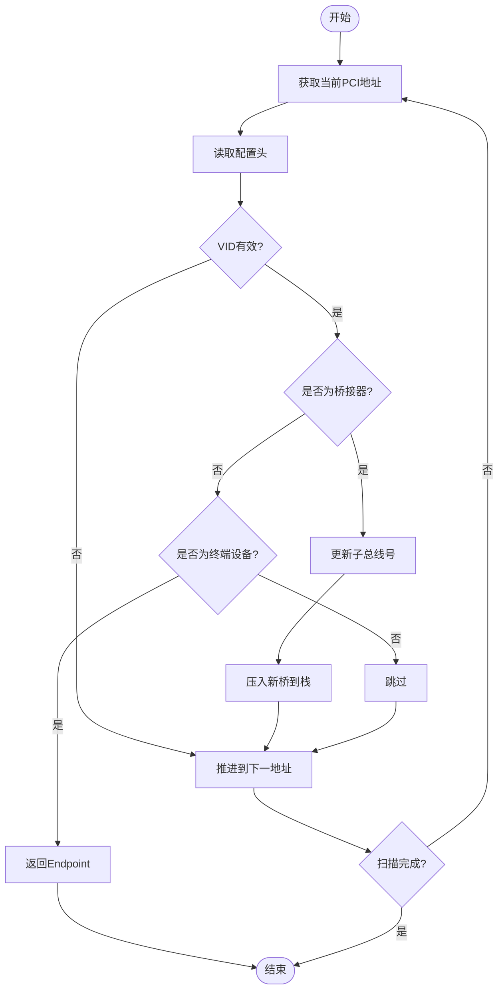

# 函数API

<cite>
**本文档引用的文件**  
- [root.rs](file://src/root.rs)
- [chip/mod.rs](file://src/chip/mod.rs)
- [types/config/endpoint.rs](file://src/types/config/endpoint.rs)
- [types/config/pci_bridge.rs](file://src/types/config/pci_bridge.rs)
- [types/config/mod.rs](file://src/types/config/mod.rs)
- [lib.rs](file://src/lib.rs)
</cite>

## 目录
1. [函数原型说明](#函数原型说明)
2. [参数详解](#参数详解)
3. [返回值特性](#返回值特性)
4. [遍历机制分析](#遍历机制分析)
5. [调用示例](#调用示例)
6. [常见错误与生命周期建议](#常见错误与生命周期建议)

## 函数原型说明

`enumerate_by_controller` 函数是 PCIe 设备枚举的核心入口，其原型定义如下：

```rust
pub fn enumerate_by_controller<'a>(
    controller: &'a mut PcieController,
    range: Option<core::ops::Range<usize>>,
) -> impl Iterator<Item = Endpoint> + 'a
```

该函数接受一个对 `PcieController` 的可变引用和一个可选的总线编号范围，返回一个惰性求值的迭代器，用于遍历所有有效的 PCIe 终端设备（`Endpoint`）。函数通过生命周期 `'a` 确保返回的迭代器与输入的控制器引用具有相同的生命周期，防止悬垂引用。

**Section sources**  
- [root.rs](file://src/root.rs#L15-L38)

## 参数详解

### controller 参数

`controller` 是一个对 `PcieController` 类型的可变引用，用于执行 MMIO（Memory-Mapped I/O）操作以访问 PCIe 配置空间。该控制器实现了 `rdif_pcie::Interface` trait，提供 `read` 和 `write` 方法，用于读写特定 PCI 地址的配置寄存器。

在 `chip/mod.rs` 中，`PcieGeneric` 结构体实现了该接口，通过 `mmio_addr` 方法将 PCI 地址转换为物理内存地址，并使用 `read_volatile` 和 `write_volatile` 进行安全的内存访问。

### range 参数

`range` 是一个可选的 `core::ops::Range<usize>` 类型，用于限定扫描的总线范围。若未提供（即 `None`），默认范围为 `0..256`，覆盖所有可能的 PCIe 总线（0x00 到 0xFF）。

该参数允许用户限制枚举范围，提高扫描效率，尤其在已知设备分布的系统中非常有用。

**Section sources**  
- [root.rs](file://src/root.rs#L15-L38)
- [chip/mod.rs](file://src/chip/mod.rs#L30-L50)

## 返回值特性

函数返回一个实现了 `Iterator<Item = Endpoint>` 的类型，其关键特性是**惰性求值**：配置空间的读取仅在调用 `next()` 时发生，而非在枚举开始时一次性读取所有设备。

迭代器会自动跳过无效设备：
- 当读取的设备 VID（Vendor ID）为 `0xFFFF` 时，表示该设备不存在或未响应，迭代器将跳过该地址。
- 对于 `CardBusBridge` 或 `Unknown` 类型的设备，迭代器同样会跳过，仅处理 `Endpoint` 和 `PciPciBridge`。

这种设计显著提升了性能，避免了对空闲地址的无效访问。

**Section sources**  
- [root.rs](file://src/root.rs#L37-L69)
- [types/config/mod.rs](file://src/types/config/mod.rs#L50-L70)

## 遍历机制分析

`enumerate_by_controller` 返回的迭代器类型为 `PciIterator`，其实现了基于栈的深度优先遍历（DFS）算法，用于处理 PCI-PCI 桥接器并递归进入次级总线。

### 核心数据结构

`PciIterator` 维护一个 `Vec<Bridge>` 类型的栈，每个 `Bridge` 包含一个 `PciPciBridge` 实例和当前设备编号。栈底为 `Bridge::root(range.start as _)`，表示从指定起始总线开始扫描。

### 遍历流程

1. **获取当前地址**：通过 `address()` 方法，从栈顶 `Bridge` 获取当前要扫描的 `PciAddress`。
2. **读取配置头**：调用 `PciHeaderBase::new` 读取该地址的配置头，若 VID 为 `0xFFFF` 则返回 `None`。
3. **分类处理**：
   - 若为 `Endpoint`，返回设备实例并推进到下一个地址。
   - 若为 `PciPciBridge`，更新所有父桥的 `subordinate_bus_number`，并将新桥压入栈中，开始扫描其下游总线。
4. **地址推进**：通过 `is_next_function_max` 和 `next_device_not_ok` 方法实现设备和功能号的递增，支持多功能设备的扫描。



**Diagram sources**  
- [root.rs](file://src/root.rs#L37-L191)

**Section sources**  
- [root.rs](file://src/root.rs#L37-L191)
- [types/config/pci_bridge.rs](file://src/types/config/pci_bridge.rs#L20-L80)

## 调用示例

以下示例展示如何使用 `enumerate_by_controller` 枚举设备，并限制总线范围：

```rust
let mut drv = PcieController::new(PcieGeneric::new(base_vaddr));
// 仅扫描总线 0 到 10
for mut ep in enumerate_by_controller(&mut drv, Some(0..11)) {
    println!("{}", ep);
    // 启用设备的内存访问
    ep.update_command(|mut cmd| {
        cmd.insert(CommandRegister::MEMORY_ENABLE);
        cmd
    });
}
```

在测试代码中，`tests/test.rs` 提供了完整的调用流程，包括 BAR（Base Address Register）信息打印和能力列表遍历。

**Section sources**  
- [root.rs](file://src/root.rs#L15-L38)
- [tests/test.rs](file://tests/test.rs#L45-L101)

## 常见错误与生命周期建议

### 借用冲突

最常见的错误是控制器生命周期不足导致的借用冲突。由于返回的迭代器持有对 `controller` 的可变引用，若在迭代过程中尝试再次借用该控制器，将导致编译错误。

**错误示例**：
```rust
let mut iter = enumerate_by_controller(&mut drv, None);
let _ = drv.some_method(); // 错误：drv 已被借用
```

### 生命周期最佳实践

- **最小化借用范围**：尽快完成枚举操作，避免长时间持有迭代器。
- **避免嵌套借用**：不要在枚举过程中调用可能借用同一控制器的方法。
- **使用作用域分离**：将枚举操作放在独立的作用域中，确保借用及时释放。

```rust
{
    let mut iter = enumerate_by_controller(&mut drv, None);
    for ep in iter {
        // 处理设备
    }
}
// 此处可安全使用 drv
```

**Section sources**  
- [root.rs](file://src/root.rs#L15-L38)
- [chip/mod.rs](file://src/chip/mod.rs#L30-L50)