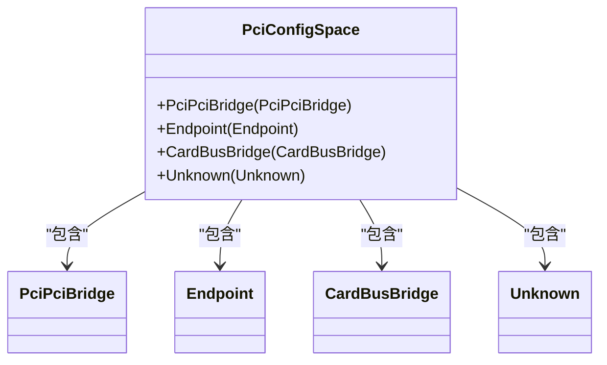
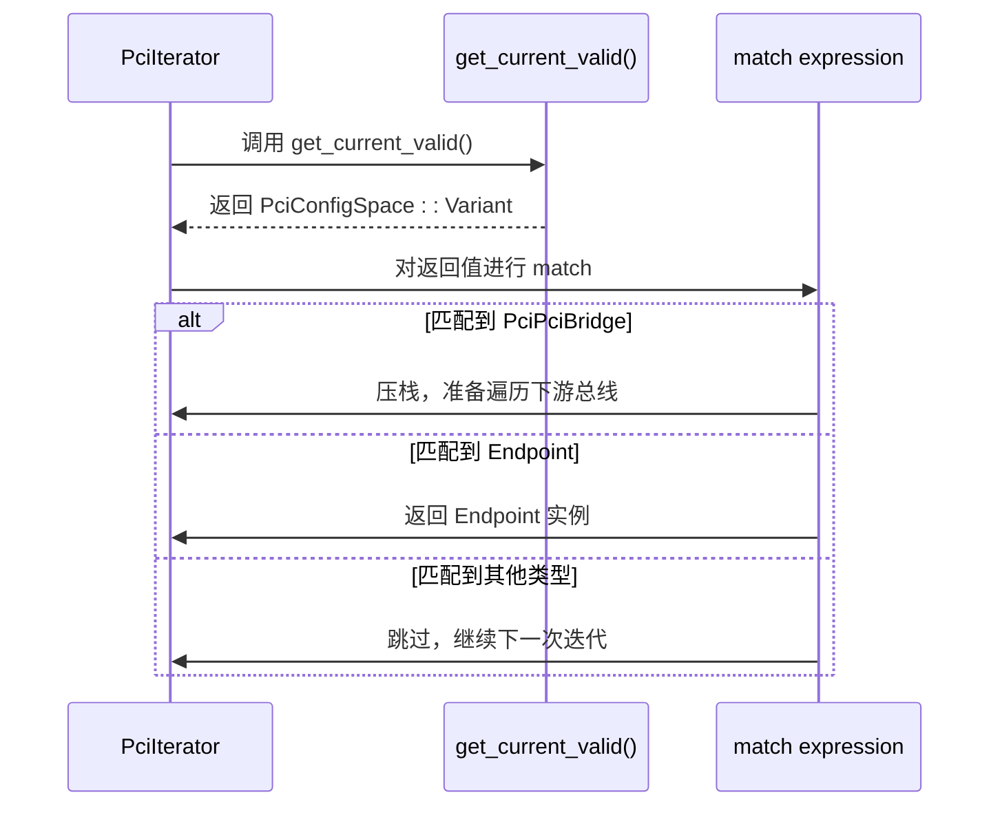
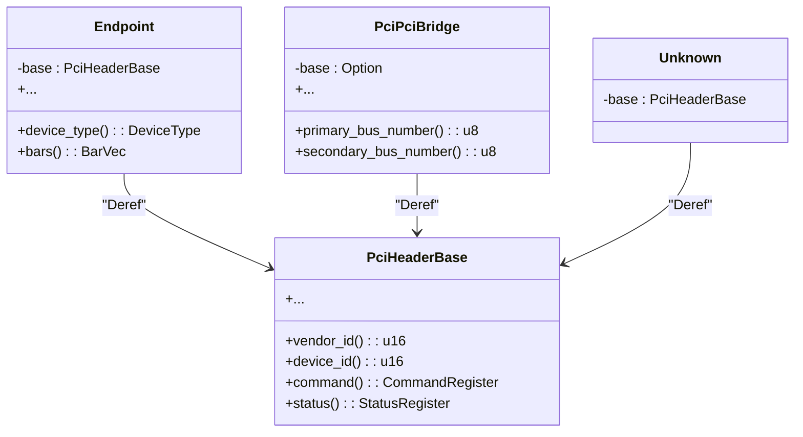

<cite>
**Referenced Files in This Document**
- [root.rs](file://src/root.rs)
- [types/config/mod.rs](file://src/types/config/mod.rs)
- [lib.rs](file://src/lib.rs)
- [chip/mod.rs](file://src/chip/mod.rs)
- [types/config/endpoint.rs](file://src/types/config/endpoint.rs)
- [types/config/pci_bridge.rs](file://src/types/config/pci_bridge.rs)
- [types/config/unknown.rs](file://src/types/config/unknown.rs)
</cite>

## 目录
1. [引言](#引言)
2. [核心枚举类型 PciConfigSpace](#核心枚举类型-pciconfigspace)
3. [动态分发机制分析](#动态分发机制分析)
4. [Trait 接口与硬件抽象层](#trait-接口与硬件抽象层)
5. [通用访问方法与 Deref 继承链](#通用访问方法与-deref-继承链)
6. [扩展指南](#扩展指南)
7. [结论](#结论)

## 引言

本文档旨在全面解析 `arceos_drivers/pcie` 项目中的核心设计模式，重点围绕公共枚举类型 `PciConfigSpace` 及其在 PCI 设备枚举过程中的作用。文档将深入探讨基于 `enum_dispatch` 模式的无开销多态实现、关键 Trait 接口定义的硬件抽象契约，以及通过 `Deref` 特性构建的继承体系。目标是为开发者提供一份清晰、详尽的技术参考，以便理解现有代码逻辑并安全地进行功能扩展。

## 核心枚举类型 PciConfigSpace

`PciConfigSpace` 是一个关键的公共枚举（enum），位于 `src/types/config/mod.rs` 文件中，用于统一表示和区分不同类型的 PCI 设备配置空间。该枚举通过其变体（variants）对设备进行分类，实现了类型安全的设备处理。

**Diagram sources**
- [types/config/mod.rs](file://src/types/config/mod.rs#L10-L14)

### 枚举变体详解

1.  **`Endpoint`**: 表示标准的 PCI 端点设备（如网卡、显卡）。这是最常见的设备类型。
2.  **`PciPciBridge`**: 表示 PCI-to-PCI 桥接器，用于连接不同的 PCI 总线段。
3.  **`CardBusBridge`**: 表示 CardBus 桥接器。根据代码注释，此功能当前未实现（`todo!()`）。
4.  **`Unknown`**: 表示无法识别或不支持的设备类型。同样，此分支在枚举逻辑中被跳过。

**Section sources**
- [types/config/mod.rs](file://src/types/config/mod.rs#L10-L14)

## 动态分发机制分析

`PciConfigSpace` 枚举的核心应用体现在 `src/root.rs` 文件中的 `PciIterator::next` 方法里。该方法利用 `match` 表达式对 `PciConfigSpace` 的不同变体进行模式匹配，从而实现针对不同设备类型的“动态分发”处理逻辑。

### 处理流程

1.  **获取设备信息**: `get_current_valid` 方法首先读取当前 PCI 地址的头部信息，并根据 `header_type()` 返回值创建对应的 `PciConfigSpace` 实例。
2.  **模式匹配分发**: 在 `next` 方法中，通过 `match` 表达式检查 `PciConfigSpace` 的具体类型：
    *   **`PciPciBridge`**: 当发现桥接器时，将其压入内部栈（`stack`），并更新总线编号范围，以便后续遍历其下游总线上的设备。
    *   **`Endpoint`**: 当发现端点设备时，直接返回该设备实例作为迭代器的下一个元素。
    *   **`CardBusBridge` 或 `Unknown`**: 这些类型目前不被处理，会被简单地跳过。

这种基于 `enum` 和 `match` 的模式被称为 `enum_dispatch`。它是一种零成本抽象（zero-cost abstraction），因为编译器在编译时就能确定所有可能的分支，生成高效的条件跳转指令，避免了传统面向对象编程中虚函数调用的运行时开销。

**Diagram sources**
- [root.rs](file://src/root.rs#L38-L59)

**Section sources**
- [root.rs](file://src/root.rs#L38-L59)

## Trait 接口与硬件抽象层

项目通过精心设计的 Trait 接口来实现硬件无关的抽象，确保驱动代码的可移植性和模块化。

### Controller (rdif_pcie::Interface)

`Controller` 并非本项目内定义的 Trait，而是对 `rdif_pcie::Interface` 的重导出（re-export），位于 `src/lib.rs` 文件中。它是整个驱动与底层硬件交互的核心契约。

*   **核心方法**:
    *   `read(&mut self, address: PciAddress, offset: u16) -> u32`: 从指定 PCI 设备的配置空间偏移处读取一个 32 位值。
    *   `write(&mut self, address: PciAddress, offset: u16, value: u32)`: 向指定 PCI 设备的配置空间偏移处写入一个 32 位值。
*   **实现**: `src/chip/mod.rs` 中的 `PcieGeneric` 结构体实现了 `Interface` Trait，提供了具体的 MMIO（内存映射 I/O）读写逻辑。

### ConfigAccess Trait

`ConfigAccess` Trait 来自外部依赖 `rdif_pcie`，并在 `src/types/config/mod.rs` 中被引入使用。它封装了对 PCI 配置空间的访问权限，通常由 `PciHeaderBase` 内部持有。`PciHeaderBase` 的 `read` 和 `write` 方法会委托给其持有的 `ConfigAccess` 实例，从而间接调用 `Controller` 的 `read`/`write` 方法。

**Section sources**
- [lib.rs](file://src/lib.rs#L10)
- [chip/mod.rs](file://src/chip/mod.rs#L38-L47)
- [types/config/mod.rs](file://src/types/config/mod.rs#L17)

## 通用访问方法与 Deref 继承链

`PciHeaderBase` 结构体提供了对 PCI 设备通用属性的访问方法，如 `vendor_id()`, `device_id()`, `command()`, `status()` 等。这些方法构成了上层设备类型的基础。

为了使 `Endpoint` 和 `PciPciBridge` 能够直接使用这些通用方法，项目采用了 Rust 的 `Deref` 特性来构建一个隐式的继承链。

### Deref 实现

*   **`Endpoint`**: 在 `src/types/config/endpoint.rs` 中，`Endpoint` 实现了 `Deref<Target = PciHeaderBase>`。这意味着当调用 `Endpoint` 实例的方法时，如果该方法在 `Endpoint` 自身不存在，编译器会自动解引用到其内部的 `base` 字段（即 `PciHeaderBase`），并尝试在 `PciHeaderBase` 上调用该方法。
*   **`PciPciBridge`**: 在 `src/types/config/pci_bridge.rs` 中，`PciPciBridge` 同样实现了 `Deref<Target = PciHeaderBase>`，实现了相同的效果。
*   **`Unknown`**: 在 `src/types/config/unknown.rs` 中，`Unknown` 也通过 `Deref` 将其行为委托给 `PciHeaderBase`。

这种设计模式使得 `Endpoint` 和 `PciPciBridge` 能够“继承” `PciHeaderBase` 的所有公共方法，而无需手动编写大量的委托函数，极大地简化了代码并保持了 API 的一致性。

**Diagram sources**
- [types/config/endpoint.rs](file://src/types/config/endpoint.rs#L228-L235)
- [types/config/pci_bridge.rs](file://src/types/config/pci_bridge.rs#L98-L105)
- [types/config/unknown.rs](file://src/types/config/unknown.rs#L14-L20)

**Section sources**
- [types/config/endpoint.rs](file://src/types/config/endpoint.rs#L228-L235)
- [types/config/pci_bridge.rs](file://src/types/config/pci_bridge.rs#L98-L105)
- [types/config/unknown.rs](file://src/types/config/unknown.rs#L14-L20)

## 扩展指南

若需在未来新增一种 PCI 设备类型（例如 `ExpressBridge`），应遵循以下步骤以确保安全和一致性：

1.  **创建新模块**: 在 `src/types/config/` 目录下创建一个新的 `.rs` 文件（如 `express_bridge.rs`），定义新的结构体 `ExpressBridge`。
2.  **实现基础功能**: `ExpressBridge` 应包含一个 `PciHeaderBase` 类型的字段，并实现其特有的业务逻辑。
3.  **实现 Deref**: 为 `ExpressBridge` 实现 `Deref<Target = PciHeaderBase>`，使其能够访问通用的 PCI 属性。
4.  **更新枚举**: 在 `src/types/config/mod.rs` 中，向 `PciConfigSpace` 枚举添加一个新的变体 `ExpressBridge(ExpressBridge)`。
5.  **更新模块声明**: 在 `src/types/config/mod.rs` 的 `mod` 声明和 `pub use` 列表中加入新模块。
6.  **修改枚举逻辑**: 在 `src/root.rs` 的 `get_current_valid` 方法中，增加对新设备类型 `HeaderType` 的判断，并返回相应的 `PciConfigSpace::ExpressBridge` 实例。
7.  **处理分发逻辑**: 在 `PciIterator::next` 的 `match` 表达式中，根据新设备的行为决定如何处理（例如，是否需要像桥接器一样压栈）。

通过以上步骤，可以无缝地将新设备类型集成到现有的枚举和分发框架中，同时保持代码的类型安全和低耦合。

## 结论

本文档详细剖析了 `arceos_drivers/pcie` 项目中 `PciConfigSpace` 枚举及其相关组件的设计与实现。通过 `enum_dispatch` 模式，项目实现了高效、无开销的多态行为；通过 `Controller` 和 `ConfigAccess` 等 Trait，建立了清晰的硬件抽象层；通过 `Deref` 特性，构建了简洁的继承关系，复用了通用功能。这一系列设计模式共同构成了一个健壮、可扩展且易于维护的 PCI 驱动架构。