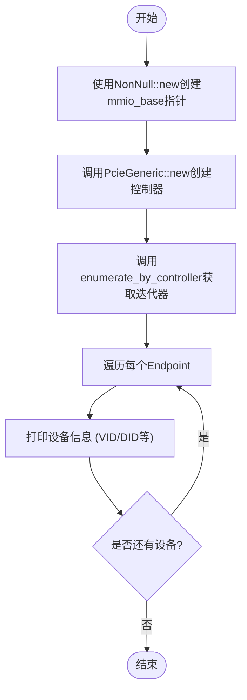

# 快速开始指南

<cite>
**本文档中引用的文件**  
- [lib.rs](file://src/lib.rs)
- [chip/mod.rs](file://src/chip/mod.rs)
- [root.rs](file://src/root.rs)
- [types/config/endpoint.rs](file://src/types/config/endpoint.rs)
- [types/config/mod.rs](file://src/types/config/mod.rs)
</cite>

## 目录
1. [简介](#简介)
2. [核心初始化流程](#核心初始化流程)
3. [设备枚举与遍历](#设备枚举与遍历)
4. [公共API导出说明](#公共api导出说明)
5. [运行前提条件](#运行前提条件)
6. [常见错误及解决方案](#常见错误及解决方案)
7. [总结](#总结)

## 简介
本文档旨在指导用户在 `no-std` 环境下快速上手本PCIe驱动库，重点介绍如何初始化 `PcieGeneric` 实例并执行设备枚举。通过详细步骤说明和关键参数解释，帮助开发者理解库的核心工作流程，为后续开发打下基础。

**Section sources**
- [lib.rs](file://src/lib.rs#L1-L22)

## 核心初始化流程
在 `no-std` 环境中使用本库的第一步是创建 `PcieGeneric` 控制器实例。该实例通过内存映射I/O（MMIO）方式访问PCIe配置空间。

首先，需获取有效的MMIO基地址指针，并使用 `NonNull::new` 构造一个非空指针以确保安全性。`NonNull` 类型保证了指针不为空，这是安全访问硬件寄存器的前提。

随后调用 `PcieGeneric::new` 方法传入该指针，创建控制器对象。此对象实现了 `Interface` trait，封装了对PCIe配置空间的读写操作，底层通过 `mmio_addr` 计算偏移地址并执行 `read_volatile` / `write_volatile` 操作。

**Section sources**
- [chip/mod.rs](file://src/chip/mod.rs#L10-L50)

## 设备枚举与遍历
创建控制器后，调用 `enumerate_by_controller` 函数启动设备枚举过程。该函数接受两个参数：
- `controller`: 可变引用到 `PcieController` 实例
- `range`: 可选的总线扫描范围（`Range<usize>`），用于限定搜索的PCIe总线号区间

若未指定 `range`（传入 `None`），默认扫描所有可能的总线（`0..0x100`）。函数返回一个 `PciIterator` 迭代器，可遍历所有发现的PCIe终端设备（Endpoint）。

遍历时，每个 `Endpoint` 对象包含完整的PCI配置头信息，可通过 `.vendor_id()` 和 `.device_id()` 获取VID/DID，并通过 `Display` 格式化输出设备信息。此外，还可访问BAR、中断引脚、子系统ID等属性。

**Diagram sources**
- [root.rs](file://src/root.rs#L0-L192)
- [types/config/endpoint.rs](file://src/types/config/endpoint.rs#L0-L237)

**Section sources**
- [root.rs](file://src/root.rs#L0-L192)
- [types/config/endpoint.rs](file://src/types/config/endpoint.rs#L0-L237)

## 公共API导出说明
根据 `lib.rs` 中的模块导出声明，以下符号可供外部调用：

- `pub use chip::PcieGeneric;`：暴露 `PcieGeneric` 结构体，用于创建底层驱动实例
- `pub use root::enumerate_by_controller;`：暴露设备枚举主函数，启动设备发现流程
- `pub use rdif_pcie::Interface as Controller;` 和 `PcieController`：提供控制器抽象接口
- `pub use types::*;`：导出所有类型定义，如 `PciAddress`、`Endpoint`、`BarVec` 等

这些公共接口构成了库的外部调用入口，开发者应基于这些符号构建应用逻辑。

**Section sources**
- [lib.rs](file://src/lib.rs#L1-L22)

## 运行前提条件
成功运行此代码需满足以下前提条件：

1. **全局分配器设置**：由于库中使用了 `alloc` 宏（如 `vec![]`），必须在 `no-std` 环境中正确配置全局分配器（如 `GlobalAlloc` 实现），否则会导致编译失败或运行时panic。
2. **日志钩子配置**：库中使用 `log` 宏进行调试输出（如 `info!`, `error!`），需在运行环境中注册合适的日志驱动（logger），否则日志将被忽略。
3. **MMIO地址映射有效**：传入的 `mmio_base` 必须指向正确的ECAM（Enhanced Configuration Access Mechanism）内存区域，且该区域已在物理内存中正确映射，否则会导致访问非法地址而panic。

**Section sources**
- [lib.rs](file://src/lib.rs#L3-L5)
- [root.rs](file://src/root.rs#L1-L192)

## 常见错误及解决方案
### 编译失败：未启用alloc
**现象**：编译时报错找不到 `alloc` 相关类型或宏。  
**原因**：`no-std` 环境下未正确链接 `alloc` crate 或未实现全局分配器。  
**解决方案**：确保在项目中引入了 `alloc` 并实现了 `#[global_allocator]`。

### 运行时panic：MMIO地址无效
**现象**：程序在调用 `read` 或 `write` 时发生段错误或异常中断。  
**原因**：`mmio_base` 指针指向未映射或受保护的内存区域。  
**解决方案**：确认ECAM基地址正确，并在操作系统或固件层面完成物理内存映射。

### 枚举无设备输出
**现象**：迭代器返回空，无任何设备信息打印。  
**原因**：总线扫描范围过窄或硬件连接异常。  
**解决方案**：尝试传入 `Some(0..256)` 显式指定全范围扫描，并检查硬件连接状态。

**Section sources**
- [chip/mod.rs](file://src/chip/mod.rs#L30-L50)
- [root.rs](file://src/root.rs#L0-L192)

## 总结
本文档介绍了在 `no-std` 环境下使用本PCIe驱动库的核心路径：从 `PcieGeneric` 初始化到设备枚举全流程。掌握这一基础流程是理解整个库工作机制的关键。通过合理配置运行环境、正确调用公共API并处理常见问题，开发者可快速实现PCIe设备的识别与管理。

**Section sources**
- [lib.rs](file://src/lib.rs#L1-L22)
- [chip/mod.rs](file://src/chip/mod.rs#L10-L50)
- [root.rs](file://src/root.rs#L0-L192)