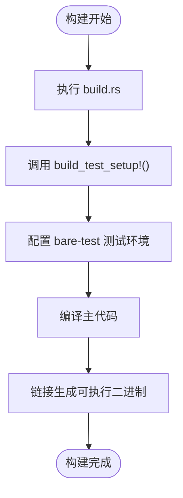
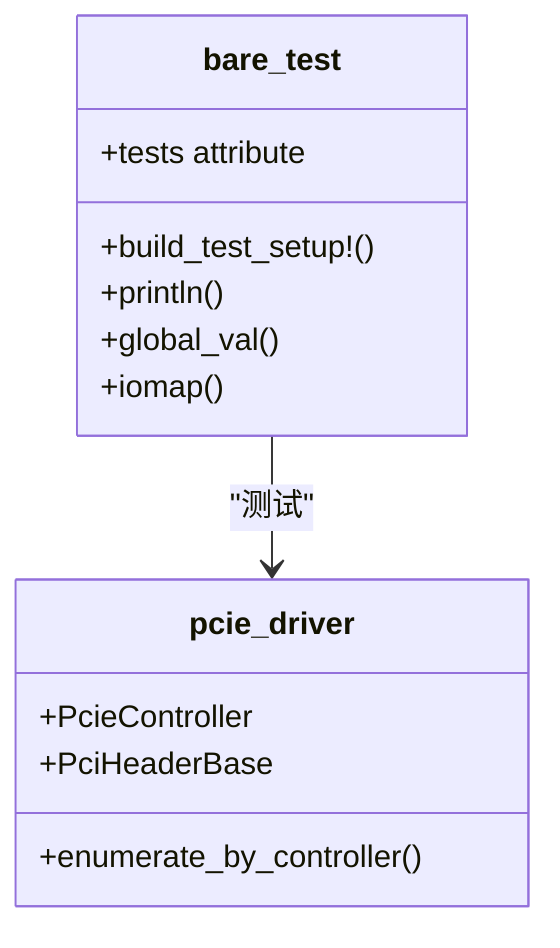
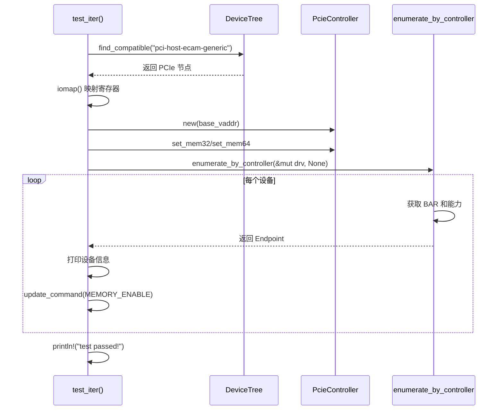

# 构建与测试

<cite>
**本文档引用的文件**  
- [Cargo.toml](file://Cargo.toml)
- [build.rs](file://build.rs)
- [tests/test.rs](file://tests/test.rs)
- [rust-toolchain.toml](file://rust-toolchain.toml)
- [bare-test.toml](file://bare-test.toml)
- [src/lib.rs](file://src/lib.rs)
- [src/root.rs](file://src/root.rs)
</cite>

## 目录
1. [简介](#简介)
2. [构建系统分析](#构建系统分析)
3. [测试框架集成](#测试框架集成)
4. [测试用例结构解析](#测试用例结构解析)
5. [工具链版本控制](#工具链版本控制)
6. [构建与测试命令指南](#构建与测试命令指南)
7. [no-std测试注意事项](#no-std测试注意事项)

## 简介
本文档详细说明`pcie`驱动项目在`no-std`环境下的构建与测试机制。该驱动专为嵌入式操作系统设计，支持PCIe设备枚举功能，并通过裸机测试框架进行验证。文档涵盖从构建脚本到测试执行的完整流程。

## 构建系统分析

`build.rs`构建脚本负责配置测试环境，其核心作用是调用`bare_test_macros::build_test_setup!()`宏来初始化测试基础设施。此宏在编译期展开，为后续的裸机测试提供必要的运行时支持。



**Diagram sources**
- [build.rs](file://build.rs#L1-L3)

**Section sources**
- [build.rs](file://build.rs#L1-L3)

## 测试框架集成

项目通过`[dev-dependencies]`引入`bare-test = "0.7"`作为开发依赖，同时使用`bare-test-macros = "0.2"`作为构建依赖。`bare-test`是一个专为`no-std`环境设计的轻量级测试框架，能够在无操作系统支持的情况下运行单元测试。

`[[test]]`段落中设置`harness = false`表明禁用标准测试harness，转而使用`bare-test`提供的自定义测试运行器。这使得测试可以在裸机环境中正确执行。



**Diagram sources**
- [Cargo.toml](file://Cargo.toml#L28-L31)

**Section sources**
- [Cargo.toml](file://Cargo.toml#L28-L31)

## 测试用例结构解析

`tests/test.rs`文件包含一个完整的裸机测试用例，验证PCIe设备枚举功能。测试使用`#![no_std]`和`#![no_main]`属性确保在无标准库环境下运行，并通过`extern crate alloc`启用堆分配支持。

测试逻辑主要包括：
1. 从设备树中查找PCIe ECAM控制器
2. 映射寄存器内存区域
3. 初始化`PcieGeneric`和`PcieController`
4. 配置内存范围
5. 调用`enumerate_by_controller`遍历所有端点设备
6. 打印每个设备的BAR信息和能力列表
7. 启用设备的内存访问权限



**Diagram sources**
- [tests/test.rs](file://tests/test.rs#L1-L102)
- [src/root.rs](file://src/root.rs#L1-L192)

**Section sources**
- [tests/test.rs](file://tests/test.rs#L1-L102)
- [src/root.rs](file://src/root.rs#L1-L192)

## 工具链版本控制

`rust-toolchain.toml`文件锁定使用`nightly`版本的Rust工具链，并指定必需组件包括`rust-src`、`rustfmt`和`clippy`。这一配置确保所有开发者使用一致的编译器版本，避免因工具链差异导致的编译或行为不一致问题。

```toml
[toolchain]
channel = "nightly"
components = ["rust-src", "rustfmt", "clippy"]
```

此配置对于`no-std`开发尤为重要，因为某些底层特性（如特定的内联汇编或未稳定化的语言项）可能仅在`nightly`通道中可用。

**Section sources**
- [rust-toolchain.toml](file://rust-toolchain.toml#L1-L3)

## 构建与测试命令指南

### 构建命令示例
```bash
cargo build --target x86_64-unknown-none
```

### 运行测试套件
由于测试在裸机环境中运行，需借助QEMU等模拟器执行：
```bash
cargo test --target aarch64-unknown-none --features=testing
```

`bare-test`会根据`bare-test.toml`中的QEMU配置自动启动模拟器并加载测试程序。


**Diagram sources**
- [bare-test.toml](file://bare-test.toml#L1-L11)

**Section sources**
- [bare-test.toml](file://bare-test.toml#L1-L11)

## no-std测试注意事项

在`no-std`环境下进行测试需要注意以下关键点：

1. **panic handler**：必须自行提供panic处理函数，否则程序崩溃时将无法正常响应。
2. **语言项（lang items）**：需要实现如`eh_personality`等必要语言项以支持异常处理机制。
3. **内存分配**：启用`alloc` crate并提供全局分配器。
4. **入口点**：使用`#![no_main]`并由测试框架管理程序入口。
5. **I/O输出**：通过`bare-test`提供的`println!`宏实现调试输出。

这些限制要求开发者对底层运行时有更深入的理解，但也确保了代码能够在真实嵌入式环境中可靠运行。

**Section sources**
- [tests/test.rs](file://tests/test.rs#L1-L10)
- [Cargo.toml](file://Cargo.toml#L28-L31)