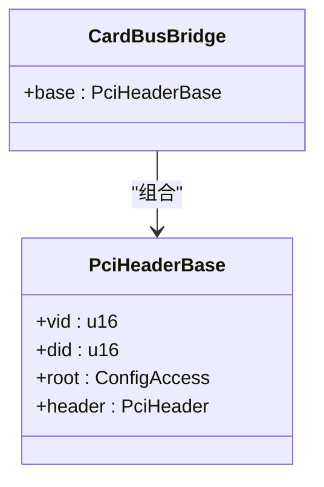
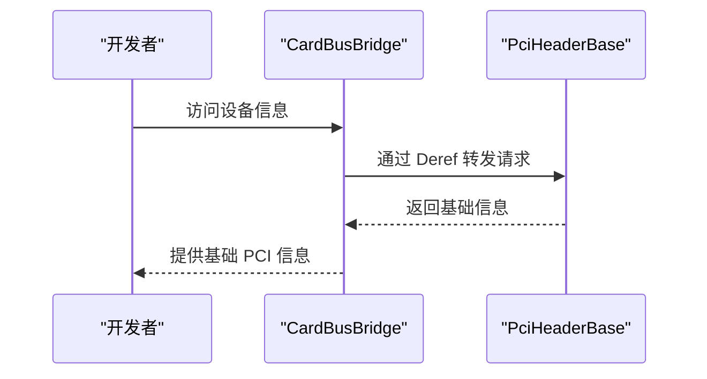
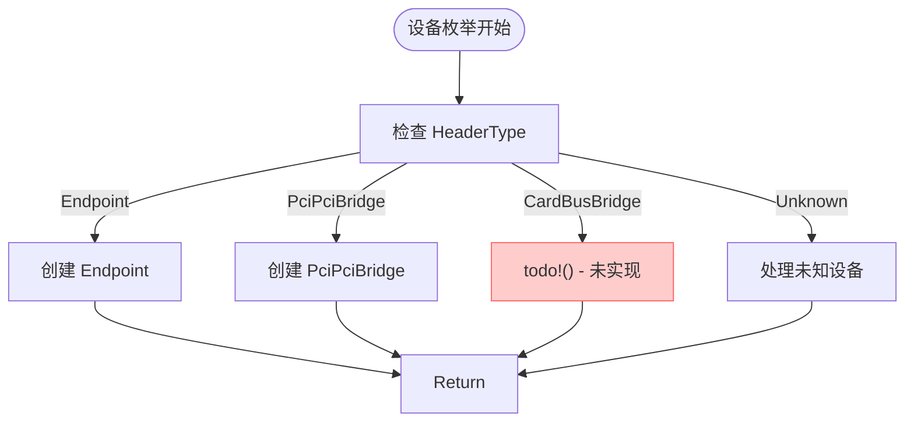

# CardBus桥接器支持

<cite>
**Referenced Files in This Document**  
- [card_bridge.rs](file://src/types/config/card_bridge.rs)
- [pci_bridge.rs](file://src/types/config/pci_bridge.rs)
- [mod.rs](file://src/types/config/mod.rs)
- [root.rs](file://src/root.rs)
</cite>

## 目录
1. [简介](#简介)
2. [CardBusBridge结构体定义](#cardbusbridge结构体定义)
3. [继承机制与基础访问能力](#继承机制与基础访问能力)
4. [在PciConfigSpace中的存在意义](#在pciconfigspace中的存在意义)
5. [当前实现限制与缺失功能](#当前实现限制与缺失功能)
6. [开发建议与未来扩展方向](#开发建议与未来扩展方向)
7. [总结](#总结)

## 简介
`CardBusBridge` 是一个为遗留 CardBus 桥接设备设计的占位符实现，用于确保系统对老式设备类型的识别兼容性。尽管该类型已在代码中定义，但其功能尚未完整实现，仅通过 `Deref` 特性继承了 `PciHeaderBase` 的基本访问能力。本文档旨在说明其当前状态、架构角色及未来扩展建议。

## CardBusBridge结构体定义

`CardBusBridge` 结构体被定义于 `src/types/config/card_bridge.rs` 文件中，其核心职责是作为 CardBus 类型 PCI 设备的配置空间表示。然而，与已实现的 `PciPciBridge` 不同，`CardBusBridge` 当前仅包含一个指向 `PciHeaderBase` 的字段，未引入任何桥接特有的寄存器或字段解析逻辑。



**Diagram sources**  
- [card_bridge.rs](file://src/types/config/card_bridge.rs#L6-L8)

**Section sources**  
- [card_bridge.rs](file://src/types/config/card_bridge.rs#L6-L8)

## 继承机制与基础访问能力

`CardBusBridge` 通过实现 `Deref` 特性，将其自身透明地转换为 `PciHeaderBase` 类型。这意味着所有对 `CardBusBridge` 实例的访问最终都会委托给其内部的 `base` 字段，从而获得对 PCI 配置头基本信息（如厂商 ID、设备 ID、命令寄存器等）的读取能力。

这种设计复用了现有基础设施，避免了重复代码，但同时也意味着 `CardBusBridge` 自身并未提供任何额外的功能或特定于 CardBus 协议的操作接口。



**Diagram sources**  
- [card_bridge.rs](file://src/types/config/card_bridge.rs#L15-L21)

**Section sources**  
- [card_bridge.rs](file://src/types/config/card_bridge.rs#L15-L21)

## 在PciConfigSpace中的存在意义

`CardBusBridge` 在 `PciConfigSpace` 枚举中的存在具有重要的架构意义。`PciConfigSpace` 定义于 `src/types/config/mod.rs` 中，用于统一表示不同类型的 PCI 设备配置空间。`CardBusBridge` 作为其中一个变体，确保了类型系统的完整性与可扩展性。

当系统检测到设备头类型为 `HeaderType::CardBusBridge` 时，理论上应构造对应的 `CardBusBridge` 实例。这保证了未来可以无缝添加对该设备类型的支持，而无需重构现有的设备枚举和处理流程。

```mermaid
erDiagram
PciConfigSpace ||--o{ CardBusBridge : "包含"
PciConfigSpace ||--o{ PciPciBridge : "包含"
PciConfigSpace ||--o{ Endpoint : "包含"
PciConfigSpace {
enum variant type
}
CardBusBridge {
PciHeaderBase base
}
PciPciBridge {
Option<PciHeaderBase> base
Option<PciPciBridgeHeader> header
bool is_root
}
Endpoint {
PciHeaderBase base
BarAllocator* bar_allocator
}
```

**Diagram sources**  
- [mod.rs](file://src/types/config/mod.rs#L59-L65)

**Section sources**  
- [mod.rs](file://src/types/config/mod.rs#L59-L65)

## 当前实现限制与缺失功能

目前，`CardBusBridge` 的实现极为基础，存在显著的功能缺失：

- **无桥接特有字段解析**：未实现对 CardBus 桥接器特有的配置寄存器（如卡槽控制寄存器、中断路由表等）的解析。
- **无具体方法实现**：除了继承自 `PciHeaderBase` 的通用方法外，未提供任何针对 CardBus 设备的专用操作方法。
- **初始化逻辑缺失**：在 `root.rs` 的设备创建流程中，`HeaderType::CardBusBridge` 分支仍处于 `todo!()` 状态，表明该路径尚未实现。

这些限制表明，当前模块主要是一个预留接口，而非一个可用的生产级实现。



**Diagram sources**  
- [root.rs](file://src/root.rs#L71-L105)

**Section sources**  
- [root.rs](file://src/root.rs#L71-L105)

## 开发建议与未来扩展方向

若需在系统中实际支持 CardBus 设备，建议采取以下步骤：

1. **参考 pci_bridge.rs 扩展功能**：借鉴 `PciPciBridge` 的实现模式，为 `CardBusBridge` 添加具体的桥接头解析逻辑（例如使用 `pci_types::CardBusBridgeHeader`）。
2. **实现桥接特有方法**：添加对次级总线号、内存/IO 基址/限界、卡槽状态等寄存器的访问方法。
3. **完成初始化逻辑**：在 `root.rs` 中实现 `CardBusBridge` 的构造函数，并集成到设备枚举流程中。
4. **考虑实际应用场景**：评估现代 PCIe 系统中 CardBus 设备的实际需求，决定是否值得投入资源进行完整实现。

## 总结

`CardBusBridge` 当前作为一个占位符存在于代码库中，其主要价值在于保持类型系统的完整性和未来的可扩展性。它通过 `Deref` 复用 `PciHeaderBase` 的基础能力，但本身未实现任何桥接特有功能。开发者应理解其预留性质，在需要支持老式 CardBus 设备时，基于现有 `pci_bridge.rs` 模块进行功能扩展。