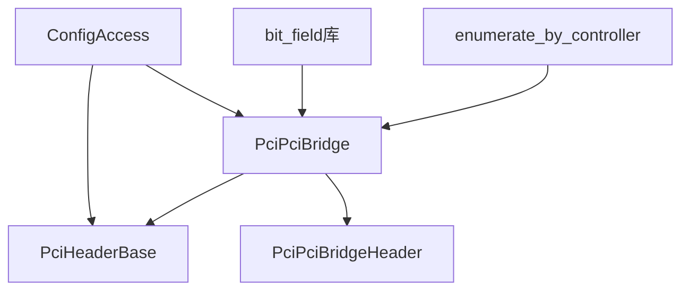
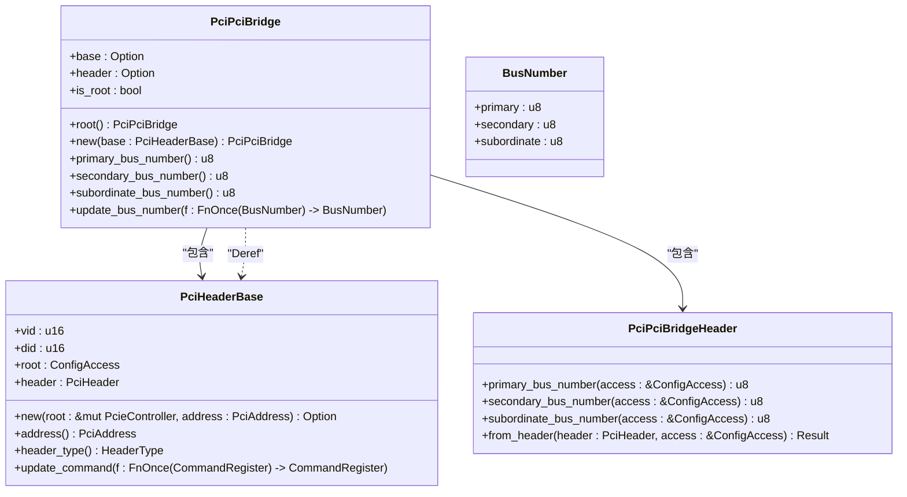
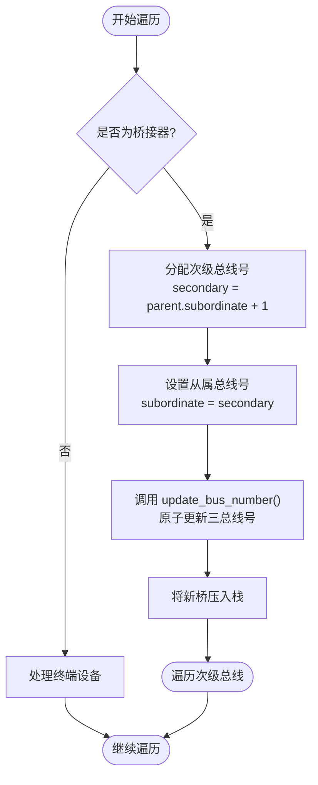
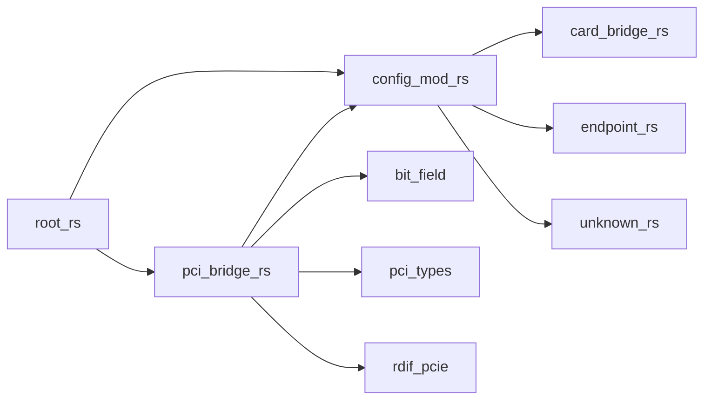

<cite>
**Referenced Files in This Document**
- [pci_bridge.rs](file://src/types/config/pci_bridge.rs)
- [config/mod.rs](file://src/types/config/mod.rs)
- [root.rs](file://src/root.rs)
</cite>

## 目录
1. [PCI-PCI桥接器处理](#pci-pci桥接器处理)
2. [核心组件](#核心组件)
3. [架构概述](#架构概述)
4. [详细组件分析](#详细组件分析)
5. [依赖分析](#依赖分析)

## PCI-PCI桥接器处理

本文档系统性地阐述了`PciPciBridge`结构体在PCIe总线拓扑遍历中的关键作用。该结构体是实现深度优先搜索（DFS）算法以发现和配置整个PCIe设备树的核心组件，它通过管理三个关键的总线号字段来组织和追踪总线层次结构。

**Section sources**
- [pci_bridge.rs](file://src/types/config/pci_bridge.rs#L1-L110)

## 核心组件

`PciPciBridge`结构体是PCI-PCI桥接器的软件抽象，封装了对桥接器配置空间的访问和操作。其核心功能包括初始化桥接器实例、读取和更新总线号、以及通过Deref特性透明访问基类功能。与之紧密关联的是`PciHeaderBase`结构体，它提供了对PCI设备通用配置头的底层访问能力，而`PciPciBridgeHeader`则专门用于解析桥接器特有的寄存器布局。

**Section sources**
- [pci_bridge.rs](file://src/types/config/pci_bridge.rs#L1-L110)
- [config/mod.rs](file://src/types/config/mod.rs#L1-L131)

## 架构概述

**Diagram sources**
- [pci_bridge.rs](file://src/types/config/pci_bridge.rs#L1-L110)
- [config/mod.rs](file://src/types/config/mod.rs#L1-L131)
- [root.rs](file://src/root.rs#L1-L192)

## 详细组件分析

### PciPciBridge 结构分析

#### 类图

**Diagram sources**
- [pci_bridge.rs](file://src/types/config/pci_bridge.rs#L1-L110)
- [config/mod.rs](file://src/types/config/mod.rs#L1-L131)

#### 总线号语义与DFS遍历流程

**Diagram sources**
- [pci_bridge.rs](file://src/types/config/pci_bridge.rs#L70-L100)
- [root.rs](file://src/root.rs#L1-L192)

### new() 构造函数分析

`new()`构造函数负责从一个已存在的`PciHeaderBase`实例创建一个`PciPciBridge`对象。它首先利用`PciPciBridgeHeader::from_header`方法解析桥接器专用的配置寄存器，并将其存储在`header`字段中。此过程确保了桥接器的特定功能（如总线号管理）可以被正确初始化。

**Section sources**
- [pci_bridge.rs](file://src/types/config/pci_bridge.rs#L25-L35)

### update_bus_number() 方法分析

`update_bus_number()`方法是实现总线号动态分配的核心。它通过直接读写配置空间偏移量0x18处的双字（DWORD）来原子性地更新主总线号、次级总线号和从属总线号。该方法接收一个闭包作为参数，允许调用者安全地修改`BusNumber`结构体。位段操作由`bit_field`库提供支持，确保了对寄存器位域的安全访问，避免了数据竞争和未定义行为。

**Section sources**
- [pci_bridge.rs](file://src/types/config/pci_bridge.rs#L70-L100)

### root() 构造函数分析

`root()`构造函数用于创建一个特殊的“根桥”实例，该实例不绑定到任何实际的硬件设备。它通过将`base`和`header`字段设为`None`，并将`is_root`标志设为`true`来实现。这种设计模式在模拟或初始化阶段非常有用，例如在`enumerate_by_controller`函数中，它被用来表示遍历的起始点。

**Section sources**
- [pci_bridge.rs](file://src/types/config/pci_bridge.rs#L15-L23)

### Deref 实现分析

`PciPciBridge`实现了`Deref`特性，使其能够透明地访问`PciHeaderBase`的所有公共方法。这意味着开发者可以直接在`PciPciBridge`实例上调用`address()`、`vendor_id()`等方法，而无需显式地解引用`base`字段。这极大地简化了API的使用，提高了代码的可读性和一致性。

**Section sources**
- [pci_bridge.rs](file://src/types/config/pci_bridge.rs#L102-L108)

## 依赖分析

**Diagram sources**
- [pci_bridge.rs](file://src/types/config/pci_bridge.rs#L1-L110)
- [config/mod.rs](file://src/types/config/mod.rs#L1-L131)
- [root.rs](file://src/root.rs#L1-L192)

**Section sources**
- [pci_bridge.rs](file://src/types/config/pci_bridge.rs#L1-L110)
- [config/mod.rs](file://src/types/config/mod.rs#L1-L131)
- [root.rs](file://src/root.rs#L1-L192)